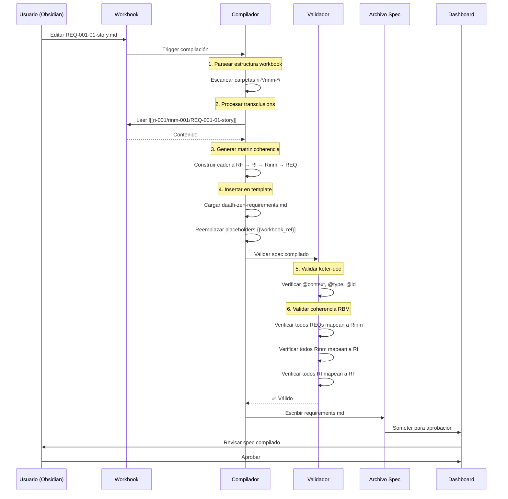

# SPEC-001: Análisis y Recomendaciones de Mejores Prácticas

## Metadatos

| Campo | Valor |
|-------|-------|
| **Tipo de Documento** | Análisis Técnico |
| **Fecha** | 2026-01-10 |
| **Versión** | 1.0.0 |
| **Estado** | Draft para Revisión |
| **Autor** | GitHub Copilot (Claude Sonnet 4.5) |
| **Propósito** | Guiar escritura de requirements de SPEC-001 |

---

## Resumen Ejecutivo

Este documento provee **análisis profundo** y **recomendaciones de mejores prácticas** para escribir **SPEC-001: Built Template spec-workflow**. Consolida hallazgos del análisis de chat, modelado teórico y decisiones arquitectónicas.

### Comprensión Central
SPEC-001 es una **meta-especificación** que define:
1. Cómo se estructurarán todas las specs futuras
2. Sistema de templates con herencia
3. Integración RBM-workbook
4. Protocolo keter-doc (JSON-LD)
5. Herramientas de compilación y validación

**Insight Crítico**: Esto no es desarrollo de software—esto es **diseño de lenguaje**. Estamos creando la gramática para expresar especificaciones de investigación.

---

## 🧠 Análisis de Deep Learning

### Capa de Comprensión 1: El Problema que SPEC-001 Resuelve

#### Estado Actual (Sin SPEC-001)
```
Templates de spec-workflow-mcp (genéricos)
    ↓
requirements.md (monolítico, duplicado)
design.md (monolítico, duplicado)
tasks.md (monolítico, duplicado)
    ↓
Sin trazabilidad a RBM
Sin mecanismo de evolución
Sin contenido reutilizable
```

**Pain Points**:
- Cada spec reescribe historias de usuario desde cero
- Decisiones arquitectónicas duplicadas entre specs
- Sin conexión a metodología de investigación (RBM)
- No se puede rastrear "por qué" (causalidad) detrás de requirements
- Templates no mejoran con el tiempo

#### Estado Objetivo (Con SPEC-001)
```
daath-zen-base.md (headers heredados)
    ↓
daath-zen-requirements.md (template + refs a workbook)
    ↓ referencia
wb-rbm-spec/ (workbook modular, evolutivo)
├── resultado_final.md
├── ri-001/ (features)
│   └── rinm-001/ (productos)
│       ├── REQ-001-story.md
│       └── REQ-002-rule.md
    ↓ compilar
requirements.md (para spec-workflow-mcp)
    ↓
Persistencia triple (MD + Graph + Vector)
```

**Soluciones**:
- Templates proveen estructura, workbooks proveen contenido
- Contenido reutilizado entre specs
- Causalidad RBM rastreada en jerarquía de carpetas
- Templates evolucionan vía feedback autopoiético
- Interoperabilidad semántica vía JSON-LD

---

### Capa de Comprensión 2: Decisiones Arquitectónicas

#### Decisión 1: Arquitectura Híbrida Modular-Monolítica

**Razonamiento**:
```
Restricción: spec-workflow-mcp espera archivos únicos
Necesidad: Contenido modular, reutilizable
Solución: Compilar modular → monolítico
```

**Implementación**:
```python
# compile_spec_from_workbook.py
def compile_requirements(workbook_path, output_path):
    """
    1. Parsear estructura RBM del workbook
    2. Procesar transclusions Obsidian ![[]]
    3. Generar matriz de coherencia
    4. Insertar en template
    5. Validar contra protocolo keter-doc
    6. Escribir requirements.md monolítico
    """
```

**Mejor Práctica**:
- Usuario **nunca** edita requirements.md directamente
- Usuario edita workbook en Obsidian
- IA compila bajo demanda o vía trigger de file-watch
- Archivo compilado es **snapshot read-only**

#### Decisión 2: RBM como Patrón de File System

**Razonamiento**:
```
Problema: RBM es una "metodología a aplicar"
Solución: Codificar RBM en estructura de carpetas
```

**Patrón**:
```
wb-rbm-spec/
├── resultado_final.md              # 1 por spec
├── ri-001-feature-x/               # N resultados intermedios
│   ├── ri-001.md                   # Overview del feature
│   └── rinm-001-product-y/         # M resultados inmediatos
│       ├── overview.md
│       ├── REQ-001-01-story.md     # P productos
│       ├── REQ-001-02-rule.md
│       └── metrics.yaml
├── ri-002-feature-z/
│   └── rinm-001-product-w/
│       └── REQ-002-01-story.md
```

**Trazabilidad**:
```
Path: wb-rbm-spec/ri-001/rinm-001/REQ-001-01-story.md
Decodifica a:
- Resultado Intermedio: RI-001 (feature-x)
- Resultado Inmediato: Rinm-001 (product-y)
- Producto: REQ-001-01 (user story)
```

**Mejor Práctica**:
- Nombre de carpeta = ID de Resultado + slug descriptivo
- Nombre de archivo = ID de Producto + tipo
- Un archivo por producto (atómico)
- metrics.yaml por resultado inmediato

#### Decisión 3: Herencia de Templates vía config.yaml-ld

**Razonamiento**:
```
Problema: Elementos comunes (HKM header, Dublin Core) duplicados
Solución: Jerarquía de herencia con overrides
```

**Schema**:
```yaml
# config.yaml-ld
"@context":
  "@vocab": "http://melquisedec.org/template#"

template_hierarchy:
  base:
    name: "daath-zen-base"
    version: "1.0.0"
    sections:
      - name: "hkm_header"
        mandatory: true
        format: "yaml-frontmatter"
      - name: "dublin_core"
        mandatory: true
        format: "yaml-frontmatter"
      - name: "keter_protocol"
        mandatory: true
        format: "json-ld"

  variants:
    requirements:
      extends: "base"
      sections:
        - name: "overview"
          format: "markdown"
        - name: "coherence_matrix"
          format: "mermaid + yaml"
        - name: "user_stories"
          source: "workbook"
          path: "ri-*/rinm-*/REQ-*-story.md"
        - name: "functional_requirements"
          source: "workbook"
          path: "ri-*/rinm-*/REQ-*-functional.md"
```

**Mejor Práctica**:
- Todos los templates extienden `base`
- Base contiene solo elementos universales
- Variantes definen secciones específicas
- Source puede ser `inline`, `workbook`, o `generated`

#### Decisión 4: Protocolo Keter-Doc (JSON-LD)

**Razonamiento**:
```
Problema: Documentos aislados, sin links semánticos
Solución: Cada documento tiene contexto JSON-LD
```

**Schema**:
```yaml
# issue.yaml-ld (ejemplo)
"@context":
  "@vocab": "http://melquisedec.org/ontology#"
  dc: "http://purl.org/dc/terms/"
  foaf: "http://xmlns.com/foaf/0.1/"
  schema: "http://schema.org/"

"@type": "ResearchSpecification"
"@id": "urn:melquisedec:spec:001"

dc:title: "Built Template spec-workflow"
dc:created: "2026-01-10T12:50:24Z"
dc:creator:
  "@type": "foaf:Agent"
  foaf:name: "GitHub Copilot"

implementsPrinciple:
  - "@id": "urn:melquisedec:principle:P1"
    dc:title: "Síntesis Metodológica"
  - "@id": "urn:melquisedec:principle:P2"
    dc:title: "Autopoiesis por Diseño"

hasIntermediateResult:
  - "@id": "urn:melquisedec:spec:001:ri:001"
    dc:title: "Template daath-zen-requirements"
  - "@id": "urn:melquisedec:spec:001:ri:002"
    dc:title: "Template daath-zen-design"
```

**Mejor Práctica**:
- Cada archivo YAML comienza con `@context`
- Usar vocabularios estándar (Dublin Core, FOAF, Schema.org)
- Definir términos custom en ontología MELQUISEDEC
- URNs siguen patrón: `urn:melquisedec:{type}:{id}`

#### Decisión 5: Granularidad = Resultado Inmediato (Producto)

**Razonamiento**:
```
Muy grueso: RI-001 = feature completo (pierde trazabilidad)
Muy fino: REQ-001-01-a-1 = una línea (inmanejable)
Justo: REQ-001-01 = un producto (testeable, medible)
```

**Esquema de Numeración**:
```
Formato: REQ-{RI}-{Rinm}-{Product}

Ejemplos:
REQ-001-01-story     = RI-001, Rinm-01, user story
REQ-001-02-rule      = RI-001, Rinm-02, business rule
REQ-002-01-contract  = RI-002, Rinm-01, interface contract
```

**Mejor Práctica**:
- Cada REQ mapea exactamente a un archivo
- Archivo contiene un tipo de producto (story, rule, contract, etc.)
- Métricas definidas a nivel Rinm (agrega productos)
- Testing referencia REQ-IDs

---

### Capa de Comprensión 3: Workflow de Compilación

#### Proceso Paso a Paso



#### Estructura del Script de Compilación

```python
# tools/compile_spec_from_workbook.py

import yaml
from pathlib import Path
from typing import Dict, List

def compile_requirements(
    workbook_path: Path,
    template_path: Path,
    output_path: Path,
    config: Dict
) -> None:
    """Función principal de compilación"""

    # 1. Cargar config y template
    template = load_template(template_path, config)

    # 2. Parsear estructura workbook
    rbm_structure = parse_workbook_structure(workbook_path)

    # 3. Construir matriz de coherencia
    coherence_matrix = build_coherence_matrix(rbm_structure)

    # 4. Procesar transclusions
    content = process_transclusions(template, workbook_path)

    # 5. Generar secciones
    sections = {
        'overview': generate_overview(rbm_structure),
        'coherence_matrix': format_coherence_matrix(coherence_matrix),
        'user_stories': collect_products(rbm_structure, '*-story.md'),
        'functional_reqs': collect_products(rbm_structure, '*-functional.md'),
        'metrics': aggregate_metrics(rbm_structure)
    }

    # 6. Compilar documento final
    compiled = render_template(template, sections)

    # 7. Validar
    validate_keter_doc(compiled)
    validate_rbm_coherence(compiled, rbm_structure)

    # 8. Escribir output
    output_path.write_text(compiled)

    print(f"✅ Compilado: {output_path}")

def parse_workbook_structure(workbook_path: Path) -> Dict:
    """
    Escanea workbook y construye árbol RBM:
    {
        'resultado_final': {...},
        'intermediate_results': [
            {
                'id': 'RI-001',
                'immediate_results': [
                    {
                        'id': 'Rinm-001',
                        'products': [
                            {'id': 'REQ-001-01', 'file': 'REQ-001-01-story.md'},
                            {'id': 'REQ-001-02', 'file': 'REQ-001-02-rule.md'}
                        ]
                    }
                ]
            }
        ]
    }
    """
    structure = {
        'resultado_final': {},
        'intermediate_results': []
    }

    # Escanear carpetas ri-*
    for ri_folder in workbook_path.glob('ri-*'):
        ri_id = ri_folder.name.split('-')[1]

        ri = {
            'id': f'RI-{ri_id}',
            'path': ri_folder,
            'immediate_results': []
        }

        # Escanear carpetas rinm-*
        for rinm_folder in ri_folder.glob('rinm-*'):
            rinm_id = rinm_folder.name.split('-')[1]

            rinm = {
                'id': f'Rinm-{rinm_id}',
                'path': rinm_folder,
                'products': []
            }

            # Escanear archivos REQ-*
            for req_file in rinm_folder.glob('REQ-*.md'):
                product_id = req_file.stem

                rinm['products'].append({
                    'id': product_id,
                    'file': req_file,
                    'content': req_file.read_text()
                })

            ri['immediate_results'].append(rinm)

        structure['intermediate_results'].append(ri)

    return structure

def build_coherence_matrix(rbm_structure: Dict) -> Dict:
    """
    Genera matriz de coherencia mostrando:
    Resultado Final → RI → Rinm → REQ
    """
    matrix = {
        'final_result': rbm_structure['resultado_final'],
        'chain': []
    }

    for ri in rbm_structure['intermediate_results']:
        for rinm in ri['immediate_results']:
            for product in rinm['products']:
                matrix['chain'].append({
                    'RF': 'RF-001',
                    'RI': ri['id'],
                    'Rinm': rinm['id'],
                    'REQ': product['id']
                })

    return matrix

def process_transclusions(template: str, workbook_path: Path) -> str:
    """
    Procesa transclusions estilo Obsidian:
    ![[ri-001/rinm-001/REQ-001-01-story]]
    """
    import re

    pattern = r'!\[\[([^\]]+)\]\]'

    def replace_transclusion(match):
        path = match.group(1)
        full_path = workbook_path / f"{path}.md"

        if full_path.exists():
            return full_path.read_text()
        else:
            return f"⚠️ Faltante: {path}"

    return re.sub(pattern, replace_transclusion, template)
```

---

## 📋 Mejores Prácticas para Escribir SPEC-001

### Práctica 1: Comenzar con Fase de Investigación

**HACER**:
```markdown
# SPEC-001 Fase 0: Investigación

## Objetivo
Entender restricciones antes de diseñar solución.

## Tasks
1. [ ] Investigar formato spec-workflow-mcp
2. [ ] Diseñar protocolo keter-doc
3. [ ] Probar sincronización Obsidian → Neo4j
4. [ ] Benchmark performance de compilación
5. [ ] Prototipar herencia de templates

## Entregables
- Reporte de investigación
- Decisiones técnicas (ADRs)
- Proof-of-concepts
```

**NO HACER**:
```markdown
# SPEC-001 Requirements

REQ-001: Crear template para requirements
(sin investigar qué espera spec-workflow-mcp)
```

### Práctica 2: Usar Workbook para SPEC-001 Mismo

**HACER**:
```
020-conceive/03-workbooks/wb-rbm-spec-001/
├── resultado_final.md           # Sistema de templates operativo
├── ri-001-base-template/
│   └── rinm-001-keter-doc/
│       ├── REQ-001-01-json-ld-schema.md
│       ├── REQ-001-02-hkm-header.md
│       └── metrics.yaml
├── ri-002-requirements-template/
│   └── rinm-001-sections/
│       ├── REQ-002-01-overview.md
│       ├── REQ-002-02-coherence-matrix.md
│       └── REQ-002-03-user-stories.md
```

**Razonamiento**: Practicar lo que se predica—usar estructura RBM para meta-spec.

### Práctica 3: Definir Criterios de Éxito por Producto

**HACER**:
```markdown
# REQ-001-01: Schema JSON-LD

## Criterios de Éxito
- [ ] Schema valida contra spec JSON-LD 1.1
- [ ] Incluye @context con vocabulario MELQUISEDEC
- [ ] Todos los principios P1-P10 representables
- [ ] Grafo RDF genera sin errores
- [ ] Ingestión a Neo4j exitosa

## Métricas
- Validación schema: PASS/FAIL
- Cobertura: 10/10 principios
- Tiempo de ingestión: < 100ms
```

**NO HACER**:
```markdown
# REQ-001: Crear protocolo

Crear protocolo keter-doc.
(sin criterios medibles)
```

### Práctica 4: Incluir Estrategia de Migración

**HACER**:
```markdown
# SPEC-001 Design: Estrategia de Migración

## Estado Actual
- Templates genéricos de spec-workflow-mcp
- Sin workbooks

## Plan de Transición
1. Crear templates daath-zen junto a existentes
2. Piloto SPEC-002 usando templates nuevos
3. Validar que compilación funciona
4. Migrar SPEC-001 mismo a usar nuevo sistema
5. Deprecar templates antiguos

## Plan de Rollback
Si compilación falla:
1. Mantener ambos sistemas (6 meses)
2. Permitir specs elegir sistema de templates
3. Arreglar issues sin bloquear trabajo
```

### Práctica 5: Versionar Todo

**HACER**:
```yaml
# config.yaml-ld
"@context":
  "@vocab": "http://melquisedec.org/template#"

version: "1.0.0"
changelog:
  - version: "1.0.0"
    date: "2026-01-10"
    changes:
      - "Release inicial"
      - "Template base con header HKM"
      - "Template requirements con RBM"

template_hierarchy:
  base:
    version: "1.0.0"
  variants:
    requirements:
      version: "1.0.0"
      extends_version: "1.0.0"
```

**Razonamiento**: Los templates evolucionan—rastrear versiones para reproducibilidad.

### Práctica 6: Validar Incrementalmente

**HACER**:
```python
# Checkpoints de validación

# Checkpoint 1: Después de parsing
assert rbm_structure['intermediate_results'], "No se encontraron RIs"

# Checkpoint 2: Después de coherencia
assert len(coherence_matrix['chain']) > 0, "Cadena vacía"

# Checkpoint 3: Después de compilación
assert '@context' in compiled, "Falta keter-doc"

# Checkpoint 4: Después de sincronización Neo4j
assert graph.query("MATCH (s:Spec {id: 'spec-001'}) RETURN s"), "No en grafo"
```

**NO HACER**:
```python
# Una validación grande al final
validate_everything(compiled)  # 😱 Difícil de debuggear
```

### Práctica 7: Documentar Razonamiento de Templates

**HACER**:
```markdown
## Decisión de Diseño: ¿Por Qué Arquitectura Híbrida?

**Contexto**: spec-workflow-mcp espera archivos únicos

**Alternativas Consideradas**:
1. Monolítico (rechazado - duplicación)
2. Modular puro (rechazado - incompatible)
3. Híbrido con compilación (seleccionado)

**Razonamiento**:
- Preserva compatibilidad con spec-workflow-mcp
- Habilita reutilización de workbook
- Permite evolución
- Scripts ocultan complejidad

**Trade-offs**:
- Agrega paso de compilación (aceptable)
- Requiere file-watcher (automatizable)
- Artefactos read-only (realmente beneficioso)
```

**Razonamiento**: Futuros maintainers necesitan entender POR QUÉ se tomaron decisiones.

### Práctica 8: Crear Workbook de Ejemplo

**HACER**:
```
# Incluir en entregables de SPEC-001
examples/
└── wb-rbm-example-auth/
    ├── resultado_final.md
    ├── ri-001-login/
    │   └── rinm-001-email-login/
    │       ├── REQ-001-01-story.md
    │       └── REQ-001-02-rule.md
    └── README.md  # ← Explica estructura
```

**Razonamiento**: Los ejemplos valen 1000 palabras de documentación.

---

## 🎯 Estructura Recomendada de SPEC-001

### Estructura de Workbook

```
020-conceive/03-workbooks/wb-rbm-spec-001/
├── resultado_final.md
│   # Título: Sistema de templates daath-zen operativo
│   # Métricas: 6 templates creados, compilación exitosa, validación pasa
│
├── ri-001-base-infrastructure/
│   ├── ri-001.md
│   └── rinm-001-keter-doc-protocol/
│       ├── overview.md
│       ├── REQ-001-01-json-ld-schema.md
│       ├── REQ-001-02-hkm-header-format.md
│       ├── REQ-001-03-dublin-core-fields.md
│       └── metrics.yaml
│
├── ri-002-template-system/
│   ├── ri-002.md
│   ├── rinm-001-base-template/
│   │   ├── REQ-002-01-header-structure.md
│   │   ├── REQ-002-02-inheritance-rules.md
│   │   └── metrics.yaml
│   └── rinm-002-variant-templates/
│       ├── REQ-002-03-requirements-sections.md
│       ├── REQ-002-04-design-sections.md
│       ├── REQ-002-05-tasks-sections.md
│       ├── REQ-002-06-steering-product.md
│       ├── REQ-002-07-steering-tech.md
│       ├── REQ-002-08-steering-structure.md
│       └── metrics.yaml
│
├── ri-003-compilation-pipeline/
│   ├── ri-003.md
│   └── rinm-001-compiler-script/
│       ├── REQ-003-01-parse-workbook.md
│       ├── REQ-003-02-process-transclusions.md
│       ├── REQ-003-03-build-coherence-matrix.md
│       ├── REQ-003-04-render-template.md
│       └── metrics.yaml
│
├── ri-004-validation-system/
│   ├── ri-004.md
│   └── rinm-001-validators/
│       ├── REQ-004-01-keter-doc-validator.md
│       ├── REQ-004-02-rbm-coherence-validator.md
│       ├── REQ-004-03-neo4j-sync-validator.md
│       └── metrics.yaml
│
└── ri-005-documentation-examples/
    ├── ri-005.md
    └── rinm-001-guides/
        ├── REQ-005-01-template-usage-guide.md
        ├── REQ-005-02-workbook-creation-guide.md
        ├── REQ-005-03-example-auth-workbook.md
        └── metrics.yaml
```

### Artefactos Compilados

```
.spec-workflow/specs/spec-001/
├── requirements.md       # Compilado desde wb-rbm-spec-001
├── design.md             # Compilado desde wb-rbm-spec-001
├── tasks.md              # Compilado desde wb-rbm-spec-001
└── phase-state/
    └── investigation.yaml
```

---

## 🔬 Desglose de Tasks de Investigación

### Task 1: Investigar Formato spec-workflow-mcp

**Objetivo**: Entender restricciones y expectativas.

**Subtasks**:
1. Leer templates actuales en repo spec-workflow-mcp
2. Identificar secciones obligatorias
3. Probar parser con casos edge
4. Documentar hallazgos en ADR

**Entregable**:
- `ADR-001-spec-workflow-mcp-format-constraints.md`

### Task 2: Diseñar Protocolo Keter-Doc

**Objetivo**: Crear schema JSON-LD para todos los documentos.

**Subtasks**:
1. Estudiar especificación JSON-LD 1.1
2. Revisar vocabularios Dublin Core, FOAF, Schema.org
3. Definir términos de ontología MELQUISEDEC
4. Crear `@context` para cada tipo de documento
5. Validar con herramientas RDF

**Entregable**:
- `keter-doc-protocol-v1.0.0.jsonld`
- `ADR-002-keter-doc-design-decisions.md`

### Task 3: Probar Sincronización Obsidian → Neo4j

**Objetivo**: Validar estrategia de persistencia triple.

**Subtasks**:
1. Crear workbook de prueba en Obsidian
2. Escribir parser: MD → JSON
3. Escribir script de ingestión: JSON → Neo4j
4. Query grafo para verificar relaciones
5. Benchmark performance

**Entregable**:
- `sync-obsidian-neo4j.py` (proof-of-concept)
- Reporte de performance

### Task 4: Benchmark de Compilación

**Objetivo**: Asegurar que compilación es suficientemente rápida.

**Subtasks**:
1. Crear workbook mock (100 productos)
2. Implementar compilador básico
3. Medir tiempo de parse, render, write
4. Identificar cuellos de botella
5. Optimizar si es necesario

**Entregable**:
- Reporte de benchmark
- Targets de performance

### Task 5: Prototipar Herencia de Templates

**Objetivo**: Validar que herencia config.yaml-ld funciona.

**Subtasks**:
1. Crear template base
2. Crear 2 variantes
3. Implementar cargador de herencia
4. Probar comportamiento de override
5. Documentar patrón

**Entregable**:
- `daath-zen-base.md` (prototipo)
- `daath-zen-requirements.md` (prototipo)
- Script cargador de herencia

---

## ⚠️ Trampas Comunes a Evitar

### Trampa 1: Sobre-Abstracción Temprana

**Problema**: Crear 10 niveles de herencia cuando 2 serían suficientes.

**Solución**: Empezar con base + 6 variantes. Agregar abstracción solo cuando se duplique 3+ veces.

### Trampa 2: Ignorar Restricciones de spec-workflow-mcp

**Problema**: Templates hermosos que no funcionan con dashboard.

**Solución**: Probar output de compilación con spec-workflow-mcp real inmediatamente.

### Trampa 3: Compilación Manual

**Problema**: Usuarios olvidan compilar, someten specs desactualizados.

**Solución**: File watcher auto-compila al guardar. Hacer imposible olvidar.

### Trampa 4: Sin Ejemplos de Validación

**Problema**: Validador rechaza specs válidos (falsos positivos).

**Solución**: Crear suite de test con 10+ ejemplos válidos, 10+ inválidos.

### Trampa 5: Olvidar Autopoiesis

**Problema**: Templates nunca mejoran.

**Solución**: SPEC-001 debe incluir diseño de loop de feedback:
- Cómo se capturan lecciones
- Cómo se actualizan templates
- Cómo se propagan scores de confianza

---

## ✅ Definition of Done para SPEC-001

### Fase Requirements
- [ ] Investigación completa (Tasks 1-5)
- [ ] Workbook `wb-rbm-spec-001/` creado
- [ ] Todos los productos REQ-XXX escritos
- [ ] Matriz de coherencia validada
- [ ] requirements.md compilado sometido
- [ ] Aprobado vía dashboard

### Fase Design
- [ ] Diagramas de arquitectura creados
- [ ] ADRs para todas las decisiones mayores
- [ ] Modelo de herencia de templates documentado
- [ ] Workflow de compilación especificado
- [ ] Estrategia de validación definida
- [ ] design.md compilado aprobado

### Fase Tasks
- [ ] Desglose de tasks completo
- [ ] Dependencias mapeadas
- [ ] Estimaciones provistas
- [ ] Criterios de éxito por task
- [ ] tasks.md compilado aprobado

### Fase Implementation
- [ ] Todos los 6 templates creados
- [ ] config.yaml-ld funcional
- [ ] Script compilador operativo
- [ ] Validadores pasando
- [ ] Workbook de ejemplo incluido
- [ ] Documentación completa
- [ ] SPEC-002 puede usar templates nuevos

---

## 🚀 Próximos Pasos

### Inmediato
1. ✅ Loguear chat (hecho)
2. ✅ Extraer lecciones (hecho)
3. ⏳ Crear estructura de carpetas `wb-rbm-spec-001/`
4. ⏳ Comenzar Investigation Task 1

### Esta Semana
1. ⏳ Completar todas las 5 tasks de investigación
2. ⏳ Escribir ADRs
3. ⏳ Crear draft de protocolo keter-doc
4. ⏳ Prototipar template base

### Próxima Semana
1. ⏳ Escribir requirements de SPEC-001 (compilar desde workbook)
2. ⏳ Someter para aprobación
3. ⏳ Iterar basado en feedback
4. ⏳ Proceder a fase design

---

## 📚 Referencias

- [CHATLOG-2026-01-10_125024-spec-001-estrategia-es.md](../logs/CHATLOG-2026-01-10_125024-spec-001-estrategia-es.md)
- [LECCION-001-arquitectura-templates-specs.md](lesson-001-spec-template-architecture/LECCION-001-arquitectura-templates-specs.md)
- [raw-manifiesto-melquisedec.md](../manifest/1-inputs/raw-manifiesto-melquisedec.md)
- [spec-workflow-mcp documentation](https://github.com/pimzino/spec-workflow-mcp)
- [JSON-LD 1.1 Specification](https://www.w3.org/TR/json-ld11/)
- [Dublin Core Metadata Terms](https://www.dublincore.org/specifications/dublin-core/dcmi-terms/)

---

**Análisis Por**: GitHub Copilot (Claude Sonnet 4.5)
**Fecha**: 2026-01-10
**Estado**: Listo para Escritura de SPEC-001
**Confianza**: 0.90 (Alta - análisis comprehensivo, pendiente validación)

---

## 💡 Recomendación Final

**Escribir SPEC-001 en 3 fases**:

1. **Fase 0: Investigación** (3-5 días)
   - Completar Tasks 1-5
   - Crear ADRs
   - Construir proof-of-concepts

2. **Fase 1: Requirements** (2-3 días)
   - Crear estructura de workbook
   - Escribir todos los productos REQ-XXX
   - Compilar y someter

3. **Fase 2+: Design → Tasks → Implementation**
   - Seguir proceso estándar de spec-workflow-mcp
   - Usar artefactos compilados
   - Validar en cada checkpoint

**Factor Crítico de Éxito**:
> No saltarse la investigación. La calidad de SPEC-001 determina la calidad de todas las specs futuras. Invertir el tiempo por adelantado.

**Recordar**:
> "No especificar features antes de especificar cómo especificar."

Esto es **arquitectura lingüística**—estamos construyendo el lenguaje para specs de investigación, no solo escribiendo un spec.

---

## 🔬 Evolución Epistemológica: HYPATIA→SALOMÓN Pipeline (2026-01-10)

### Descubrimiento del Gap Crítico

Durante la planificación de Phase 2 (Research Foundation), se identificó una **falla epistemológica fundamental**:

**Observación Crítica del Usuario**:
> "ES QUE SI NO HACEMOS LA INVESTIGACIÓN INICIAL, LA PARTE2 QUE ES LO QUE TENEMOS ACTUALMENTE, SERA INVENTADO"

**Problema Identificado**:
El diseño original de Task 2.1 "Investigación IMRAD" especificaba QUÉ hacer (IMRAD structure) pero NO especificaba **DÓNDE obtener el conocimiento**. El prompt decía "conduct IMRAD investigation" sin indicar fuentes concretas.

**Consecuencia Inevitable**:
Todo contenido generado sería **INVENTADO** ("Based on my understanding...") en lugar de **FUNDAMENTADO** en literatura real verificable.

### Solución: Pipeline HYPATIA→SALOMÓN

Inspirado en MELQUISEDEC 5 Rostros, se reestructuró Phase 2 en dos fases:

#### HYPATIA (Rostro de Investigación Rigurosa) - Task 2.1
**Objetivo**: Adquirir conocimiento REAL antes de sintetizar

**Actividades**:
1. **Download Literature**:
   - DDD: Evans (2003) "Domain-Driven Design", Vernon (2013) "Implementing DDD"
   - ISO: ISO/IEC 21838-1:2019, ISO/IEC 21838-2:2019 (BFO)
   - IMRAD: Sollaci & Pereira (2004)
   - Code: spec-workflow-mcp repository

2. **Atomic Analysis**:
   - Extract 50+ atomic concepts from sources
   - Each concept: definition + source citation + page number
   - Store in `artefactos-conocimiento/concepts/`

3. **Semantic Chunking & Embeddings**:
   - LangChain RecursiveCharacterTextSplitter (512 tokens)
   - Ollama nomic-embed-text (768 dimensions)
   - Store vectors in `artefactos-conocimiento/embeddings/`

4. **GraphRAG Construction** (Neo4j):
   - Schema: (Concept)-[:PART_OF]->(Framework), (Concept)-[:CITED_IN]->(Source)
   - Enable semantic queries for concept retrieval
   - Store in `artefactos-conocimiento/graphs/`

**Entregables**:
```
artefactos-conocimiento/
├── literature/       # 10+ sources
├── concepts/         # 50+ atomic definitions
├── frameworks/       # 5+ documented (DDD, IMRAD, RBM, ISO)
├── embeddings/       # Vector representations
└── graphs/           # Neo4j schema + queries
```

#### SALOMÓN (Rostro de Síntesis Arquitectónica) - Tasks 2.2-2.6
**Objetivo**: Sintetizar con citas a fuentes REALES

**Metodología**:
- Query GraphRAG para conceptos relevantes
- Semantic search en embeddings para contexto
- Synthesize IMRAD workbooks con inline citations
- **Agregar 07-decisiones.md** con ADRs fundamentados
- Validator automático confirma zero unsourced claims

**Principio de Validación**:
```python
def validate_sources(workbook_file):
    claims = extract_claims(workbook_file)
    for claim in claims:
        if not has_citation(claim):
            raise ValidationError(f"Claim '{claim}' lacks source citation")
        if "based on my understanding" in claim.lower():
            raise ValidationError("Unsourced speculation detected")
```

### Mejor Práctica: Knowledge-First Design

**Antes (Schema-First)**:
```
Design → Implement → Test → Document
```

**Ahora (Knowledge-First)**:
```
Acquire Knowledge (HYPATIA) → Synthesize (SALOMÓN) → Design → Implement
```

**Implicaciones**:
1. **Trazabilidad Epistemológica**: Cada claim tiene fuente verificable
2. **Zero Invented Content**: Validator rechaza especulación
3. **Semantic Retrieval**: GraphRAG + embeddings permiten discovery
4. **Fundamented ADRs**: 07-decisiones.md con citas a literatura
5. **Reproducible Research**: GraphRAG queries documentadas

### Impacto en SPEC-001

**Cambios a Requirements**:
- US-007 dividido en US-007a (HYPATIA) y US-007b (SALOMÓN)
- Nuevos criterios de aceptación: citations obligatorias, validator de sources

**Cambios a Design**:
- ADR-007: HYPATIA→SALOMÓN Pipeline
- Nuevos componentes: HypatiaKnowledgeEngine, SalomonIMRADWriter, SourceValidator

**Cambios a Tasks**:
- Phase 2 rediseñada: 34 horas (vs 26h original)
- Task 2.1 ahora es knowledge acquisition (10h)
- Task 2.2 ahora requiere knowledge base completo

### Lección para Specs Futuras

**Anti-Pattern Detectado**:
> Especificar synthesis sin especificar sources = contenido inventado

**Pattern Correcto**:
> HYPATIA (acquire) → SALOMÓN (synthesize) → Validator (verify)

**Validación Crítica**:
Antes de cualquier fase de synthesis (IMRAD, requirements, design):
1. ¿Existe knowledge base?
2. ¿Fuentes descargadas y analizadas?
3. ¿Embeddings + GraphRAG operativos?
4. ¿Validator configurado?

Si respuesta es NO a cualquiera: **NO PROCEDER CON SYNTHESIS**.

### Conclusión Epistemológica

El descubrimiento del gap HYPATIA→SALOMÓN refuerza el principio MELQUISEDEC:

> **"Fundamentar (fundar + fundamentar) es prerequisito para Sintetizar."**

No hay síntesis válida sin fundamento verificable. La arquitectura de SPEC-001 ahora **enforces** este principio mediante:
1. Pipeline de dos fases separando acquisition de synthesis
2. Validator automático que rechaza unsourced claims
3. artefactos-conocimiento/ como central knowledge base
4. GraphRAG + embeddings para semantic discovery

Esta evolución hace de SPEC-001 no solo un sistema de templates, sino un **sistema de conocimiento fundamentado**.
