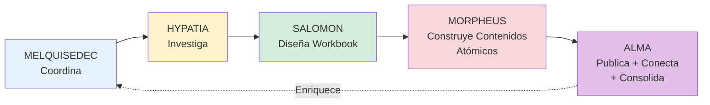
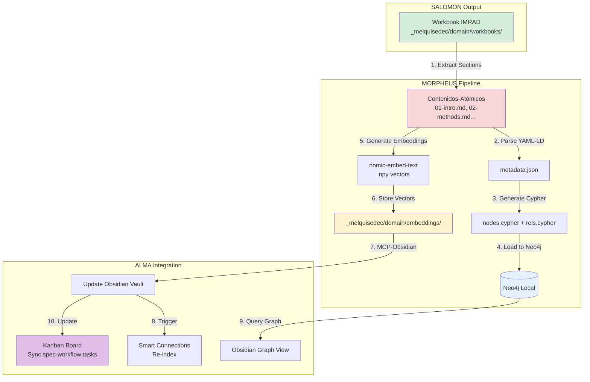
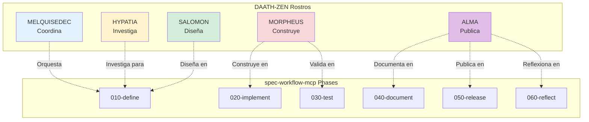
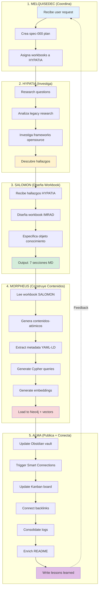

# 🧬 SPEC-000 REFINEMENT: Ciclo Completo de los 5 Rostros

**Fecha**: 2026-01-10  
**Contexto**: Feedback del usuario sobre análisis profundo spec-000  
**Autor**: GitHub Copilot (Claude Sonnet 4.5)  
**Status**: ⏳ Planning Refinement (Incorporando Feedback)

---

## 📋 Feedback del Usuario (Respuestas)

### ✅ Q1: Número de Workbooks - RESPONDIDO

**Usuario dijo**: "prefiero 5 o más, los que cada análisis requiera... lo importante es que como resultado de las discusiones, agreguemos generemos los **contenidos-atómicos**"

**Implicaciones**:
1. ✅ No limitar a 3 workbooks fijos
2. ✅ Cada investigación determina su cantidad de workbooks
3. ✅ **NUEVO ENFOQUE**: Generar **contenidos-atómicos** como resultado
4. ✅ Contenidos-atómicos = unidades indivisibles de conocimiento (Zettelkasten style)

---

### 🧬 REVELACIÓN: Ciclo Completo de los 5 Rostros DAATH-ZEN

**Usuario explicó el flujo completo**:



#### Responsabilidades de Cada Rostro

| Rostro | Acción | Input | Output | Herramientas |
|--------|--------|-------|--------|--------------|
| **MELQUISEDEC** | Coordina | User request | spec-000 plan | spec-workflow-mcp |
| **HYPATIA** | Investiga | Legacy research, frameworks | Análisis, descubrimientos | MCP-Obsidian, web search |
| **SALOMON** | Diseña | Hallazgos HYPATIA | Workbook IMRAD (especifica objeto conocimiento) | IMRAD methodology |
| **MORPHEUS** | Construye | Workbook SALOMON | **Contenidos-atómicos** para triple persistencia | GenAI-stack, Neo4j |
| **ALMA** | Publica + Conecta | Contenidos-atómicos | README, guías, lecciones, logs consolidados | MCP-Obsidian, Kanban |

---

## 🔍 Preguntas Clave del Usuario

### Pregunta 1: Relaciones Conceptuales Metodológicas

**Usuario pregunta**: "relaciones conceptuales entre los artefactos de una metodología y otra..."

**Interpretación**: Mapear relaciones entre:
- **Artefactos spec-workflow-mcp** (requirements.md, design.md, tasks.md, approvals/)
- **Artefactos DAATH-ZEN** (keter-doc, workbooks IMRAD, contenidos-atómicos)

**Ejemplo de Relación**:
```
spec-workflow requirements.md ←→ DAATH-ZEN keter-doc (frontmatter)
spec-workflow 010-define/      ←→ DAATH-ZEN SALOMON (diseño)
spec-workflow 020-implement/   ←→ DAATH-ZEN MORPHEUS (construcción)
spec-workflow 050-release/     ←→ DAATH-ZEN ALMA (publicación)
```

### Pregunta 2: Frameworks/Ontologías Opensource

**Usuario pregunta**: "si ya existen framework, ontologias (cypher, embeddings) opensource robustas que se puedan aprovechar."

**Implicaciones**: HYPATIA debe investigar:
1. **Graph Ontologies**: DBpedia, Schema.org, Wikidata, FOAF
2. **Cypher Patterns**: Neo4j Graph Data Science library, APOC procedures
3. **Embedding Models**: Sentence Transformers, Nomic Embed, OpenAI embeddings
4. **RAG Frameworks**: LlamaIndex, LangChain (ya analizado en genai-stack)

---

## 🛠️ Q2: GenAI-Stack Prototype (Respondido)

**Usuario dijo**: "no, ya tenemos un prototipo desarrollado que usa el stack GenAI-stack docker, pero no lo tengo bien documentado, lo llevé todo a _legacy porque se generó desordenadamente sin un spec formal que lo documentara."

### Estado Actual del Prototype

**Ubicación Actual**:
- `_lab/genai-stack/` (Docker Compose con 7 servicios)
- Documentación en `apps/research-neo4j-llamaindex-architecture/`
- Análisis completo en `genai-stack.md` (1,040+ líneas)

**Servicios en GenAI-Stack**:
```yaml
services:
  database:      # Neo4j 5.26 (Graph + Vector unified)
  llm:           # Ollama (local LLM inference)
  pull-model:    # Auto-download Ollama models
  loader:        # StackOverflow data ingestion
  bot:           # Streamlit chatbot
  pdf_bot:       # PDF Q&A bot
  api:           # FastAPI REST API
  front-end:     # Svelte UI
```

**Stack Técnico**:
- **Backend**: LangChain (chains.py) + LlamaIndex (optional)
- **Database**: Neo4j 5.26 (HNSW vector index + Cypher)
- **Embeddings**: Ollama nomic-embed-text (768 dim), OpenAI, AWS Bedrock
- **LLM**: Ollama llama2/qwen2.5, OpenAI GPT-4, AWS Bedrock

### Problema Identificado

**Por qué está en _legacy**:
1. ❌ Sin spec formal (requirements.md, design.md)
2. ❌ Arquitectura no documentada estructuralmente
3. ❌ No hay triple persistencia de markdown → Neo4j
4. ❌ Solo ingesta de StackOverflow (no markdown files)

### Solución Propuesta

**MORPHEUS debe**:
1. Documentar arquitectura GenAI-stack con spec formal (spec-002 futuro)
2. Adaptar ingestion pipeline: MD workbooks → Neo4j + embeddings
3. Crear contenidos-atómicos desde workbooks SALOMON
4. Integrar con `packages/triple-persistence/` existente

---

## 🔌 Q3: MCP-Obsidian + Triple Permanencia (Respondido)

**Usuario dijo**: "TENEMOS EL MCP-OBSIDEAN, LO QUE CREO QUE DEBEMOS HACER ES INCLUIR DENTRO DE LAS ACCIONES DE LA TRIPLE PERMANENCIA QUE SE ACTUALICE OBSIDEAN GRAFOS, SMART-CONNECTIONS... PODRIAMOS INCLUIR UN KANBAN QUE ESTÉ SINCRONIZADO CON SPEC-WORKBLOW PARA QUE SE VEA TAMBIÉN ESTE TABLERO EN OBSIDEAN."

### Componentes a Integrar

#### 1. MCP-Obsidian (Existente)

**Capabilities**:
- `mcp_obsidian_get_file_contents`: Leer archivos MD
- `mcp_obsidian_append_content`: Agregar contenido
- `mcp_obsidian_simple_search`: Buscar texto
- `mcp_obsidian_complex_search`: Búsqueda avanzada
- `mcp_obsidian_list_files_in_vault`: Listar archivos

#### 2. Smart Connections (Obsidian Plugin)

**Función**: Semantic search con embeddings locales
**Integration Point**: MORPHEUS genera embeddings → Smart Connections los indexa

#### 3. Kanban Board (Obsidian Plugin)

**Función**: Visualizar tareas como Kanban
**Integration Point**: Sincronizar con spec-workflow tasks.md

### Pipeline de Triple Permanencia Actualizado



### Acciones ALMA (Nueva Responsabilidad)

**ALMA debe**:
1. **Publicar contenidos-atómicos** en Obsidian vault
2. **Conectar** conceptos entre workbooks (bidirectional links [[]])
3. **Actualizar Smart Connections** (trigger re-indexing)
4. **Sincronizar Kanban** con spec-workflow tasks.md
5. **Consolidar logs** (chatlog, implementation-log)
6. **Enriquecer README** con hallazgos de workbooks
7. **Escribir lecciones aprendidas** (lessons/)

---

## 📊 Q5: Best Practice para Amendments (Recomendación)

**Usuario pregunta**: "¿Amendments en § X.1 o folder separado?"

### Análisis de Opciones

| Opción | Pros | Cons | Obsidian Compatibility |
|--------|------|------|------------------------|
| **A: § X.1 Amendment en mismo archivo** | ✅ Single source of truth<br/>✅ Version history en Git<br/>✅ Fácil navegar | ❌ Archivo crece mucho<br/>❌ Difícil ver solo amendments | ✅ Excelente |
| **B: Folder separado `amendments/`** | ✅ Archivos separados<br/>✅ Fácil listar amendments<br/>✅ No modifica original | ❌ Fragmentación<br/>❌ Doble source of truth<br/>❌ Backlinks complejos | ⚠️ Requiere más configuración |
| **C: Hybrid: § X.1 + `amendments/` link** | ✅ Best of both worlds<br/>✅ § X.1 como índice<br/>✅ Amendment detallado separado | ⚠️ Más complejo<br/>⚠️ Requiere disciplina | ✅ Muy buena |

### 🏆 Recomendación: Opción C (Hybrid)

**Formato Recomendado**:

#### En Workbook Original (06-conclusion.md)

```markdown
## 6. Conclusion (Original)

<!-- Contenido original de spec-000 -->

---

## 6.1 Amendment from spec-001

**Status**: ⚠️ Updated by [[amendments/spec-001-amendment-template-validation]]

**Summary**: Durante implementación spec-001, se validó que template-base.yaml requiere campo adicional `meta.author_rostro` para trazabilidad.

**Impact**: Minor (no afecta decisión principal)

**Read Full Amendment**: [[amendments/spec-001-amendment-template-validation]]

---

**Version History**:
- v1.0.0 (2026-01-10): Original conclusion from spec-000
- v1.1.0 (2026-01-15): Amendment from spec-001 (template validation)
```

#### En Folder Separado (amendments/spec-001-amendment-template-validation.md)

```markdown
---
'@context': '../../../context.jsonld'
'@type': 'Amendment'
'@id': 'urn:melquisedec:amendment:spec-001-template-validation'
original_workbook: 'spec-000-daath-zen-templates-analysis'
original_section: '06-conclusion.md'
amendment_from_spec: 'spec-001'
date: '2026-01-15T14:30:00Z'
impact_level: 'minor'  # minor | moderate | major
status: 'accepted'
author: 'MORPHEUS (via spec-001 implementation)'
tags:
  - amendment
  - spec-001
  - template-validation
---

# Amendment: Template Validation Findings (spec-001)

## Context

Durante la implementación de spec-001 (Built Template Spec-Workflow), al validar el sistema minimalista propuesto en [[spec-000-daath-zen-templates-analysis#conclusion]], se descubrió que...

## Original Decision (spec-000)

> "Adoptar `template-base.yaml` con campos minimalistas: `meta.project`, `meta.purpose`, `sections[]`"

**Reference**: [[spec-000-daath-zen-templates-analysis/06-conclusion#section-6.2]]

## New Finding (spec-001 Implementation)

Durante implementación de `template-renderer.py`, se identificó que **es necesario agregar campo `meta.author_rostro`** para:

1. **Trazabilidad**: Saber qué Rostro DAATH-ZEN generó el documento
2. **Auditoría**: Validar que SALOMON diseña, MORPHEUS construye, ALMA publica
3. **Compliance**: Cumplir con Keter-Doc Protocol v1.0.0 (campo obligatorio)

**Evidencia**:
```yaml
# template-base.yaml (UPDATED)
meta:
  project: '{{PROJECT_NAME}}'
  purpose: '{{PURPOSE}}'
  author_rostro: '{{ROSTRO}}'  # NUEVO CAMPO
  created: '{{TIMESTAMP}}'
```

## Impact Analysis

**Impact Level**: ⚠️ **Minor**

**Affected Components**:
- ✅ `template-base.yaml`: Agregar campo `meta.author_rostro`
- ✅ `config-*.yaml`: Agregar `ROSTRO` placeholder
- ❌ No afecta estructura de secciones (decisión principal se mantiene)

**Backward Compatibility**: ✅ Compatible (campo opcional por ahora)

## Updated Decision

**Original Decision**: ✅ Mantiene validez

**Amendment**: Agregar campo `meta.author_rostro` a template-base.yaml

**Rationale**: Mejora trazabilidad sin romper minimalismo (1 campo adicional de 3 → 4)

## Implementation in spec-001

- [x] Actualizar `template-base.yaml` con campo `author_rostro`
- [x] Actualizar `config-salomon.yaml` con `ROSTRO: SALOMON`
- [x] Actualizar `config-morpheus.yaml` con `ROSTRO: MORPHEUS`
- [x] Validar con `pytest tests/test_template_validation.py`

**Commit**: `feat(spec-001): Add author_rostro to template-base.yaml`

## Acceptance

**Accepted by**: MELQUISEDEC (coordinating role)
**Date**: 2026-01-15
**Rationale**: Mejora necesaria, impacto mínimo, mantiene minimalismo

---

**References**:
- [[spec-000-daath-zen-templates-analysis/06-conclusion]]
- [[spec-001/020-implement/template-renderer.py]]
- [[packages/core-mcp/schemas/keter-doc-protocol-v1.0.0.jsonld]]
```

### Ventajas de Opción C (Hybrid)

1. ✅ **Single Source of Truth**: Conclusión original no se modifica (solo índice)
2. ✅ **Detalle Separado**: Amendment completo en archivo propio (fácil leer)
3. ✅ **Obsidian Backlinks**: Funciona perfecto con [[wikilinks]]
4. ✅ **Versionado Git**: Cada amendment es un commit separado
5. ✅ **Fácil Auditar**: `amendments/` folder lista todos los cambios
6. ✅ **Impact Level**: Campo explícito para priorizar amendments

---

## 🔬 Diseño de Workbooks 5+ (Respondiendo Q1)

### Metodología de Diseño

**Principio**: Cada **tópico de investigación** genera workbooks según necesidad, no cantidad fija.

### Workbooks Propuestos para spec-000

#### Workbook 1: daath-zen-templates-analysis

**Tópico**: Análisis comparativo de 6 versiones de templates DAATH-ZEN

**HYPATIA Research Questions**:
1. ¿Cuáles son las fortalezas de cada versión?
2. ¿Qué estructura unificada emerge?
3. ¿Cómo mapean a Keter-Doc Protocol v1.0.0?

**SALOMON Workbook** (IMRAD):
- 01-introduction.md: Problema de inconsistencia entre 6 templates
- 02-methods.md: Análisis comparativo línea por línea
- 03-results.md: Tabla comparativa (líneas, placeholders, metadata)
- 04-analysis.md: Identificación de patrones comunes
- 05-discussion.md: Implicaciones de template unificado
- 06-conclusion.md: Decisión de adoptar daath-zen-base.md
- 07-references.md: Links a 6 templates analizados

**MORPHEUS Contenidos-Atómicos** (ejemplos):
```
_melquisedec/domain/atomic-content/
├── template-comparison-table.md          # Tabla comparativa
├── keter-doc-mapping-diagram.md          # Diagrama mapeo
├── placeholders-inventory.md             # Lista placeholders {{VAR}}
├── metadata-schema-unified.md            # Esquema YAML-LD unificado
└── minimalismo-calculation.md            # Cálculo sistema minimalista
```

**Duración**: 3 días

---

#### Workbook 2: spec-workflow-daath-zen-mapping

**Tópico**: Relaciones conceptuales spec-workflow-mcp ↔ DAATH-ZEN

**HYPATIA Research Questions**:
1. ¿Qué artefactos de spec-workflow-mcp mapean a DAATH-ZEN?
2. ¿Cómo se relacionan requirements.md con keter-doc?
3. ¿Qué fases de spec-workflow corresponden a qué Rostros?

**SALOMON Workbook** (IMRAD):
- 01-introduction.md: Necesidad de mapear metodologías
- 02-methods.md: Análisis estructural de artefactos
- 03-results.md: Tabla de mapeo spec-workflow → DAATH-ZEN
- 04-analysis.md: Correspondencias y gaps identificados
- 05-discussion.md: Cómo sincronizar ambas metodologías
- 06-conclusion.md: Estrategia de integración híbrida
- 07-references.md: Links a documentación de ambos frameworks

**MORPHEUS Contenidos-Atómicos**:
```
_melquisedec/domain/atomic-content/
├── spec-workflow-phases-diagram.md       # Diagrama fases spec-workflow
├── daath-zen-rostros-diagram.md          # Diagrama 5 Rostros
├── mapping-table-artifacts.md            # Tabla: spec-workflow ↔ DAATH-ZEN
├── integration-strategy.md               # Estrategia de sincronización
└── hybrid-workflow-design.md             # Diseño workflow híbrido
```

**Duración**: 2 días

---

#### Workbook 3: opensource-ontologies-investigation

**Tópico**: Frameworks/ontologías opensource para reutilizar

**HYPATIA Research Questions**:
1. ¿Qué ontologías de grafos existen (Schema.org, FOAF, DBpedia)?
2. ¿Qué Cypher patterns robustos hay en Neo4j GDS?
3. ¿Qué embedding models open-source son mejores?
4. ¿Qué RAG frameworks (LlamaIndex, LangChain) se integran mejor?

**SALOMON Workbook** (IMRAD):
- 01-introduction.md: Necesidad de aprovechar estándares existentes
- 02-methods.md: Survey de frameworks, pruebas de integración
- 03-results.md: Tabla comparativa frameworks (features, pros/cons)
- 04-analysis.md: Idoneidad de cada framework para MELQUISEDEC
- 05-discussion.md: Trade-offs de adopción vs custom development
- 06-conclusion.md: Frameworks recomendados para adoptar
- 07-references.md: Links a repos, papers, documentación oficial

**MORPHEUS Contenidos-Atómicos**:
```
_melquisedec/domain/atomic-content/
├── schema-org-mapping.md                 # Mapeo Schema.org concepts
├── foaf-ontology-analysis.md             # Análisis FOAF ontology
├── neo4j-gds-patterns.md                 # Cypher patterns de GDS library
├── embedding-models-benchmark.md         # Benchmark modelos embeddings
├── llamaindex-integration-guide.md       # Guía integración LlamaIndex
└── langchain-comparison.md               # Comparación LangChain vs LlamaIndex
```

**Duración**: 4 días

---

#### Workbook 4: genai-stack-architecture-documentation

**Tópico**: Documentación formal de GenAI-stack prototype

**HYPATIA Research Questions**:
1. ¿Cómo funciona la arquitectura Docker Compose actual?
2. ¿Qué servicios están funcionando vs cuáles faltan?
3. ¿Cómo adaptar ingestion pipeline para MD workbooks?

**SALOMON Workbook** (IMRAD):
- 01-introduction.md: Estado actual GenAI-stack en `_lab/`
- 02-methods.md: Análisis de docker-compose.yml, chains.py
- 03-results.md: Diagrama arquitectura, tabla servicios
- 04-analysis.md: Gaps identificados (falta MD ingestion)
- 05-discussion.md: Cómo integrar con triple-persistence package
- 06-conclusion.md: Spec formal para GenAI-stack (futuro spec-002)
- 07-references.md: Links a genai-stack.md analysis (1,040 líneas)

**MORPHEUS Contenidos-Atómicos**:
```
_melquisedec/domain/atomic-content/
├── genai-stack-docker-diagram.md         # Diagrama Docker Compose
├── services-inventory-table.md           # Tabla servicios (7 containers)
├── ingestion-pipeline-md.md              # Diseño MD ingestion pipeline
├── triple-persistence-integration.md     # Plan integración con package
└── genai-stack-spec-002-outline.md       # Outline futuro spec-002
```

**Duración**: 2 días

---

#### Workbook 5: mcp-obsidian-integration-design

**Tópico**: Integración MCP-Obsidian + Smart Connections + Kanban

**HYPATIA Research Questions**:
1. ¿Qué capabilities tiene MCP-Obsidian actualmente?
2. ¿Cómo sincronizar embeddings con Smart Connections?
3. ¿Cómo sincronizar Kanban con spec-workflow tasks.md?

**SALOMON Workbook** (IMRAD):
- 01-introduction.md: Necesidad de gestionar dominio con Obsidian
- 02-methods.md: Análisis de MCP-Obsidian API, plugins
- 03-results.md: Diagrama de integración MCP + plugins
- 04-analysis.md: Estrategia de sincronización automática
- 05-discussion.md: ALMA como orquestador de publicaciones
- 06-conclusion.md: Pipeline ALMA definido
- 07-references.md: Links a MCP-Obsidian docs, plugin docs

**MORPHEUS Contenidos-Atómicos**:
```
_melquisedec/domain/atomic-content/
├── mcp-obsidian-capabilities.md          # Lista capabilities MCP
├── smart-connections-integration.md      # Plan sincronización Smart Connections
├── kanban-sync-design.md                 # Diseño sincronización Kanban
├── alma-pipeline-workflow.md             # Workflow ALMA detallado
└── obsidian-vault-config.md              # Configuración Obsidian vault
```

**Duración**: 2 días

---

#### Workbook 6: contenidos-atomicos-methodology

**Tópico**: Metodología para generar contenidos-atómicos (Zettelkasten)

**HYPATIA Research Questions**:
1. ¿Qué es un contenido-atómico (unidad indivisible)?
2. ¿Cómo se relacionan contenidos-atómicos entre sí?
3. ¿Qué metadata debe tener cada contenido-atómico?

**SALOMON Workbook** (IMRAD):
- 01-introduction.md: Concepto de contenidos-atómicos
- 02-methods.md: Análisis de Zettelkasten, Obsidian atomic notes
- 03-results.md: Template para contenido-atómico
- 04-analysis.md: Relación con triple persistencia
- 05-discussion.md: MORPHEUS como generador automatizado
- 06-conclusion.md: Metodología estandarizada
- 07-references.md: Papers sobre Zettelkasten, Luhmann

**MORPHEUS Contenidos-Atómicos**:
```
_melquisedec/domain/atomic-content/
├── zettelkasten-principles.md            # Principios Zettelkasten
├── atomic-content-template.md            # Template contenido-atómico
├── metadata-schema-atomic.md             # Esquema metadata YAML-LD
├── backlinks-strategy.md                 # Estrategia de backlinks
└── morpheus-automation-guide.md          # Guía automatización MORPHEUS
```

**Duración**: 2 días

---

### Resumen Workbooks spec-000

| Workbook | Duración | Contenidos-Atómicos | Rostros Involucrados |
|----------|----------|---------------------|----------------------|
| 1. daath-zen-templates-analysis | 3 días | 5 contenidos | H + S + Mo |
| 2. spec-workflow-daath-zen-mapping | 2 días | 5 contenidos | H + S + Mo |
| 3. opensource-ontologies-investigation | 4 días | 6 contenidos | H + S + Mo |
| 4. genai-stack-architecture-documentation | 2 días | 5 contenidos | H + S + Mo |
| 5. mcp-obsidian-integration-design | 2 días | 5 contenidos | H + S + Mo |
| 6. contenidos-atomicos-methodology | 2 días | 5 contenidos | H + S + Mo |
| **TOTAL** | **15 días** | **31 contenidos-atómicos** | H + S + Mo + A |

**Nota**: ALMA interviene al final para publicar, conectar, consolidar.

---

## 🔗 Mapeo Relaciones Conceptuales (Respondiendo Pregunta Clave)

### spec-workflow-mcp ↔ DAATH-ZEN

| Artefacto spec-workflow-mcp | Artefacto DAATH-ZEN | Rostro Responsable | Relación |
|-----------------------------|---------------------|--------------------| ---------|
| `requirements.md` | Keter-Doc frontmatter (YAML-LD) | MELQUISEDEC | 1-1 mapping |
| `design.md` | Workbook IMRAD (SALOMON) | SALOMON | Diseña solución |
| `tasks.md` | Workbook IMRAD (MORPHEUS sections) | MORPHEUS | Construye contenidos |
| `010-define/` | Workbooks folder | SALOMON | Definición/Diseño |
| `020-implement/` | Contenidos-atómicos folder | MORPHEUS | Implementación |
| `030-test/` | Validation scripts | MORPHEUS | Testing |
| `040-document/` | README, guías (ALMA) | ALMA | Documentación |
| `050-release/` | Published content (ALMA) | ALMA | Publicación |
| `060-reflect/` | Lessons learned (ALMA) | ALMA | Reflexión |
| `approvals/` | Amendments folder | MELQUISEDEC | Governance |

### Fases spec-workflow ↔ Rostros DAATH-ZEN



---

## 📁 Estructura de Directorios Actualizada

```
_melquisedec/domain/
├── workbooks/                              # SALOMON Output (IMRAD)
│   ├── daath-zen-templates-analysis/
│   │   ├── 01-introduction.md
│   │   ├── 02-methods.md
│   │   ├── 03-results.md
│   │   ├── 04-analysis.md
│   │   ├── 05-discussion.md
│   │   ├── 06-conclusion.md
│   │   └── 07-references.md
│   ├── spec-workflow-daath-zen-mapping/
│   ├── opensource-ontologies-investigation/
│   ├── genai-stack-architecture-documentation/
│   ├── mcp-obsidian-integration-design/
│   └── contenidos-atomicos-methodology/
│
├── atomic-content/                         # MORPHEUS Output (Contenidos-Atómicos)
│   ├── template-comparison-table.md
│   ├── keter-doc-mapping-diagram.md
│   ├── spec-workflow-phases-diagram.md
│   ├── daath-zen-rostros-diagram.md
│   ├── schema-org-mapping.md
│   ├── genai-stack-docker-diagram.md
│   ├── mcp-obsidian-capabilities.md
│   └── zettelkasten-principles.md
│   └── [31 contenidos-atómicos total]
│
├── amendments/                             # Amendments a workbooks
│   ├── spec-001-amendment-template-validation.md
│   └── [futuros amendments]
│
├── metadata/                               # Metadata extraída (JSON)
│   ├── workbooks/
│   └── atomic-content/
│
├── cypher/                                 # Cypher queries (Triple Persistencia)
│   ├── workbooks/
│   │   ├── nodes.cypher
│   │   └── relationships.cypher
│   └── atomic-content/
│       ├── nodes.cypher
│       └── relationships.cypher
│
├── embeddings/                             # Vector embeddings (.npy)
│   ├── workbooks/
│   └── atomic-content/
│
├── neo4j-data/                             # Neo4j database (Docker volume)
├── ollama-models/                          # Ollama models cache
│
└── README.md                               # ALMA-generated overview
```

---

## 🎯 Pipeline Completo de los 5 Rostros (Actualizado)



---

## 🚀 Próximos Pasos

### 1. MELQUISEDEC (Ahora)

- [ ] Aprobar refinamiento de spec-000 con 6 workbooks
- [ ] Confirmar estructura de directorios
- [ ] Confirmar best practice amendments (Opción C)

### 2. HYPATIA (Día 1-2)

- [ ] Comenzar workbook 1: daath-zen-templates-analysis
- [ ] Investigar frameworks opensource (workbook 3)

### 3. SALOMON (Día 3-5)

- [ ] Diseñar workbooks IMRAD
- [ ] Especificar contenidos-atómicos necesarios

### 4. MORPHEUS (Día 6-10)

- [ ] Construir contenidos-atómicos
- [ ] Ejecutar pipeline triple persistencia
- [ ] Validar Neo4j + embeddings

### 5. ALMA (Día 11-15)

- [ ] Publicar en Obsidian vault
- [ ] Sincronizar Smart Connections + Kanban
- [ ] Consolidar logs + README + lessons

---

**Esperando feedback del usuario para proceder con spec-000 refinado.**