# Sistema Minimalista y Configurable de Templates

**Filosofía**: 1 template genérico + N configuraciones pequeñas = Sistema escalable y mantenible

## 🎯 Problema Resuelto

### ❌ Enfoque incorrecto (sobre-ingeniería):
```
requirement-issue.yaml (100 líneas, hardcoded)
concept-issue.yaml (80 líneas, hardcoded)
literature-issue.yaml (90 líneas, hardcoded)
design-issue.yaml (95 líneas, hardcoded)
implementation-issue.yaml (110 líneas, hardcoded)

Total: 475 líneas
Agregar nuevo tipo: +100 líneas de código duplicado
Cambiar estructura base: modificar 5 archivos
```

### ✅ Enfoque correcto (minimalista):
```
template-base.yaml (30 líneas genéricas)
configs/
  ├─ requirement-config.yaml (20 líneas)
  ├─ concept-config.yaml (18 líneas)
  ├─ literature-config.yaml (22 líneas)
  ├─ design-config.yaml (25 líneas)
  └─ implementation-config.yaml (28 líneas)

Total: 143 líneas
Agregar nuevo tipo: +20 líneas de config
Cambiar estructura base: modificar 1 archivo (template-base.yaml)
```

---

## 📐 Arquitectura del Sistema

### Estructura de Directorios

```
.spec-workflow/_meta/
├── template-base.yaml          ← UNA plantilla genérica (30 líneas)
├── configs/                    ← Configuraciones por tipo (15-25 líneas c/u)
│   ├── requirement-config.yaml
│   ├── concept-config.yaml
│   ├── literature-config.yaml
│   ├── design-config.yaml
│   └── implementation-config.yaml
└── workflows/                  ← Patrones de workflow
    ├── workflow-patterns.yaml  ← Definición de workflows (Sub-Issue, Main Spec, IMPL, Steering)
    └── instantiation-rules.yaml ← Reglas de instanciación (próximamente)
```

### Flujo de Instanciación

```mermaid
graph LR
    A[Usuario: REQ-001 Template System] --> B[Cargar template-base.yaml]
    B --> C[Cargar configs/requirement-config.yaml]
    C --> D[Aplicar variables: tipo, número, nombre]
    D --> E[Aplicar context: territorio, persona, proceso, momento]
    E --> F[Generar ISSUE.yaml]
    F --> G[Generar workbook en territorio específico]
    G --> H[Actualizar índice]
    H --> I[Issue REQ-001 listo]

    style A fill:#e1f5ff
    style F fill:#d4edda
    style I fill:#d4edda
```



---

## 🔧 Componentes del Sistema

### 1. Template Base (template-base.yaml)

**Propósito**: Estructura genérica compartida por todos los tipos de issues

**Contenido**:
```yaml
---
# METADATA BASE (común a todos)
id: "{type}-{number}-{name}"
type: "{type}"
category: "{category}"
priority: "{priority}"
status: "draft"

# SPEC CONFIGURABLE (se llena desde config)
spec: {}

# DEPENDENCIES (estructura definida por config)
dependencies: {}

# WORKFLOW METADATA
tasks_generated: false

# WORKBOOK PATH (configurable)
workbook: "{workbook_path}"

# CONTEXT (territorio, persona, proceso, momento)
context:
  territory: "{territory}"
  persona: "{persona}"
  proceso: "{proceso}"
  momento: "{momento}"
---
```

**Variables**:
- `{type}`: requirement | concept | literature | design | implementation
- `{number}`: 001, 002, 003...
- `{name}`: Slug del artefacto
- `{category}`: Desde config-{type}.yaml
- `{priority}`: high | medium | low
- `{territory}`: Dónde se ejecuta (010-define/, 020-conceive/, etc.)
- `{persona}`: Quién ejecuta (AI Agent, User, MCP)
- `{proceso}`: Cómo se ejecuta (create_file, approval, logging)
- `{momento}`: Cuándo se ejecuta (immediate, after_approval, batch)

---

### 2. Config Files (configs/{type}-config.yaml)

**Propósito**: Define campos específicos, metodología, validaciones por tipo

#### Ejemplo: requirement-config.yaml

```yaml
---
type: "requirement"
methodology: "RBM"  # Results-Based Management

workbook_pattern: "010-define/workbooks/{id}.md"

spec_fields:
  problem:
    gap: "string"
    goal: "string"
    outcomes: "array"
  approach:
    methodology: "string"
    key_concepts: "array"
    constraints: "array"

dependency_types:
  - concepts: "array"
  - literature: "array"
  - designs: "array"

validation:
  - rule: "outcomes_measurable"
    message: "Cada outcome debe ser medible (SMART)"
  - rule: "gap_defined"
    message: "El gap debe describir el estado actual"

workflow_defaults:
  territory: "010-define/"
  persona: "AI Agent"
  proceso: "create_issue"
  momento: "immediate"
---
```

**Campos clave**:
- `methodology`: Mapeo a metodología robusta (RBM, Zettelkasten, DDD, DSR)
- `spec_fields`: Estructura específica del tipo
- `validation`: Reglas para validar coherencia
- `workflow_defaults`: Valores por defecto de territory/persona/proceso/momento
- `workbook_template`: Template Markdown del workbook

---

### 3. Workflow Patterns (workflows/workflow-patterns.yaml)

**Propósito**: Define cómo se ejecutan los workflows según tipo de issue

**Patterns disponibles**:
- **Sub-Issue**: Sin approval, sin logging (20-35 min) → Para REQ, CONCEPT, LIT, DESIGN
- **Main Spec**: Con approval CON, sin logging (8 semanas) → Para especificaciones completas
- **IMPL**: Sin approval, **logging MANDATORY** (5 horas) → Para implementaciones
- **Steering**: Con approval CON, sin logging, OPCIONAL (1 semana) → Para product.md, tech.md, structure.md

#### Ejemplo: Implementation Pattern

```yaml
implementation:
  name: "Implementation Workflow (IMPL)"
  approval_required: false
  logging_required: true  # ⚠️ MANDATORY
  logging_tool: "mcp_spec-workflow_log-implementation"
  timing: "5 horas"

  applies_to:
    - implementation

  phases:
    - phase: "implement"
      steps:
        - "Escribir código según diseño"
        - "Ejecutar tests (coverage ≥80%)"

    - phase: "log"
      steps:
        - "MANDATORY: Llamar mcp_spec-workflow_log-implementation"
        - "Registrar artifacts (APIs, components, functions, classes, integrations)"
      mandatory_validation:
        - "artifacts must not be empty"
        - "summary must describe implementation"

  configuration:
    territory: "030-design/implementations/"
    persona: "AI Agent"
    proceso: "implement → test → log (MANDATORY)"
    momento: "immediate"
```

**Configuration Variables**:
- **territorio**: ¿Dónde? (.spec-workflow/, 010-define/, 030-design/)
- **persona**: ¿Quién? (AI Agent, User, MCP tool)
- **proceso**: ¿Cómo? (create_file, approval_loop, logging)
- **momento**: ¿Cuándo? (immediate, after_approval, batch)

---

## 🔄 Flujo Completo: Requirements → Design → Tasks

### Visión Correcta (Explicación para Dummies)

```
📋 REQUERIMIENTO (QUÉ necesito)
REQ-001: "Sistema de templates configurables"
  │
  │ ¿Cómo se resuelve este requerimiento?
  ↓
📐 DISEÑO (CÓMO lo resuelvo)
DESIGN-001:
  - Arquitectura: 1 template base + configs
  - Contratos: schema YAML validable
  - Pruebas: test de instanciación
  - Patrones: factory pattern
  │
  │ ¿Qué artefactos intermedios necesito?
  ↓
📦 ARTEFACTOS INTERMEDIOS (especificados por DESIGN)
  1. template-base.yaml
  2. config-requirement.yaml
  3. config-concept.yaml
  4. workflow-instantiation.py
  │
  │ ¿Cómo creo cada artefacto?
  ↓
⚙️ TASKS (Workflow configurable por artefacto)

  Task 1: Crear template-base.yaml
    └─ Territorio: .spec-workflow/_meta/
    └─ Persona: AI Agent
    └─ Proceso: create_file
    └─ Momento: ahora

  Task 2: Crear configs (requirement, concept, etc.)
    └─ Territorio: .spec-workflow/_meta/configs/
    └─ Persona: AI Agent
    └─ Proceso: create_file (5 archivos)
    └─ Momento: ahora

  Task 3: Validar instanciación
    └─ Territorio: local test
    └─ Persona: AI Agent
    └─ Proceso: test_instantiation()
    └─ Momento: después de crear configs
```

**Clave**: Los workflows son CONFIGURABLES por contexto específico:
- **Territorio**: Dónde se ejecuta cada task
- **Persona**: Quién la ejecuta (AI, User, MCP)
- **Proceso**: Cómo se ejecuta (create_file, approval, logging)
- **Momento**: Cuándo se ejecuta (immediate, after_approval, batch)

---

## 🔬 Coherencia Metodológica

Cada tipo de issue se fundamenta en **metodología robusta y aprobada**:

### requirement → RBM (Results-Based Management)
- **Fuente**: UNDP Results-Based Management Handbook
- **Estructura**: Gap → Goal → Outcomes
- **Validación**: Outcomes medibles (SMART)

### concept → Zettelkasten (Luhmann)
- **Fuente**: Niklas Luhmann, "Communicating with Slip Boxes"
- **Estructura**: Atomic idea + bidirectional links
- **Validación**: Definición clara + ejemplos

### literature → Systematic Literature Review
- **Fuente**: Kitchenham & Charters, "Guidelines for SLR in SE"
- **Estructura**: Bibliographic data + extraction targets
- **Validación**: Citas verificables

### design → DDD + DSR
- **Fuente**: Eric Evans (DDD) + Hevner et al. (DSR)
- **Estructura**: Component + decisions + ADRs
- **Validación**: Implementa requirements

### implementation → DSR + TDD
- **Fuente**: Design Science Research + Test-Driven Development
- **Estructura**: Algorithm + inputs/outputs + test coverage
- **Validación**: Tests ≥80%, logging MANDATORY

---

## 📝 Uso del Sistema (Pseudocódigo)

### Crear un Issue (Ejemplo: REQ-001)

```python
# 1. Definir variables del issue
variables = {
    "type": "requirement",
    "number": "001",
    "name": "template-system",
    "category": "architecture",
    "priority": "high"
}

# 2. Definir contexto de ejecución
context = {
    "territory": "010-define/workbooks/",
    "persona": "AI Agent",
    "proceso": "create_issue",
    "momento": "immediate"
}

# 3. Cargar template base
template = load(".spec-workflow/_meta/template-base.yaml")

# 4. Cargar config del tipo
config = load(f".spec-workflow/_meta/configs/{variables['type']}-config.yaml")

# 5. Aplicar config al template
issue_yaml = template.apply(config, variables, context)

# 6. Generar workbook template
workbook_md = config.workbook_template.format(**variables)

# 7. Crear archivos
issue_path = f".spec-workflow/REQ-001-template-system/ISSUE.yaml"
workbook_path = f"{context['territory']}/REQ-001-template-system.md"

create_file(issue_path, issue_yaml)
create_file(workbook_path, workbook_md)

# 8. Actualizar índice
update_index("010-define/INDICE-REQUIREMENTS.md", "REQ-001")

# 9. Validar según validation rules
validate_issue(issue_yaml, config.validation)
```

---

## ✅ Ventajas del Enfoque Minimalista

### 1. **Escalabilidad**
- Agregar nuevo tipo = crear 1 config de 20 líneas
- No necesita modificar template base
- No duplica código

### 2. **Mantenibilidad**
- Cambios en estructura base → modificar 1 archivo
- Cambios específicos de tipo → modificar 1 config
- Lógica centralizada en workflow-patterns.yaml

### 3. **Configurabilidad**
- Cada workflow se adapta al contexto (territorio, persona, proceso, momento)
- No hardcodea rutas o procesos
- Permite override de defaults

### 4. **Coherencia Metodológica**
- Cada tipo mapea a metodología aprobada
- Validation rules garantizan coherencia
- Documentación clara de por qué cada estructura existe

### 5. **Minimalismo**
- 143 líneas totales vs 475 líneas del enfoque incorrecto
- Fácil de entender y explicar
- Patrones claros y explícitos

---

## 📊 Comparación: Enfoque Incorrecto vs Correcto

| Aspecto | ❌ Sobre-ingeniería (5 templates) | ✅ Minimalista (1 base + configs) |
|---------|-----------------------------------|-----------------------------------|
| **Líneas de código** | 475 líneas | 143 líneas |
| **Agregar nuevo tipo** | +100 líneas de código duplicado | +20 líneas de config |
| **Modificar estructura base** | Modificar 5 archivos | Modificar 1 archivo |
| **Duplicación** | Alta (estructura repetida 5 veces) | Ninguna (base compartida) |
| **Configurabilidad** | Baja (hardcoded) | Alta (variables por contexto) |
| **Mantenibilidad** | Baja (cambios se replican) | Alta (cambios centralizados) |
| **Coherencia metodológica** | No garantizada | Garantizada (validation rules) |

---

## 🚀 Próximos Pasos

1. ✅ Template base creado
2. ✅ Configs creados (requirement, concept)
3. ⏳ Crear configs restantes (literature, design, implementation)
4. ⏳ Crear instantiation-rules.yaml
5. ⏳ Validar creando REQ-001, REQ-002, REQ-003
6. ⏳ Implementar script de instanciación automática (opcional)

---

## 📚 Referencias

- **RBM**: UNDP Results-Based Management Handbook
- **Zettelkasten**: Luhmann, "Communicating with Slip Boxes" + Ahrens, "How to Take Smart Notes"
- **Systematic Review**: Kitchenham & Charters, "Guidelines for SLR in Software Engineering"
- **DDD**: Eric Evans, "Domain-Driven Design: Tackling Complexity in the Heart of Software"
- **DSR**: Hevner et al., "Design Science in Information Systems Research"
- **TDD**: Kent Beck, "Test Driven Development: By Example"

---

**Filosofía Final**: Pensemos mejor, construyamos una solución minimalista, que sea configurable, entendamos los patrones. De tal manera que tengamos una plantilla por tipo de artefacto, no 5 templates hardcoded.
