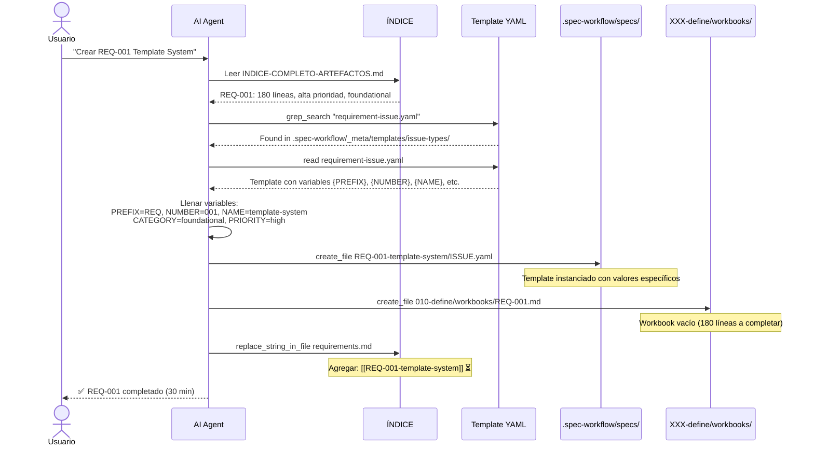
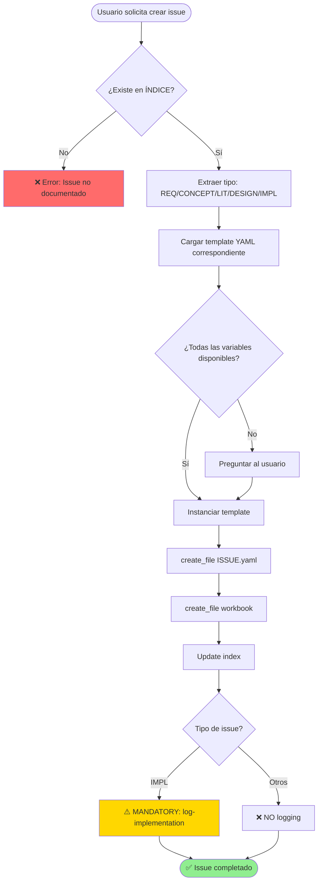

# 📋 Issue Templates por Tipo

> **Versión:** 1.0.0
> **Fecha:** 2026-01-10
> **Propósito:** Sistema de templates YAML configurables para instanciar issues por tipo
> **Arquitectura:** Template → Instanciación → Issue → Artefacto

---

## 🎯 Propósito del Sistema

Este directorio contiene **templates YAML** para cada tipo de issue que se documenta en el [INDICE-COMPLETO-ARTEFACTOS.md](../../../../010-define/INDICE-COMPLETO-ARTEFACTOS.md).

### Concepto Clave

```
ÍNDICE (requirements.md)
  └── Lista artefactos: REQ-001, CONCEPT-017, LIT-001, etc.
      │
      ├─ Cada artefacto ES un issue
      ├─ Cada issue TIENE un tipo (REQ/CONCEPT/LIT/DESIGN/IMPL)
      ├─ Cada tipo USA un template YAML
      └─ Template se INSTANCIA al crear la tarea
          │
          └─> Resultado: .spec-workflow/specs/TYPE-XXX/ISSUE.yaml + workbook
```

### Analogía OOP

| Concepto OOP | En Issues | Archivo |
|--------------|-----------|---------|
| **Class** | Template YAML | `requirement-issue.yaml` |
| **Instance** | Issue específico | `.spec-workflow/specs/REQ-001/ISSUE.yaml` |
| **Constructor** | Proceso de instanciación | AI Agent con `create_file` |
| **Properties** | Variables configurables | `{id}`, `{category}`, `{priority}`, etc. |
| **Object** | Artefacto generado | `010-define/workbooks/REQ-001.md` |

---

## 📂 Templates Disponibles

### 1. requirement-issue.yaml

**Tipo:** `requirement`
**Uso:** Requerimientos funcionales/no-funcionales
**Ubicación Issue:** `.spec-workflow/specs/REQ-XXX/`
**Ubicación Workbook:** `010-define/workbooks/REQ-XXX.md`
**Índice:** `010-define/requirements.md`

**Variables:**
- `{PREFIX}`: "REQ"
- `{NUMBER}`: "001", "002", "003"...
- `{NAME}`: Slug del requerimiento (ej: "template-system")
- `{CATEGORY}`: functional, non-functional, foundational
- `{PRIORITY}`: high, medium, low
- `{GAP}`: Descripción del problema/gap
- `{GOAL}`: Objetivo del requerimiento
- `{OUTCOMES}`: Lista de resultados esperados

**Ejemplo de uso:**
```bash
# Usuario: "Crear REQ-001 Template System Architecture"
# AI ejecuta:
create_file .spec-workflow/specs/REQ-001-template-system/ISSUE.yaml
  # Llenando variables desde requirement-issue.yaml template

create_file 010-define/workbooks/REQ-001-template-system.md
  # Workbook vacío (180 líneas a completar)

replace_string_in_file 010-define/requirements.md
  # Agregar: [[REQ-001-template-system]] ⏳ En progreso
```

---

### 2. concept-issue.yaml

**Tipo:** `concept`
**Uso:** Conceptos fundacionales o ideas clave
**Ubicación Issue:** `.spec-workflow/specs/CONCEPT-XXX/`
**Ubicación Workbook:** `020-conceive/02-atomics/CONCEPT-XXX.md`
**Índice:** `020-conceive/concepts-index.md`

**Variables:**
- `{PREFIX}`: "CONCEPT"
- `{NUMBER}`: "001", "002", "003"...
- `{NAME}`: Slug del concepto (ej: "autopoiesis")
- `{CATEGORY}`: foundational, praxis-rbm, methodology, architecture
- `{PRIORITY}`: high, medium, low
- `{DEFINITION}`: Definición corta del concepto
- `{SOURCE}`: Fuente bibliográfica (si aplica)
- `{EXAMPLES}`: Ejemplos de aplicación

**Ejemplo de uso:**
```bash
# Usuario: "Crear CONCEPT-017 Autopoiesis"
# AI ejecuta:
create_file .spec-workflow/specs/CONCEPT-017-autopoiesis/ISSUE.yaml
create_file 020-conceive/02-atomics/CONCEPT-017-autopoiesis.md
replace_string_in_file 020-conceive/concepts-index.md
```

---

### 3. literature-issue.yaml

**Tipo:** `literature`
**Uso:** Papers, libros, artículos de referencia
**Ubicación Issue:** `.spec-workflow/specs/LIT-XXX/`
**Ubicación Notas:** `020-conceive/01-literature/LIT-XXX.md`
**Índice:** `020-conceive/literature-index.md`

**Variables:**
- `{PREFIX}`: "LIT"
- `{NUMBER}`: "001", "002", "003"...
- `{NAME}`: Slug del paper (ej: "hevner-dsr")
- `{PAPER_TITLE}`: Título del paper
- `{AUTHORS}`: Autores del paper
- `{YEAR}`: Año de publicación
- `{DOI}`: DOI o URL
- `{READING_STATUS}`: to-read, reading, completed
- `{RELEVANCE}`: Framework, Foundation, Supporting

**Ejemplo de uso:**
```bash
# Usuario: "Crear LIT-001 Hevner et al. DSR 2004"
# AI ejecuta:
create_file .spec-workflow/specs/LIT-001-hevner-dsr/ISSUE.yaml
  # reading_status: "to-read"

create_file 020-conceive/01-literature/LIT-001-hevner-dsr.md
  # Notas vacías (a completar durante lectura)

replace_string_in_file 020-conceive/literature-index.md
  # Agregar: [[LIT-001-hevner-dsr]] 📚 To Read
```

---

### 4. design-issue.yaml

**Tipo:** `design`
**Uso:** Diseño arquitectónico de componentes
**Ubicación Issue:** `.spec-workflow/specs/DESIGN-XXX/`
**Ubicación Workbook:** `030-design/workbooks/DESIGN-XXX.md`
**Índice:** `030-design/architecture-index.md`

**Variables:**
- `{PREFIX}`: "DESIGN"
- `{NUMBER}`: "001", "002", "003"...
- `{NAME}`: Slug del diseño (ej: "triple-persistence")
- `{CATEGORY}`: architecture, pattern, integration
- `{PRIORITY}`: high, medium, low
- `{COMPONENT}`: Nombre del componente
- `{PURPOSE}`: Propósito del diseño
- `{KEY_DECISIONS}`: Decisiones arquitectónicas clave
- `{ADRS}`: Lista de ADRs relacionados
- `{IMPLEMENTS}`: Lista de REQ-XXX que implementa

**Ejemplo de uso:**
```bash
# Usuario: "Crear DESIGN-001 Triple Persistence"
# AI ejecuta:
create_file .spec-workflow/specs/DESIGN-001-triple-persistence/ISSUE.yaml
  # adrs: [ADR-001, ADR-009, ADR-010]
  # implements: [REQ-004, REQ-012, REQ-013]

create_file 030-design/workbooks/DESIGN-001-triple-persistence.md
  # Workbook (280 líneas diseño + diagramas)

replace_string_in_file 030-design/architecture-index.md
```

---

### 5. implementation-issue.yaml

**Tipo:** `implementation`
**Uso:** Implementación de scripts, templates, patterns, lenses
**Ubicación Issue:** `.spec-workflow/specs/IMPL-XXX/`
**Ubicación Spec:** `040-build/specifications/IMPL-XXX.md`
**Ubicación Código:** `040-build/scripts/` o `templates/` o `patterns/` o `lenses/`
**Índice:** `040-build/implementation-index.md`

**Variables:**
- `{PREFIX}`: "IMPL"
- `{NUMBER}`: "001", "002", "003"...
- `{NAME}`: Slug de la implementación (ej: "init-spec-py")
- `{CATEGORY}`: script, template, pattern, lens
- `{PRIORITY}`: high, medium, low
- `{IMPL_NAME}`: Nombre del archivo/componente
- `{IMPL_TYPE}`: Python Script, YAML Template, Pattern, Lens
- `{PURPOSE}`: Propósito de la implementación
- `{ALGORITHM}`: Pasos del algoritmo (para scripts)
- `{INPUTS}`: Inputs esperados
- `{OUTPUTS}`: Outputs generados
- `{IMPLEMENTS}`: DESIGN-XXX que implementa
- `{TEST_COVERAGE}`: Target de cobertura (≥80%)

**Ejemplo de uso:**
```bash
# Usuario: "Crear IMPL-001 init-spec.py"
# AI ejecuta:
create_file .spec-workflow/specs/IMPL-001-init-spec-py/ISSUE.yaml
  # algorithm: ["Parse args", "Create dirs", "Apply templates", ...]
  # test_coverage: "≥80%"

create_file 040-build/specifications/IMPL-001-init-spec-py.md
  # Spec (180 líneas detallando algoritmo)

create_file 040-build/scripts/init/init-spec.py
  # Código Python (680 líneas, 8 pasos, 4.2s)

# ⚠️ CRITICAL: MANDATORY LOGGING
mcp_spec-workflow2_log-implementation(
  artifacts: ["init-spec.py"],
  summary: "Script to initialize spec structure (8 steps, 4.2s)"
)

replace_string_in_file 040-build/implementation-index.md
```

---

## 🔄 Proceso de Instanciación

### Flujo Completo



### Decisiones de Instanciación



---

## 📊 Mapeo ÍNDICE → Template → Issue

| Artefacto en ÍNDICE | Tipo | Template YAML | Issue Creado | Workbook |
|---------------------|------|---------------|--------------|----------|
| REQ-001 Template System | requirement | `requirement-issue.yaml` | `.spec-workflow/specs/REQ-001-template-system/ISSUE.yaml` | `010-define/workbooks/REQ-001-template-system.md` |
| CONCEPT-017 Autopoiesis | concept | `concept-issue.yaml` | `.spec-workflow/specs/CONCEPT-017-autopoiesis/ISSUE.yaml` | `020-conceive/02-atomics/CONCEPT-017-autopoiesis.md` |
| LIT-001 Hevner DSR | literature | `literature-issue.yaml` | `.spec-workflow/specs/LIT-001-hevner-dsr/ISSUE.yaml` | `020-conceive/01-literature/LIT-001-hevner-dsr.md` |
| DESIGN-001 Triple Persistence | design | `design-issue.yaml` | `.spec-workflow/specs/DESIGN-001-triple-persistence/ISSUE.yaml` | `030-design/workbooks/DESIGN-001-triple-persistence.md` |
| IMPL-001 init-spec.py | implementation | `implementation-issue.yaml` | `.spec-workflow/specs/IMPL-001-init-spec-py/ISSUE.yaml` | `040-build/specifications/IMPL-001-init-spec-py.md` |

---

## 🔧 Validación de Templates

### Schema Validation (Futuro)

Cada template YAML debe cumplir con un JSON Schema:

```yaml
# requirement-issue-schema.json
{
  "$schema": "http://json-schema.org/draft-07/schema#",
  "type": "object",
  "required": ["id", "type", "category", "priority", "status", "problem"],
  "properties": {
    "id": {
      "type": "string",
      "pattern": "^REQ-[0-9]{3}-[a-z0-9-]+$"
    },
    "type": {
      "const": "requirement"
    },
    "category": {
      "enum": ["functional", "non-functional", "foundational"]
    },
    "priority": {
      "enum": ["high", "medium", "low"]
    },
    "status": {
      "enum": ["draft", "in-progress", "review", "completed", "blocked"]
    },
    "problem": {
      "type": "object",
      "required": ["gap", "goal", "outcomes"],
      "properties": {
        "gap": {"type": "string"},
        "goal": {"type": "string"},
        "outcomes": {
          "type": "array",
          "items": {"type": "string"},
          "minItems": 1
        }
      }
    }
  }
}
```

### Checklist de Instanciación

- [ ] Template YAML existe para el tipo de issue
- [ ] Todas las variables obligatorias están definidas
- [ ] Issue ID sigue nomenclatura: `{PREFIX}-{NUMBER}-{NAME}`
- [ ] ISSUE.yaml cumple con schema (si existe)
- [ ] Workbook creado en ubicación correcta
- [ ] Índice actualizado con link al issue
- [ ] (Solo IMPL) `log-implementation()` ejecutado

---

## 🚀 Uso Práctico

### Ejemplo 1: Crear REQ-002

```yaml
# Usuario solicita: "Crear REQ-002 Pattern Registry"

# AI ejecuta:
# 1. Leer ÍNDICE: REQ-002 Pattern Registry (150 líneas, alta prioridad)
# 2. Cargar requirement-issue.yaml template
# 3. Llenar variables:
id: "REQ-002-pattern-registry"
type: "requirement"
category: "foundational"
priority: "high"
status: "draft"

problem:
  gap: "No hay registro centralizado de patterns validados"
  goal: "Crear registry YAML con confidence scores y usage stats"
  outcomes:
    - "Registry YAML con 8+ patterns documentados"
    - "Confidence scores calculados (0.55 - 0.95)"
    - "Métricas de uso por spec"

dependencies:
  concepts: []
  literature: []
  designs: []
  requirements: ["REQ-001"]  # Depende de Template System

tasks_generated: false
workbook: "010-define/workbooks/REQ-002-pattern-registry.md"

# 4. create_file .spec-workflow/specs/REQ-002-pattern-registry/ISSUE.yaml
# 5. create_file 010-define/workbooks/REQ-002-pattern-registry.md
# 6. replace_string_in_file 010-define/requirements.md
```

### Ejemplo 2: Crear IMPL-030

```yaml
# Usuario solicita: "Crear IMPL-030 spec-config.yaml template"

# AI ejecuta:
# 1. Leer ÍNDICE: IMPL-030 spec-config.yaml (180 líneas, template)
# 2. Cargar implementation-issue.yaml template
# 3. Llenar variables:
id: "IMPL-030-spec-config-yaml"
type: "implementation"
category: "template"
priority: "high"
status: "not-started"

implementation:
  name: "spec-config.yaml"
  type: "YAML Template"
  purpose: "Configuración de spec: patterns, lenses, outputs"

  inputs:
    - "--name: Spec name"
    - "--patterns: Pattern list"
    - "--lens: Primary lens"

  outputs:
    - "spec-config.yaml populated"

implements:
  - "DESIGN-003"  # Template System Architecture

dependencies:
  - "IMPL-023"  # ISSUE.yaml template

specification: "040-build/specifications/IMPL-030-spec-config-yaml.md"
test_coverage: "N/A (template)"

# 4. create_file .spec-workflow/specs/IMPL-030-spec-config-yaml/ISSUE.yaml
# 5. create_file 040-build/specifications/IMPL-030-spec-config-yaml.md
# 6. create_file 040-build/templates/spec-config.yaml
# 7. ⚠️ MANDATORY: mcp_spec-workflow2_log-implementation()
# 8. replace_string_in_file 040-build/implementation-index.md
```

---

## 📚 Referencias

- [INDICE-COMPLETO-ARTEFACTOS.md](../../../../010-define/INDICE-COMPLETO-ARTEFACTOS.md) - Lista completa de 180 artefactos
- [DIAGRAMAS-WORKFLOW-MCP.md](../../../../010-define/DIAGRAMAS-WORKFLOW-MCP.md) - Diagramas de workflows
- [bereshit-v3.0.0.md](../../../../../../docs/manifiesto/bereshit-v3.0.0.md) - Manifiesto MELQUISEDEC
- [spec-workflow-mcp](https://github.com/your-org/spec-workflow-mcp) - MCP server

---

**Versión:** 1.0.0
**Última actualización:** 2026-01-10
**Mantenido por:** MELQUISEDEC (Rostro Orquestador)
**Status:** ✅ DOCUMENTADO, 🔴 TEMPLATES PENDING
