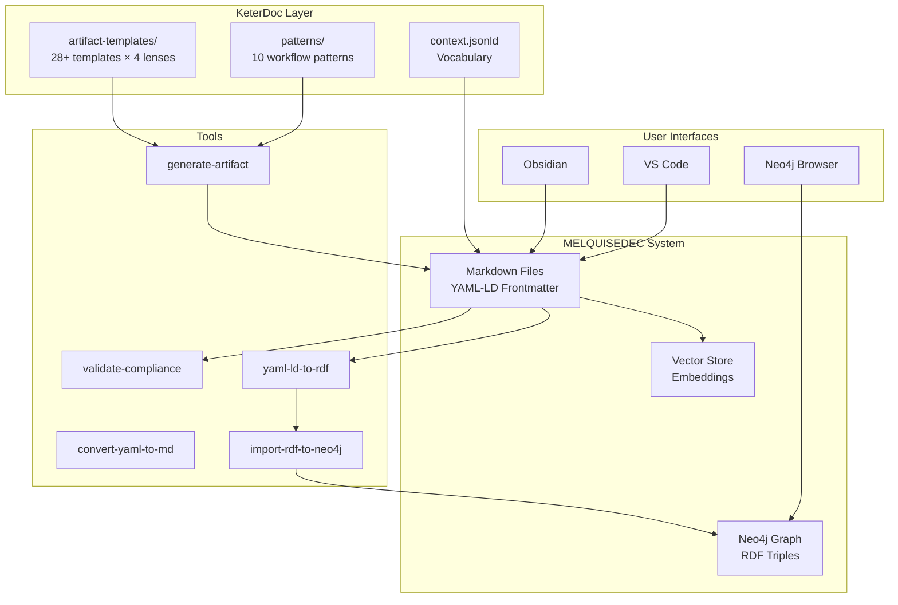
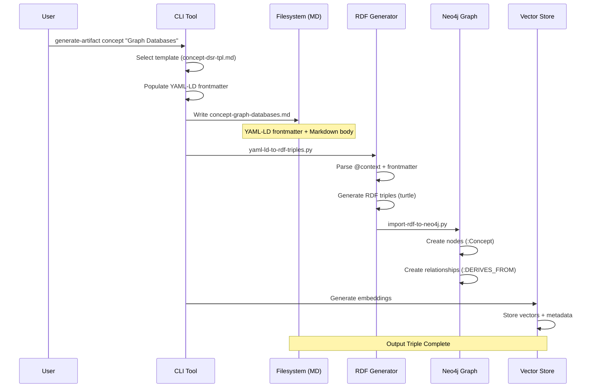
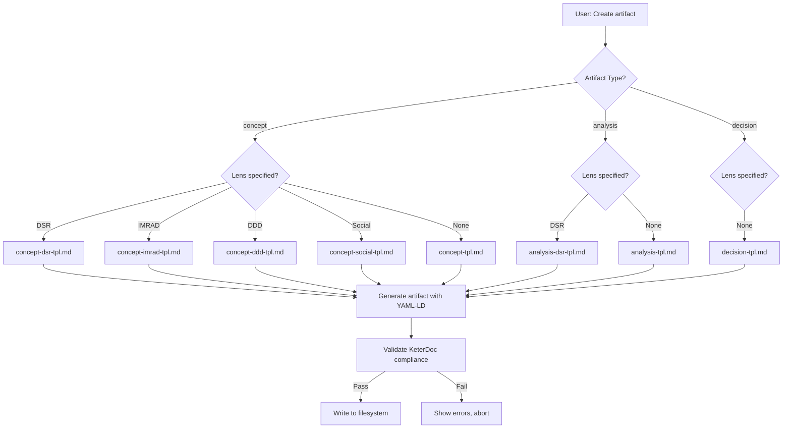
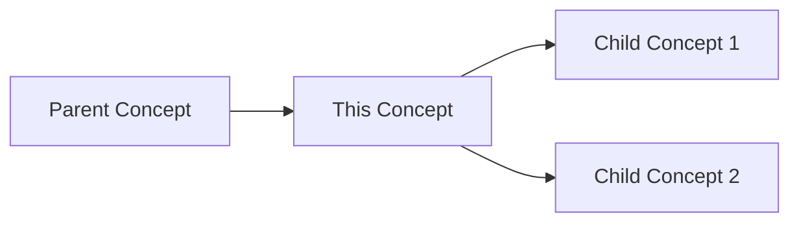
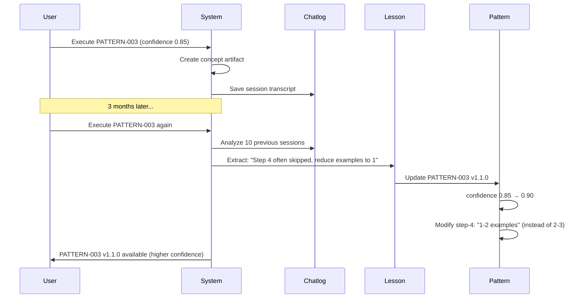
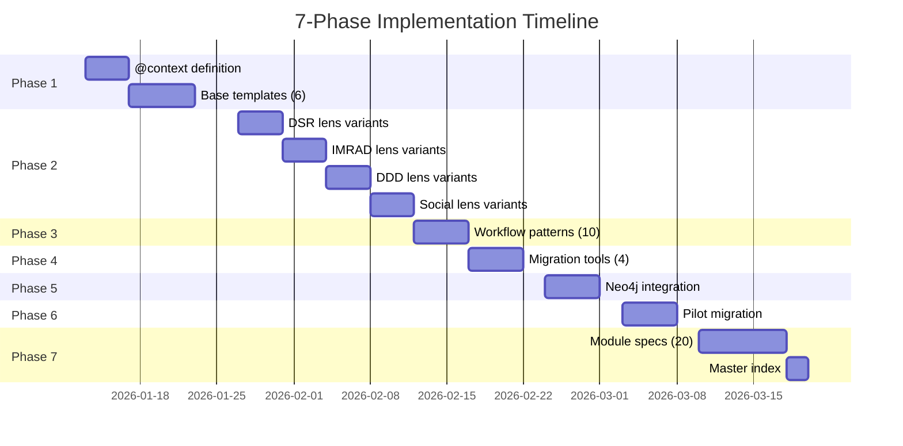

# Design Document: spec-001-implement-keterdoc-architecture

## 🎯 Design Overview

**Purpose**: Define detailed architecture, implementation approach, and technical decisions for KeterDoc system with YAML-LD, templates, and Neo4j integration.

**Approach**: Incremental, phase-by-phase implementation with continuous validation and autopoiesis feedback loops.

**Key Innovation**: Dogfooding - this spec itself uses the architecture it proposes (YAML-LD + KeterDoc format).

---

## 1. Architecture Diagram

### 1.1 System Context



### 1.2 Output Triple Flow



### 1.3 Template Selection Logic



---

## 2. Component Design

### 2.1 YAML-LD Context Definition

**File**: `context.jsonld`

**Structure**:
```json
{
  "@context": {
    "@vocab": "https://melquisedec.org/vocab/",
    "mel": "https://melquisedec.org/vocab/",
    "dc": "http://purl.org/dc/terms/",
    "rdf": "http://www.w3.org/1999/02/22-rdf-syntax-ns#",
    "rdfs": "http://www.w3.org/2000/01/rdf-schema#",
    "xsd": "http://www.w3.org/2001/XMLSchema#",

    "id": "@id",
    "type": "@type",

    "is_a": {
      "@id": "rdf:type",
      "@type": "@id"
    },

    "dc:title": { "@type": "xsd:string" },
    "dc:creator": { "@container": "@list" },
    "dc:date": { "@type": "xsd:date" },
    "dc:subject": { "@container": "@set" },
    "dc:source": { "@container": "@list" },

    "seci": {
      "@id": "mel:seci",
      "@type": "@id"
    },
    "derives_from": {
      "@id": "mel:derivesFrom",
      "@type": "@id",
      "@container": "@list"
    },
    "informs": {
      "@id": "mel:informs",
      "@type": "@id",
      "@container": "@list"
    },

    "artifact_template": {
      "@id": "mel:artifactTemplate",
      "@type": "@id"
    },
    "workflow_pattern": {
      "@id": "mel:workflowPattern",
      "@type": "@id"
    },
    "lens": { "@id": "mel:lens" },

    "version": { "@id": "mel:version" },
    "permalink": { "@id": "mel:permalink" }
  }
}
```

**Usage in Markdown Frontmatter**:
```yaml
---
'@context': 'https://melquisedec.org/context/v1'
'@type': 'Concept'
'@id': 'https://melquisedec.org/concepts/graph-databases'

id: 'concept-graph-databases'
is_a: 'concept'
version: '1.0.0'

dc:
  title: 'Graph Databases'
  creator: ['HYPATIA']
  date: '2026-01-15'
  subject: ['databases', 'graphs', 'neo4j']
  source:
    - '010-define/01-literature/paper-graph-databases-robinson.md'

seci:
  derives_from:
    - '../01-literature/paper-graph-databases-robinson.md'
  informs:
    - '../../030-design/03-analyses/analysis-graph-db-performance.md'

artifact_template: '../../../artifact-templates/by-lens/dsr/concept-dsr-tpl.md'
workflow_pattern: 'PATTERN-003-Conceptualize'
lens: 'DSR'
---

# Graph Databases

## Definition
[...]
```

**RDF Triples Generated**:
```turtle
<https://melquisedec.org/concepts/graph-databases>
    a <Concept> ;
    <http://purl.org/dc/terms/title> "Graph Databases" ;
    <http://purl.org/dc/terms/creator> "HYPATIA" ;
    <http://purl.org/dc/terms/date> "2026-01-15"^^xsd:date ;
    <https://melquisedec.org/vocab/derivesFrom> <../01-literature/paper-graph-databases-robinson.md> ;
    <https://melquisedec.org/vocab/informs> <../../030-design/03-analyses/analysis-graph-db-performance.md> ;
    <https://melquisedec.org/vocab/version> "1.0.0" .
```

**Design Rationale**:
- **@context URL**: Points to canonical definition (versioned: v1, v2, etc.)
- **Dublin Core**: Standard metadata vocabulary (widely adopted)
- **SECI Model**: Custom vocabulary for knowledge flow
- **RDF-ready**: Maps cleanly to RDF triples for Neo4j
- **Extensible**: Can add new fields without breaking existing data

---

### 2.2 Template Structure

**Base Template Format** (`artifact-templates/by-type/concept-tpl.md`):

```markdown
---
# YAML-LD for Semantic Web
'@context': 'https://melquisedec.org/context/v1'
'@type': 'Concept'
'@id': 'https://melquisedec.org/concepts/{{id}}'

# KeterDoc/HKM Standard Metadata
id: '{{id}}'
is_a: 'concept'
version: '1.0.0'
permalink: '{{filepath}}'

# Dublin Core (dc)
dc:
  title: '{{title}}'
  creator: ['{{creator}}']
  date: '{{date}}'
  subject: {{subjects}}  # List: ['topic1', 'topic2']
  source: {{sources}}    # List of source files

# SECI Model (seci)
seci:
  derives_from: {{derives_from}}  # Where did this come from?
  informs: []                      # What does this inform? (filled later)

# Workflow Configuration
artifact_template: 'artifact-templates/by-type/concept-tpl.md'
workflow_pattern: 'PATTERN-003-Conceptualize'
lens: '{{lens}}'  # DSR | IMRAD | DDD | Social | None
---

# {{title}}

## Definition

**What is this concept?**

[Clear, concise definition in 1-2 sentences]

## Context

**Where does this concept come from?**

- **Domain**: [e.g., Software Engineering, Knowledge Management]
- **Origin**: [e.g., Paper by Author X, Industry practice]
- **Related Concepts**: [[concept-1]], [[concept-2]]

## Relationships

**How does this connect to other concepts?**



## Examples

**Real-world instances of this concept:**

1. **Example 1**: [Description]
2. **Example 2**: [Description]
3. **Example 3**: [Description]

## References

**Where to learn more:**

- [[paper-source-1]]
- [[paper-source-2]]
- External: [Link to resource]

---

**Metadata**:
- **Created**: {{date}}
- **Creator**: {{creator}}
- **Version**: 1.0.0
- **Template**: concept-tpl.md
```

**DSR Lens Variant** (`artifact-templates/by-lens/dsr/concept-dsr-tpl.md`):

Inherits all sections from `concept-tpl.md` + adds:

```markdown
## Design Requirements (DSR)

**How does this concept inform artifact design?**

| Requirement | Description | Priority |
|-------------|-------------|----------|
| REQ-1 | [Functional requirement] | High |
| REQ-2 | [Non-functional requirement] | Medium |

## Design Space

**What design alternatives does this concept enable?**

- **Alternative 1**: [Approach]
- **Alternative 2**: [Approach]
- **Recommended**: [Justified choice]
```

**Template Variables**:
- `{{id}}`: Unique identifier (e.g., concept-graph-databases)
- `{{title}}`: Human-readable title
- `{{creator}}`: Rostro name (HYPATIA, SALOMON, etc.)
- `{{date}}`: ISO 8601 date (YYYY-MM-DD)
- `{{subjects}}`: YAML list of topics
- `{{sources}}`: YAML list of source file paths
- `{{derives_from}}`: YAML list of parent artifacts
- `{{lens}}`: Research lens (DSR | IMRAD | DDD | Social)
- `{{filepath}}`: Relative path to this file

**Generation Command**:
```bash
python tools/keterdoc/generate-artifact-from-template.py \
  concept \
  "Graph Databases" \
  --lens dsr \
  --creator HYPATIA \
  --sources 010-define/01-literature/paper-graph-databases-robinson.md \
  --output 020-conceive/02-atomics/concept-graph-databases.md
```

**Design Rationale**:
- **Variables**: Templating system (Jinja2) for flexibility
- **Lens Variants**: Inherit base + extend (DRY principle)
- **Frontmatter First**: Metadata separate from content
- **Wikilinks**: [[concept-name]] for Obsidian compatibility
- **Mermaid**: Diagrams for relationships

---

### 2.3 Workflow Pattern System

**Pattern File Format** (`patterns/PATTERN-003-Conceptualize.yaml`):

```yaml
pattern:
  id: 'PATTERN-003-Conceptualize'
  version: '1.0.0'
  confidence: 0.85  # Updated by autopoiesis
  created_date: '2026-01-13'
  last_updated: '2026-01-13'

  metadata:
    name: 'Conceptualize'
    description: 'Extract atomic concepts from literature sources'
    artifact_type: 'concept'
    lens_applicability:
      - 'DSR'
      - 'IMRAD'
      - 'DDD'
      - 'Social'

  steps:
    - id: 'step-1'
      name: 'Identify concept in source'
      description: 'Read source paper, highlight key concepts'
      validation:
        - 'Concept clearly defined in source'
        - 'Concept has unique name'

    - id: 'step-2'
      name: 'Extract definition'
      description: 'Write 1-2 sentence definition'
      validation:
        - 'Definition is clear and concise'
        - 'Definition includes context'

    - id: 'step-3'
      name: 'Map relationships'
      description: 'Identify parent/child concepts'
      validation:
        - 'At least 1 relationship identified'
        - 'Relationships are bidirectional'

    - id: 'step-4'
      name: 'Provide examples'
      description: 'List 2-3 real-world examples'
      validation:
        - 'Examples are concrete'
        - 'Examples illustrate concept'

    - id: 'step-5'
      name: 'Link references'
      description: 'Add seci.derives_from and sources'
      validation:
        - 'seci.derives_from populated'
        - 'dc.source includes original paper'

  validation_criteria:
    - name: 'Concept is atomic'
      description: 'Cannot be further decomposed'
      criticality: 'high'

    - name: 'SECI traceability'
      description: 'derives_from points to valid source'
      criticality: 'critical'

    - name: 'Template compliance'
      description: 'Passes validate-keterdoc-compliance.py'
      criticality: 'critical'

  outputs:
    - type: 'markdown'
      location: '020-conceive/02-atomics/'
      naming_pattern: 'concept-{{slug}}.md'

    - type: 'rdf'
      location: '.output-triple/rdf/'
      naming_pattern: 'concept-{{slug}}.ttl'

  evolution_history:
    - version: '1.0.0'
      date: '2026-01-13'
      confidence: 0.85
      changes: 'Initial pattern creation'
      source: 'lesson-001-keterdoc-architecture-gap.md'
```

**Pattern Selection** (`config/artifact-workflows.yaml`):

```yaml
artifact_workflows:
  version: '1.0.0'

  mappings:
    concept:
      default_pattern: 'PATTERN-003-Conceptualize'
      lens_overrides:
        DSR: 'PATTERN-003-Conceptualize-DSR'  # Optional specialized variant

    analysis:
      default_pattern: 'PATTERN-004-Analyze'
      lens_overrides:
        IMRAD: 'PATTERN-004-Analyze-IMRAD'

    decision:
      default_pattern: 'PATTERN-005-Decide'

    experiment:
      default_pattern: 'PATTERN-006-Experiment'
      lens_overrides:
        DSR: 'PATTERN-006-Experiment-DSR'

    output:
      default_pattern: 'PATTERN-008-Output-Production'

    lesson:
      default_pattern: 'PATTERN-009-Lesson-Extraction'

    issue:
      default_pattern: 'PATTERN-007-Problem-RBM-GAC'
```

**Autopoiesis: Pattern Evolution**:



**Design Rationale**:
- **Confidence Scores**: Measure pattern reliability (0.00-1.00)
- **Evolution**: Patterns improve based on lessons learned
- **Validation**: Each step has clear success criteria
- **Lens Variants**: Patterns can be customized per lens
- **Traceability**: Pattern history tracked (changelog)

---

### 2.4 Tool Architecture

#### 2.4.1 generate-artifact-from-template.py

**Purpose**: Create new artifacts from templates with auto-populated metadata.

**Architecture**:
```python
# Simplified pseudo-code
class ArtifactGenerator:
    def __init__(self, templates_dir, patterns_dir):
        self.templates = self.load_templates(templates_dir)
        self.patterns = self.load_patterns(patterns_dir)

    def generate(self, artifact_type, title, lens=None, **kwargs):
        # 1. Select template
        template = self.select_template(artifact_type, lens)

        # 2. Generate unique ID
        artifact_id = self.generate_id(artifact_type, title)

        # 3. Select workflow pattern
        pattern = self.select_pattern(artifact_type, lens)

        # 4. Populate variables
        variables = {
            'id': artifact_id,
            'title': title,
            'creator': kwargs.get('creator', 'MELQUISEDEC'),
            'date': datetime.now().isoformat()[:10],
            'lens': lens or 'None',
            'workflow_pattern': pattern.id,
            **kwargs
        }

        # 5. Render template
        content = template.render(variables)

        # 6. Validate KeterDoc compliance
        validation = self.validate(content)
        if not validation.passed:
            raise ValidationError(validation.errors)

        # 7. Write file
        output_path = self.determine_output_path(artifact_type, artifact_id)
        self.write_file(output_path, content)

        return output_path

    def select_template(self, artifact_type, lens):
        if lens:
            template_path = f"by-lens/{lens}/{artifact_type}-{lens}-tpl.md"
            if template_path in self.templates:
                return self.templates[template_path]

        # Fallback to base template
        return self.templates[f"by-type/{artifact_type}-tpl.md"]
```

**CLI Interface**:
```bash
# Basic usage
generate-artifact-from-template.py concept "Graph Databases"

# With lens
generate-artifact-from-template.py concept "Graph Databases" --lens dsr

# Full options
generate-artifact-from-template.py concept "Graph Databases" \
  --lens dsr \
  --creator HYPATIA \
  --subjects databases,graphs,neo4j \
  --sources 010-define/01-literature/paper-graph-databases.md \
  --output 020-conceive/02-atomics/concept-graph-databases.md \
  --interactive  # Prompt for missing values
```

#### 2.4.2 validate-keterdoc-compliance.py

**Purpose**: Lint artifacts for KeterDoc/YAML-LD compliance.

**Validation Rules**:
1. **YAML-LD Frontmatter**:
   - [ ] Has `@context` field
   - [ ] Has `@type` field
   - [ ] Has `@id` field (unique URI)

2. **KeterDoc Metadata**:
   - [ ] Has `id` field (matches filename)
   - [ ] Has `is_a` field (artifact type)
   - [ ] Has `version` field (semver format)
   - [ ] Has `dc` section with title, creator, date

3. **SECI Model**:
   - [ ] Has `seci` section
   - [ ] `seci.derives_from` paths exist (file validation)
   - [ ] No circular dependencies in seci graph

4. **Workflow Configuration**:
   - [ ] Has `artifact_template` field
   - [ ] Has `workflow_pattern` field
   - [ ] Pattern exists in patterns/ directory

5. **Date Formats**:
   - [ ] `dc.date` is ISO 8601 (YYYY-MM-DD)
   - [ ] `version` is semver (1.0.0)

**Output Format**:
```json
{
  "file": "020-conceive/02-atomics/concept-graph-databases.md",
  "status": "pass",
  "errors": [],
  "warnings": [
    {
      "rule": "seci-derivation",
      "message": "seci.informs is empty - will be populated by future artifacts",
      "severity": "info"
    }
  ],
  "metadata": {
    "id": "concept-graph-databases",
    "type": "Concept",
    "version": "1.0.0",
    "creator": "HYPATIA"
  }
}
```

#### 2.4.3 yaml-ld-to-rdf-triples.py

**Purpose**: Convert YAML-LD frontmatter to RDF triples.

**Architecture**:
```python
import rdflib
from rdflib import Graph, Namespace, Literal, URIRef
import yaml
import json

class YAMLLDToRDF:
    def __init__(self, context_file='context.jsonld'):
        self.context = json.load(open(context_file))
        self.graph = Graph()

        # Bind namespaces
        self.MEL = Namespace("https://melquisedec.org/vocab/")
        self.graph.bind("mel", self.MEL)
        self.graph.bind("dc", Namespace("http://purl.org/dc/terms/"))

    def convert(self, markdown_file):
        # 1. Extract YAML-LD frontmatter
        frontmatter = self.extract_frontmatter(markdown_file)

        # 2. Expand using @context
        expanded = self.expand_with_context(frontmatter)

        # 3. Generate RDF triples
        subject = URIRef(expanded['@id'])

        # Type triple
        self.graph.add((subject, RDF.type, URIRef(expanded['@type'])))

        # Dublin Core triples
        self.graph.add((subject, DC.title, Literal(expanded['dc']['title'])))
        for creator in expanded['dc']['creator']:
            self.graph.add((subject, DC.creator, Literal(creator)))

        # SECI triples
        for source in expanded['seci']['derives_from']:
            self.graph.add((subject, self.MEL.derivesFrom, URIRef(source)))

        # 4. Serialize to Turtle
        return self.graph.serialize(format='turtle')
```

**Usage**:
```bash
# Single file
yaml-ld-to-rdf-triples.py \
  --input 020-conceive/02-atomics/concept-graph-databases.md \
  --output .output-triple/rdf/concept-graph-databases.ttl \
  --format turtle

# Batch mode
yaml-ld-to-rdf-triples.py \
  --input-dir apps/research-autopoietic-template/ \
  --output-dir .output-triple/rdf/ \
  --recursive
```

#### 2.4.4 import-rdf-to-neo4j.py

**Purpose**: Import RDF triples to Neo4j using neosemantics (n10s).

**Neo4j Setup**:
```cypher
// 1. Install neosemantics plugin
CREATE CONSTRAINT n10s_unique_uri ON (r:Resource) ASSERT r.uri IS UNIQUE;
CALL n10s.graphconfig.init({handleVocabUris: "MAP"});

// 2. Define namespace mappings
CALL n10s.nsprefixes.add("mel", "https://melquisedec.org/vocab/");
CALL n10s.nsprefixes.add("dc", "http://purl.org/dc/terms/");
```

**Import Script**:
```python
from neo4j import GraphDatabase
import rdflib

class RDFToNeo4jImporter:
    def __init__(self, neo4j_uri, username, password):
        self.driver = GraphDatabase.driver(neo4j_uri, auth=(username, password))

    def import_turtle(self, turtle_file):
        # 1. Load RDF graph
        g = rdflib.Graph()
        g.parse(turtle_file, format='turtle')

        # 2. Convert to Cypher CREATE statements
        with self.driver.session() as session:
            for s, p, o in g:
                # Example: (:Concept {uri: s})-[:DERIVES_FROM]->(:Paper {uri: o})
                session.run("""
                    MERGE (subject {uri: $subject_uri})
                    SET subject:Resource
                    MERGE (object {uri: $object_uri})
                    SET object:Resource
                    MERGE (subject)-[r:RELATIONSHIP {type: $predicate}]->(object)
                """, subject_uri=str(s), predicate=str(p), object_uri=str(o))

    def import_with_n10s(self, turtle_file):
        # Alternative: Use neosemantics for direct RDF import
        with self.driver.session() as session:
            turtle_content = open(turtle_file).read()
            session.run("""
                CALL n10s.rdf.import.inline($rdf, 'Turtle')
            """, rdf=turtle_content)
```

**Usage**:
```bash
# Single file import
import-rdf-to-neo4j.py \
  --input .output-triple/rdf/concept-graph-databases.ttl \
  --neo4j-uri bolt://localhost:7687 \
  --username neo4j \
  --password password

# Batch import
import-rdf-to-neo4j.py \
  --input-dir .output-triple/rdf/ \
  --neo4j-uri bolt://localhost:7687 \
  --batch-size 100
```

---

## 3. Data Model

### 3.1 KeterDoc Metadata Schema

```yaml
# JSON Schema for validation
{
  "$schema": "http://json-schema.org/draft-07/schema#",
  "title": "KeterDoc Artifact",
  "type": "object",
  "required": ["@context", "@type", "@id", "id", "is_a", "version", "dc", "seci"],

  "properties": {
    "@context": {
      "type": "string",
      "format": "uri",
      "description": "YAML-LD context URI"
    },
    "@type": {
      "type": "string",
      "description": "Semantic type (Concept, Analysis, Decision, etc.)"
    },
    "@id": {
      "type": "string",
      "format": "uri",
      "description": "Unique resource identifier"
    },
    "id": {
      "type": "string",
      "pattern": "^[a-z0-9-]+$",
      "description": "Local identifier (kebab-case)"
    },
    "is_a": {
      "type": "string",
      "enum": ["concept", "analysis", "decision", "experiment", "output", "lesson", "issue"],
      "description": "Artifact type"
    },
    "version": {
      "type": "string",
      "pattern": "^\\d+\\.\\d+\\.\\d+$",
      "description": "Semantic version"
    },
    "dc": {
      "type": "object",
      "required": ["title", "creator", "date"],
      "properties": {
        "title": { "type": "string" },
        "creator": {
          "type": "array",
          "items": {
            "type": "string",
            "enum": ["MELQUISEDEC", "HYPATIA", "SALOMON", "MORPHEUS", "ALMA"]
          }
        },
        "date": {
          "type": "string",
          "format": "date",
          "pattern": "^\\d{4}-\\d{2}-\\d{2}$"
        },
        "subject": {
          "type": "array",
          "items": { "type": "string" }
        },
        "source": {
          "type": "array",
          "items": { "type": "string" }
        }
      }
    },
    "seci": {
      "type": "object",
      "required": ["derives_from", "informs"],
      "properties": {
        "derives_from": {
          "type": "array",
          "items": { "type": "string" },
          "description": "Parent artifacts (knowledge sources)"
        },
        "informs": {
          "type": "array",
          "items": { "type": "string" },
          "description": "Child artifacts (knowledge consumers)"
        }
      }
    },
    "artifact_template": {
      "type": "string",
      "description": "Path to template used"
    },
    "workflow_pattern": {
      "type": "string",
      "pattern": "^PATTERN-\\d{3}-[A-Za-z-]+$",
      "description": "Workflow pattern ID"
    },
    "lens": {
      "type": "string",
      "enum": ["DSR", "IMRAD", "DDD", "Social", "None"],
      "description": "Research lens"
    }
  }
}
```

### 3.2 Neo4j Graph Schema

**Node Labels**:
- `:Concept` - Atomic concept
- `:Analysis` - Analytical artifact
- `:Decision` - Architectural decision (ADR)
- `:Experiment` - Empirical experiment
- `:Output` - Deliverable output
- `:Lesson` - Lesson learned
- `:Issue` - Research issue
- `:Paper` - Literature source

**Relationship Types**:
- `:DERIVES_FROM` - Knowledge flow (child → parent)
- `:INFORMS` - Knowledge flow (parent → child)
- `:RELATES_TO` - Lateral relationship
- `:HAS_CREATOR` - Artifact → Rostro
- `:USES_TEMPLATE` - Artifact → Template
- `:FOLLOWS_PATTERN` - Artifact → Workflow Pattern

**Example Cypher Query**:
```cypher
// Find all concepts derived from specific paper
MATCH (paper:Paper {id: 'paper-graph-databases-robinson'})
MATCH (concept:Concept)-[:DERIVES_FROM]->(paper)
RETURN concept.title, concept.id

// Show knowledge flow from paper → concept → analysis → decision
MATCH path = (paper:Paper)-[:DERIVES_FROM*]->(decision:Decision)
WHERE paper.id = 'paper-graph-databases-robinson'
RETURN path

// Find orphaned concepts (no derives_from)
MATCH (concept:Concept)
WHERE NOT (concept)-[:DERIVES_FROM]->()
RETURN concept.title, concept.id
```

---

## 4. Migration Strategy

### 4.1 Phased Rollout



### 4.2 Backward Compatibility

**Strategy**: Maintain dual format during transition period.

```
apps/research-autopoietic-template/
├── ISSUE.yaml              # OLD FORMAT - deprecated but not deleted
├── ISSUE.md                # NEW FORMAT - primary
├── .migration-notes.md     # Documents what changed
└── .compatibility/
    └── yaml-to-md-mapping.json  # Field mappings for tools
```

**Graceful Degradation**:
- Tools check for ISSUE.md first, fall back to ISSUE.yaml
- Validation warns if using old format: "ISSUE.yaml deprecated, migrate to ISSUE.md"
- Automated converter available: `convert-issue-yaml-to-md.py`

### 4.3 Rollback Plan

**If migration fails**:
1. Restore from backup: `research-autopoietic-template.backup-YYYYMMDD/`
2. Git revert: `git checkout pre-keterdoc-migration`
3. Document failures in `lesson-002-migration-validation.md`
4. Adjust templates/tools based on lessons
5. Retry migration

---

## 5. Testing Strategy

### 5.1 Unit Tests

**Coverage**: >80% for all Python scripts

**Test Categories**:
1. **Template Rendering**: generate-artifact-from-template.py
   - Test all 30 templates (6 base + 24 lens variants)
   - Test variable substitution
   - Test validation (catches missing fields)

2. **Validation**: validate-keterdoc-compliance.py
   - Test valid artifacts (should pass)
   - Test missing fields (should fail with specific error)
   - Test invalid dates (should fail)
   - Test circular dependencies (should warn)

3. **RDF Generation**: yaml-ld-to-rdf-triples.py
   - Test @context expansion
   - Test triple generation
   - Test different serialization formats

4. **Neo4j Import**: import-rdf-to-neo4j.py
   - Test single file import
   - Test batch import
   - Test duplicate handling

**Test Framework**: pytest + fixtures

```python
# Example test
def test_generate_concept_dsr_template(tmp_path):
    generator = ArtifactGenerator('artifact-templates', 'patterns')

    output_path = generator.generate(
        artifact_type='concept',
        title='Test Concept',
        lens='dsr',
        creator='HYPATIA',
        output_dir=tmp_path
    )

    assert output_path.exists()

    # Validate frontmatter
    content = output_path.read_text()
    frontmatter = extract_frontmatter(content)

    assert frontmatter['@type'] == 'Concept'
    assert frontmatter['lens'] == 'DSR'
    assert 'Design Requirements' in content  # DSR-specific section
```

### 5.2 Integration Tests

**Scenarios**:
1. **End-to-End Artifact Creation**:
   - Generate concept using DSR template
   - Validate KeterDoc compliance
   - Convert to RDF triples
   - Import to Neo4j
   - Query Neo4j (verify node exists)

2. **Pilot Migration**:
   - Backup project
   - Convert ISSUE.yaml → ISSUE.md
   - Migrate 20+ artifacts
   - Validate all artifacts
   - Test Obsidian (open, edit, save)
   - Test spec-workflow-mcp (generate tasks.md)

3. **SECI Traceability**:
   - Create paper artifact
   - Create concept derived from paper
   - Create analysis derived from concept
   - Import to Neo4j
   - Query: "Show path from paper to analysis"
   - Verify: Path exists and is correct

### 5.3 Acceptance Tests

**Criteria** (from requirements.md):
- [ ] @context validates in JSON-LD playground
- [ ] All 30 templates render without errors
- [ ] 10 PATTERN-*.yaml files created
- [ ] All 7 scripts run without errors on test data
- [ ] RDF triples import to Neo4j successfully
- [ ] Pilot project passes validate-keterdoc-compliance.py 100%
- [ ] 21 manifesto specs created
- [ ] Master index shows complete results chain

---

## 6. Non-Functional Requirements

### 6.1 Performance

**Targets**:
- **Template generation**: <1 second per artifact
- **Validation**: <5 seconds for 100 artifacts
- **RDF conversion**: <10 seconds for 100 artifacts
- **Neo4j import**: <5 minutes for 1000 artifacts
- **Neo4j queries**: <1 second response time

**Optimization**:
- Batch processing for RDF/Neo4j operations
- Caching for template lookups
- Parallel processing for validation

### 6.2 Scalability

**Design Limits**:
- **Artifacts**: Support up to 10,000 artifacts per project
- **Neo4j**: Handle graphs with 100,000+ nodes
- **Templates**: Support 100+ template variants

**Horizontal Scaling**:
- Tools are stateless (can parallelize)
- Neo4j cluster for large graphs

### 6.3 Maintainability

**Code Quality**:
- **Type Hints**: All Python functions have type annotations
- **Docstrings**: All public functions documented
- **Linting**: Black + Flake8 + mypy
- **Testing**: >80% coverage

**Documentation**:
- **User Guides**: 4 guides (KeterDoc, Lenses, Patterns, Neo4j)
- **API Docs**: Sphinx-generated from docstrings
- **Examples**: 10+ complete examples

### 6.4 Security

**Considerations**:
- **Neo4j Credentials**: Stored in environment variables (not committed)
- **File Paths**: Validated to prevent directory traversal
- **YAML Parsing**: Safe loader (prevents code injection)

---

## 7. Open Questions & Risks

### 7.1 Open Questions

1. **@context Hosting**: Where to host context.jsonld?
   - **Options**: GitHub Pages, Cloudflare, Self-hosted
   - **Decision**: Start with GitHub Pages (free, versioned)

2. **Template Proliferation**: 112 templates (28 × 4 lenses) may be too many?
   - **Mitigation**: Start with 6 base + 6 DSR variants (12 total), expand based on demand

3. **Neo4j Performance**: How well does neosemantics scale?
   - **Test**: Import 10,000 artifacts, measure query time
   - **Alternative**: Custom Cypher importer if n10s too slow

### 7.2 Risks

| Risk | Probability | Impact | Mitigation |
|------|-------------|--------|------------|
| **YAML-LD complexity** | Medium | High | Start simple, expand gradually |
| **Template maintenance** | High | Medium | Automate template validation |
| **Breaking changes** | High | Critical | Maintain backward compatibility |
| **Neo4j learning curve** | Medium | Medium | Provide detailed guide + examples |
| **Tool adoption** | Medium | High | Dogfooding - use in all new projects |

---

## 8. Success Metrics

**Quantitative** (from spec-config.yaml):
- ✅ 28 templates created
- ✅ 24 lens variants created
- ✅ 95% validation pass rate
- ✅ <1 second Neo4j query time
- ✅ 21 manifesto specs created

**Qualitative**:
- ✅ Developers say: "Templates make creation easier"
- ✅ Obsidian users say: "Works natively, no issues"
- ✅ AI agents say: "Metadata is machine-readable"
- ✅ System shows: "Clear coherence from master index"

---

## 9. Next Steps

After completing spec-001:

1. **Phase 1 Execution** (Weeks 1-2):
   - Create context.jsonld
   - Create 6 base templates
   - Document quickstart guide

2. **Phase 2-6 Execution** (Weeks 3-8):
   - Follow requirements.md sequentially
   - Validate at each phase checkpoint

3. **Phase 7 Execution** (Weeks 9-10):
   - Create 20 additional specs (spec-002 through spec-021)
   - Build master index
   - Generate conceptualization map

4. **Continuous Improvement**:
   - Extract lessons after each phase
   - Update pattern confidence scores
   - Evolve templates based on usage

---

**Status**: ✅ Design Complete
**Next Action**: Create tasks.md (auto-generate from requirements.md)
