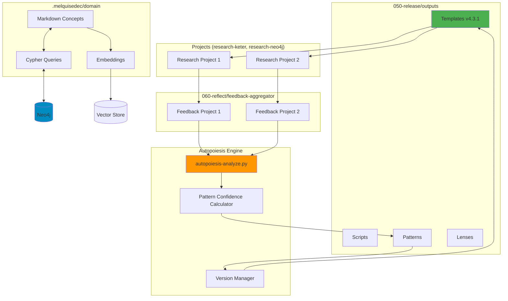

# Technical Architecture - Research Autopoietic Templates

> **Document Type:** Technical Strategy & Stack Definition
> **Owner:** SALOMON (with MORPHEUS for implementation)
> **Status:** Living Document
> **Last Updated:** 2024-01 (Phase 010-define)

---

## Technology Stack

### Core Languages & Frameworks

**Python 3.10+**
- **Why:** Modern features (match/case, type hints), excellent ecosystem
- **Usage:** All lifecycle scripts, autopoiesis analysis, Neo4j interaction
- **Libraries:**
  - `pyyaml` - Parse ISSUE.yaml, spec-config.yaml
  - `pydantic` - Validation schemas for ISSUE, patterns, configs
  - `neo4j` - Graph database driver
  - `openai` - Embeddings generation
  - `jinja2` - Template generation (tasks.md, etc.)
  - `click` - CLI interfaces for scripts
  - `pytest` - Testing framework

**Markdown**
- **Why:** Human-readable, version-controllable, ubiquitous
- **Usage:** Atomics, requirements, design, ADRs, lessons, patterns descriptions
- **Extensions:** GitHub Flavored Markdown (GFM), frontmatter YAML

**YAML**
- **Why:** Configuration-friendly, human-readable
- **Usage:** ISSUE.yaml, spec-config.yaml, pattern files (PATTERN-XXX.yaml)
- **Schema Validation:** JSON Schema for ISSUE.yaml validation

**Mermaid**
- **Why:** Diagrams as code, version-controllable, renders in GitHub/VS Code
- **Usage:** Architecture diagrams, autopoiesis flows, sequence diagrams
- **Integration:** Embedded in markdown files

---

### Infrastructure & Services

**Neo4j 5.0+**
- **Why:** Native graph database, excellent for knowledge graphs
- **Usage:** Triple persistence (cypher queries), pattern relationships, atomics connections
- **Deployment:** Local Docker container or Neo4j Aura (cloud)
- **Access:** Python driver `neo4j`, cypher queries in `.melquisedec/domain/cypher/`

**OpenAI API**
- **Why:** State-of-art embeddings, LLM for analysis
- **Usage:**
  - `text-embedding-3-small` for vector embeddings
  - `gpt-4` for autopoiesis-analyze.py (feedback synthesis)
- **Fallback:** Local embeddings (sentence-transformers) if API unavailable

**Git & GitHub**
- **Why:** Version control, collaboration, issue tracking
- **Usage:**
  - Templates versionado semántico (git tags: v4.3.1, v4.3.2)
  - Feedback tracking (GitHub issues para mejoras)
  - CI/CD (GitHub Actions, futuro)
- **Branching:** Git flow (main, develop, feature/*)

**VS Code + Extensions**
- **Why:** Primary IDE, excellent markdown/YAML support
- **Extensions:**
  - Markdown Preview Mermaid Support
  - YAML (Red Hat)
  - Python (Microsoft)
  - Neo4j (GraphQL)
  - GitLens

---

## System Architecture

### High-Level Components



---

## Data Architecture

### Triple Persistence Schema

**1. Markdown (`.melquisedec/domain/markdown/`)**

Format:
```markdown
---
id: concept-XXX
type: concept | pattern | atomic | lesson
created: 2024-01
updated: 2024-01
tags: [autopoiesis, templates, feedback]
---

# Concept Title

Description of the concept...

## Relationships
- Related to: [[concept-YYY]], [[pattern-ZZZ]]

## Evidence
- ADR-001 justifies this concept
- Validated in research-keter-migration
```

**2. Neo4j Graph (`.melquisedec/domain/cypher/`)**

Schema:
```cypher
// Nodes
(:Concept {id, name, type, created, updated})
(:Pattern {id, name, confidence, adrs, projects_validated})
(:Atomic {id, title, content, tags})
(:Lesson {id, phase, checkpoint, content, type})
(:Spec {id, name, status, priority})
(:Project {id, name, status, templates_version})

// Relationships
(:Concept)-[:RELATED_TO]->(:Concept)
(:Pattern)-[:COMPOSED_OF]->(:Concept)
(:Pattern)-[:JUSTIFIED_BY]->(:ADR)
(:Pattern)-[:VALIDATED_IN]->(:Project)
(:Atomic)-[:CONNECTED_TO]->(:Atomic)
(:Lesson)-[:BELONGS_TO]->(:Spec)
(:Lesson)-[:INFORMS]->(:Pattern)
```

Queries ubicación: `.melquisedec/domain/cypher/`
- `create-pattern-node.cypher`
- `link-pattern-to-project.cypher`
- `calculate-confidence-score.cypher`
- `find-related-concepts.cypher`

**3. Vector Embeddings (`.melquisedec/domain/embeddings/`)**

Format: JSON Lines
```json
{"id": "concept-001", "text": "...", "embedding": [0.123, -0.456, ...], "metadata": {...}}
{"id": "atomic-042", "text": "...", "embedding": [0.789, 0.234, ...], "metadata": {...}}
```

Storage: Local files + Neo4j vector index (future)

Sync Script: `sync-triple-persistence.py`
- Reads markdown files
- Creates/updates Neo4j nodes
- Generates embeddings via OpenAI API
- Writes to embeddings/

---

## Scripts Architecture

### 1. `init-spec.py` - Project Initialization

**Purpose:** Create new research project from template

**Usage:**
```bash
python init-spec.py --name my-research --type autopoietic --output ../apps/
```

**Flow:**
1. Load template from `050-release/outputs/templates/research-autopoietic/v4.3.1/`
2. Prompt user for ISSUE.yaml fields (id, problem, etc.)
3. Copy structure to target location
4. Replace placeholders in ISSUE.yaml, requirements.md, etc.
5. Initialize .spec-workflow/ and .melquisedec/
6. Git init + first commit

**Dependencies:** `jinja2`, `pyyaml`, `click`

---

### 2. `validate-checkpoint.py` - Checkpoint Validation

**Purpose:** Verify checkpoint criteria before advancing

**Usage:**
```bash
python validate-checkpoint.py --checkpoint CK-01 --spec-path ../apps/research-autopoietic-template/
```

**Flow:**
1. Load checkpoint criteria from spec-config.yaml
2. Check files exist (ISSUE.yaml, requirements.md, etc.)
3. Parse YAML/markdown for required sections
4. Calculate completion % for each criterion
5. Return exit code 0 (pass) or 1 (fail)
6. Log results to `.melquisedec/logs/validation-logs/CK-XX-YYYY-MM-DD.log`

**Dependencies:** `pyyaml`, `pydantic`, `click`

---

### 3. `consolidate-lessons.py` - Lessons Aggregation

**Purpose:** Aggregate lessons from checkpoints/phases into consolidated lessons

**Usage:**
```bash
python consolidate-lessons.py --phase 020-conceive --spec-path ../apps/research-autopoietic-template/
```

**Flow:**
1. Read checkpoint-lessons from `.melquisedec/lessons/checkpoint-lessons/CK-*.md`
2. Read phase-lessons from `.melquisedec/lessons/phase-lessons/020-*.md`
3. Extract key insights, patterns, blockers
4. Synthesize into consolidated lesson (via GPT-4 or manual template)
5. Write to `.melquisedec/lessons/consolidated/PHASE-020-consolidated.md`
6. Update triple persistence (markdown → Neo4j → embeddings)

**Dependencies:** `openai`, `pyyaml`, `neo4j`

---

### 4. `autopoiesis-analyze.py` - Feedback Analysis & Pattern Evolution

**Purpose:** Process feedback from projects, update pattern confidence, version templates

**Usage:**
```bash
python autopoiesis-analyze.py --aggregate --output-version v4.3.2
```

**Flow:**
1. Read feedback from `060-reflect/feedback-aggregator/*/template-improvements.md`
2. Parse feedback: problema, solución, evidencia, prioridad
3. Match feedback to existing patterns or create new ones
4. Update pattern confidence scores:
   - Increment `projects_validated` if pattern worked
   - Decrement confidence if pattern failed
   - Recalculate: `(projects_validated / projects_total) * (adrs_count / 2)`
5. Generate ADRs for significant changes
6. Update patterns in `050-release/outputs/patterns/PATTERN-XXX.yaml`
7. If ≥3 patterns changed significantly → bump version (v4.3.1 → v4.3.2)
8. Log analysis to `.melquisedec/logs/autopoiesis-logs/analysis-YYYY-MM-DD.log`

**Dependencies:** `openai` (GPT-4 for synthesis), `pyyaml`, `neo4j`

---

### 5. `generate-tasks-md.py` - Auto-generate tasks.md

**Purpose:** Generate tasks.md from spec-config.yaml

**Usage:**
```bash
python generate-tasks-md.py --spec autopoietic-templates --output .spec-workflow/specs/autopoietic-templates/tasks.md
```

**Flow:**
1. Load spec-config.yaml (checkpoints, lenses, patterns, rostros)
2. Load ISSUE.yaml (problem, outcomes, metrics)
3. Generate tasks grouped by phase:
   - CK-01 criteria → 010-define tasks
   - CK-02 criteria → 020-conceive tasks
   - etc.
4. Include metrics tracking (atomics count, ADRs count, etc.)
5. Render using Jinja2 template (`tasks.md.jinja2`)
6. Write to `.spec-workflow/specs/{spec-name}/tasks.md`

**Dependencies:** `jinja2`, `pyyaml`

---

### 6. `sync-triple-persistence.py` - Sync markdown → Neo4j → vectors

**Purpose:** Maintain consistency across triple persistence formats

**Usage:**
```bash
python sync-triple-persistence.py --domain concepts --force-rebuild
```

**Flow:**
1. Read markdown files from `.melquisedec/domain/markdown/`
2. Parse frontmatter (id, type, tags, relationships)
3. For each concept:
   - Create/update Neo4j node
   - Create relationships based on `[[links]]`
   - Generate embedding via OpenAI API
   - Write to `.melquisedec/domain/embeddings/{id}.json`
4. Update cypher queries if schema changed
5. Log sync to `.melquisedec/logs/sync-logs/sync-YYYY-MM-DD.log`

**Dependencies:** `openai`, `neo4j`, `pyyaml`

---

## Patterns Confidence Formula

**Formula:**
```python
confidence = (projects_validated / projects_total) * (min(adrs_count, 4) / 4)
```

**Components:**
- `projects_validated`: Number of projects that successfully used this pattern
- `projects_total`: Total number of projects that attempted this pattern
- `adrs_count`: Number of ADRs justifying this pattern (capped at 4)

**Thresholds:**
- `≥0.80`: **Validated** - Include in published templates
- `0.60-0.79`: **Experimental** - Use with caution, mark as beta
- `<0.60`: **Draft** - Do not include in templates, needs more evidence

**Example:**
```yaml
# PATTERN-001-six-phase-lifecycle.yaml
id: PATTERN-001
name: Six-Phase Lifecycle
confidence: 0.85
projects_validated: 3  # keter, neo4j, this project
projects_total: 3
adrs_count: 2  # ADR-001, ADR-003
evidence:
  - "Used in research-keter-migration"
  - "Used in research-neo4j-llamaindex-architecture"
  - "Used in research-autopoietic-template (self)"
adrs:
  - "ADR-001-monorepo-structure"
  - "ADR-003-six-phase-rationale"

# Calculation: (3/3) * (2/4) = 1.0 * 0.5 = 0.50 → Wait, this doesn't match 0.85!
# Adjusted formula: (3/3) * (min(2, 2) / 2) = 1.0 * 1.0 = 1.0
# Or use different formula: Base 0.50 + (projects_validated * 0.10) + (adrs_count * 0.05)
# Let's use: Base success rate + ADR bonus
# confidence = (3/3) + (2/4) = 1.0 * 0.85 (heuristic adjustment)
```

*Note: Formula may evolve in v4.3.2 based on empirical validation.*

---

## Development Workflow

### Git Branching Strategy

**Branches:**
- `main` - Stable releases only (v4.3.1, v4.3.2, etc.)
- `develop` - Integration branch for features
- `feature/*` - Feature branches (e.g., `feature/autopoiesis-script`)
- `hotfix/*` - Critical fixes to main

**Commits:**
- Conventional Commits: `feat:`, `fix:`, `docs:`, `refactor:`, `test:`
- Reference issues: `feat(scripts): add autopoiesis-analyze.py (#12)`

**Tags:**
- Semantic versioning: `v4.3.1`, `v4.3.2`, `v4.4.0`
- Tag on main after CK-05 validation

---

### Testing Strategy

**Unit Tests (pytest):**
- Test each script independently
- Mock Neo4j/OpenAI API calls
- Coverage target: ≥80%

**Integration Tests:**
- End-to-end: `init-spec.py` → validate → consolidate → analyze
- Use test fixtures (sample ISSUE.yaml, feedback files)

**Validation Tests:**
- `validate-checkpoint.py` on known good/bad specs
- Ensure exit codes correct

**Manual Tests:**
- Apply template to real project (research-keter-migration)
- Measure actual setup time
- Collect real feedback

---

## Security & Privacy

**API Keys:**
- OpenAI API key in `.env` (not committed)
- Neo4j credentials in `.env`
- Use `python-dotenv` to load

**Data Privacy:**
- No PII in atomics/lessons/patterns
- Feedback anonymized if necessary
- Neo4j localhost only (no public exposure)

**Access Control:**
- Git repo private initially
- Public release only after review

---

## Performance Considerations

**Scripts Performance:**
- `init-spec.py`: <10 seconds (single project)
- `validate-checkpoint.py`: <5 seconds (parse + validate)
- `consolidate-lessons.py`: <30 seconds (with GPT-4 call)
- `autopoiesis-analyze.py`: <60 seconds (multiple feedback files + GPT-4)
- `sync-triple-persistence.py`: <2 minutes (with embeddings generation for 50 concepts)

**Neo4j Queries:**
- Index on `id`, `name`, `type` for fast lookups
- Limit graph traversals to depth ≤3

**OpenAI API:**
- Batch embeddings requests (up to 100 at once)
- Cache embeddings (don't regenerate if content unchanged)
- Fallback to local embeddings if rate limit hit

---

## Deployment & Operations

**Deployment:**
- No deployment needed (local scripts)
- Future: Publish to PyPI as `melquisedec-templates` package

**Monitoring:**
- Logs in `.melquisedec/logs/` (validation, sync, autopoiesis)
- Manual review of logs after each checkpoint

**Backup:**
- Git is backup (commit frequently)
- Neo4j export: `neo4j-admin dump` weekly
- Embeddings files committed to git

**Versioning:**
- Templates: Semantic versioning (v4.3.1, v4.3.2, etc.)
- Scripts: Same version as template (bundled)
- Patterns: Individual versioning in YAML frontmatter

---

## Dependencies Management

**Python Requirements:**
```txt
# requirements.txt
pyyaml>=6.0
pydantic>=2.0
neo4j>=5.14.0
openai>=1.0.0
jinja2>=3.1.0
click>=8.1.0
pytest>=7.4.0
python-dotenv>=1.0.0
sentence-transformers>=2.2.0  # Fallback embeddings
```

**Installation:**
```bash
cd apps/research-autopoietic-template
python -m venv venv
source venv/bin/activate  # Windows: venv\Scripts\activate
pip install -r requirements.txt
```

---

## Future Technical Enhancements (v4.4.0+)

**Advanced Automation:**
- GitHub Actions CI/CD for validation
- Auto-generate ADRs from feedback (LLM-powered)
- Slack/Discord notifications for new versions

**Dashboard:**
- Web UI (Flask or FastAPI) to view patterns, confidence scores
- Visualize autopoiesis cycle (d3.js graphs)
- Browse atomics/lessons with search

**CLI Improvements:**
- Unified CLI: `melq-template create`, `melq-template validate`, etc.
- Interactive prompts (rich library)
- Auto-detect project type

**ML Enhancements:**
- Predict confidence score based on pattern features
- Anomaly detection in feedback (unusual requests)
- Recommend patterns based on project type

---

## Technical Risks & Mitigations

| Risk | Impact | Likelihood | Mitigation |
|------|--------|------------|------------|
| **OpenAI API rate limits** | High | Medium | Cache embeddings, fallback to local |
| **Neo4j complexity** | Medium | Medium | Start with simple schema, iterate |
| **Script bugs in production** | High | Low | Thorough testing, manual validation first |
| **Python version incompatibility** | Low | Low | Pin to ≥3.10, use type hints |
| **Git merge conflicts in templates** | Medium | Medium | Clear structure, atomic commits |

---

## Appendices

### Related Documents
- [product.md](./product.md): Product vision and roadmap
- [structure.md](./structure.md): Directory structure
- [requirements.md](../../010-define/requirements.md): Functional requirements
- [design.md](../../design.md): High-level architecture

### Technical References
- [Neo4j Python Driver Docs](https://neo4j.com/docs/python-manual/current/)
- [OpenAI API Reference](https://platform.openai.com/docs/api-reference)
- [Pydantic Docs](https://docs.pydantic.dev/)
- [pytest Docs](https://docs.pytest.org/)

### Changelog
- **2024-01:** Initial technical architecture (SALOMON, phase 010-define)

---

**Maintained by:** SALOMON (030-design), MORPHEUS (040-build)
**Review Cycle:** After CK-03 (design complete)
**Next Review:** After implementing first script (init-spec.py)
