# 📋 Issue-Driven Everything + spec-workflow-mcp
## Integración Completa con Diagramas y Flujos

> **Versión:** 1.0.0
> **Fecha:** 2026-01-09
> **Propósito:** Explicar "Issue-Driven Everything" y su gestión desde spec-workflow-mcp
> **Documentación Oficial:** spec-workflow-mcp workflow guide

---

## 🎯 ¿Qué es "Issue-Driven Everything"?

### Definición

**Issue-Driven Everything** significa que **cada componente** de la investigación tiene:
1. Un **issue** en `.spec-workflow/specs/TYPE-XXX/`
2. Un **ISSUE.yaml** que define Gap/Goal/Outcomes
3. **Tasks auto-generadas** desde spec-config.yaml
4. **Trackability completa** del progreso

### Analogía: GitHub Issues

Si conoces GitHub Issues:
```
GitHub Issue #42: "Add user authentication"
├── Descripción del problema
├── Goals a alcanzar
├── Tareas específicas
├── Discusión y comentarios
└── Status: Open/In Progress/Closed

Issue-Driven = Cada REQ/CONCEPT/DESIGN es como GitHub Issue
```

---

## 📊 Diagrama de Secuencia: Creación de Issue

```mermaid
sequenceDiagram
    autonumber
    actor User as Usuario
    participant AI as Copilot Agent
    participant Templates as Template System
    participant SpecWF as spec-workflow-mcp
    participant Dashboard as Dashboard/Approval
    participant Files as File System

    User->>AI: "Crear REQ-001 Template System"

    Note over AI: PASO 1: Load Workflow
    AI->>SpecWF: mcp_spec-workflow2_spec-workflow-guide()
    SpecWF-->>AI: Workflow completo (Requirements → Design → Tasks)

    Note over AI: PASO 2: Read Template
    AI->>Templates: read_file(".spec-workflow/templates/requirements-template.md")
    Templates-->>AI: Template structure

    Note over AI: PASO 3: Create Issue Directory
    AI->>Files: create_directory(".spec-workflow/specs/REQ-001-template-system/")
    Files-->>AI: Directory created

    Note over AI: PASO 4: Generate ISSUE.yaml
    AI->>Files: create_file("ISSUE.yaml")
    Files-->>AI: ISSUE.yaml created with Gap/Goal/Outcomes

    Note over AI: PASO 5: Generate requirements.md
    AI->>Files: create_file("requirements.md")
    Files-->>AI: requirements.md created (following template)

    Note over AI: PASO 6: Request Approval
    AI->>SpecWF: mcp_spec-workflow2_approvals(action: request)
    SpecWF->>Dashboard: Create approval request
    Dashboard-->>User: 🔔 REQ-001 requirements.md needs review

    Note over User,Dashboard: Usuario revisa en Dashboard
    User->>Dashboard: Approve ✅ / Needs Revision ❌

    Note over AI: PASO 7: Poll Status
    loop Every 5 seconds
        AI->>SpecWF: mcp_spec-workflow2_approvals(action: status)
        SpecWF-->>AI: status: pending/approved/needs-revision
    end

    alt Approved
        Dashboard-->>SpecWF: status: approved
        SpecWF-->>AI: approved ✅

        Note over AI: PASO 8: Clean Approval
        AI->>SpecWF: mcp_spec-workflow2_approvals(action: delete)
        SpecWF-->>AI: deleted ✅

        Note over AI: PASO 9: Continue to Design Phase
        AI->>User: "Requirements approved. Creating design.md..."

    else Needs Revision
        Dashboard-->>SpecWF: status: needs-revision, comments: "Add acceptance criteria"
        SpecWF-->>AI: needs-revision with comments

        Note over AI: PASO 8b: Update Document
        AI->>Files: replace_string_in_file("requirements.md")
        Files-->>AI: Updated

        Note over AI: PASO 9b: Request NEW Approval
        AI->>SpecWF: mcp_spec-workflow2_approvals(action: request)
        Note right of AI: Vuelve a PASO 6
    end
```



---

## 🔄 Flujo Completo: Spec-Workflow 4 Fases

```mermaid
flowchart TD
    Start([👤 Usuario solicita feature]) --> LoadGuide[📚 Load spec-workflow-guide]

    LoadGuide --> CheckSteering{🤔 ¿Existen steering docs?}
    CheckSteering -->|Sí| ReadSteering[📖 Leer .spec-workflow/steering/*.md]
    CheckSteering -->|No| Phase1
    ReadSteering --> Phase1

    %% PHASE 1: Requirements
    subgraph Phase1[" 📋 FASE 1: Requirements "]
        P1_Template[📄 Read requirements-template.md] --> P1_Research[🔍 Web search best practices]
        P1_Research --> P1_Create[✍️ Create requirements.md]
        P1_Create --> P1_Approve[📤 Request approval]
        P1_Approve --> P1_Poll{⏱️ Poll status}
        P1_Poll -->|needs-revision| P1_Update[🔧 Update document]
        P1_Update --> P1_Approve
        P1_Poll -->|approved| P1_Clean[🧹 Delete approval]
    end

    P1_Clean --> Phase2

    %% PHASE 2: Design
    subgraph Phase2[" 🏗️ FASE 2: Design "]
        P2_Template[📄 Read design-template.md] --> P2_Analyze[🔍 Analyze codebase patterns]
        P2_Analyze --> P2_Create[✍️ Create design.md]
        P2_Create --> P2_Approve[📤 Request approval]
        P2_Approve --> P2_Poll{⏱️ Poll status}
        P2_Poll -->|needs-revision| P2_Update[🔧 Update document]
        P2_Update --> P2_Approve
        P2_Poll -->|approved| P2_Clean[🧹 Delete approval]
    end

    P2_Clean --> Phase3

    %% PHASE 3: Tasks
    subgraph Phase3[" ✅ FASE 3: Tasks "]
        P3_Template[📄 Read tasks-template.md] --> P3_Break[🔨 Convert design to tasks]
        P3_Break --> P3_Prompts[✨ Generate _Prompt fields]
        P3_Prompts --> P3_Create[✍️ Create tasks.md]
        P3_Create --> P3_Approve[📤 Request approval]
        P3_Approve --> P3_Poll{⏱️ Poll status}
        P3_Poll -->|needs-revision| P3_Update[🔧 Update document]
        P3_Update --> P3_Approve
        P3_Poll -->|approved| P3_Clean[🧹 Delete approval]
    end

    P3_Clean --> Phase4Ready{🚀 Ready to implement?}

    Phase4Ready -->|Yes| Phase4

    %% PHASE 4: Implementation
    subgraph Phase4[" 💻 FASE 4: Implementation "]
        P4_Status[📊 spec-status] --> P4_Select[🎯 Select task]
        P4_Select --> P4_InProgress[⏳ Mark task [-]]
        P4_InProgress --> P4_Search[🔍 grep existing implementations]
        P4_Search --> P4_Code[💻 Write code]
        P4_Code --> P4_Test[🧪 Test]
        P4_Test --> P4_Log[📝 log-implementation with artifacts]
        P4_Log --> P4_Complete[✅ Mark task [x]]
        P4_Complete --> P4_More{❓ More tasks?}
        P4_More -->|Yes| P4_Select
    end

    P4_More -->|No| End([🎉 Implementation Complete])

    style Start fill:#e1f5e1
    style End fill:#e1f5e1
    style Phase1 fill:#e3f2fd
    style Phase2 fill:#fff3e0
    style Phase3 fill:#f3e5f5
    style Phase4 fill:#e8f5e9
```

---

## 🏗️ Arquitectura de Archivos: Issue-Driven


---

## 📝 Estructura ISSUE.yaml por Tipo

### 1️⃣ ISSUE.yaml para REQ-XXX (Requirement)

```yaml
# .spec-workflow/specs/REQ-001-template-system/ISSUE.yaml

id: REQ-001-template-system
type: requirement
category: functional
priority: high
status: draft

problem:
  gap: |
    No existe sistema de templates versionados que permita evolución iterativa.
    Actualmente, templates son archivos estáticos sin tracking de cambios.

  goal: |
    Crear sistema de templates con versioning (v1.0, v1.1, etc.) y confidence scores
    que evolucionen basados en feedback de uso real en specs.

  outcomes:
    - "Template registry con ≥28 templates documentados"
    - "Versioning system con confidence scores ≥0.80"
    - "Auto-population de templates en nuevos specs"

context:
  methodology: "Design Science Research (DSR)"
  principles:
    - "P2: Autopoiesis - Templates evolucionan por feedback"
    - "P3: Issue-Driven - Cada template es trackeable"
    - "P7: Recursion Fractal - Pattern se repite en todos los templates"

dependencies:
  concepts:
    - CONCEPT-017  # Template System Architecture
    - CONCEPT-018  # Versioning Strategy
  literature:
    - LIT-003      # Gamma - Design Patterns (template method)
  designs:
    - DESIGN-003   # Template System Architecture

acceptance_criteria:
  - "Template registry implementado y poblado con 28 templates"
  - "Sistema de versioning funcional con ≥3 templates versionados"
  - "Confidence scores calculados automáticamente"
  - "Test coverage ≥80%"

workbook: "010-define/workbooks/REQ-001-template-system.md"
spec_config: null  # OPTIONAL: Usarlo solo si necesitas generar tasks automáticamente
```

### 2️⃣ ISSUE.yaml para CONCEPT-XXX (Concept)

```yaml
# .spec-workflow/specs/CONCEPT-001-autopoiesis/ISSUE.yaml

id: CONCEPT-001-autopoiesis
type: concept
category: foundational
priority: high
status: draft

concept:
  term: "Autopoiesis"

  definition: |
    Sistema que se auto-produce y auto-organiza mediante feedback loop continuo.
    Acuñado por Maturana & Varela (1980) para describir sistemas vivos.

  origin:
    authors: ["Maturana, H.", "Varela, F."]
    year: 1980
    work: "Autopoiesis and Cognition: The Realization of the Living"

  key_characteristics:
    - "Self-production: Sistema se crea a sí mismo"
    - "Operational closure: Procesos internos circunscritos"
    - "Structural coupling: Interacción con entorno"

  application_in_praxis:
    area: "Template Evolution"
    explanation: |
      Templates evolucionan basados en feedback de uso real:
      1. Template usado en spec → feedback capturado
      2. Confidence score ajustado (↑ si exitoso, ↓ si problemático)
      3. Template mejorado en próxima versión
      4. Ciclo se repite → template "auto-produce" su evolución

related_concepts:
  - CONCEPT-002  # Confidence Scores
  - CONCEPT-025  # Autopoietic Cycle

literature:
  - LIT-006      # Maturana & Varela - Autopoiesis
  - LIT-007      # Luhmann - Social Systems (autopoiesis social)

used_in:
  requirements:
    - REQ-007    # Autopoietic Feedback Loop
  designs:
    - DESIGN-002 # Autopoietic Cycle Design

document: "020-conceive/02-atomics/CONCEPT-001-autopoiesis.md"
```

### 3️⃣ ISSUE.yaml para LIT-XXX (Literature)

```yaml
# .spec-workflow/specs/LIT-001-hevner-dsr/ISSUE.yaml

id: LIT-001-hevner-dsr
type: literature
category: methodology
priority: high
status: to-read

paper:
  title: "Design Science in Information Systems Research"

  authors:
    - "Hevner, Alan R."
    - "March, Salvatore T."
    - "Park, Jinsoo"
    - "Ram, Sudha"

  publication:
    year: 2004
    venue: "MIS Quarterly"
    volume: 28
    issue: 1
    pages: "75-105"
    doi: "10.2307/25148625"
    url: "https://www.jstor.org/stable/25148625"

  relevance: |
    Framework fundamental para crear artefactos (templates, scripts) como
    contribución científica. Define 7 guidelines que aplicamos en PRAXIS-RBM.

  key_concepts:
    - "Seven Guidelines for DSR"
    - "Relevance + Rigor cycle"
    - "Build and Evaluate artefacts"
    - "Design as search process"
    - "Communication of research"

  seven_guidelines:
    guideline_1: "Design as an Artifact"
    guideline_2: "Problem Relevance"
    guideline_3: "Design Evaluation"
    guideline_4: "Research Contributions"
    guideline_5: "Research Rigor"
    guideline_6: "Design as a Search Process"
    guideline_7: "Communication of Research"

application_in_praxis:
  guideline_1: "Templates = Artefacts diseñados"
  guideline_2: "Gap en research methodology → problema relevante"
  guideline_3: "Confidence scores = evaluación de templates"
  guideline_4: "Sistema PRAXIS-RBM = contribución"
  guideline_5: "Literature review + justificación teórica"
  guideline_6: "Iteración template v1.0 → v1.1 → v2.0"
  guideline_7: "Documentación completa en manifiesto"

applied_in:
  requirements:
    - REQ-001    # Template System (artefact creation)
  designs:
    - DESIGN-001 # System Architecture (evaluation criteria)

related_literature:
  - LIT-002      # Peffers - DSR Process Model
  - LIT-003      # March & Smith - DSR Taxonomy

reading_notes: "020-conceive/01-literature/LIT-001-hevner-dsr.md"
reading_status: "to-read"  # to-read | reading | completed
```

### 4️⃣ ISSUE.yaml para DESIGN-XXX (Design)

```yaml
# .spec-workflow/specs/DESIGN-001-triple-persistence/ISSUE.yaml

id: DESIGN-001-triple-persistence
type: design
category: architecture
priority: high
status: draft

design:
  component: "Triple Persistence System"

  purpose: |
    Sincronizar conocimiento en 3 formatos complementarios:
    1. Markdown files (human-readable, git-trackable)
    2. Neo4j graph (queryable, relationship-rich)
    3. Vector embeddings (semantic search, similarity)

  key_decisions:
    decision_1:
      what: "Markdown es source of truth"
      rationale: "Git-friendly, human-readable, durable"
      alternatives: ["Database-first", "API-first"]

    decision_2:
      what: "Neo4j para relaciones complejas"
      rationale: "Cypher queries eficientes, graph visualization"
      alternatives: ["SQL joins", "Document DB"]

    decision_3:
      what: "Embeddings para similarity search"
      rationale: "Encuentra templates similares semánticamente"
      alternatives: ["Full-text search", "Manual tags"]

  architecture_diagram: |
    ```
    Markdown (.md) ──sync──> Neo4j (graph) ──embed──> Vectors (similarity)
         ↑                        ↓                         ↓
         └─────────── feedback loop ───────────────────────┘
    ```

  components:
    sync_service:
      purpose: "Watch markdown changes, update Neo4j"
      technology: "Python watchdog + Neo4j driver"

    embedding_service:
      purpose: "Generate embeddings from Neo4j content"
      technology: "OpenAI embeddings API + Pinecone"

    query_service:
      purpose: "Unified API para queries cross-format"
      technology: "FastAPI + async Neo4j + Pinecone"

adrs:
  - ADR-001  # Triple Persistence Architecture
  - ADR-009  # Neo4j Schema Design
  - ADR-010  # Vector Embedding Strategy

implements:
  requirements:
    - REQ-004  # Triple Persistence Sync
    - REQ-012  # Neo4j Integration
    - REQ-013  # Vector Embeddings

related_concepts:
  - CONCEPT-016  # Triple Persistence Theory
  - CONCEPT-027  # Neo4j Integration Patterns

design_document: "030-design/workbooks/DESIGN-001-triple-persistence.md"
```

### 5️⃣ ISSUE.yaml para IMPL-XXX (Implementation)

```yaml
# .spec-workflow/specs/IMPL-001-init-spec-py/ISSUE.yaml

id: IMPL-001-init-spec-py
type: implementation
category: script
priority: high
status: not-started

implementation:
  name: "init-spec.py"
  type: "Python Script"
  purpose: |
    Inicializar nueva spec completa en 8 pasos (~4.2 segundos).
    Crea estructura 010-060, ISSUE.yaml, spec-config.yaml, phase states.

  algorithm:
    step_1: "Parse command-line arguments (--name, --type, --lens)"
    step_2: "Create directory structure (010-define/ through 060-reflect/)"
    step_3: "Apply ISSUE.yaml template con valores del usuario"
    step_4: "Generate spec-config.yaml con patterns recomendados"
    step_5: "Initialize phase state files (.melquisedec/phase-states/)"
    step_6: "Create .melquisedec/ cache directories"
    step_7: "Validate structure (check all required files exist)"
    step_8: "Report success con spec path y next steps"

  inputs:
    arg_name:
      flag: "--name"
      required: true
      format: "kebab-case"
      example: "user-authentication"

    arg_type:
      flag: "--type"
      required: false
      default: "research"
      options: ["research", "architecture", "quality"]

    arg_lens:
      flag: "--lens"
      required: false
      default: "DSR"
      options: ["DSR", "IMRAD", "DDD", "SOCIAL"]

  outputs:
    directory_structure:
      - ".spec-workflow/specs/{name}/"
      - "010-define/ through 060-reflect/"
      - ".melquisedec/phase-states/"

    files_created:
      - "ISSUE.yaml (populated)"
      - "spec-config.yaml (patterns recommended)"
      - "phase-state files (6 phases)"

    console_output:
      - "Success message"
      - "Spec path"
      - "Next steps (run validate-spec.py)"

implements:
  designs:
    - DESIGN-003  # Template System Architecture

dependencies:
  implementations:
    - IMPL-002    # ISSUE.yaml template
    - IMPL-030    # spec-config.yaml template

  external_libs:
    - "pathlib"
    - "argparse"
    - "jinja2"
    - "pyyaml"

testing:
  test_coverage: "≥80%"
  test_cases:
    - "Happy path: create spec with all default values"
    - "Custom lens: create spec with IMRAD lens"
    - "Error: invalid spec name (not kebab-case)"
    - "Error: spec already exists"
    - "Edge case: spec name with numbers (user-auth-v2)"

specification_document: "040-build/specifications/IMPL-001-init-spec-py.md"
implementation_path: "040-build/scripts/init-spec.py"
```

---

## 🔄 Flujo de Gestión desde spec-workflow-mcp

### Escenario 1: Crear Nuevo REQ-001

```mermaid
sequenceDiagram
    autonumber
    actor User
    participant AI as GitHub Copilot
    participant SpecWF as spec-workflow-mcp
    participant Files as File System

    User->>AI: "Crear REQ-001 Template System"

    Note over AI: Paso 1: Load Workflow Guide
    AI->>SpecWF: mcp_spec-workflow2_spec-workflow-guide()
    SpecWF-->>AI: Workflow completo retornado

    Note over AI: Paso 2: Create Issue Directory
    AI->>Files: create_directory(".spec-workflow/specs/REQ-001-template-system/")

    Note over AI: Paso 3: Generate ISSUE.yaml
    AI->>Files: create_file("ISSUE.yaml")<br/>with Gap/Goal/Outcomes

    Note over AI: Paso 4: OPCIONAL - Generate spec-config.yaml
    Note right of AI: Solo si necesitas generar<br/>tasks automáticamente
    AI->>Files: create_file("spec-config.yaml")<br/>with lenses/patterns

    Note over AI: Paso 5: Create Workbook
    AI->>Files: create_file("010-define/workbooks/REQ-001-template-system.md")

    Note over AI: Paso 6: Update Index
    AI->>Files: replace_string_in_file("010-define/requirements.md")<br/>Add REQ-001 to list

    User->>AI: "Generate tasks for REQ-001"

    Note over AI: Paso 7: OPCIONAL - Generate tasks.md
    Note right of AI: Solo si creaste spec-config.yaml
    AI->>SpecWF: Read spec-config.yaml<br/>Extract patterns/lenses
    AI->>Files: create_file(".spec-workflow/specs/REQ-001-template-system/tasks.md")

    Note over AI: Paso 8: Mark in Progress
    AI->>Files: replace_string_in_file("tasks.md")<br/>[ ] → [-] for task 1
```



### Escenario 2: Main Spec con Approval Workflow


### Escenario 3: Implementation con Log

```mermaid
sequenceDiagram
    autonumber
    actor User
    participant AI as GitHub Copilot
    participant SpecWF as spec-workflow-mcp
    participant Files as File System

    User->>AI: "Implement task 1 from autopoietic-templates"

    Note over AI: Step 1: Check Status
    AI->>SpecWF: mcp_spec-workflow2_spec-status(spec: autopoietic-templates)
    SpecWF-->>AI: Phase status, task list

    Note over AI: Step 2: Mark In Progress
    AI->>Files: replace_string_in_file("tasks.md")<br/>- [ ] Task 1 → - [-] Task 1

    Note over AI: Step 3: Search Existing Implementations
    AI->>Files: grep_search("api|endpoint", includePattern: "Implementation Logs/*")
    Files-->>AI: Found: GET /api/todos/:id in task-2_log.md

    Note over AI: Step 4: Implement Code
    AI->>Files: create_file("src/api/todos.py")<br/>Implement GET endpoint

    Note over AI: Step 5: Log Implementation
    AI->>SpecWF: mcp_spec-workflow2_log-implementation(<br/>taskId: "task-1",<br/>summary: "Created GET /api/todos/:id endpoint",<br/>artifacts: {<br/>  apiEndpoints: [{method: GET, path: /api/todos/:id}]<br/>}<br/>)
    SpecWF-->>Files: Create .spec-workflow/specs/autopoietic-templates/<br/>Implementation Logs/task-1_timestamp.md

    Note over AI: Step 6: Mark Complete
    AI->>Files: replace_string_in_file("tasks.md")<br/>- [-] Task 1 → - [x] Task 1
```



---

## 📋 Integración con INDICE-COMPLETO-ARTEFACTOS.md

### Problema Actual: Gap con spec-workflow-mcp

El **INDICE-COMPLETO-ARTEFACTOS.md** v2.0 define:
- ✅ 157 issues atómicos (REQ, CONCEPT, LIT, DESIGN, IMPL)
- ✅ ISSUE.yaml structures por tipo
- ✅ Atomic approach con 100-300 líneas/documento
- ❌ **PERO:** No explica cómo usar `spec-workflow-mcp` para gestionarlos

### Solución: Columna Nueva en el Índice

Propongo agregar **columna "spec-workflow Integration"** a cada tabla del índice:

#### Ejemplo: Tabla REQ-XXX Mejorada

| ID | Nombre | Prioridad | Tamaño Est. | Dependencias | **spec-workflow Integration** |
|----|--------|-----------|-------------|--------------|-------------------------------|
| REQ-001 | Template System Architecture | 🔴 ALTA | 180 líneas | CONCEPT-017, LIT-003 | **Main Spec Workflow:**<br/>1. Create in `.spec-workflow/specs/autopoietic-templates/`<br/>2. Use `requirements-template.md`<br/>3. Request approval with `mcp_spec-workflow2_approvals`<br/>4. Wait for approved status<br/>5. Clean approval before continuing |
| REQ-002 | Pattern Registry | 🔴 ALTA | 150 líneas | CONCEPT-018, REQ-001 | **Sub-Issue (No Approval):**<br/>1. Create in `.spec-workflow/specs/REQ-002-pattern-registry/`<br/>2. Generate `ISSUE.yaml` manually<br/>3. Create workbook in `010-define/workbooks/`<br/>4. Update index in `requirements.md`<br/>5. OPTIONAL: Generate tasks with `spec-config.yaml` |

#### Ejemplo: Tabla CONCEPT-XXX Mejorada

| ID | Categoría | Nombre | Tamaño | **spec-workflow Integration** |
|----|-----------|--------|--------|-------------------------------|
| CONCEPT-001 | Foundational | Autopoiesis | 100 líneas | **Concept Issue (No Approval):**<br/>1. Create in `.spec-workflow/specs/CONCEPT-001-autopoiesis/`<br/>2. Generate `ISSUE.yaml` with concept metadata<br/>3. Create document in `020-conceive/02-atomics/`<br/>4. Update `concepts-index.md`<br/>5. Link to LIT-006, LIT-007 |

#### Ejemplo: Tabla IMPL-XXX Mejorada

| ID | Tipo | Nombre | Tamaño | **spec-workflow Integration** |
|----|------|--------|--------|-------------------------------|
| IMPL-001 | Script | init-spec.py | 180 líneas | **Implementation Spec:**<br/>1. Create in `.spec-workflow/specs/IMPL-001-init-spec-py/`<br/>2. Generate `ISSUE.yaml` with algorithm details<br/>3. Create spec in `040-build/specifications/`<br/>4. Implement in `040-build/scripts/`<br/>5. Log implementation with `log-implementation` tool<br/>6. Test coverage ≥80% |

---

## 🎯 Mejores Prácticas: Cuándo Usar Cada Workflow

### 1️⃣ Main Spec Workflow (CON Approval)

**Usar para:**
- Spec principal del proyecto (`autopoietic-templates`)
- Features grandes que necesitan revisión formal
- Cambios arquitectónicos significativos

**Estructura:**
```
.spec-workflow/specs/autopoietic-templates/
├── ISSUE.yaml (Gap/Goal/Outcomes del proyecto completo)
├── requirements.md (APROBACIÓN REQUERIDA)
├── design.md (APROBACIÓN REQUERIDA)
├── tasks.md (APROBACIÓN REQUERIDA)
└── Implementation Logs/ (auto-generado)
```

**Workflow:**
1. `mcp_spec-workflow2_spec-workflow-guide()` - Load workflow
2. Create `requirements.md` siguiendo template
3. `mcp_spec-workflow2_approvals(action: request)` - Request approval
4. Poll status hasta `approved`
5. `mcp_spec-workflow2_approvals(action: delete)` - Clean approval
6. Repeat para `design.md` y `tasks.md`

### 2️⃣ Sub-Issue Workflow (SIN Approval)

**Usar para:**
- Issues atómicos (REQ-XXX, CONCEPT-XXX, LIT-XXX, DESIGN-XXX, IMPL-XXX)
- Componentes independientes
- Workbooks y documentación atómica

**Estructura:**
```
.spec-workflow/specs/REQ-001-template-system/
├── ISSUE.yaml (Gap/Goal/Outcomes específico)
├── spec-config.yaml (OPCIONAL - solo si generas tasks)
└── tasks.md (OPCIONAL)

010-define/workbooks/
└── REQ-001-template-system.md (Workbook detallado)
```

**Workflow:**
1. Create directory en `.spec-workflow/specs/REQ-XXX/`
2. Generate `ISSUE.yaml` manualmente (sin usar templates de spec-workflow)
3. Create workbook en `010-define/workbooks/`
4. Update index en `requirements.md`
5. OPCIONAL: Generate `tasks.md` si necesitas sub-tasks

**IMPORTANTE:** No uses `mcp_spec-workflow2_approvals` para sub-issues.

### 3️⃣ Steering Docs Workflow (CON Approval)

**Usar para:**
- Documentación a nivel de proyecto
- product.md, tech.md, structure.md
- Solo una vez por proyecto

**Estructura:**
```
.spec-workflow/steering/
├── product.md (Visión, goals, usuarios)
├── tech.md (Stack tecnológico, ADRs)
└── structure.md (Organización de código, convenciones)
```

**Workflow:**
1. `mcp_spec-workflow2_steering-guide()` - Load steering workflow
2. Create `product.md` siguiendo template
3. `mcp_spec-workflow2_approvals(action: request)` - Request approval
4. Poll status hasta `approved`
5. `mcp_spec-workflow2_approvals(action: delete)` - Clean approval
6. Repeat para `tech.md` y `structure.md`

---

## 📊 Decisión: ¿Qué Workflow Usar?

```mermaid
flowchart TD
    Start{¿Qué estás creando?}

    Start -->|Spec principal del proyecto| MainSpec[Main Spec Workflow<br/>CON Approval]
    Start -->|Requerimiento atómico| SubIssue[Sub-Issue Workflow<br/>SIN Approval]
    Start -->|Concepto atómico| SubIssue
    Start -->|Paper/literatura| SubIssue
    Start -->|Diseño arquitectónico| SubIssue
    Start -->|Script/template/pattern| SubIssue
    Start -->|Docs de proyecto| Steering[Steering Docs Workflow<br/>CON Approval]

    MainSpec --> MainSteps["1. Load spec-workflow-guide<br/>2. Create requirements.md<br/>3. Request approval<br/>4. Poll status<br/>5. Clean approval<br/>6. Repeat for design.md, tasks.md"]

    SubIssue --> SubSteps["1. Create .spec-workflow/specs/TYPE-XXX/<br/>2. Generate ISSUE.yaml manualmente<br/>3. Create workbook in phase dir<br/>4. Update index<br/>5. OPCIONAL: Generate tasks.md"]

    Steering --> SteeringSteps["1. Load steering-guide<br/>2. Create product.md<br/>3. Request approval<br/>4. Poll status<br/>5. Clean approval<br/>6. Repeat for tech.md, structure.md"]

    MainSteps --> End([Workflow Completado])
    SubSteps --> End
    SteeringSteps --> End

    style MainSpec fill:#e3f2fd
    style SubIssue fill:#fff3e0
    style Steering fill:#f3e5f5
```



---

## 🚀 Próximos Pasos Recomendados

### 1. Actualizar INDICE-COMPLETO-ARTEFACTOS.md

Agregar columna **"spec-workflow Integration"** a cada tabla:

**Sección a actualizar:**
- Tabla de REQ-XXX (15 requerimientos)
- Tabla de CONCEPT-XXX (50 conceptos)
- Tabla de LIT-XXX (25 papers)
- Tabla de DESIGN-XXX (5 diseños)
- Tabla de IMPL-XXX (62 implementaciones)

**Contenido de la columna:**
- Para Main Spec: Workflow con approval (requirements → design → tasks)
- Para Sub-Issues: Workflow sin approval (ISSUE.yaml → workbook → index)
- Referencias a tools específicos de `spec-workflow-mcp`

### 2. Crear Issue Templates Completos

Generar 5 archivos `.yaml` en `.spec-workflow/_meta/templates/`:

1. `requirement-issue-template.yaml` - Para REQ-XXX
2. `concept-issue-template.yaml` - Para CONCEPT-XXX
3. `literature-issue-template.yaml` - Para LIT-XXX
4. `design-issue-template.yaml` - Para DESIGN-XXX
5. `implementation-issue-template.yaml` - Para IMPL-XXX

### 3. Crear Primeros 3 Ejemplos

Implementar:
- `.spec-workflow/specs/REQ-001-template-system/` (con ISSUE.yaml + workbook)
- `.spec-workflow/specs/CONCEPT-001-autopoiesis/` (con ISSUE.yaml + concept.md)
- `.spec-workflow/specs/LIT-001-hevner-dsr/` (con ISSUE.yaml + notes.md)

### 4. Validar con Equipo

- Revisar si columna "spec-workflow Integration" es clara
- Probar workflow con 1 ejemplo real
- Ajustar templates basado en feedback

---

## 📚 Referencias

**Documentación Oficial:**
- `spec-workflow-mcp` workflow guide (loaded via `mcp_spec-workflow2_spec-workflow-guide()`)
- `spec-workflow-mcp` steering guide (loaded via `mcp_spec-workflow2_steering-guide()`)

**Archivos Relacionados:**
- `INDICE-COMPLETO-ARTEFACTOS.md` v2.0 - Atomic architecture
- `ANALISIS-APPROACH-ATOMICO.md` - Deep analysis of atomic vs monolithic

**Herramientas MCP:**
- `mcp_spec-workflow2_spec-workflow-guide()` - Load workflow
- `mcp_spec-workflow2_steering-guide()` - Load steering workflow
- `mcp_spec-workflow2_approvals()` - Manage approvals (request/status/delete)
- `mcp_spec-workflow2_spec-status()` - Check implementation progress

---

**Documento Completado:** 2026-01-09
**Propósito:** Explicar "Issue-Driven Everything" con diagramas Mermaid y flujos completos
**Next Step:** Actualizar INDICE-COMPLETO-ARTEFACTOS.md con columna "spec-workflow Integration"
