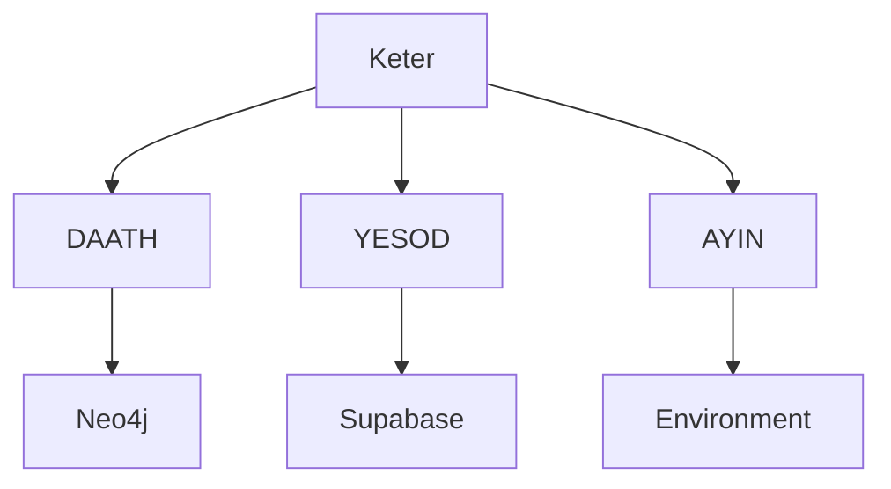

# Dependency Audit Design

## Architecture Overview
El audit se realizará en 4 capas de abstracción, identificando puntos de corte para migración.

## Abstraction Layers

### Layer 1: DAATH Knowledge Graph
- **Current**: Direct Neo4j imports via `from daath.kg import ...`
- **Target**: `IKnowledgeGraph` interface with adapter pattern
- **Files affected**: ~15 Python files

### Layer 2: YESOD Schema Registry
- **Current**: Direct Supabase schemas: `keter`, `templates`, `audit`, `public`
- **Target**: `ISchemaRegistry` interface with configuration injection
- **Files affected**: ~8 Python files

### Layer 3: AYIN Configuration
- **Current**: Hardcoded env vars and paths
- **Target**: `IConfigProvider` interface
- **Files affected**: ~10 config files

### Layer 4: Templates
- **Current**: Absolute paths to template directories
- **Target**: `ITemplateEngine` with relative paths
- **Files affected**: 87 L0 templates

## Dependency Graph

## Design Decisions
- Use Hexagonal Architecture (Ports & Adapters)
- All dependencies injected via constructor
- No direct imports between packages

## Technical Constraints
- Python 3.11+ required
- Must maintain 92.94% test coverage
- Zero breaking changes to public API
