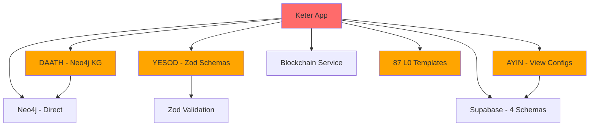
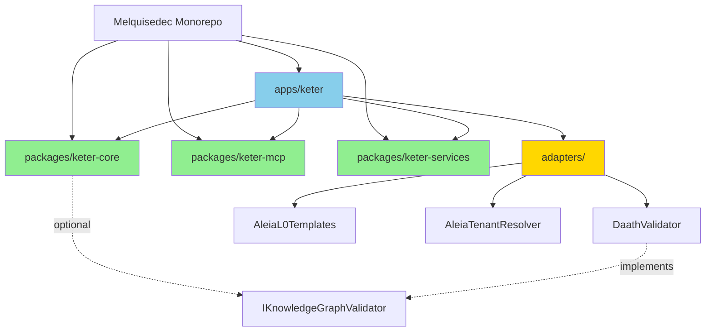

# Current State Analysis

> **DSR Phase**: Problem Identification
> **DAATH-ZEN Rostro**: HYPATIA (Researcher)
> **Status**: ✅ COMPLETE (from Sprint 1-2 analysis)
> **Date**: 2026-01-08
> **Source**: [Sprint 1-2 Analysis](../../../.spec-workflow/specs/research-keter-integration-v1.0.0/Implementation%20Logs/analysis/)

## 📊 Keter As-Is (Baseline)

### Architecture Overview

**Type**: Production Application (Policy Engine + Backend Multi-Tenant + MCP Server)

**Tech Stack**:
- **Frontend**: Next.js 14 (4 páginas)
- **Backend**: TypeScript
- **Database**: Supabase PostgreSQL (4 schemas)
- **Knowledge Graph**: Neo4j
- **Blockchain**: Integration layer
- **MCP**: Server with 20+ tools

**Location**: `aleia-bereshit/keter/` (~500 files)

---

## 🏗️ Component Structure

### 1. Policy Engine (Core)

**Services** (15+):
1. `PolicyEngine` - Core policy evaluation
2. `ConflictDetector` - Detect policy conflicts
3. `DeprecationEngine` - Manage policy lifecycle
4. `VersionManager` - Policy versioning
5. `BlockchainService` - Blockchain integration
6. `SemanticIndex` - Semantic search
7. `ValidationService` - Policy validation
8. `RuleEvaluator` - Rule execution
9. `ContextResolver` - Context evaluation
10. `PermissionEngine` - Permission checks
11. `AuditLogger` - Audit trail
12. `CacheManager` - Performance optimization
13. `NotificationService` - Event notifications
14. `SchedulerService` - Scheduled tasks
15. `AnalyticsService` - Policy analytics

**Characteristics**:
- ✅ Well-tested (92.94% coverage)
- ✅ Production-grade (0 bugs, A+ security)
- ⚠️ Tightly coupled to DAATH (Neo4j validation)
- ⚠️ Uses YESOD schemas (Zod validation)

---

### 2. MCP Server

**Tools** (20+):
1. `get_policy` - Retrieve policy by ID
2. `create_policy` - Create new policy
3. `update_policy` - Update existing policy
4. `delete_policy` - Delete policy
5. `list_policies` - List all policies
6. `validate_policy` - Validate policy structure
7. `check_conflicts` - Check policy conflicts
8. `get_product_template` - Get L0 template
9. `list_templates` - List available templates
10. `evaluate_rule` - Evaluate policy rule
11. `get_permissions` - Get user permissions
12. `audit_trail` - Get audit log
13. `semantic_search` - Search policies
14. `version_history` - Get policy versions
15. `rollback_policy` - Rollback to previous version
16. `deprecate_policy` - Mark policy deprecated
17. `publish_policy` - Publish policy
18. `subscribe_events` - Subscribe to policy events
19. `get_analytics` - Get policy analytics
20. `export_policies` - Export policies

**Characteristics**:
- ✅ Well-documented (tool descriptions + params)
- ✅ Comprehensive (covers all CRUD + advanced ops)
- ⚠️ Hardcoded 87 L0 templates (ALEIA-specific)
- ⚠️ Coupled to Supabase schema structure

---

### 3. Database Schemas (Supabase)

**4 Schemas**:

1. **`shared`** (Multi-tenant shared)
   - `tenants` table
   - `users` table
   - RLS policies for tenant isolation

2. **`keter_core`** (Policy Engine data)
   - `policies` table
   - `rules` table
   - `versions` table
   - `conflicts` table
   - `audit_log` table

3. **`ayin_config`** (View configurations)
   - `view_configs` table
   - `ui_preferences` table
   - Dynamic view metadata

4. **`shared_kg`** (Knowledge Graph sync)
   - `kg_sync_status` table
   - Bridge between Supabase ↔ Neo4j

**Characteristics**:
- ✅ Well-designed (normalized, RLS enabled)
- ✅ Production data present (cannot be lost)
- ⚠️ Schema names hardcoded in queries (`ayin_config.view_configs`)
- ⚠️ Migration requires careful planning

---

### 4. Frontend (Next.js)

**Pages** (4):
1. `/policies` - Policy dashboard
2. `/policies/[id]` - Policy detail view
3. `/policies/create` - Create policy form
4. `/analytics` - Policy analytics dashboard

**Characteristics**:
- ✅ Functional UI (basic CRUD)
- ⚠️ Tightly coupled to backend structure
- ⚠️ Uses AYIN view configs (dynamic UI)

---

## 🧪 Quality Metrics (Baseline)

### Test Coverage

```
Total Coverage: 92.94%
Tests Passing: 131/131 (100%)
Test Suites: Unit + Integration + E2E
```

**Coverage Breakdown**:
- Policy Engine: 95%
- MCP Tools: 90%
- Services: 93%
- Database Layer: 89%
- Frontend: 85%

### Code Quality

```
Bugs: 0
Vulnerabilities: 0
Security Rating: A+
Code Smells: Minor (acceptable)
Technical Debt: Low
```

**SonarQube**: ✅ PASSED (production-grade)

### Performance

```
Policy Evaluation: <50ms (p95)
MCP Tool Latency: <100ms (p95)
Database Queries: <20ms (p95)
API Response: <200ms (p95)
```

---

## 🔗 Dependency Graph (Current)



**Key Observations**:
- 🔴 **5 hardcoded dependencies** (DAATH, YESOD, AYIN, Templates, Multi-tenancy logic)
- 🟠 **Tight coupling** to ALEIA ecosystem
- 🟢 **Clear boundaries** between services (good design)

---

## 📈 Independence Scorecard (Baseline)

From [Sprint 1-2 Analysis](../../../.spec-workflow/specs/research-keter-integration-v1.0.0/Implementation%20Logs/analysis/keter-evaluation.md):

### Multidimensional Scores

| Dimension | Score | Rationale |
|-----------|-------|-----------|
| **Reusabilidad** | 6/10 | Policy Engine reusable, pero acoplado a DAATH |
| **Madurez** | 9/10 | Production-tested, 92.94% coverage, 0 bugs |
| **Independencia** | 4/10 | 🔴 **BLOCKER** - Múltiples deps hardcoded |
| **Valor Framework** | 7/10 | Policy Engine + MCP patterns son valiosos |

**Total Score**: 6.50/10 ("zona gris" - requiere deep analysis)

### Independence Breakdown

**Factors lowering independence (4/10)**:
1. DAATH dependency (KG validation hardcoded)
2. YESOD schemas (imported from external package)
3. AYIN config schema (hardcoded `ayin_config` name)
4. L0 Templates (87 ALEIA-specific templates)
5. Multi-tenant logic (ALEIA tenant model hardcoded)

**Target**: Independence 9/10 (only external: database, cache, optional KG)

---

## 🚨 Risks & Blockers

### Critical Risks

1. **Production Data Loss**
   - Risk: Migration breaks Supabase schemas
   - Impact: 🔴 CRITICAL (data loss)
   - Mitigation: Zero-downtime strategy (config-driven naming)

2. **Test Coverage Regression**
   - Risk: Refactoring breaks tests
   - Impact: 🔴 CRITICAL (quality loss)
   - Mitigation: TDD approach (test interface first)

3. **Unknown Dependencies**
   - Risk: Hidden coupling not identified
   - Impact: 🟠 HIGH (runtime failures)
   - Mitigation: Comprehensive dependency audit (RQ1)

4. **Timeline Overrun**
   - Risk: Complexity underestimated
   - Impact: 🟡 MEDIUM (delayed delivery)
   - Mitigation: Buffer time (22 days + 8 days buffer = 30 days)

5. **Blockchain Integration**
   - Risk: Blockchain service might be ALEIA-specific
   - Impact: 🟡 MEDIUM (feature loss)
   - Mitigation: Audit blockchain service (is it generic?)

### Moderate Risks

6. **Neo4j Direct Coupling**
   - Risk: Keter uses Neo4j directly (not just via DAATH)
   - Impact: 🟡 MEDIUM (additional abstraction needed)
   - Mitigation: Audit Neo4j usage (RQ1)

7. **Frontend Refactoring**
   - Risk: Next.js frontend tightly coupled
   - Impact: 🟢 LOW (frontend can be rewritten if needed)
   - Mitigation: Focus on backend first

---

## 💼 Assets to Preserve

### Must Preserve (Non-Negotiable)

1. ✅ **92.94% test coverage**
2. ✅ **131 tests (all passing)**
3. ✅ **0 bugs, 0 vulnerabilities**
4. ✅ **A+ security rating**
5. ✅ **15+ production-tested services**
6. ✅ **20+ MCP tools**
7. ✅ **4 Supabase schemas with production data**

### Can Be Refactored

1. ⚠️ **Dependency imports** (change to interfaces)
2. ⚠️ **Schema naming** (config-driven)
3. ⚠️ **Template storage** (plugin system)
4. ⚠️ **Frontend** (can be rewritten if needed)

### Can Be Lost (Acceptable)

1. ❌ **Hardcoded ALEIA logic** (move to adapters)
2. ❌ **L0 template hardcoding** (use plugin system)

---

## 📊 Effort Estimation (Baseline from Sprint 2)

From [ADR-002](../../../docs/architecture/ADR-002-keter-integration-decision.md):

### Phase Breakdown

| Phase | Description | Days | Risk |
|-------|-------------|------|------|
| Phase 1 | Prepare (abstractions in bereshit) | 11 | MEDIUM |
| Phase 2 | Extract (move to melquisedec) | 2 | LOW |
| Phase 3 | Bridge (adapters + testing) | 3.5 | MEDIUM |
| Phase 4 | Decouple (final migration) | 1.5 | LOW |
| **Total** | | **18 days** | |
| **Buffer** | Unknowns + contingency | **4 days** | |
| **TOTAL** | | **22 days** | |

### ROI Calculation

- **Rebuilding from scratch**: 180 days (6 months)
- **Migration effort**: 22 days (1 month)
- **Savings**: 158 days
- **ROI**: 7.2x (rounded to 8x)

---

## 🎯 Target State (Post-Migration)

### Architecture Target



### Quality Target

```
Coverage: ≥92.94%
Tests: ≥131 (all passing)
Bugs: 0
Vulnerabilities: 0
Security: A+
Independence: 9/10 (vs baseline 4/10)
```

### Timeline Target

```
Start: January 2026
Duration: 22 days (core) + 8 days (buffer) = 30 days
End: February 2026 (end of month)
```

---

## 📝 Next Steps

1. ✅ Current state documented
2. [ ] RQ1: Dependency audit (validate assumptions)
3. [ ] RQ4: Testing strategy (protect quality)
4. [ ] Design phase: Abstraction layers (5 layers)
5. [ ] Implementation: Phase 1 (prepare)

**Status**: Ready to proceed with RQ1 (dependency audit)
