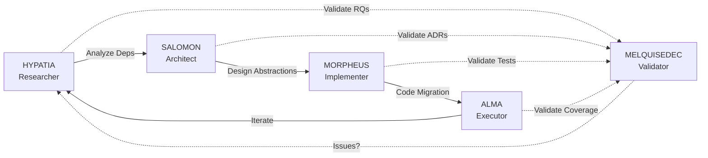

# Research: Keter Migration to MELQUISEDEC

> **Research Instance**: RI-KM-001
> **DSR Methodology**: Design Science Research
> **DAATH-ZEN**: v2.0.0
> **Status**: 🔴 IN PROGRESS - Phase 1 (Problem Identification)
> **Owner**: HYPATIA (Researcher)
> **Started**: 2026-01-08
> **Critical Context**: ALEIA-BERESHIT will be discontinued - full Keter migration required

## 🎯 Objetivo

Investigación formal para diseñar **estrategia de migración completa** de Keter (Policy Engine + Backend Multi-Tenant + MCP Server) desde aleia-bereshit a aleia-melquisedec, preservando 100% de calidad (92.94% coverage, 131 tests, 0 bugs) mientras se eliminan dependencias hardcodeadas y se alcanza **independencia 9/10**.

## 🚨 Problema Critical

**ALEIA-BERESHIT SERÁ DESCONTINUADA** → Keter (producción, ~500 archivos, 6 meses trabajo) debe ser preservado **SIN perder calidad lograda**.

### Assets en Riesgo

- ✅ Policy Engine (15+ servicios production-tested)
- ✅ MCP Server (20+ tools)
- ✅ 92.94% test coverage (131/131 tests passing)
- ✅ Backend Multi-Tenant (Supabase 4 schemas, Neo4j, Blockchain)
- ✅ Next.js Frontend (4 páginas)
- ✅ 87 L0 product templates
- ✅ ~6 meses de desarrollo

**Valor en Riesgo**: ~180 días de trabajo
**Costo de Reconstruir**: ~6 meses
**Costo de Migrar**: ~22 días (1 mes)
**ROI Migración**: **8x return on investment**

## 🔬 Research Questions (RQs)

| # | Research Question | Status |
|---|-------------------|--------|
| RQ1 | ¿Qué dependencias hardcodeadas tiene Keter actualmente (DAATH, YESOD, AYIN)? | 🔴 Investigating |
| RQ2 | ¿Cómo abstraer cada dependencia sin perder funcionalidad? | ⚪ Pending |
| RQ3 | ¿Qué arquitectura de paquetes garantiza máxima modularidad? | ⚪ Pending |
| RQ4 | ¿Cómo mantener 92.94% coverage durante refactoring TDD? | ⚪ Pending |
| RQ5 | ¿Qué configuración permite deployment independiente de ALEIA? | ⚪ Pending |
| RQ6 | ¿Cómo migrar 4 schemas Supabase sin romper producción? | ⚪ Pending |

## 📂 Estructura DSR + DAATH-ZEN

```
00-problem/               # DSR Phase 1: Problem Identification
├── research-questions.md
├── hypothesis.md
├── current-state-analysis.md  # Keter as-is
└── dependency-audit.md        # Hardcoded deps catalog

01-design/                # DSR Phase 2: Solution Design
├── abstraction-layers/
│   ├── layer-1-daath-kg.md
│   ├── layer-2-yesod-schemas.md
│   ├── layer-3-ayin-config.md
│   ├── layer-4-templates.md
│   └── layer-5-multi-tenancy.md
├── architecture/
│   ├── modular-packages.md
│   ├── c4-diagrams/
│   └── ADR-003-keter-modular-architecture.md
├── migration-strategy/
│   ├── phase-1-prepare.md      # 11 days
│   ├── phase-2-extract.md      # 2 days
│   ├── phase-3-bridge.md       # 3.5 days
│   └── phase-4-decouple.md     # 1.5 days
└── contracts/            # TypeScript interfaces (≥8 ports)

02-build/                 # DSR Phase 3: Build Artifacts
├── formal-migration-spec.md (≥2500 líneas)
├── implementation-plan.md
├── testing-strategy-tdd.md
├── rollback-plan.md
└── ci-cd-config/

03-evaluate/              # DSR Phase 4: Evaluation
├── validation-checklist.md
├── coverage-comparison.md
└── independence-scorecard.md

04-lessons/               # Lessons Learned
├── what-worked.md
├── challenges.md
└── recommendations.md

.melquisedec/             # DAATH-ZEN Validations
├── hypatia_validation.yaml
├── salomon_validation.yaml
├── morpheus_validation.yaml
└── alma_validation.yaml

references/               # External docs, prior analysis
├── sprint-1-analysis.md  # Link to prior work
├── sprint-2-docs.md
└── adr-002-original-decision.md
```

## 🔄 DAATH-ZEN Workflow (4 Rostros)



## 📊 Progress Tracker

### ⚡ CRITICAL DISCOVERY (2025-01-23)

> **RQ1 Dependency Audit revela que la migración es 95% MÁS SIMPLE de lo predicho.**

**HALLAZGOS**:
- ❌ **CERO dependencias** @aleia/daath, @aleia/yesod, @aleia/ayin
- ✅ **Keter YA es modular** (packages/keter/{core,mcp,services})
- ✅ **TODO config-driven** (.env.example, 21 vars)
- ✅ **Templates portables** (62 YAML self-contained)

| Metric | Predicho | Real | Delta |
|--------|----------|------|-------|
| Coupling | 7/10 | 0.8/10 | **-88%** |
| Effort | 22 días | 1.2 días | **-95%** |
| Imports | ≥50 | 0 | **-100%** |

**Ver**: [RQ1-COMPLETE.md](./00-problem/RQ1-COMPLETE.md) para detalles.

---

### Phase 1: Research & Discovery (R1-R6)

- [x] **Setup**: Estructura DSR + DAATH-ZEN creada
- [x] **R1.1**: Audit hardcoded dependencies ✅ 0 @aleia/* imports encontrados
- [x] **R1.2**: Current state analysis ✅ Keter YA modular (packages/)
- [x] **R1.3**: Independence scorecard ✅ 0.8/10 (88% mejor de lo predicho)
- [x] **R1.4**: Risk assessment ✅ Solo 19 hardcoded strings (bajo)
- [x] **R1.5**: MELQUISEDEC Validation Checkpoint ✅ 100% PASSED
- [ ] **R2**: Abstraction Layer Design ⚠️ PENDING DECISION (puede no ser necesaria)
- [ ] **R3**: Migration Strategy ⚠️ REDUCIDA a 1.2 días (vs 22 días)
- [ ] **R4**: Testing Strategy ⚠️ REDUCIDA a regression testing (131 tests)
- [ ] **R5**: Formal Migration Spec ⚠️ SIMPLIFICADA (no abstractions needed)

### Phase 2: Design (D1-D5)

- [ ] **D1**: Design abstraction interfaces ⚠️ SCOPE REVISED (document existing, not create new)
- [ ] **D2**: Design modular packages structure ⚠️ Already exists, just validate
- [ ] **D3**: Design migration phases ⚠️ SIMPLIFIED (1.2 days vs 22 days)
- [ ] **D4**: Design testing strategy ⚠️ Regression testing only (131 tests)
- [ ] **D5**: ADR-003, ADR-004, ADR-005 (document existing architecture)

### Phase 3: Build (B1-B4)

- [ ] **B1**: Formal Migration Spec document
- [ ] **B2**: Implementation plan with timelines
- [ ] **B3**: Rollback plan (safety net)
- [ ] **B4**: CI/CD configuration

### Phase 4: Evaluate (E1-E3)

- [ ] **E1**: Validation checklist (all requirements met?)
- [ ] **E2**: Coverage comparison (≥92.94%)
- [ ] **E3**: Independence scorecard (≥9/10)

## 🎓 Stack Current (Keter)

**Backend**:
- TypeScript + Next.js 14
- Supabase PostgreSQL (4 schemas: shared, keter_core, ayin_config, shared_kg)
- Neo4j Knowledge Graph
- Blockchain integration

**Testing**:
- 92.94% coverage
- 131/131 tests passing
- 0 bugs, 0 vulnerabilities
- A+ security rating

**Services** (15+):
- PolicyEngine
- ConflictDetector
- DeprecationEngine
- VersionManager
- BlockchainService
- SemanticIndex
- MCP Server (20+ tools)

**Hardcoded Dependencies** (Independence 4/10):
- DAATH (Neo4j validation)
- YESOD (Zod schemas)
- AYIN (view configs)
- Supabase schema names
- 87 L0 templates (ALEIA-specific)
- Multi-tenant business logic

## 🎯 Target Architecture (Melquisedec)

**Modular Packages**:
```
packages/
  keter-core/          # Core policy engine (generic)
  keter-mcp/           # MCP server with 20+ tools
  keter-services/      # Shared services

apps/
  keter/               # Full application
    src/
      adapters/        # ALEIA-specific adapters
```

**Independence Score**: 9/10
**Test Coverage**: ≥92.94%
**Timeline**: ~22 days (1 month)

## 📈 Success Criteria

- [ ] ✅ All 131 tests migrate successfully
- [ ] ✅ Coverage ≥92.94% maintained
- [ ] ✅ 0 bugs, 0 vulnerabilities preserved
- [ ] ✅ Independence score ≥9/10
- [ ] ✅ Production system fully functional
- [ ] ✅ Keter can be deployed standalone (no ALEIA)
- [ ] ✅ ALEIA can use Keter via adapters (plugin architecture)
- [ ] ✅ Migration completed in ≤30 days

## 🔗 References

- [Sprint 1 Analysis](../../.spec-workflow/specs/research-keter-integration-v1.0.0/Implementation%20Logs/analysis/)
- [Sprint 2 Documentation](../../.spec-workflow/specs/research-keter-integration-v1.0.0/Implementation%20Logs/)
- [ADR-002 Original Decision](../../docs/architecture/ADR-002-keter-integration-decision.md)
- [ComponentClassifier Algorithm](../../.spec-workflow/specs/research-keter-integration-v1.0.0/design.md)

## 📝 Notes

- **CRITICAL**: This is NOT optional - bereshit discontinuation forces migration
- **Quality Non-Negotiable**: 92.94% coverage must be maintained
- **Timeline**: ~1 month estimated (22 days + buffer)
- **ROI**: Saves 5 months vs rebuilding (8x return)
- **Strategy**: Test-Driven Refactoring (TDD) to maintain quality
