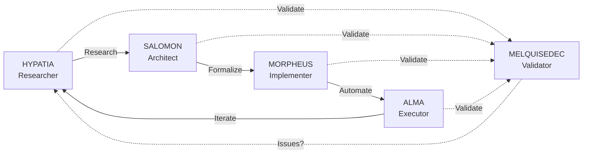

# Research: Neo4j + LlamaIndex Architecture for MELQUISEDEC

> **Research Instance**: RI-MDA-002
> **DSR Methodology**: Design Science Research
> **DAATH-ZEN**: v2.0.0
> **Status**: 🔴 IN PROGRESS - Phase 1 (Problem Identification + State-of-Art)
> **Owner**: HYPATIA (Researcher)
> **Started**: 2026-01-08

## 🎯 Objetivo

Investigación formal para diseñar arquitectura robusta **Neo4j 5.15+ Vector Index + LlamaIndex + Ollama embeddings locales** usando patrones probados de proyectos open source, evitando "reinventar la rueda".

## 🔬 Research Questions (RQs)

| # | Research Question | Status |
|---|-------------------|--------|
| RQ1 | ¿Cómo mantienen consistencia transaccional proyectos existentes entre Graph y Vector Index en Neo4j? | 🔴 Investigating |
| RQ2 | ¿Cuáles son los patrones de chunking más efectivos en proyectos RAG production-ready? | ⚪ Pending |
| RQ3 | ¿Qué arquitectura de software usan proyectos robustos (Hexagonal, Clean, Layered)? | ⚪ Pending |
| RQ4 | ¿Cómo integran embeddings locales (Ollama) vs cloud (OpenAI) los frameworks? | ⚪ Pending |
| RQ5 | ¿Qué estrategias de testing usan proyectos maduros (testcontainers, mocks)? | ⚪ Pending |

## 📂 Estructura DSR + DAATH-ZEN

```
00-problem/               # DSR Phase 1: Problem Identification
├── research-questions.md
└── hypothesis.md

01-design/                # DSR Phase 2: Solution Design
├── state-of-art/
│   ├── frameworks/       # genai-stack, llamaindex, haystack, langchain
│   ├── code-patterns/    # Extracted snippets (≥20)
│   ├── best-practices/   # Hybrid queries, RAG patterns
│   └── comparative-analysis.md
├── architecture/
│   ├── hexagonal-architecture.md
│   ├── c4-diagrams/
│   └── ADR-003-hexagonal-adoption.md
└── contracts/            # Python Protocols (≥8 ports)

02-build/                 # DSR Phase 3: Build Artifacts
├── formal-solution-spec.md (≥2000 líneas)
├── implementation-plan.md
├── testing-strategy.md
├── test-fixtures/
└── sonarqube-config/

03-evaluate/              # DSR Phase 4: Evaluation
└── validation-results.md

04-lessons/               # Lessons Learned
├── what-worked.md
├── challenges.md
└── recommendations.md

.melquisedec/             # DAATH-ZEN Validations
├── hypatia_validation.yaml
├── salomon_validation.yaml
└── morpheus_validation.yaml

references/               # External links, papers, docs
```

## 🔄 DAATH-ZEN Workflow (4 Rostros)



## 📊 Progress Tracker

### Phase 1: Research & Discovery ✅ COMPLETE (2026-01-08 → 2026-01-09)

- [x] **Setup**: Estructura DSR + DAATH-ZEN creada
- [x] **R1.1**: genai-stack analysis (dual storage issue identified)
- [x] **R1.2**: LlamaIndex deep dive (600+ integrations, semantic chunking)
- [x] **R1.3**: Hybrid Query Patterns (900 líneas, 4 retriever types, 50-100ms)
- [x] **R1.4**: Comparative Analysis (800 líneas, LlamaIndex 8.6/10 winner)
- [x] **R1.5**: MELQUISEDEC Validation Checkpoint (750 líneas, 3/6 PASS, 10 gaps)

### Phase 2: Design & Architecture ⏭️ IN PROGRESS (Sprint 1-2, 3 weeks)

**Sprint 1 (2 weeks - CRITICAL + HIGH)**:
- [ ] **R2.1**: Neo4j GraphRAG Retrievers Installation + Implementation (4 days)
- [ ] **R2.2**: DecisionTracerRetriever Custom (3 days)
- [ ] **R2.3**: Benchmarking Suite Comparativo (3 days)

**Sprint 2 (1 week - MEDIUM)**:
- [ ] **R2.4**: LessonsRetriever Implementation (2 days)
- [ ] **R2.5**: Lessons Auto-Capture Prototype (3 days)

**Architecture & Contracts**:
- [ ] **Architecture**: Hexagonal + C4 Diagrams
- [ ] **Contracts**: Python Protocols (≥8 ports)

### Phase 3: Build Artifacts 🔜 FUTURE (4 weeks)

- [ ] **Formal Solution Spec** (≥2000 líneas)
- [ ] **Implementation Plan** with milestones
- [ ] **Testing Strategy** (TDD + SonarQube 80% coverage)
- [ ] **Test Fixtures** (testcontainers, mocks)

### Phase 4: Evaluation + Lessons 🔜 FUTURE (2 weeks)

- [ ] **Validation Results** (benchmarks, metrics)
- [ ] **Lessons Learned** (what worked, challenges, recommendations)

## 🎓 Stack Target

- **Graph Database**: Neo4j 5.15+ (HNSW Vector Index nativo)
- **Embeddings**: Ollama (qwen3-embedding, 1536 dims)
- **RAG Framework**: LlamaIndex (preferred)
- **Architecture**: Hexagonal + DDD
- **Testing**: TDD + SonarQube QA (80% coverage, 0 smells)

## 📚 Referencias Clave

- [neo4j/genai-stack](https://github.com/neo4j/genai-stack) - Stack oficial Neo4j+Ollama+LlamaIndex
- [LlamaIndex Neo4j Integration](https://docs.llamaindex.ai/en/stable/examples/vector_stores/Neo4jVector/) - Docs oficiales
- [Tomasonjo Neo4j Blog](https://medium.com/@neo4j) - Hybrid queries, RAG patterns
- [Haystack Neo4j](https://github.com/deepset-ai/haystack) - Alternative framework
- [LangChain Neo4j](https://python.langchain.com/docs/integrations/vectorstores/neo4jvector) - Alternative approach

## 🚀 Next Steps

1. **R1.1**: Investigar neo4j/genai-stack (docker-compose, arquitectura, patterns)
2. **R1.2**: Analizar LlamaIndex `Neo4jVectorStore` (interface, methods, transacciones)
3. **R1.3**: Extraer hybrid query patterns de Tomasonjo blogs
4. **R1.4**: Comparar Haystack vs LangChain vs LlamaIndex
5. **R1.5**: Validación MELQUISEDEC (completeness check)

---

**Última actualización**: 2026-01-08
**Rostro activo**: HYPATIA (Researcher)
**Fase DSR**: Problem Identification
