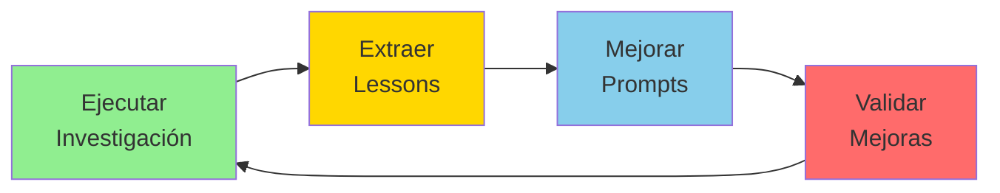

# 1. ¿Qué es MELQUISEDEC?

```yaml
---
# HKM HEADER
id: "fundamentos-01-definicion"
is_a: "concept/definition"
permalink: "/manifiesto/01-fundamentos/01-que-es-melquisedec"
version: "4.0.0"

# DUBLIN CORE
dc:
  title: "Definición de MELQUISEDEC"
  creator: ["Equipo ALEIA-BERESHIT"]
  date: "2026-01-08"
  subject: ["Meta-metodología", "Autopoiesis", "Síntesis Metodológica"]
  type: "ConceptualDefinition"
  language: "es"

# SECI
seci:
  mode: "Externalization"
  derives_from:
    - "Árbol de la Vida (Kabbalah)"
    - "ISO 30401"
    - "SECI Model"
  informs:
    - "02-fundamento-kabalistico.md"
    - "03-cinco-rostros.md"

status: active
---
```

---

## Definición Central

**MELQUISEDEC** es una **meta-metodología autopoiética** para investigación y desarrollo que sintetiza:

- **Sabiduría kabalística**: Árbol de la Vida como arquitectura de flujo de conocimiento
- **Estándares internacionales**: ISO 30401 (Knowledge Management), ISO 15836 (Dublin Core)
- **Gestión del conocimiento**: Modelo SECI (Nonaka & Takeuchi)
- **Metodologías ágiles**: Issue-driven development, sprints, retrospectives

---

## Autopoiesis Metodológica

> **Autopoiesis**: Sistema que se auto-crea, auto-organiza y auto-mejora recursivamente.

MELQUISEDEC es autopoiético porque:

1. **Se auto-describe**: Este manifiesto es un artefacto MELQUISEDEC
2. **Se auto-aplica**: Los issues son investigaciones de la propia metodología
3. **Se auto-refina**: Lessons learned mejoran prompts y templates
4. **Se auto-valida**: Checkpoints garantizan coherencia interna

### Ciclo Autopoiético



**Ejemplo concreto**:
- **Ejecutar**: Research instance "C.2.2_DDD" completada
- **Extraer**: Lesson learned "DDD Strategic Design debe preceder Tactical"
- **Mejorar**: Prompt `daath-zen-research` actualizado con esta priorización
- **Validar**: Siguiente research instance usa prompt mejorado y reduce errores

---

## Meta-metodología

MELQUISEDEC no compite con metodologías específicas (CRISP-DM, Scrum, DDD). En cambio:

- **ORQUESTA** metodologías existentes según el contexto
- **SINTETIZA** conocimiento de múltiples fuentes
- **VALIDA** salidas con criterios explícitos
- **EVOLUCIONA** aprendiendo de cada ejecución

### Comparación con Metodologías Tradicionales

| Aspecto | Metodología Tradicional | MELQUISEDEC |
|---------|-------------------------|-------------|
| **Alcance** | Un dominio específico (ej: desarrollo software) | Universal (investigación, software, BIM, etc.) |
| **Evolución** | Cambios por comités/expertos (años) | Autopoiesis por lessons learned (sprints) |
| **Trazabilidad** | Opcional, manual | Obligatoria, automatizada (HKM + Dublin Core) |
| **Integración** | Compite con otras metodologías | Orquesta otras metodologías |
| **Versionamiento** | Versiones globales (ej: Scrum 2020) | Versionamiento granular (per-prompt, per-component) |

### Ejemplo de Orquestación

```yaml
# ISSUE: Desarrollar módulo CALE de evaluación de exámenes

proyecto: "CALE-Evaluacion"
dominios:
  - software  # Arquitectura de sistema
  - bim       # Representación espacial de centros de conducción
  - legal     # Normativa Ley 1503-2011

metodologias_orquestadas:
  software:
    metodologia: "Domain-Driven Design"
    rostro_responsable: "SALOMON"
    fase: "Strategic Design antes de Tactical"

  bim:
    metodologia: "ISO 19650 (BIM Level 2)"
    rostro_responsable: "MORPHEUS"
    fase: "Modelado espacial L0-L3"

  legal:
    metodologia: "Legal Requirements Analysis"
    rostro_responsable: "HYPATIA"
    fase: "Extracción de requisitos normativos"

  integracion:
    meta_metodologia: "MELQUISEDEC"
    rostro_responsable: "MELQUISEDEC"
    accion: "Orquestar cascada H→S→Mo→A"
```

**Resultado**: Las 3 metodologías específicas se ejecutan en armonía bajo la orquestación de MELQUISEDEC, sin competir ni duplicarse.

---

## Diferencias Clave con Otros Enfoques

### vs. Metodologías Prescriptivas (ej: RUP, PRINCE2)

- **Ellas**: Definen CÓMO hacer cada paso
- **MELQUISEDEC**: Define QUIÉN (rostro) hace QUÉ (tipo de trabajo) y CUÁNDO (cascada), pero permite flexibilidad en el CÓMO

### vs. Frameworks Ágiles (ej: Scrum, Kanban)

- **Ellos**: Gestionan flujo de trabajo y equipos
- **MELQUISEDEC**: Gestiona flujo de CONOCIMIENTO (SECI) y trazabilidad epistemológica

### vs. Knowledge Management Systems (ej: Confluence, Notion)

- **Ellos**: Almacenan y organizan conocimiento
- **MELQUISEDEC**: CREA conocimiento (investigación) + lo almacena con trazabilidad completa

---

## Principios Rectores

MELQUISEDEC se basa en 10 principios fundacionales (ver [04-principios-fundacionales.md](04-principios-fundacionales.md)):

1. **P1**: Síntesis Metodológica
2. **P2**: Autopoiesis por Diseño
3. **P3**: Issue-Driven Everything
4. **P4**: Arquitectura de Prompts por Capas
5. **P5**: Validación Continua (Checkpoints)
6. **P6**: Trazabilidad Explícita
7. **P7**: Recursión Fractal
8. **P8**: Tzimtzum (Dependency Blocking)
9. **P9**: Outputs como Snapshots Inmutables
10. **P10**: Feedback Loops via Inbox Multinivel

---

## ¿Para Quién es MELQUISEDEC?

### Audiencias Primarias

1. **Investigadores**: Académicos, científicos, analistas
2. **Equipos de Desarrollo**: Software, BIM, arquitectura
3. **Gestores de Conocimiento**: KM managers, archiveros
4. **Agentes de IA**: LLMs orquestando investigación

### Casos de Uso Principales

- **Investigación académica**: Papers, tesis, meta-análisis
- **Desarrollo de software**: Arquitectura DDD, microservicios
- **Proyectos BIM**: Modelado espacial L0-L5
- **Proyectos Desarrollo Sostenible**: Modelado RBM-GAC + BSC-S
- **Investigación normativa**: Análisis de leyes, estándares ISO
- **Meta-investigación**: Estudio de la propia metodología

---

## ¿Por Qué el Nombre "MELQUISEDEC"?

**Melquisedec** (en hebreo מַלְכִּי־צֶדֶק, Malki-Tzedek) significa:

- **Malki** = Rey
- **Tzedek** = Justicia

En la tradición kabalística, Melquisedec es el **Rey-Sacerdote** de Salem, que representa:

1. **Integración**: Combina poder temporal (rey) y espiritual (sacerdote)
2. **Justicia**: Equilibrio (Tzedek) en decisiones
3. **Síntesis**: Une lo humano (rey) con lo divino (sacerdote)

### Metáfora Metodológica

MELQUISEDEC como metodología:

- **Rey**: Orquesta y gobierna el flujo de trabajo (MELQUISEDEC rostro)
- **Sacerdote**: Media entre lo abstracto (filosofía) y lo concreto (código)
- **Justicia**: Equilibra trade-offs (SALOMON rostro)
- **Síntesis**: Une conocimiento disperso en coherencia (DAATH)

---

## Relación con DAATH

MELQUISEDEC es el **rostro de Keter** (la corona), pero su corazón es **DAATH** (conocimiento oculto).

```
KETER (MELQUISEDEC)
  ↓ [inicia cascada]
DAATH (Los 5 Rostros)
  ↓ [ejecutan investigación]
MALKUTH (Outputs)
```

Ver [03-cinco-rostros.md](03-cinco-rostros.md) para detalles sobre los rostros de DAATH.

---

## Conclusión

MELQUISEDEC es:

- ✅ Una **meta-metodología** (orquesta otras metodologías)
- ✅ **Autopoiética** (se auto-mejora)
- ✅ **Trazable** (cada decisión tiene origen)
- ✅ **Fractal** (misma estructura a diferentes escalas)
- ✅ **Universal** (aplicable a investigación, software, BIM, etc.)

---

## 🧭 Navegación

- **← README**: [Fundamentos](README.md)
- **→ Siguiente**: [02. Fundamento Kabalístico](02-fundamento-kabalistico.md)

---

**Última actualización**: 2026-01-08 | **Versión**: 4.0.0
