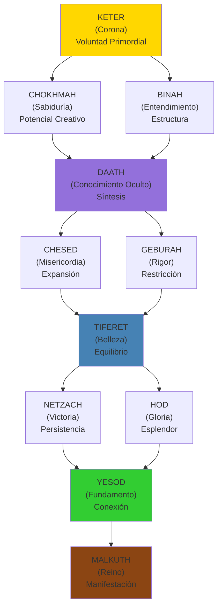
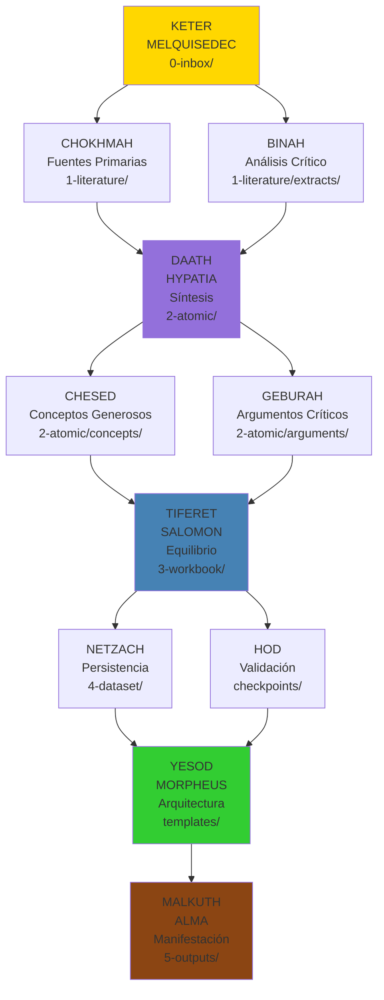

# 2. Fundamento Kabalístico: El Árbol de la Vida

```yaml
---
# HKM HEADER
id: "fundamentos-02-kabbalah"
is_a: "concept/philosophy"
permalink: "/manifiesto/01-fundamentos/02-fundamento-kabalistico"
version: "4.0.0"

# DUBLIN CORE
dc:
  title: "Árbol de la Vida y Mapeo MELQUISEDEC"
  creator: ["Equipo ALEIA-BERESHIT"]
  date: "2026-01-08"
  subject: ["Kabbalah", "Sephirot", "Árbol de la Vida", "Flujo de Conocimiento"]
  type: "PhilosophicalFoundation"
  language: "es"

# SECI
seci:
  mode: "Externalization"
  derives_from:
    - "Árbol de la Vida (Etz Chaim)"
    - "Scholem, Gershom (1974) - Kabbalah"
    - "Luzzatto, Moshe Chaim (2005) - The Way of God"
  informs:
    - "03-cinco-rostros.md"
    - "../02-arquitectura/01-research-instance.md"

status: active
---
```

---

## El Árbol de la Vida (Etz Chaim)

El **Árbol de la Vida** es un diagrama de **10 Sephirot** (emanaciones divinas) conectadas por 22 senderos, que representa el flujo de la creación desde lo abstracto (Keter) hasta lo concreto (Malkuth).

### Estructura Básica



---

## Las 10 Sephirot

### 1. KETER (כֶּתֶר) - Corona

**Significado**: Voluntad primordial, la fuente de toda creación

**Características**:
- Intención pura antes de manifestación
- "Querer hacer" antes de "saber cómo"
- Trascendente, inefable

### 2. CHOKHMAH (חָכְמָה) - Sabiduría

**Significado**: Destello intuitivo, potencial creativo

**Características**:
- Insight súbito ("¡Eureka!")
- Conocimiento tácito, no estructurado
- Semilla de la idea

### 3. BINAH (בִּינָה) - Entendimiento

**Significado**: Proceso analítico, estructura

**Características**:
- Análisis, descomposición
- Conocimiento explícito, estructurado
- Dar forma a la idea

### 4. DAATH (דַּעַת) - Conocimiento Oculto

**Significado**: Síntesis de Sabiduría + Entendimiento

**Características**:
- NO es una Sephirah formal, sino un "puente"
- Punto de integración Chokhmah ↔ Binah
- Conocimiento experimentado (no solo leído)

### 5. CHESED (חֶסֶד) - Misericordia

**Significado**: Expansión, generosidad

**Características**:
- Dar sin restricción
- Creatividad abundante
- Múltiples posibilidades

### 6. GEBURAH (גְּבוּרָה) - Rigor

**Significado**: Restricción, filtrado

**Características**:
- Disciplina, crítica
- Eliminar lo superfluo
- Enfoque y precisión

### 7. TIFERET (תִּפְאֶרֶת) - Belleza

**Significado**: Equilibrio entre Chesed y Geburah

**Características**:
- Armonía, síntesis
- "Punto medio" justo
- Decisión equilibrada

### 8. NETZACH (נֶצַח) - Victoria

**Significado**: Persistencia, perseverancia

**Características**:
- Repetición hasta logro
- Voluntad de continuar
- Momentum

### 9. HOD (הוֹד) - Gloria

**Significado**: Esplendor, reconocimiento

**Características**:
- Validación externa
- Acknowledgment
- Humildad ante la realidad

### 10. YESOD (יְסוֹד) - Fundamento

**Significado**: Conexión, arquitectura

**Características**:
- Puente entre abstracto y concreto
- Estructuras duraderas
- Fundación estable

### 11. MALKUTH (מַלְכוּת) - Reino

**Significado**: Manifestación física, mundo material

**Características**:
- Outputs tangibles
- Realidad observable
- Resultado final

---

## Mapeo MELQUISEDEC → Sephirot

| Sephirah | Rostro MELQUISEDEC | Carpeta Research Instance | Función |
|----------|-------------------|--------------------------|---------|
| **Keter** | MELQUISEDEC | `0-inbox/` | Orquestación, clasificación de issues |
| **Chokhmah** | HYPATIA | `1-literature/` (input) | Búsqueda de fuentes primarias |
| **Binah** | HYPATIA | `1-literature/extracts/` | Análisis y extracción de contenido |
| **Daath** | HYPATIA | `2-atomic/` | Síntesis de conceptos |
| **Chesed** | SALOMON | `2-atomic/concepts/` | Generación abundante de ideas |
| **Geburah** | SALOMON | `2-atomic/arguments/` | Filtrado crítico de conceptos |
| **Tiferet** | SALOMON | `3-workbook/` | Análisis equilibrado y decisiones |
| **Netzach** | MORPHEUS | `4-dataset/` (iterativo) | Persistencia en implementación |
| **Hod** | MORPHEUS | `_melquisedec/*.yaml` | Validación de arquitectura |
| **Yesod** | MORPHEUS | Templates, schemas | Fundaciones arquitectónicas |
| **Malkuth** | ALMA | `5-outputs/` | Manifestación de entregables |

### Diagrama del Mapeo



---

## Flujo Correcto: Keter → Daath → Tiferet → Yesod → Malkuth

### ⚠️ Error Común

**Saltar directamente de Keter a Tiferet**:

```
KETER (MELQUISEDEC) ──X──> TIFERET (SALOMON)
                           ↓
                        MALKUTH (ALMA)
```

**Problema**: Sin síntesis (DAATH), el análisis (TIFERET) carece de fundamento conceptual.

### ✅ Flujo Correcto

```
KETER (MELQUISEDEC)
  ↓
CHOKHMAH (Fuentes) + BINAH (Análisis)
  ↓
DAATH (HYPATIA: Síntesis)  ← ⚠️ Paso crítico
  ↓
TIFERET (SALOMON: Equilibrio)
  ↓
YESOD (MORPHEUS: Arquitectura)
  ↓
MALKUTH (ALMA: Manifestación)
```

### Ejemplo Concreto

**Caso**: Investigar metodología CRISP-DM

1. **KETER (MELQUISEDEC)**: Recibe issue "Investigar CRISP-DM"
2. **CHOKHMAH (HYPATIA)**: Busca guías oficiales de CRISP-DM
3. **BINAH (HYPATIA)**: Extrae las 6 fases del proceso
4. **DAATH (HYPATIA)**: Sintetiza conceptos clave (Business Understanding, Data Preparation, etc.)
5. **CHESED + GEBURAH (SALOMON)**: Genera múltiples interpretaciones, luego filtra las más relevantes
6. **TIFERET (SALOMON)**: Compara CRISP-DM vs TDSP vs KDD, decide cuál aplicar
7. **YESOD (MORPHEUS)**: Diseña templates de fases CRISP-DM
8. **MALKUTH (ALMA)**: Publica "GUIA_CRISP_DM_v1.0.0.md"

**Sin DAATH**: SALOMON intentaría comparar metodologías sin haber sintetizado conceptos → análisis superficial.

---

## El Papel Crítico de DAATH

### ¿Por Qué DAATH No Es una Sephirah Formal?

En la Kabbalah clásica, DAATH es un **"conocimiento oculto"** que solo emerge cuando:

- Chokhmah (sabiduría intuitiva) **+** Binah (análisis estructurado) **→** DAATH (conocimiento experiencial)

### DAATH en MELQUISEDEC

**HYPATIA** encarna DAATH porque:

1. **Lee fuentes primarias** (Chokhmah: adquiere sabiduría)
2. **Analiza críticamente** (Binah: estructura conocimiento)
3. **SINTETIZA conocimiento** (Daath: integra ambos)

**Salida de HYPATIA**: Conceptos atómicos en `2-atomic/` que son:
- **Destilados** (no copia-pega de fuentes)
- **Conectados** (links bidireccionales)
- **Trazables** (derives_from fuentes originales)

---

## Tzimtzum: Contracción Divina

### Concepto Kabalístico

**Tzimtzum** (צמצום) = Contracción de Dios para crear espacio al universo

En Kabbalah:
1. Antes de la creación, Dios llenaba todo (Ein Sof)
2. Dios se "contrae" (Tzimtzum) para dejar espacio
3. En ese espacio vacío, fluye la luz creadora (Or Ein Sof)

### Tzimtzum en MELQUISEDEC (Principio P8)

**Aplicación**: Cada rostro espera (se "contrae") antes de ejecutar.

```
HYPATIA espera que MELQUISEDEC termine clasificación  ← Tzimtzum
  ↓
SALOMON espera que HYPATIA termine búsqueda           ← Tzimtzum
  ↓
MORPHEUS espera que SALOMON termine análisis          ← Tzimtzum
  ↓
ALMA espera que MORPHEUS termine diseño               ← Tzimtzum
```

**Razón**: Sin espera (contracción), habría caos (todos ejecutando simultáneamente sin inputs válidos).

**Ver**: [04-principios-fundacionales.md - P8](04-principios-fundacionales.md#p8-tzimtzum-dependency-blocking)

---

## Partzufim (Rostros)

### Concepto Kabalístico

**Partzufim** (פַּרְצוּפִים) = Rostros o personificaciones de las Sephirot.

Ejemplos clásicos:
- **Arikh Anpin** (Rostro Largo) = Keter + Chokhmah + Binah
- **Zeir Anpin** (Rostro Corto) = Chesed + Geburah + Tiferet + Netzach + Hod + Yesod
- **Nukvah** (Femenino) = Malkuth

### Partzufim en MELQUISEDEC

Los **5 Rostros de DAATH** son personificaciones operacionales:

1. **MELQUISEDEC** (Keter) = Rey-Sacerdote, Orquestador
2. **HYPATIA** (Daath) = Filósofa, Buscadora de Conocimiento
3. **SALOMON** (Tiferet) = Rey Sabio, Juez Equilibrado
4. **MORPHEUS** (Yesod) = Arquitecto, Constructor de Matrices
5. **ALMA** (Malkuth) = Ejecutor, Manifestador

**Ver**: [03-cinco-rostros.md](03-cinco-rostros.md) para detalles completos.

---

## Las Tres Columnas

El Árbol de la Vida tiene 3 columnas verticales:

| Columna | Sephirot | Cualidad | Rostro MELQUISEDEC |
|---------|----------|----------|-------------------|
| **Izquierda (Rigor)** | Binah, Geburah, Hod | Restricción, análisis, crítica | HYPATIA (análisis), SALOMON (filtrado) |
| **Derecha (Misericordia)** | Chokhmah, Chesed, Netzach | Expansión, creatividad, persistencia | HYPATIA (búsqueda), MORPHEUS (diseño) |
| **Centro (Equilibrio)** | Keter, Tiferet, Yesod, Malkuth | Síntesis, balance, manifestación | MELQUISEDEC, SALOMON, MORPHEUS, ALMA |

**Principio de Balance**: Todo workflow de MELQUISEDEC debe transitar por las 3 columnas:

1. **Expansión** (Columna Derecha): Búsqueda abundante de fuentes
2. **Restricción** (Columna Izquierda): Filtrado crítico
3. **Equilibrio** (Columna Centro): Síntesis y decisión

---

## Conclusión

El Árbol de la Vida no es solo una metáfora decorativa en MELQUISEDEC: es la **arquitectura operacional** del flujo de conocimiento.

**Puntos clave**:

- ✅ **10 Sephirot** mapean a 5 Rostros + 6 Carpetas
- ✅ **DAATH** (síntesis) es crítico, no opcional
- ✅ **Tzimtzum** (espera) previene ejecución caótica
- ✅ **3 Columnas** garantizan balance rigor ↔ expansión

---

## Referencias

- Scholem, Gershom (1974). *Kabbalah*. Meridian.
- Kaplan, Aryeh (1997). *Sefer Yetzirah: The Book of Creation*. Weiser Books.
- Luzzatto, Moshe Chaim (2005). *The Way of God*. Feldheim Publishers.

---

## 🧭 Navegación

- **← Anterior**: [01. ¿Qué es MELQUISEDEC?](01-que-es-melquisedec.md)
- **→ Siguiente**: [03. Los 5 Rostros de DAATH](03-cinco-rostros.md)
- **↑ Fundamentos**: [README](README.md)

---

**Última actualización**: 2026-01-08 | **Versión**: 4.0.0
