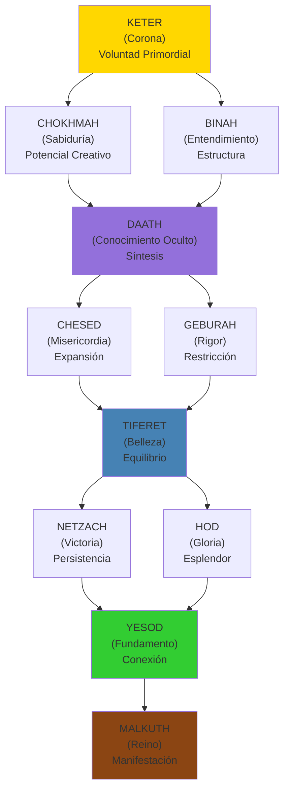
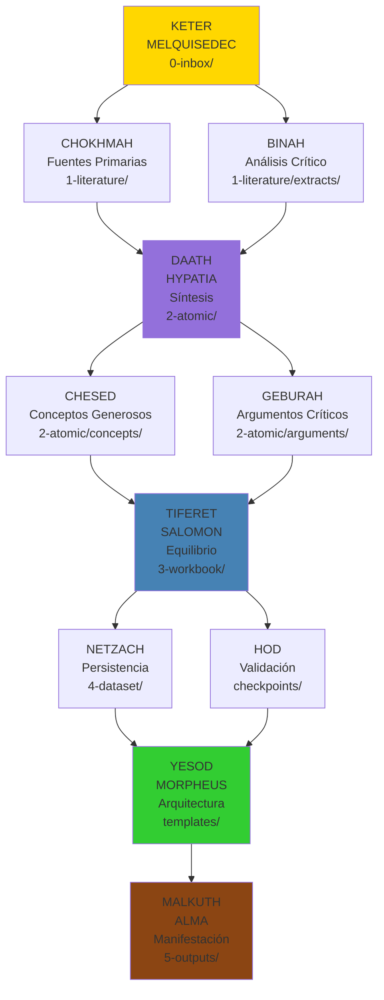
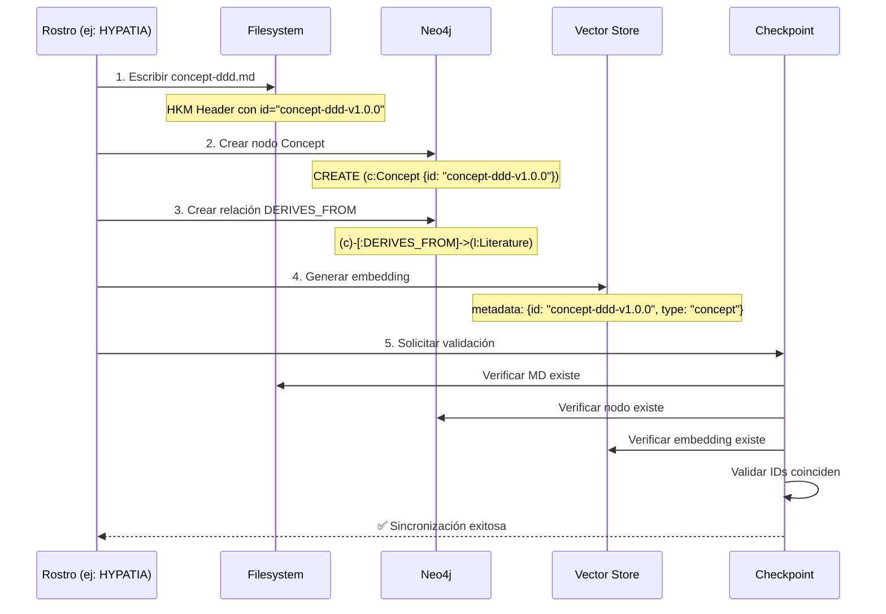
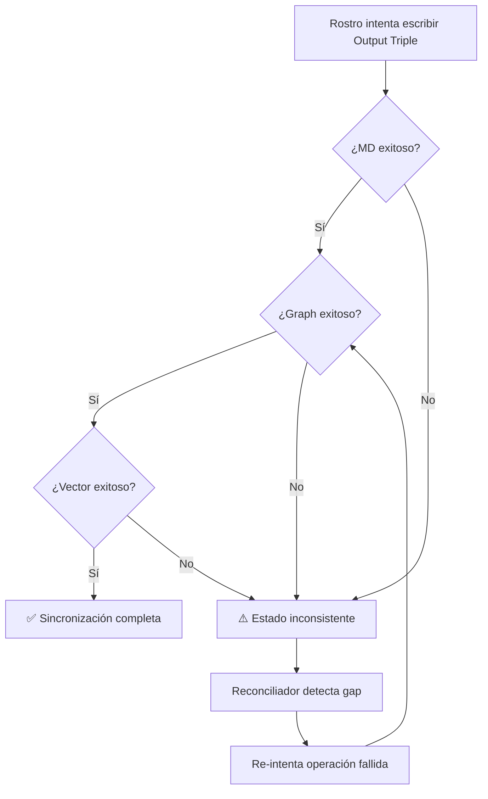

# 2. Fundamento Kabalístico: El Árbol de la Vida

```yaml
---
# HKM HEADER
id: "fundamentos-02-kabbalah"
is_a: "concept/philosophy"
permalink: "/manifiesto/01-fundamentos/02-fundamento-kabalistico"
version: "4.0.0"

# DUBLIN CORE
dc:
  title: "Árbol de la Vida y Mapeo MELQUISEDEC"
  creator: ["Equipo ALEIA-BERESHIT"]
  date: "2026-01-08"
  subject: ["Kabbalah", "Sephirot", "Árbol de la Vida", "Flujo de Conocimiento"]
  type: "PhilosophicalFoundation"
  language: "es"

# SECI
seci:
  mode: "Externalization"
  derives_from:
    - "Árbol de la Vida (Etz Chaim)"
    - "Scholem, Gershom (1974) - Kabbalah"
    - "Luzzatto, Moshe Chaim (2005) - The Way of God"
  informs:
    - "03-cinco-rostros.md"
    - "../02-arquitectura/01-research-instance.md"

status: active
---
```

---

## El Árbol de la Vida (Etz Chaim)

El **Árbol de la Vida** es un diagrama de **10 Sephirot** (emanaciones divinas) conectadas por 22 senderos, que representa el flujo de la creación desde lo abstracto (Keter) hasta lo concreto (Malkuth).

### Estructura Básica



---

## Las 10 Sephirot

### 1. KETER (כֶּתֶר) - Corona

**Significado**: Voluntad primordial, la fuente de toda creación

**Características**:
- Intención pura antes de manifestación
- "Querer hacer" antes de "saber cómo"
- Trascendente, inefable

### 2. CHOKHMAH (חָכְמָה) - Sabiduría

**Significado**: Destello intuitivo, potencial creativo

**Características**:
- Insight súbito ("¡Eureka!")
- Conocimiento tácito, no estructurado
- Dominio de Conocimiento
- Semilla de la idea

### 3. BINAH (בִּינָה) - Entendimiento

**Significado**: Proceso analítico, estructura

**Características**:
- Análisis, descomposición
- Conocimiento explícito, estructurado
- Dar forma a la idea
- Estructura lógica y coherente

### 4. DAATH (דַּעַת) - Conocimiento Oculto

**Significado**: Síntesis de Sabiduría + Entendimiento

**Características**:
- NO es una Sephirah formal, sino un "puente"
- Punto de integración Chokhmah ↔ Binah
- Conocimiento experimentado (no solo leído)

### 5. CHESED (חֶסֶד) - Misericordia

**Significado**: Expansión, generosidad

**Características**:
- Dar sin restricción
- Creatividad abundante
- Exploración sin límites
- Múltiples posibilidades

### 6. GEBURAH (גְּבוּרָה) - Rigor

**Significado**: Restricción, filtrado

**Características**:
- Disciplina, crítica
- Eliminar lo superfluo
- Selección pragmática
- Enfoque y precisión

### 7. TIFERET (תִּפְאֶרֶת) - Belleza

**Significado**: Equilibrio entre Chesed y Geburah

**Características**:
- Armonía, síntesis
- "Punto medio" justo
- Decisión equilibrada

### 8. NETZACH (נֶצַח) - Victoria

**Significado**: Persistencia, perseverancia

**Características**:
- Repetición hasta logro
- Voluntad de continuar
- Momentum

### 9. HOD (הוֹד) - Gloria

**Significado**: Esplendor, reconocimiento

**Características**:
- Validación externa
- Acknowledgment
- Humildad ante la realidad

### 10. YESOD (יְסוֹד) - Fundamento

**Significado**: Conexión, arquitectura

**Características**:
- Puente entre abstracto y concreto
- Estructuras duraderas
- Fundación estable

### 11. MALKUTH (מַלְכוּת) - Reino

**Significado**: Manifestación física, mundo material

**Características**:
- Outputs tangibles
- Realidad observable
- Manifestación concreta
- Resultado verificable

---

## Mapeo MELQUISEDEC → Sephirot

| Sephirah     | Rostro MELQUISEDEC | Carpeta Research Instance | Función                               | Output Triple                                 |
| ------------ | ------------------ | ------------------------- | ------------------------------------- | --------------------------------------------- |
| **Keter**    | MELQUISEDEC        | `0-inbox/`                | Orquestación, clasificación de issues | MD + Graph (Issue) + Vector (question)        |
| **Chokhmah** | HYPATIA            | `1-literature/` (input)   | Búsqueda de fuentes primarias         | MD + Graph (Literature) + Vector (abstract)   |
| **Binah**    | HYPATIA            | `1-literature/extracts/`  | Análisis y extracción de contenido    | MD + Graph (Extract) + Vector (content)       |
| **Daath**    | HYPATIA            | `2-atomic/`               | Síntesis de conceptos                 | MD + Graph (Concept) + Vector (definition)    |
| **Chesed**   | SALOMON            | `2-atomic/concepts/`      | Generación abundante de ideas         | MD + Graph (múltiples Concepts) + Vectors     |
| **Geburah**  | SALOMON            | `2-atomic/arguments/`     | Filtrado crítico de conceptos         | MD + Graph (Argument) + Vector (critique)     |
| **Tiferet**  | SALOMON            | `3-workbook/`             | Análisis equilibrado y decisiones     | MD + Graph (Analysis) + Vector (conclusions)  |
| **Netzach**  | MORPHEUS           | `4-dataset/` (iterativo)  | Persistencia en implementación        | MD + Graph (Pattern) + Vector (design)        |
| **Hod**      | MORPHEUS           | `_melquisedec/*.yaml`     | Validación de arquitectura            | MD + Graph (Validation) + Vector (criteria)   |
| **Yesod**    | MORPHEUS           | Templates, schemas        | Fundaciones arquitectónicas           | MD + Graph (Template) + Vector (schema)       |
| **Malkuth**  | ALMA               | `5-outputs/`              | Manifestación de entregables          | MD + Graph (Output + version) + Vector (docs) |

### Diagrama del Mapeo



---

## Flujo Correcto: Keter → Daath → Tiferet → Yesod → Malkuth

### ⚠️ Error Común

**Saltar directamente de Keter a Tiferet**:

```
KETER (MELQUISEDEC) ──X──> TIFERET (SALOMON)
                           ↓
                        MALKUTH (ALMA)
```

**Problema**: Sin síntesis (DAATH), el análisis (TIFERET) carece de fundamento conceptual.

### ✅ Flujo Correcto

```
KETER (MELQUISEDEC)
  ↓
CHOKHMAH (Fuentes) + BINAH (Análisis)
  ↓
DAATH (HYPATIA: Síntesis)  ← ⚠️ Paso crítico
  ↓
TIFERET (SALOMON: Equilibrio)
  ↓
YESOD (MORPHEUS: Arquitectura)
  ↓
MALKUTH (ALMA: Manifestación)
```

### Ejemplo Concreto

**Caso**: Investigar metodología CRISP-DM

1. **KETER (MELQUISEDEC)**: Recibe issue "Investigar CRISP-DM"
2. **CHOKHMAH (HYPATIA)**: Busca guías oficiales de CRISP-DM
3. **BINAH (HYPATIA)**: Extrae las 6 fases del proceso
4. **DAATH (HYPATIA)**: Sintetiza conceptos clave (Business Understanding, Data Preparation, etc.)
5. **CHESED + GEBURAH (SALOMON)**: Genera múltiples interpretaciones, luego filtra las más relevantes
6. **TIFERET (SALOMON)**: Compara CRISP-DM vs TDSP vs KDD, decide cuál aplicar
7. **YESOD (MORPHEUS)**: Diseña templates de fases CRISP-DM
8. **MALKUTH (ALMA)**: Publica "GUIA_CRISP_DM_v1.0.0.md"

**Sin DAATH**: SALOMON intentaría comparar metodologías sin haber sintetizado conceptos → análisis superficial.

---

## 🔧 Implementación Técnica: Output Triple

### El Problema de Sincronización

En MELQUISEDEC, cada Sephirah no solo representa un concepto filosófico, sino que produce **artefactos de conocimiento** que deben existir en **3 dimensiones simultáneas**:

1. **Markdown (Filesystem)**: Contenido humano-legible, versionado, inmutable
2. **Graph (Neo4j)**: Relaciones semánticas, trazabilidad, navegación
3. **Vectors (Embeddings)**: Búsqueda semántica, similitud conceptual

### Mapeo Técnico: Sephirot → Output Triple

| Sephirah | Output Markdown | Output Graph (Neo4j) | Output Vectors |
|----------|----------------|---------------------|----------------|
| **Keter (MELQUISEDEC)** | `0-inbox/ISSUE.yaml` | Nodo `Issue` + relación `hasType` | Embedding de `research_question` |
| **Chokhmah (HYPATIA)** | `1-literature/*.pdf` | Nodo `Literature` | Embedding de abstract |
| **Binah (HYPATIA)** | `1-literature/extracts/*.md` | Nodo `Extract` + `extractedFrom` | Embedding de extracto |
| **Daath (HYPATIA)** | `2-atomic/concept-*.md` | Nodo `Concept` + `DERIVES_FROM` | Embedding de definición |
| **Chesed (SALOMON)** | `2-atomic/concepts/*.md` | Múltiples nodos `Concept` | Embeddings exploratorios |
| **Geburah (SALOMON)** | `2-atomic/arguments/*.md` | Nodos `Argument` + `CHALLENGES` | Embeddings críticos |
| **Tiferet (SALOMON)** | `3-workbook/analysis-*.md` | Nodo `Analysis` + `COMPARES` | Embedding de conclusiones |
| **Netzach (MORPHEUS)** | `4-dataset/*.yaml` (iterativo) | Nodos `Pattern` (evolutivos) | Embeddings de patrones |
| **Hod (MORPHEUS)** | `_melquisedec/checkpoint.yaml` | Nodo `Validation` | Embedding de criterios |
| **Yesod (MORPHEUS)** | `templates/*.yaml` | Nodo `Template` + `IMPLEMENTS` | Embedding de arquitectura |
| **Malkuth (ALMA)** | `5-outputs/deliverable.md` | Nodo `Output` + `PRODUCES` + versión | Embedding de documentación |

### Arquitectura de Sincronización



### Implementación en Sephirot Específicas

#### BINAH: Domain Standards

**Markdown**: Análisis estructurado
```markdown
# Domain Standards
- Data Standards de Dominio
- Reglas de Dominio para Excelencia
- Procesos de Dominio
```

**Graph**: Taxonomía explícita
```cypher
CREATE (d:Domain {name: "data-science"})
CREATE (s:Standard {type: "data", domain: "data-science"})
CREATE (d)-[:HAS_STANDARD]->(s)
```

**Vectors**: Embeddings categorizados por dominio

---

#### CHESED: State of the Art

**Markdown**: Exploración de mejores prácticas
```markdown
# Estado del Arte: CRISP-DM
- Evolución desde KDD (1996)
- Best practices actuales (2024)
- Papers seminales: 47 referencias
```

**Graph**: Red de evolución temporal
```cypher
CREATE (kdd:Method {name: "KDD", year: 1996})
CREATE (crisp:Method {name: "CRISP-DM", year: 2000})
CREATE (crisp)-[:EVOLVES_FROM]->(kdd)
```

**Vectors**: Embeddings para detectar similitud entre metodologías

---

#### GEBURAH: Implementable Ahora

**Markdown**: Filtrado pragmático
```markdown
# Decisión: CRISP-DM vs TDSP
**Selección**: CRISP-DM
**Razón**: Documentación madura, tooling disponible, equipo familiarizado
**Descartado**: TDSP (requiere Azure, curva de aprendizaje 2 semanas)
```

**Graph**: Decisión con justificación
```cypher
CREATE (d:Decision {selected: "CRISP-DM", rejected: "TDSP"})
CREATE (d)-[:JUSTIFIED_BY {reason: "tooling+team"}]->(crisp)
```

**Vectors**: Embedding de criterios de decisión (para futuras búsquedas similares)

---

#### MALKUTH: Versionamiento Inmutable

**Markdown**: Referencia con versión exacta
```yaml
---
id: "output-crisp-guide-v1.0.0"
derives_from:
  - "templates/crisp-template.yaml@v2.1.0"  # Versión exacta de YESOD
  - "3-workbook/analysis-crisp.md@v1.5.3"   # Versión exacta de TIFERET
---
```

**Graph**: Relaciones versionadas
```cypher
CREATE (o:Output {id: "output-crisp-guide", version: "1.0.0"})
CREATE (t:Template {id: "crisp-template", version: "2.1.0"})
CREATE (o)-[:PRODUCES {at_version: "2.1.0"}]->(t)
```

**Vectors**: Metadata preserva versiones
```python
{
  "id": "output-crisp-guide-v1.0.0",
  "type": "output",
  "derives_from": [
    {"id": "crisp-template", "version": "2.1.0"},
    {"id": "analysis-crisp", "version": "1.5.3"}
  ],
  "embedding": [...]
}
```

**Workflow Git**: 1 branch = 1 research instance

```bash
# Cada investigación en su branch
git checkout -b research/crisp-dm-analysis

# Commits documentan evolución
git commit -m "feat(hypatia): extract 15 concepts from Evans DDD"

# Push crea snapshot inmutable
git push origin research/crisp-dm-analysis
git tag research/crisp-dm-v1.0.0
```

### Checkpoints de Sincronización

Cada checkpoint ahora valida **consistencia tripartita**:

```yaml
checkpoint_hypatia:
  validates:
    markdown:
      - path: "2-atomic/concept-ddd.md"
      - metadata_valid: true
      - version: "1.0.0"

    graph:
      - node_exists: "Concept:concept-ddd-v1.0.0"
      - relationships: ["DERIVES_FROM:Literature"]
      - properties_match_md: true

    vectors:
      - embedding_exists: "concept-ddd-v1.0.0"
      - dimension: 1536  # OpenAI ada-002
      - metadata_has_version: true

    consistency:
      - md_id == graph_id == vector_id: true
      - md_version == graph_version == vector_metadata.version: true
      - md_derives_from ⊆ graph_relationships: true
```

### Manejo de Fallas Parciales

**Estrategia: Eventual Consistency + Reconciliación**



**Reconciliador periódico**:

```python
# Pseudo-código
def reconcile_knowledge_stores():
    for md_file in filesystem.list("**/*.md"):
        md_id = extract_id(md_file)

        # Verificar existencia en los 3 sistemas
        has_graph = neo4j.exists(md_id)
        has_vector = vector_store.exists(md_id)

        if not has_graph:
            sync_to_graph(md_file)

        if not has_vector:
            sync_to_vectors(md_file)

        # Verificar consistencia de versiones
        md_version = md_file.metadata.version
        graph_version = neo4j.get(md_id).version

        if md_version != graph_version:
            log_inconsistency(md_id, md_version, graph_version)
```

### Principios Relacionados

- **P6 (Trazabilidad)**: `derives_from` debe existir en MD + Graph + Vector metadata
- **P9 (Inmutables)**: Versionamiento semántico en los 3 sistemas
- **P2 (Autopoiesis)**: Reconciliador detecta gaps y auto-corrige

**Ver también**:
- [02-arquitectura/02-sistema-checkpoints.md](../02-arquitectura/02-sistema-checkpoints.md) - Checkpoints de sincronización
- [03-workflow/03-versionamiento.md](../03-workflow/03-versionamiento.md) - Versionamiento en Git + Neo4j
- [04-principios-fundacionales.md](04-principios-fundacionales.md#p6) - Trazabilidad integral

---

## El Papel Crítico de DAATH

### ¿Por Qué DAATH No Es una Sephirah Formal?

En la Kabbalah clásica, DAATH es un **"conocimiento oculto"** que solo emerge cuando:

- Chokhmah (sabiduría intuitiva) **+** Binah (análisis estructurado) **→** DAATH (conocimiento experiencial)

### DAATH en MELQUISEDEC

**HYPATIA** encarna DAATH porque:

1. **Lee fuentes primarias** (Chokhmah: adquiere sabiduría)
2. **Analiza críticamente** (Binah: estructura conocimiento)
3. **SINTETIZA conocimiento** (Daath: integra ambos)

**Salida de HYPATIA**: Conceptos atómicos en `2-atomic/` que son:
- **Destilados** (no copia-pega de fuentes)
- **Conectados** (links bidireccionales)
- **Trazables** (derives_from fuentes originales)

---

## Tzimtzum: Contracción Divina

### Concepto Kabalístico

**Tzimtzum** (צמצום) = Contracción de Dios para crear espacio al universo

En Kabbalah:
1. Antes de la creación, Dios llenaba todo (Ein Sof)
2. Dios se "contrae" (Tzimtzum) para dejar espacio
3. En ese espacio vacío, fluye la luz creadora (Or Ein Sof)

### Tzimtzum en MELQUISEDEC (Principio P8)

**Aplicación**: Cada rostro aplica una "contracción operativa" (espera) antes de iniciar su fase principal cuando esa fase depende de un artifact producido por el rostro anterior.

```text
HYPATIA espera que MELQUISEDEC termine clasificación  ← Tzimtzum
  ↓
SALOMON espera que HYPATIA termine búsqueda           ← Tzimtzum
  ↓
MORPHEUS espera que SALOMON termine análisis          ← Tzimtzum
  ↓
ALMA espera que MORPHEUS termine diseño               ← Tzimtzum
```

#### Regla de decisión (Simple)
- **¿La actividad incluye construir un ARTIFACT que será consumido por el siguiente rostro?**
  - **Sí** → *NOT Tzimtzum*: permitir actividades paralelas de preparación (p. ej. investigación, pruebas), pero **la fase productiva** que genera el artifact debe respetar el checkpoint y no publicar hasta tener validación.
  - **No** → *Tzimtzum*: esperar al anterior (sequential handoff)

> Nota: Por defecto, si la respuesta es incierta, **aplicar Tzimtzum** (esperar) hasta clarificar por issue o checklist.

#### Excepciones y vías rápidas
- **Expedite lane**: Casos críticos pueden saltarse Tzimtzum con aprobación explícita de `MELQUISEDEC` y registro en el issue (motivo, riesgos, owner).
- **Trabajos preparatorios** (p. ej. prototipos, experimentos exploratorios) pueden ejecutarse en paralelo siempre que no publiquen outputs que rompan trazabilidad.

#### Mapeo a Kanban y Automatización
- Estado `blocked` se usa cuando la dependencia no está satisfecha; no eliminar `blocked` hasta que la dependencia esté resuelta.
- WIP limits y asignaciones evitan que un rostro tenga demasiados items `in-progress` mientras espera (reduce multi-tasking ineficiente).
- Integración CI/CD: validar presence of HKM header y `seci.derives_from` antes de permitir transición `in-progress` → `review` o `done`.

#### Métricas y Señales de Salud
- **Tiempo medio en `blocked`** por issue (objetivo: disminuir)
- **% de adherencia a Tzimtzum** (issues que respetaron handoffs)
- **MTTU (mean time to unblock)** — tiempo desde `blocked` → `in-progress`
- **Causa raíz de bypass** documentada en `02-lessons-learned.md`

#### Ejemplos Prácticos
- *Investigación pura (no artifact)*: HYPATIA puede trabajar en paralelo en búsquedas exploratorias (NO Tzimtzum obligatorio).
- *Construcción de Output* (artifact): SALOMON no debe empezar integraciones finales hasta que HYPATIA publique los `2-atomic/concepts` con HKM completo (APLICAR Tzimtzum).
- *Bug crítico en producción*: Se puede usar `Expedite lane` y documentar la excepción en el issue; después, registrar la lesson learned.

**Razón**: Sin contracciones operativas, las fases producen artifacts inconsistente o no trazables; con Tzimtzum correctamente aplicado, se garantiza calidad, trazabilidad y decisiones informadas.

**Ver**: [04-principios-fundacionales.md - P8](04-principios-fundacionales.md#p8-tzimtzum-dependency-blocking)

---

## Partzufim (Rostros)

### Concepto Kabalístico

**Partzufim** (פַּרְצוּפִים) = Rostros o personificaciones de las Sephirot.

Ejemplos clásicos:
- **Arikh Anpin** (Rostro Largo) = Keter + Chokhmah + Binah
- **Zeir Anpin** (Rostro Corto) = Chesed + Geburah + Tiferet + Netzach + Hod + Yesod
- **Nukvah** (Femenino) = Malkuth

### Partzufim en MELQUISEDEC

Los **5 Rostros de DAATH** son personificaciones operacionales:

1. **MELQUISEDEC** (Keter) = Rey-Sacerdote, Orquestador
2. **HYPATIA** (Daath) = Filósofa, Buscadora de Conocimiento
3. **SALOMON** (Tiferet) = Rey Sabio, Juez Equilibrado
4. **MORPHEUS** (Yesod) = Arquitecto, Constructor de Matrices
5. **ALMA** (Malkuth) = Ejecutor, Manifestador

**Ver**: [03-cinco-rostros.md](03-cinco-rostros.md) para detalles completos.

---

## Las Tres Columnas

El Árbol de la Vida tiene 3 columnas verticales:

| Columna | Sephirot | Cualidad | Rostro MELQUISEDEC |
|---------|----------|----------|-------------------|
| **Izquierda (Rigor)** | Binah, Geburah, Hod | Restricción, análisis, crítica | HYPATIA (análisis), SALOMON (filtrado) |
| **Derecha (Misericordia)** | Chokhmah, Chesed, Netzach | Expansión, creatividad, persistencia | HYPATIA (búsqueda), MORPHEUS (diseño) |
| **Centro (Equilibrio)** | Keter, Tiferet, Yesod, Malkuth | Síntesis, balance, manifestación | MELQUISEDEC, SALOMON, MORPHEUS, ALMA |

**Principio de Balance**: Todo workflow de MELQUISEDEC debe transitar por las 3 columnas:

1. **Expansión** (Columna Derecha): Búsqueda abundante de fuentes
2. **Restricción** (Columna Izquierda): Filtrado crítico
3. **Equilibrio** (Columna Centro): Síntesis y decisión

---

## Conclusión

El Árbol de la Vida no es solo una metáfora decorativa en MELQUISEDEC: es la **arquitectura operacional** del flujo de conocimiento.

**Puntos clave**:

- ✅ **10 Sephirot** mapean a 5 Rostros + 6 Carpetas
- ✅ **DAATH** (síntesis) es crítico, no opcional
- ✅ **Tzimtzum** (espera) previene ejecución caótica
- ✅ **3 Columnas** garantizan balance rigor ↔ expansión
- ✅ **Output Triple** (MD + Graph + Vectors) garantiza trazabilidad integral
- ✅ **Checkpoints** validan sincronización, no solo existencia de archivos

---

## Referencias

- Scholem, Gershom (1974). *Kabbalah*. Meridian.
- Kaplan, Aryeh (1997). *Sefer Yetzirah: The Book of Creation*. Weiser Books.
- Luzzatto, Moshe Chaim (2005). *The Way of God*. Feldheim Publishers.

---

## 🧭 Navegación

- **← Anterior**: [01. ¿Qué es MELQUISEDEC?](01-que-es-melquisedec.md)
- **→ Siguiente**: [03. Los 5 Rostros de DAATH](03-cinco-rostros.md)
- **↑ Fundamentos**: [README](README.md)

---

**Última actualización**: 2026-01-08 | **Versión**: 4.0.0
