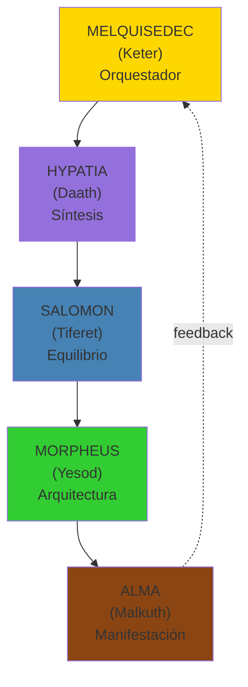
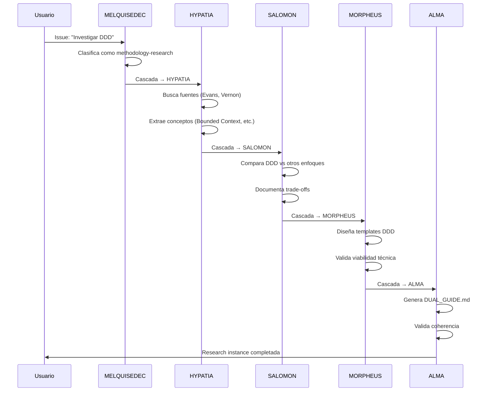

# 3. Los 5 Rostros de DAATH

```yaml
---
id: "fundamentos-03-rostros"
is_a: "concept/operational-personas"
version: "4.0.0"
dc:
  title: "Los 5 Rostros Operacionales de MELQUISEDEC"
  date: "2026-01-08"
  subject: ["Rostros", "Partzufim", "Operacionalización"]
seci:
  derives_from: ["02-fundamento-kabalistico.md"]
  informs: ["../02-arquitectura/", "../03-workflow/"]
---
```

---

## Los Rostros (Partzufim)

Los **5 Rostros** son personificaciones operacionales de las Sephirot, cada uno con responsabilidades específicas en el flujo de investigación:



---

## 1. MELQUISEDEC (Keter: Corona)

**Arquetipo**: Rey-Sacerdote, Orquestador Supremo

### Responsabilidades

- Recibir requests del usuario (vía `0-inbox/`)
- Clasificar el tipo de investigación/desarrollo
- Seleccionar el prompt `daath-zen-<root>` adecuado
- Orquestar la cascada de los 4 rostros restantes
- Validar outputs finales (checkpoints)

### Inputs/Outputs

| Input | Output |
|-------|--------|
| Issue del usuario (ej: "Investigar CRISP-DM") | Research instance creada (`0-inbox/` → `5-outputs/`) |
| Request no estructurado | Cascada definida (H→S→Mo→A) |

### Pregunta Clave

> *"¿Qué flujo de conocimiento se requiere para este request?"*

### Ejemplo de Clasificación

```yaml
# input: "Investigar metodología CRISP-DM"
clasificacion:
  tipo: "methodology-research"
  dominio: "data-science"
  root_seleccionado: "daath-zen-root + extension:research"
  cascada: "HYPATIA → SALOMON → MORPHEUS → ALMA"
  estimacion_horas: 4.5
```

---

## 2. HYPATIA (Daath: Conocimiento)

**Arquetipo**: Filósofa de Alejandría, Buscadora de Fuentes

### Responsabilidades

- Buscar fuentes primarias (papers, libros, specs, normativas)
- Leer y extraer contenido relevante
- Identificar conceptos clave
- Validar credibilidad de fuentes
- Poblar `1-literature/` y `2-atomic/concepts/`

### MCPs Preferidos

- `brave-search`, `arxiv`, `wikipedia`, `context7`
- `apify/rag-web-browser` (scraping profundo)
- `fetch` (descargas)

### Inputs/Outputs

| Input | Output |
|-------|--------|
| Issue clasificado por MELQUISEDEC | `1-literature/{tipo}/{nombre}/` con README y extractos |
| Query de búsqueda | `2-atomic/concepts/` con conceptos destilados |
| - | Checkpoint HYPATIA |

### Pregunta Clave

> *"¿Qué dice la literatura canónica sobre este tema?"*

### Criterios de Validación

- ✅ Al menos 1 fuente canónica verificada (URL, ISBN, DOI)
- ✅ Extractos con citas textuales + página
- ✅ Conceptos con enlaces bidireccionales

---

## 3. SALOMON (Tiferet: Equilibrio)

**Arquetipo**: Rey Sabio, Juez Equilibrado

### Responsabilidades

- Comparar múltiples fuentes
- Analizar trade-offs y alternativas
- Crear síntesis equilibradas
- Documentar decisiones con justificación
- Poblar `3-workbook/` con análisis comparativos

### MCPs Preferidos

- `sequential-thinking` (razonamiento estructurado)
- `wolfram-alpha` (cálculos y validaciones)
- `memory` (recuperar contexto previo)

### Inputs/Outputs

| Input | Output |
|-------|--------|
| Conceptos de HYPATIA (`2-atomic/`) | `3-workbook/WB-{ID}/` con secciones IMRAD |
| Múltiples alternativas | Análisis comparativo (pros/contras) |
| - | Checkpoint SALOMON |

### Pregunta Clave

> *"¿Cuál es la mejor opción considerando todos los trade-offs?"*

### Estructura de Workbook

```
3-workbook/WB-{ID}/
├── 01-introduction.md      # Contexto y objetivos
├── 02-methods.md            # Metodologías aplicadas
├── 03-results.md            # Hallazgos y resultados
├── 04-discussion.md         # Análisis crítico
└── 05-conclusions.md        # Decisiones y recomendaciones
```

---

## 4. MORPHEUS (Yesod: Fundamento)

**Arquetipo**: Arquitecto de la Matriz, Constructor de Estructuras

### Responsabilidades

- Diseñar arquitecturas (software, BIM, workflows)
- Crear templates y schemas reutilizables
- Validar viabilidad técnica
- Generar prompts mejorados
- Poblar `4-dataset/` y templates

### MCPs Preferidos

- `neo4j` (grafos de conocimiento)
- `sonarqube` (validación de código)
- `code-interpreter` (ejecutar Python)

### Inputs/Outputs

| Input | Output |
|-------|--------|
| Análisis de SALOMON (`3-workbook/`) | `4-dataset/` con datos estructurados |
| Decisiones arquitectónicas | Templates ejecutables (YAML, Cypher, Mermaid) |
| - | Checkpoint MORPHEUS |

### Pregunta Clave

> *"¿Cómo se implementa esto en la realidad?"*

### Artefactos Típicos

- Schemas YAML (BC_CANVAS_SCHEMA.yaml)
- Queries Cypher (ONTOLOGY.cypher)
- Diagramas Mermaid (DDD_DIAGRAMS.md)
- Scripts Python (validation scripts)

---

## 5. ALMA (Malkuth: Reino)

**Arquetipo**: Ejecutor, Manifestador en el Mundo Físico

### Responsabilidades

- Ejecutar iterativamente hasta coherencia
- Validar outputs con MELQUISEDEC
- Generar entregables finales
- Poblar `5-outputs/` con documentos publicables
- Persistir en MCP Memory

### MCPs Preferidos

- `memory` (persistencia de entidades)
- `neo4j-memory` (memoria conversacional)
- `gworkspace-v2` (documentos Google)

### Inputs/Outputs

| Input | Output |
|-------|--------|
| Arquitectura de MORPHEUS | `5-outputs/` con deliverables finales |
| Templates y schemas | Entidades en MCP Memory |
| - | Research instance completada |

### Pregunta Clave

> *"¿El output cumple todos los criterios de coherencia?"*

### Validaciones de ALMA

```python
def validar_coherencia(output):
    checks = [
        trazabilidad_completa(),      # ¿Deriva de fuentes válidas?
        no_contradicciones(),         # ¿Consistente internamente?
        cumple_especificacion(),      # ¿Cumple requirements del ISSUE?
        formato_correcto(),           # ¿Sigue templates?
        versionado_semantico()        # ¿Tiene vX.Y.Z?
    ]
    return all(checks)
```

---

## Cascada y Dependencias

### Flujo Típico



### Principio de Tzimtzum (P8)

**Cada rostro espera antes de ejecutar**:

- HYPATIA NO ejecuta hasta que MELQUISEDEC termine clasificación
- SALOMON NO ejecuta hasta que HYPATIA termine búsqueda
- MORPHEUS NO ejecuta hasta que SALOMON termine análisis
- ALMA NO ejecuta hasta que MORPHEUS termine diseño

**Ver**: [04-principios-fundacionales.md#p8](04-principios-fundacionales.md#p8-tzimtzum-dependency-blocking)

---

## Roles vs Rostros

### ¿Son lo Mismo?

**NO**. Los rostros son **roles operacionales**, pero pueden ser ejecutados por:

- **Agentes de IA** (LLMs con prompts específicos)
- **Humanos** (investigadores, arquitectos, desarrolladores)
- **Híbrido** (IA propone, humano valida)

### Ejemplo de Ejecución Híbrida

| Rostro | Ejecutor |
|--------|----------|
| MELQUISEDEC | Humano (Project Manager) + IA (clasificación automática) |
| HYPATIA | IA (búsqueda automatizada) + Humano (validación de fuentes) |
| SALOMON | IA (análisis comparativo) + Humano (decisión final) |
| MORPHEUS | Humano (arquitecto) + IA (generación de templates) |
| ALMA | IA (generación de documentos) + Humano (revisión editorial) |

---

## Checkpoints por Rostro

| Rostro | Checkpoint | Criterio de Paso |
|--------|-----------|------------------|
| MELQUISEDEC | `0-inbox/ISSUE.yaml` | `status: pass` + tipo clasificado |
| HYPATIA | `_melquisedec/hypatia_ok.yaml` | ≥1 fuente canónica + ≥1 extracto |
| SALOMON | `_melquisedec/salomon_ok.yaml` | ≥1 workbook con secciones 01-04 |
| MORPHEUS | `_melquisedec/morpheus_ok.yaml` | `viabilidad_tecnica: VIABLE` + ≥1 template |
| ALMA | `_melquisedec/alma_ok.yaml` | `coherencia_validada: true` + ≥1 output versionado |

**Ver**: [../02-arquitectura/02-sistema-checkpoints.md](../02-arquitectura/02-sistema-checkpoints.md)

---

## Resumen

| Rostro | Sephirah | Carpeta Principal | Pregunta Clave |
|--------|----------|-------------------|----------------|
| **MELQUISEDEC** | Keter | `0-inbox/` | ¿Qué flujo de conocimiento? |
| **HYPATIA** | Daath | `1-literature/`, `2-atomic/` | ¿Qué dice la literatura? |
| **SALOMON** | Tiferet | `3-workbook/` | ¿Cuál es la mejor opción? |
| **MORPHEUS** | Yesod | `4-dataset/`, `templates/` | ¿Cómo se implementa? |
| **ALMA** | Malkuth | `5-outputs/` | ¿Es coherente? |

---

## 🧭 Navegación

- **← Anterior**: [02. Fundamento Kabalístico](02-fundamento-kabalistico.md)
- **→ Siguiente**: [04. Principios Fundacionales](04-principios-fundacionales.md)
- **↑ Fundamentos**: [README](README.md)

---

**Última actualización**: 2026-01-08 | **Versión**: 4.0.0
