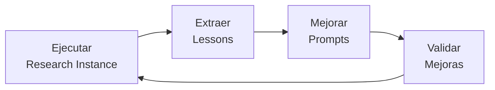
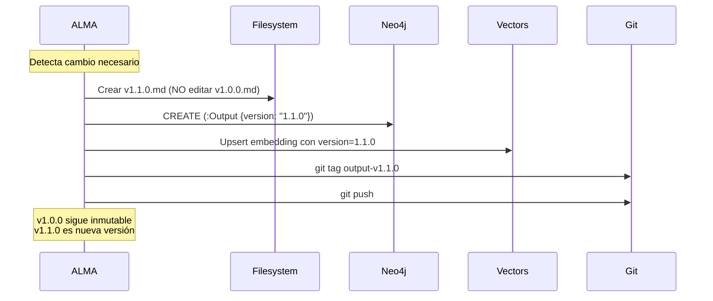
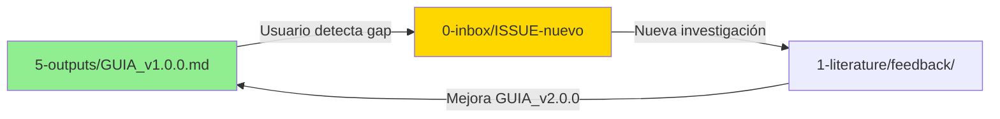

# 4. Principios Fundacionales (P1-P10)

```yaml
---
id: "fundamentos-04-principios"
is_a: "doctrine/principles"
version: "4.0.0"
dc:
  title: "Los 10 Principios Fundacionales de MELQUISEDEC"
  date: "2026-01-08"
  subject: ["Principios", "Doctrina", "Reglas Operacionales"]
seci:
  derives_from: ["01-que-es-melquisedec.md", "02-fundamento-kabalistico.md"]
  informs: ["../02-arquitectura/", "../03-workflow/", "../04-implementacion/"]
---
```

---

## Los 10 Principios

| # | Principio | Esencia |
|---|-----------|---------|
| **P1** | Síntesis Metodológica | MELQUISEDEC SINTETIZA y ORQUESTA metodologías existentes |
| **P2** | Autopoiesis por Diseño | La metodología se auto-mejora mediante lessons learned |
| **P3** | Issue-Driven Everything | Todo trabajo parte de un ISSUE explícito con metadata HKM |
| **P4** | Arquitectura de Prompts por Capas | Prompts jerarquizados: root → type → instance |
| **P5** | Validación Continua | Cada rostro valida su salida (checkpoints) |
| **P6** | Trazabilidad Explícita | Toda decisión/concepto/output es trazable hasta su fuente |
| **P7** | Recursión Fractal | La estructura se repite a diferentes escalas |
| **P8** | Tzimtzum (Dependency Blocking) | Cada etapa espera dependencias antes de ejecutar |
| **P9** | Outputs como Snapshots Inmutables | Los outputs publicados son inmutables, cambios = nueva versión |
| **P10** | Feedback Loops via Inbox Multinivel | Los outputs generan nuevos issues (retroalimentación) |

---

## P1: Síntesis Metodológica

**Enunciado**: MELQUISEDEC NO inventa metodologías. SINTETIZA y ORQUESTA metodologías existentes.

### Ejemplos

- Usa **CRISP-DM** para proyectos de datos
- Usa **Scrum** para desarrollo ágil
- Usa **DDD** para diseño de software
- Usa **IMRAD** para papers académicos

### ❌ Anti-patrón

Crear "metodología MELQUISEDEC propia" ignorando estándares.

### ✅ Validación

Toda metodología aplicada debe tener fuente canónica citada.

---

## P2: Autopoiesis por Diseño

**Enunciado**: La metodología se auto-mejora mediante lessons learned y versionamiento de prompts.

### Mecanismos

1. `_daath/chatlog/` registra ejecuciones
2. `_daath/lessons/` extrae aprendizajes
3. `MORPHEUS` mejora prompts con lecciones
4. Prompts versionados (v1.0.0 → v1.1.0)

### Ciclo



### ❌ Anti-patrón

Prompts estáticos que nunca evolucionan.

### ✅ Validación

Cada research instance debe generar al menos 1 lesson learned.

---

## P3: Issue-Driven Everything

**Enunciado**: Todo trabajo parte de un **ISSUE** explícito con metadata HKM.

### Issue Mínimo

```yaml
---
# HKM HEADER
id: "issue-001-{tipo}-{nombre}"
is_a: "{tipo}"  # literature, research, feature, bug
permalink: "{path}"

# DUBLIN CORE
title: "{título}"
creator: ["{autor}"]
date: "{YYYY-MM-DD}"
subject: ["{keywords}"]

# MELQUISEDEC WORKFLOW
estado: "{inbox|literature|atomic|workbook|dataset|outputs}"
cascada_siguiente: "{siguiente paso}"
---
```

### ❌ Anti-patrón

Trabajo ad-hoc sin issue rastreable.

### ✅ Validación

Cada carpeta de investigación debe tener `ISSUE.yaml`.

---

## P4: Arquitectura de Prompts por Capas

**Enunciado**: Los prompts se organizan jerárquicamente:

```
daath-zen-root (universal)
  ↓
daath-zen-type (dominio: research, software, bim)
  ↓
daath-zen-instance (proyecto concreto)
```

### Ejemplo

- **Root**: `daath-zen-root.yaml` (orquestación universal)
- **Type**: `daath-zen-research.yaml` (investigación académica)
- **Instance**: `daath-zen-crisp-dm.yaml` (CRISP-DM específico)

### ❌ Anti-patrón

Un solo prompt monolítico para todo.

### ✅ Validación

Prompts deben heredar y extender, no duplicar.

---

## P5: Validación Continua (Checkpoints)

**Enunciado**: Cada rostro valida su salida antes de pasar a la siguiente cascada.

### Checkpoints por Rostro

| Rostro | Checkpoint | Archivo |
|--------|-----------|---------|
| MELQUISEDEC | Clasificación correcta | `0-inbox/ISSUE.yaml` |
| HYPATIA | Fuentes canónicas verificadas | `_melquisedec/hypatia_ok.yaml` |
| SALOMON | Análisis equilibrado | `_melquisedec/salomon_ok.yaml` |
| MORPHEUS | Arquitectura viable | `_melquisedec/morpheus_ok.yaml` |
| ALMA | Outputs coherentes | `_melquisedec/alma_ok.yaml` |

### ❌ Anti-patrón

Pasar a la siguiente etapa sin validar la actual.

### ✅ Validación

Cada checkpoint debe tener `status: pass` antes de continuar.

---

## P6: Trazabilidad Explícita

**Enunciado**: Toda decisión, concepto o output debe ser trazable hasta su fuente **en los 3 sistemas del Output Triple**.

### Arquitectura de Trazabilidad: Output Triple

MELQUISEDEC registra conocimiento en **3 dimensiones independientes**:

1. **Markdown (Filesystem)**: Archivos `.md` con metadata YAML
2. **Graph (Neo4j)**: Nodos y relaciones semánticas
3. **Vectors (Embeddings)**: Embeddings para búsqueda semántica

**Cada artefacto existe en las 3 dimensiones simultáneamente.**

### Mecanismos por Sistema

#### 1. Markdown (Filesystem)

- **HKM Header**: `id`, `is_a`, `permalink`
- **Dublin Core**: `creator`, `source`, `date`
- **SECI Model**: `derives_from`, `informs`

```yaml
---
id: "concept-bounded-context"
seci:
  derives_from: ["evans-2003-ddd"]
  informs: ["analysis-ddd-architecture"]
---
```

#### 2. Graph (Neo4j)

- Nodos: `Concept`, `Literature`, `Analysis`, `Output`
- Relaciones: `DERIVES_FROM`, `INFORMS`, `SELECTS`, `REJECTS`

```cypher
CREATE (c:Concept {id: "concept-bounded-context"})
CREATE (l:Literature {id: "evans-2003-ddd"})
CREATE (c)-[:DERIVES_FROM {page: 14}]->(l)
```

#### 3. Vectors (Embeddings)

- Metadata incluye trazabilidad completa
- Permite búsqueda semántica de artefactos relacionados

```python
{
  "id": "concept-bounded-context-embedding",
  "metadata": {
    "artifact_id": "concept-bounded-context",
    "derives_from": ["evans-2003-ddd"],
    "version": "1.0.0"
  }
}
```

### Ejemplo de Trazabilidad Completa

#### Filesystem (MD)
```
issue-003-book-ddd
  ↓ derives_from
1-literature/book/domain-driven-design/
  ↓ informs
2-atomic/concepts/bounded-context.md
  ↓ informs
3-workbook/WB-ASC-001/02-methods.md
  ↓ informs
5-outputs/CALE_ARCHITECTURE.md
```

#### Graph (Neo4j)
```cypher
MATCH path =
  (i:Issue {id: "issue-003-book-ddd"})
  -[:INFORMS]->
  (l:Literature)
  -[:INFORMS]->
  (c:Concept)
  -[:INFORMS]->
  (w:Workbook)
  -[:INFORMS]->
  (o:Output)
RETURN path
```

#### Vectors
```python
# Búsqueda semántica: "bounded context"
results = vector_store.search("bounded context architecture")
# Retorna: concept-bounded-context, analysis-ddd-architecture, output-cale-architecture
# Todos con metadata de trazabilidad
```

### ❌ Anti-patrón

- Outputs sin referencias a fuentes primarias
- Artefactos que existen en 1 o 2 sistemas (no los 3)
- Metadata de trazabilidad inconsistente entre sistemas

### ✅ Validación

1. **Grafo de trazabilidad es DAG** (acíclico dirigido)
2. **Cada artefacto existe en MD + Graph + Vector**
3. **Metadata `derives_from` coincide en los 3 sistemas**
4. **Checkpoints validan consistencia tripartita**

Ver [02-arquitectura/04-sincronizacion-knowledge.md](../02-arquitectura/04-sincronizacion-knowledge.md) para detalles técnicos.

---

## P7: Recursión Fractal

**Enunciado**: La estructura de research instance se repite a diferentes escalas.

### Niveles Fractales

```
Organización/
├── Proyecto A/  # Research instance nivel 1
│   ├── 0-inbox/
│   ├── 1-literature/
│   │   └── book/ddd/  # Research instance nivel 2
│   │       ├── 0-inbox/
│   │       ├── 2-atomic/
│   │       └── 5-outputs/
│   └── 5-outputs/
```

### Regla

Cualquier artefacto en `1-literature/` puede convertirse en research instance independiente si requiere profundidad.

### ❌ Anti-patrón

Forzar todo a un solo nivel.

### ✅ Validación

Estructura `0-inbox/` → `5-outputs/` debe repetirse en cada nivel.

---

## P8: Tzimtzum (Dependency Blocking)

**Enunciado**: Cada etapa aplica una "contracción operativa" (espera) ante dependencias que deben cumplirse antes de generar el artifact que consumirá la siguiente etapa.

### Inspiración Kabalística

**Tzimtzum** = Contracción intencional para crear espacio y evitar expansión prematura.

### Regla de decisión (Operativa)
- **¿La actividad genera un ARTIFACT consumido por el siguiente rostro?**
  - **Sí** → *NOT Tzimtzum* (permitir trabajo preparatorio en paralelo, pero la **fase productiva** que genera el artifact debe respetar el checkpoint y no publicar hasta validación).
  - **No** → *Tzimtzum* (esperar al rostro anterior antes de proceder).

> Si la respuesta es incierta, por defecto **aplicar Tzimtzum** hasta clarificar en el issue o checklist.

### Excepciones
- **Expedite lane**: Casos críticos pueden saltarse Tzimtzum con aprobación explícita de `MELQUISEDEC` y registro del motivo y riesgos en el issue.
- **Prototipos/experimentos**: Permitidos en paralelo siempre que no produzcan outputs oficiales ni alteren trazabilidad.

### Mapeo a Kanban y Automatización
- Usar `blocked` para indicar dependencia pendiente; no liberar hasta que la dependencia se resuelva.
- Aplicar WIP limits por rostro para evitar multitarea ineficiente mientras se espera.
- Automatizar checks (CI) que validen: presencia de HKM header, `seci.derives_from` apunta a artifact existente y passing tests antes de permitir `in-progress` → `review`/`done`.

### Métricas y señales de salud
- **Tiempo medio en `blocked`** por issue (objetivo: reducir).
- **% de adherencia a Tzimtzum** (issues que respetaron handoffs).
- **MTTU (Mean Time To Unblock)** — tiempo desde `blocked` → `in-progress`.
- Registrar la **causa raíz** de cualquier bypass en `02-lessons-learned.md`.

### Ejemplo práctico
- *Investigación exploratoria (sin artifact)*: HYPATIA puede trabajar en paralelo (NO Tzimtzum obligatorio).
- *Construcción de output final*: SALOMON espera a que HYPATIA publique `2-atomic/concepts` con HKM completo (APLICAR Tzimtzum).

### Anti-patrón (a evitar)
- Saltar handoffs sin validaciones (produce artifacts inconsistentes y rompe trazabilidad).

---

## P9: Outputs como Snapshots Inmutables

**Enunciado**: Los outputs publicados son **inmutables en los 3 sistemas**. Cambios requieren nueva versión.

### Versionamiento en Output Triple

Cada artefacto tiene versión semántica **sincronizada** en los 3 sistemas:

```
MAJOR.MINOR.PATCH

MAJOR: Breaking changes (incompatibilidad)
MINOR: Nuevas features (compatible)
PATCH: Bug fixes
```

#### 1. Markdown (Filesystem)

```yaml
---
id: "output-cale-architecture"
version: "1.0.0"  # ← Versión explícita en frontmatter
---
```

Archivo versionado:
```
5-outputs/CALE_ARCHITECTURE_v1.0.0.md  ← Inmutable
5-outputs/CALE_ARCHITECTURE_v1.1.0.md  ← Nueva versión (no sobrescribir)
```

#### 2. Graph (Neo4j)

```cypher
CREATE (o:Output {
  id: "output-cale-architecture",
  version: "1.0.0",  # ← Versión en propiedades
  published: true,
  immutable: true
})

# Relaciones con versiones EXACTAS
CREATE (o)-[:PRODUCES {at_version: "1.0.0"}]->(t:Template)
CREATE (o)-[:DERIVES_FROM {at_version: "1.0.0"}]->(a:Analysis)
```

**CRÍTICO**: Relaciones deben especificar `at_version` para inmutabilidad:

```cypher
// ❌ MAL: Versión implícita (mutable)
CREATE (o)-[:PRODUCES]->(t)

// ✅ BIEN: Versión explícita (inmutable)
CREATE (o)-[:PRODUCES {at_version: "1.0.0"}]->(t)
```

#### 3. Vectors (Embeddings)

```python
{
  "id": "output-cale-architecture-v1.0.0-embedding",  # ← Versión en ID
  "metadata": {
    "artifact_id": "output-cale-architecture",
    "version": "1.0.0",  # ← Versión en metadata
    "immutable": true,
    "published_at": "2026-01-08T15:30:00Z"
  }
}
```

### Sincronización de Versiones

El **reconciliador** garantiza que versiones coincidan:

```python
# Checkpoint valida consistencia
md_version = "1.0.0"       # De frontmatter
graph_version = "1.0.0"    # De nodo Neo4j
vector_version = "1.0.0"   # De metadata

assert md_version == graph_version == vector_version
```

Ver [02-arquitectura/04-sincronizacion-knowledge.md](../02-arquitectura/04-sincronizacion-knowledge.md) para detalles técnicos.

### Git Tags para Inmutabilidad

```bash
# ALMA ejecuta al publicar
git tag output-cale-architecture-v1.0.0
git push origin output-cale-architecture-v1.0.0
```

Git tag es **punto de anclaje inmutable** del output.

### Ejemplo: Publicar Nueva Versión



### ❌ Anti-patrón

- Editar outputs publicados sin cambiar versión
- Sobrescribir archivos versionados
- Relaciones sin `at_version` (versionamiento implícito)
- Versiones desincronizadas entre MD, Graph, Vector

### ✅ Validación

1. **Filesystem**: Archivos con `_v{x.y.z}.md` no se editan
2. **Graph**: Nodos `Output` tienen `immutable: true`
3. **Vectors**: Embeddings incluyen `version` en metadata
4. **Git**: Tag existe para cada versión publicada
5. **Checkpoint**: Versiones coinciden en los 3 sistemas

### Excepción: Typos y Hotfixes

Para correcciones menores (typos):

```
v1.0.0 → v1.0.1 (PATCH)
```

Proceso:
1. Crear `output_v1.0.1.md` (no editar v1.0.0)
2. Actualizar versión en Neo4j y Vector
3. Git tag `output-v1.0.1`

**NUNCA** editar `v1.0.0` directamente.

---

## P10: Feedback Loops via Inbox Multinivel

**Enunciado**: Los outputs pueden generar nuevos issues que retroalimentan el sistema.

### Flujo de Feedback



### Mecanismos

- `0-inbox/` acepta issues desde outputs
- `_daath/lessons/` retroalimenta prompts
- Versionamiento de prompts (`v1.0.0` → `v2.0.0`)

### ❌ Anti-patrón

Sistema cerrado sin feedback.

### ✅ Validación

Cada output debe tener link a "Reportar issue" → `0-inbox/`.

---

## Matriz de Aplicación de Principios

| Principio | Caso 1A (Literatura) | Caso 1B (Investigación) | Caso 2 (Prompts) |
|-----------|---------------------|------------------------|------------------|
| **P1** | Cita DDD como metodología externa | Estudia DDD en profundidad | Sintetiza best practices |
| **P2** | Lessons de extracción → mejores prompts | Lessons → DUAL_GUIDE | Investiga la propia metodología |
| **P3** | `issue-003-book-ddd` | `RES_C.2.2_SPECIFICATION.yaml` | `Q001-Q004` como issues formales |
| **P4** | Usa `daath-zen-root-research` | Usa `daath-zen-root-methodology` | Define arquitectura hybrid |
| **P5** | Checkpoint HYPATIA | 5 checkpoints (M, H, S, Mo, A) | Experimentos validan |
| **P6** | `derives_from: issue-003` | Grafo Neo4j con 70+ nodos | SECI mode en cada question |
| **P7** | DDD puede ser instance independiente | C.2.2_DDD ES research instance | Q001-Q004 pueden ser sub-investigaciones |
| **P8** | SALOMON espera extractos | Cascada estricta H→S→Mo→A | Experimentos secuenciales |
| **P9** | `bounded-context-v1.0.md` inmutable | `DUAL_GUIDE-v1.0.md` versionado | `GUIA_v2.0.0.md` (nueva versión) |
| **P10** | Gap en WB → nuevo issue | DUAL_GUIDE genera issues | Q004 retroalimenta pattern registry |

---

## Resumen Ejecutivo

**Los 10 Principios garantizan que MELQUISEDEC sea**:

- ✅ **Sintético** (P1): Orquesta, no inventa
- ✅ **Autopoiético** (P2): Se auto-mejora
- ✅ **Trazable** (P3, P6): Todo issue tiene origen y destino
- ✅ **Modular** (P4, P7): Componible a diferentes escalas
- ✅ **Validado** (P5): Checkpoints garantizan calidad
- ✅ **Ordenado** (P8): Dependencias explícitas
- ✅ **Inmutable** (P9): Outputs versionados
- ✅ **Adaptativo** (P10): Feedback continuo

---

## 🧭 Navegación

- **← Anterior**: [03. Los 5 Rostros de DAATH](03-cinco-rostros.md)
- **→ Siguiente**: [02. Arquitectura Operativa](../02-arquitectura/README.md)
- **↑ Fundamentos**: [README](README.md)

---

**Última actualización**: 2026-01-08 | **Versión**: 4.0.0
