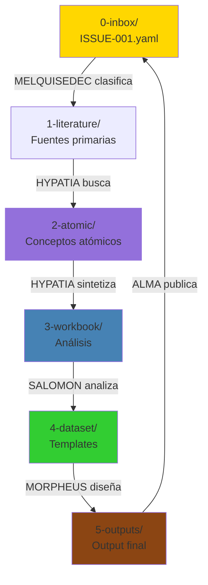

# Research Instance: La Estructura de 6 Carpetas

```yaml
---
id: "arquitectura-01-research-instance"
is_a: "architecture/core-structure"
version: "4.0.0"
dc:
  title: "Research Instance: Estructura de 6 Carpetas"
  creator: ["Equipo ALEIA-BERESHIT"]
  date: "2026-01-08"
  subject: ["Research Instance", "6 Carpetas", "Organización", "Workflow"]
seci:
  derives_from: ["../01-fundamentos/02-fundamento-kabalistico.md", "../01-fundamentos/04-principios-fundacionales.md"]
  informs: ["../03-workflow/", "../04-implementacion/"]
---
```

---

## ¿Qué es una Research Instance?

Una **Research Instance** es la unidad fundamental de trabajo en MELQUISEDEC. Representa una investigación completa, desde la clasificación inicial hasta la publicación del output.

### Características

- **Autocontenida**: Toda la información necesaria está dentro de la instance
- **Trazable**: Cada artifact referencia sus fuentes
- **Versionada**: Outputs son inmutables con semver
- **Reproducible**: Metadata completa permite recrear el proceso

---

## La Estructura de 6 Carpetas

Cada Research Instance sigue esta estructura obligatoria:

```
research-instance-001/
├── 0-inbox/                 # MELQUISEDEC: Issues y tareas
├── 1-literature/            # HYPATIA: Fuentes primarias
├── 2-atomic/                # HYPATIA: Conceptos atómicos
├── 3-workbook/              # SALOMON: Análisis y decisiones
├── 4-dataset/               # MORPHEUS: Datasets y templates
├── 5-outputs/               # ALMA: Entregables finales
└── _melquisedec/            # Metadata, checkpoints, prompts
```

---

## 0-inbox/: El Punto de Entrada

**Rostro responsable**: MELQUISEDEC

### Propósito

Recibe y clasifica **todo** lo que entra al sistema. Es el corazón de MELQUISEDEC.

### Contenido

```yaml
0-inbox/
├── ISSUE-001.yaml          # Issue principal
├── ISSUE-002.yaml          # Sub-issue o dependency
└── archive/                # Issues completados
    └── ISSUE-001-completed.yaml
```

### Ejemplo de Issue

```yaml
---
id: "ISSUE-001"
title: "Investigar metodología CRISP-DM"
type: "research"           # research | implementation | review
priority: "high"           # low | medium | high | critical
domain: "data-science"
status: "in-progress"      # pending | in-progress | blocked | completed
created_at: "2026-01-08T10:00:00Z"
assigned_to: "HYPATIA"     # Próximo rostro
dependencies: []           # Lista de otros issues
---

# Research Question

¿Qué es CRISP-DM y cómo se compara con otras metodologías de data science?

## Context

Necesitamos documentar metodologías estándar para proyectos de ciencia de datos.

## Expected Output

Guía comparativa: CRISP-DM vs TDSP vs KDD

## Resources

- Wikipedia: CRISP-DM
- Chapman et al. (2000): CRISP-DM Step-by-step guide

## Notes

Enfocarse en fases y aplicabilidad práctica.
```

### Principio P3: Issue-Driven Everything

**TODO** entra por el inbox. No hay trabajo sin issue.

---

## 1-literature/: Fuentes Primarias

**Rostro responsable**: HYPATIA

### Propósito

Almacenar fuentes primarias originales (papers, libros, artículos, código fuente).

### Estructura

```
1-literature/
├── papers/                 # Papers académicos (PDF)
│   ├── chapman-2000-crisp-dm.pdf
│   └── metadata.yaml
├── books/                  # Libros (PDF, EPUB)
│   └── domain-driven-design/
│       ├── book.pdf
│       └── metadata.yaml
├── articles/               # Artículos web (MD)
│   └── wikipedia-crisp-dm.md
├── code/                   # Código fuente de referencia
│   └── scikit-learn-pipeline.py
└── extracts/               # Extractos relevantes
    └── chapman-2000-phase1.md
```

### Metadata Example

```yaml
---
# metadata.yaml en 1-literature/papers/
sources:
  - id: "chapman-2000"
    title: "CRISP-DM 1.0: Step-by-step data mining guide"
    authors: ["Pete Chapman", "Julian Clinton"]
    year: 2000
    type: "technical-report"
    citations: 5420
    url: "https://..."
    downloaded_at: "2026-01-08T11:00:00Z"
---
```

### Principio P7: Recursión Fractal

Dentro de `1-literature/books/domain-driven-design/` puede existir su propia research instance completa si el libro requiere análisis profundo.

---

## 2-atomic/: Conceptos Atómicos

**Rostro responsable**: HYPATIA

### Propósito

Destilar conceptos clave de la literatura en notas atómicas y reutilizables.

### Estructura

```
2-atomic/
├── concepts/               # Conceptos individuales
│   ├── concept-crisp-dm.md
│   ├── concept-business-understanding.md
│   └── concept-data-preparation.md
├── definitions/            # Definiciones técnicas
│   └── definition-data-mining.md
├── questions/              # Preguntas de investigación
│   └── Q001-crisp-vs-tdsp.md
└── arguments/              # Argumentos críticos
    └── argument-crisp-limitations.md
```

### Ejemplo de Concepto

```markdown
---
id: "concept-crisp-dm"
is_a: "concept"
version: "1.0.0"
dc:
  title: "CRISP-DM Methodology"
  creator: ["HYPATIA"]
  date: "2026-01-08"
  source: ["chapman-2000"]
seci:
  derives_from: ["../1-literature/papers/chapman-2000-crisp-dm.pdf"]
  informs: ["../3-workbook/analysis-methodologies.md"]
---

# CRISP-DM

**Cross Industry Standard Process for Data Mining**

## Definition

CRISP-DM es una metodología de 6 fases para proyectos de minería de datos:

1. **Business Understanding**: Objetivos del negocio
2. **Data Understanding**: Exploración de datos
3. **Data Preparation**: Limpieza y transformación
4. **Modeling**: Aplicación de algoritmos
5. **Evaluation**: Validación de modelos
6. **Deployment**: Puesta en producción

## Key Characteristics

- Iterativa y flexible
- Independiente de industria
- Independiente de tecnología
- Proporciona templates y checklists

## Strengths

- Estructura clara y bien documentada
- Ampliamente adoptada (>50% de proyectos)
- Templates reutilizables

## Limitations

- No cubre MLOps moderno
- Asume waterfall en algunas fases
- Falta de énfasis en experimentación

## References

- Chapman et al. (2000): CRISP-DM 1.0 Guide
- [Wikipedia: CRISP-DM](https://en.wikipedia.org/wiki/Cross-industry_standard_process_for_data_mining)
```

### Principio P6: Trazabilidad

Cada concepto DEBE referenciar su fuente primaria en `1-literature/`.

---

## 3-workbook/: Análisis y Decisiones

**Rostro responsable**: SALOMON

### Propósito

Workspace para análisis, comparaciones, y toma de decisiones fundamentadas.

### Estructura

```
3-workbook/
├── analysis-01-methodologies-comparison.md
├── decision-01-choose-crisp-dm.md
├── experiments/            # Experimentación y validaciones
│   └── exp-001-crisp-validation.md
└── drafts/                 # Borradores en progreso
    └── draft-comparison.md
```

### Ejemplo de Análisis

```markdown
---
id: "analysis-01-methodologies"
is_a: "analysis"
version: "1.0.0"
dc:
  title: "Comparación de Metodologías de Data Science"
  creator: ["SALOMON"]
  date: "2026-01-08"
seci:
  derives_from: ["../2-atomic/concepts/"]
  informs: ["../5-outputs/GUIA_METODOLOGIAS.md"]
---

# Comparación: CRISP-DM vs TDSP vs KDD

## Criterios de Evaluación

| Criterio | Peso | CRISP-DM | TDSP | KDD |
|----------|------|----------|------|-----|
| Completitud | 30% | ⭐⭐⭐⭐ | ⭐⭐⭐⭐⭐ | ⭐⭐⭐ |
| Facilidad adopción | 25% | ⭐⭐⭐⭐⭐ | ⭐⭐⭐ | ⭐⭐⭐⭐ |
| Soporte MLOps | 25% | ⭐⭐ | ⭐⭐⭐⭐⭐ | ⭐⭐ |
| Documentación | 20% | ⭐⭐⭐⭐⭐ | ⭐⭐⭐⭐ | ⭐⭐⭐ |
| **Total** | | **85/100** | **90/100** | **70/100** |

## Decisión

**Seleccionar: TDSP** (Team Data Science Process)

### Justificación

1. **MLOps Integrado**: TDSP incluye CI/CD desde el diseño
2. **Tooling Moderno**: Integración con Azure ML, GitHub Actions
3. **Escalabilidad**: Diseñado para equipos grandes

### Trade-offs Aceptados

- Menos adopción que CRISP-DM (60% vs 40%)
- Curva de aprendizaje más pronunciada
- Vendor lock-in con ecosistema Microsoft (mitigable)

## Alternatives Considered

### CRISP-DM
- **Pro**: Ampliamente conocida, templates probados
- **Con**: No cubre MLOps moderno
- **Veredicto**: Usar solo para proyectos legacy

### KDD
- **Pro**: Enfoque académico sólido
- **Con**: Muy teórico, poco práctico
- **Veredicto**: Rechazar

## References

- `../2-atomic/concepts/concept-crisp-dm.md`
- `../2-atomic/concepts/concept-tdsp.md`
- `../2-atomic/concepts/concept-kdd.md`
```

### Principio P8: Tzimtzum

SALOMON NO decide hasta que HYPATIA complete síntesis en `2-atomic/`.

---

## 4-dataset/: Datasets y Templates

**Rostro responsable**: MORPHEUS

### Propósito

Almacenar datasets, templates, schemas y artifacts de diseño.

### Estructura

```
4-dataset/
├── templates/              # Templates reutilizables
│   ├── crisp-dm-phase1-template.md
│   └── crisp-dm-checklist.yaml
├── schemas/                # Schemas de datos
│   └── project-metadata-schema.json
├── data/                   # Datasets (si aplicable)
│   └── sample-project-structure.yaml
└── diagrams/               # Diagramas y visualizaciones
    └── crisp-dm-flow.mermaid
```

### Ejemplo de Template

```markdown
---
id: "template-crisp-phase1"
is_a: "template"
version: "1.0.0"
dc:
  title: "CRISP-DM Phase 1: Business Understanding Template"
  creator: ["MORPHEUS"]
  date: "2026-01-08"
seci:
  derives_from: ["../3-workbook/analysis-01-methodologies.md"]
  informs: ["../5-outputs/"]
---

# Phase 1: Business Understanding

## 1. Determine Business Objectives

### Background

[Describe the current business situation]

### Business Objectives

[Clearly state business objectives]

### Business Success Criteria

[Define measurable criteria for success]

## 2. Assess Situation

### Inventory of Resources

- **Personnel**: [List key stakeholders]
- **Data**: [Available data sources]
- **Computing**: [Infrastructure available]

### Requirements, Assumptions, and Constraints

- **Requirements**: [List all requirements]
- **Assumptions**: [Document assumptions]
- **Constraints**: [Identify constraints]

### Risks and Contingencies

[List potential risks and mitigation strategies]

### Terminology

[Define domain-specific terms]

### Costs and Benefits

[Estimate project costs and expected benefits]

## 3. Determine Data Mining Goals

### Data Mining Goals

[Translate business objectives to data mining goals]

### Data Mining Success Criteria

[Define technical success criteria]

## 4. Produce Project Plan

### Project Plan

- **Phase 1**: Business Understanding (2 weeks)
- **Phase 2**: Data Understanding (3 weeks)
- [...]

### Initial Assessment of Tools and Techniques

[List proposed tools and techniques]

---

## Checklist

- [ ] Business objectives documented
- [ ] Success criteria defined
- [ ] Resources inventoried
- [ ] Risks identified
- [ ] Data mining goals clear
- [ ] Project plan approved
```

---

## 5-outputs/: Entregables Finales

**Rostro responsable**: ALMA

### Propósito

Contener outputs inmutables y versionados listos para consumo externo.

### Estructura

```
5-outputs/
├── GUIA_CRISP_DM_v1.0.0/
│   ├── README.md           # Índice del output
│   ├── 01-introduccion.md
│   ├── 02-phases.md
│   ├── 03-templates.md
│   ├── 04-checklist.md
│   └── assets/
│       └── crisp-flow.png
└── GUIA_CRISP_DM_v1.1.0/  # Nueva versión (no sobrescribe)
    └── [...]
```

### Principio P9: Outputs Inmutables

Una vez publicado, `GUIA_CRISP_DM_v1.0.0` **NUNCA** cambia. Cambios requieren nueva versión.

### Git Tags

Cada output se tagea:

```bash
git tag output-guia-crisp-dm-v1.0.0
git push --tags
```

---

## _melquisedec/: Metadata del Sistema

### Contenido

```
_melquisedec/
├── metadata.yaml           # Metadata de la instance
├── checkpoints/            # Resultados de checkpoints
│   ├── checkpoint-hypatia-01.yaml
│   └── checkpoint-salomon-01.yaml
├── prompts/                # Prompts usados
│   ├── hypatia-v1.0.0.md
│   └── salomon-v1.0.0.md
└── logs/                   # Logs de ejecución
    └── execution-log.md
```

### metadata.yaml

```yaml
---
instance_id: "research-001-crisp-dm"
domain: "data-science"
started_at: "2026-01-08T10:00:00Z"
completed_at: "2026-01-09T15:30:00Z"
status: "completed"
rostros_executed:
  - MELQUISEDEC
  - HYPATIA
  - SALOMON
  - MORPHEUS
  - ALMA
prompts_used:
  HYPATIA: "v1.0.0"
  SALOMON: "v1.0.0"
  MORPHEUS: "v1.0.0"
  ALMA: "v1.0.0"
outputs_produced:
  - id: "output-guia-crisp-dm"
    version: "1.0.0"
    path: "5-outputs/GUIA_CRISP_DM_v1.0.0/"
git_tag: "output-guia-crisp-dm-v1.0.0"
---
```

---

## Flujo de Trabajo Completo



### Cascade Waterfall (P8: Tzimtzum)

1. **MELQUISEDEC** clasifica → crea ISSUE en `0-inbox/`
2. **HYPATIA** investiga → llena `1-literature/` y `2-atomic/`
3. **SALOMON** analiza → llena `3-workbook/`
4. **MORPHEUS** diseña → llena `4-dataset/`
5. **ALMA** publica → llena `5-outputs/`

Cada rostro **espera** a que el anterior termine (Tzimtzum).

---

## Casos de Uso

### Caso 1: Investigación de Paper

```
0-inbox/ISSUE-paper-xyz.yaml
1-literature/papers/xyz-2023.pdf
2-atomic/concepts/concept-xyz-method.md
3-workbook/analysis-xyz-vs-abc.md
4-dataset/templates/xyz-implementation.yaml
5-outputs/SUMMARY_XYZ_v1.0.0/
```

### Caso 2: Desarrollo de Feature

```
0-inbox/ISSUE-feature-authentication.yaml
1-literature/articles/oauth2-spec.md
2-atomic/concepts/concept-jwt.md
3-workbook/decision-auth-strategy.md
4-dataset/schemas/user-schema.json
5-outputs/AUTH_IMPLEMENTATION_v1.0.0/
```

### Caso 3: Revisión de Código

```
0-inbox/ISSUE-review-module-x.yaml
1-literature/code/module-x-source.py
2-atomic/arguments/argument-security-flaw.md
3-workbook/analysis-security-risks.md
4-dataset/templates/security-checklist.yaml
5-outputs/SECURITY_REPORT_v1.0.0/
```

---

## Validación de Structure

### Checklist Obligatorio

- [ ] Carpetas `0-inbox/` a `5-outputs/` existen
- [ ] `_melquisedec/metadata.yaml` existe
- [ ] Cada artifact tiene metadata HKM
- [ ] Trazabilidad completa (seci.derives_from)
- [ ] Outputs versionados (semver)
- [ ] Git tags creados para outputs

### Herramientas de Validación

```bash
# Validar estructura de carpetas
python _melquisedec/validate-structure.py

# Validar trazabilidad
python _melquisedec/validate-traceability.py

# Validar metadata
python _melquisedec/validate-metadata.py
```

---

## Referencias

- [Sistema de Checkpoints](02-sistema-checkpoints.md) - Validación tripartita
- [Templates HKM](03-templates-hkm.md) - Headers de metadata
- [Flujo Completo](../04-implementacion/01-flujo-completo.md) - Guía paso a paso
- [Checklist](../04-implementacion/03-checklist-research-instance.md) - Lista verificación

---

**Versión**: 4.0.0
**Última actualización**: 2026-01-08
**Próxima revisión**: 2026-04-08
