# Sistema de Checkpoints: Validación Tripartita

```yaml
---
id: "arquitectura-02-checkpoints"
is_a: "architecture/validation-system"
version: "4.0.0"
dc:
  title: "Sistema de Checkpoints con Validación Triple"
  creator: ["Equipo ALEIA-BERESHIT"]
  date: "2026-01-08"
  subject: ["Checkpoints", "Validation", "Sync", "Output Triple"]
seci:
  derives_from: ["../01-fundamentos/02-fundamento-kabalistico.md"]
  informs: ["../03-workflow/", "../04-implementacion/"]
---
```

---

## ¿Qué es un Checkpoint?

Un **checkpoint** en MELQUISEDEC es una **validación tripartita** que verifica que un rostro ha completado su trabajo correctamente **en las 3 dimensiones del conocimiento**:

1. **Markdown (Filesystem)**: ¿Se creó el archivo? ¿Tiene metadata válida?
2. **Graph (Neo4j)**: ¿Se creó el nodo? ¿Tiene relaciones correctas?
3. **Vectors (Embeddings)**: ¿Se generó el embedding? ¿Tiene metadata correcta?

### Evolución del Concepto

**Checkpoint v1.0 (ingenuo)**:
```yaml
checkpoint:
  validates:
    - file_exists: true
```

**Checkpoint v2.0 (tripartito)**:
```yaml
checkpoint:
  validates:
    markdown:
      - file_exists: true
      - metadata_valid: true
    graph:
      - node_exists: true
      - relationships_valid: true
    vectors:
      - embedding_exists: true
      - metadata_valid: true
    consistency:
      - ids_match: true
      - versions_match: true
```

---

## Principio de Tzimtzum (P8)

Cada rostro **espera** (Tzimtzum = contracción) a que el anterior pase su checkpoint antes de ejecutar:


---

## Checkpoints por Rostro

### 1. Checkpoint MELQUISEDEC (Keter)

**Responsabilidad**: Validar que el issue fue clasificado correctamente y está listo para investigación.

#### Validaciones Markdown

```yaml
checkpoint_melquisedec:
  markdown:
    location: "0-inbox/ISSUE.yaml"
    validates:
      - file_exists: true
      - yaml_valid: true
      - required_fields:
          - id
          - title
          - research_question
          - domain
          - type
          - priority
      - metadata:
          - has_hkm_header: true
          - version_format: "semantic"  # x.y.z
```

#### Validaciones Graph

```cypher
// Neo4j: Verificar nodo Issue
MATCH (i:Issue {id: $issue_id})
WHERE i.domain IS NOT NULL
  AND i.type IS NOT NULL
  AND i.priority IS NOT NULL
RETURN i

// Verificar relación con Domain
MATCH (i:Issue {id: $issue_id})-[:BELONGS_TO]->(d:Domain)
RETURN d

// Verificar relación con Type
MATCH (i:Issue {id: $issue_id})-[:HAS_TYPE]->(t:Type)
RETURN t
```

#### Validaciones Vectors

```python
# Python: Verificar embedding del research_question
def validate_melquisedec_vectors(issue_id: str) -> bool:
    vector_id = f"{issue_id}-question"

    # Verificar que existe embedding
    embedding = vector_store.get(vector_id)
    if not embedding:
        return False

    # Verificar dimensión correcta (OpenAI ada-002 = 1536)
    if len(embedding.vector) != 1536:
        return False

    # Verificar metadata
    required_metadata = ['id', 'type', 'domain', 'version']
    if not all(k in embedding.metadata for k in required_metadata):
        return False

    return True
```

#### Validaciones de Consistencia

```yaml
consistency:
  - markdown.id == graph.node.id == vector.metadata.id
  - markdown.domain == graph.relationship.domain
  - markdown.version == graph.node.version == vector.metadata.version
```

#### Ejemplo Completo

```yaml
# 0-inbox/ISSUE-001.yaml
---
id: "issue-001-crisp-dm"
title: "Investigar metodología CRISP-DM"
research_question: "¿Cómo se compara CRISP-DM con TDSP y KDD?"
domain: "data-science"
type: "methodology-research"
priority: "high"
version: "1.0.0"
---
```

**Checkpoint ejecuta**:
1. ✅ Archivo existe en `0-inbox/ISSUE-001.yaml`
2. ✅ Nodo `Issue:issue-001-crisp-dm` existe en Neo4j
3. ✅ Relación `(i)-[:BELONGS_TO]->(d:Domain {name: "data-science"})` existe
4. ✅ Embedding `issue-001-crisp-dm-question` existe con dim=1536
5. ✅ IDs coinciden en los 3 sistemas
6. ✅ Versiones coinciden (1.0.0)

**Resultado**: ✅ HYPATIA puede comenzar

---

### 2. Checkpoint HYPATIA (Daath)

**Responsabilidad**: Validar que la síntesis de conceptos es correcta y trazable.

#### Validaciones Markdown

```yaml
checkpoint_hypatia:
  markdown:
    locations:
      - "1-literature/*.pdf"
      - "1-literature/extracts/*.md"
      - "2-atomic/concept-*.md"
    validates:
      - all_concepts_have_derives_from: true
      - concepts_link_to_literature: true
      - hkm_headers_valid: true
```

#### Validaciones Graph

```cypher
// Verificar cadena de trazabilidad Literature → Extract → Concept
MATCH (c:Concept {id: $concept_id})-[:DERIVES_FROM]->(e:Extract)
      -[:EXTRACTED_FROM]->(l:Literature)
RETURN c, e, l

// Verificar que no hay conceptos huérfanos
MATCH (c:Concept)
WHERE NOT (c)-[:DERIVES_FROM]->()
RETURN count(c) AS orphan_concepts
// Debe retornar 0

// Verificar versiones
MATCH (c:Concept {id: $concept_id})
WHERE c.version IS NOT NULL
RETURN c.version
```

#### Validaciones Vectors

```python
def validate_hypatia_vectors(concept_id: str) -> bool:
    # Verificar embedding del concepto
    embedding = vector_store.get(f"{concept_id}-definition")

    # Verificar que metadata tiene derives_from
    if 'derives_from' not in embedding.metadata:
        return False

    # Verificar que derives_from coincide con Graph
    graph_sources = neo4j.query(
        "MATCH (c:Concept {id: $cid})-[:DERIVES_FROM]->(s) RETURN s.id",
        cid=concept_id
    )

    vector_sources = embedding.metadata['derives_from']

    # Deben coincidir
    return set(graph_sources) == set(vector_sources)
```

#### Ejemplo Completo

```yaml
# 2-atomic/concept-ddd-bounded-context.md
---
id: "concept-ddd-bounded-context"
title: "Bounded Context (DDD)"
version: "1.0.0"
seci:
  derives_from:
    - "1-literature/evans-2003-ddd.pdf"
    - "1-literature/extracts/evans-chapter-14.md"
---

## Definición

Un **Bounded Context** es un límite explícito dentro del cual un modelo de dominio es definido y aplicable...
```

**Graph (Neo4j)**:
```cypher
CREATE (c:Concept {
  id: "concept-ddd-bounded-context",
  title: "Bounded Context",
  version: "1.0.0"
})

CREATE (l:Literature {
  id: "evans-2003-ddd",
  title: "Domain-Driven Design"
})

CREATE (e:Extract {
  id: "evans-chapter-14",
  chapter: 14
})

CREATE (c)-[:DERIVES_FROM {created_at: "2026-01-08"}]->(e)
CREATE (e)-[:EXTRACTED_FROM]->(l)
```

**Vector**:
```python
{
  "id": "concept-ddd-bounded-context-definition",
  "vector": [0.123, 0.456, ...],  # 1536 dims
  "metadata": {
    "id": "concept-ddd-bounded-context",
    "type": "concept",
    "version": "1.0.0",
    "derives_from": ["evans-2003-ddd", "evans-chapter-14"]
  }
}
```

**Checkpoint ejecuta**:
1. ✅ Archivo `concept-ddd-bounded-context.md` existe
2. ✅ Nodo `Concept` existe con relaciones `DERIVES_FROM`
3. ✅ Embedding existe con metadata correcta
4. ✅ `derives_from` coincide en MD y Graph y Vector
5. ✅ Versiones coinciden

**Resultado**: ✅ SALOMON puede comenzar

---

### 3. Checkpoint SALOMON (Tiferet)

**Responsabilidad**: Validar que el análisis tiene decisión fundamentada y alternativas documentadas.

#### Validaciones Markdown

```yaml
checkpoint_salomon:
  markdown:
    location: "3-workbook/analysis-*.md"
    validates:
      - has_decision: true
      - has_alternatives: true
      - has_justification: true
      - decision_is_traceable: true
```

#### Validaciones Graph

```cypher
// Verificar nodo Analysis con decisión
MATCH (a:Analysis {id: $analysis_id})
WHERE a.decision IS NOT NULL
  AND a.justification IS NOT NULL
RETURN a

// Verificar que compara conceptos
MATCH (a:Analysis {id: $analysis_id})-[:COMPARES]->(c:Concept)
RETURN count(c) AS compared_concepts
// Debe retornar >= 2

// Verificar relación SELECTS
MATCH (a:Analysis {id: $analysis_id})-[:SELECTS]->(selected:Concept)
RETURN selected

// Verificar relaciones REJECTS
MATCH (a:Analysis {id: $analysis_id})-[:REJECTS {reason: r}]->(rejected:Concept)
RETURN rejected, r
```

#### Ejemplo Completo

```yaml
# 3-workbook/analysis-crisp-vs-tdsp.md
---
id: "analysis-crisp-vs-tdsp"
title: "Comparación CRISP-DM vs TDSP"
version: "1.0.0"
decision:
  selected: "CRISP-DM"
  rejected: ["TDSP", "KDD"]
  justification: "CRISP-DM tiene tooling maduro y equipo familiarizado"
---

## Alternativas Evaluadas

### CRISP-DM
- ✅ Documentación madura
- ✅ Tooling disponible (RapidMiner, KNIME)
- ✅ Equipo conoce la metodología

### TDSP (Team Data Science Process)
- ❌ Requiere Azure (vendor lock-in)
- ❌ Curva de aprendizaje 2 semanas
- ✅ Integración CI/CD

## Decisión

**Selección**: CRISP-DM

**Justificación**:
- Tooling disponible reduce tiempo de implementación
- Equipo ya tiene experiencia (reduce riesgo)
- Documentación madura facilita onboarding
```

**Graph**:
```cypher
CREATE (a:Analysis {
  id: "analysis-crisp-vs-tdsp",
  decision: "CRISP-DM",
  justification: "tooling maduro + equipo familiarizado",
  version: "1.0.0"
})

CREATE (crisp:Concept {id: "concept-crisp-dm"})
CREATE (tdsp:Concept {id: "concept-tdsp"})

CREATE (a)-[:COMPARES]->(crisp)
CREATE (a)-[:COMPARES]->(tdsp)
CREATE (a)-[:SELECTS {score: 8.5}]->(crisp)
CREATE (a)-[:REJECTS {reason: "vendor lock-in", score: 6.0}]->(tdsp)
```

**Checkpoint ejecuta**:
1. ✅ Workbook existe con decisión clara
2. ✅ Nodo `Analysis` con propiedades `decision` y `justification`
3. ✅ Al menos 2 conceptos comparados
4. ✅ Relación `SELECTS` apunta a decisión
5. ✅ Relaciones `REJECTS` documentan alternativas

**Resultado**: ✅ MORPHEUS puede comenzar

---

### 4. Checkpoint MORPHEUS (Yesod)

**Responsabilidad**: Validar que los templates/schemas son reutilizables y versionados.

#### Validaciones Markdown

```yaml
checkpoint_morpheus:
  markdown:
    locations:
      - "4-dataset/*.yaml"
      - "_melquisedec/templates/*.yaml"
    validates:
      - templates_have_version: true
      - templates_have_schema: true
      - templates_are_reusable: true
```

#### Validaciones Graph

```cypher
// Verificar nodo Template
MATCH (t:Template {id: $template_id})
WHERE t.version IS NOT NULL
  AND t.schema_valid = true
RETURN t

// Verificar relación IMPLEMENTS
MATCH (t:Template)-[:IMPLEMENTS]->(p:Pattern)
RETURN p

// Verificar que template deriva de análisis
MATCH (t:Template)<-[:PRODUCES]-(a:Analysis)
RETURN a
```

#### Ejemplo Completo

```yaml
# _melquisedec/templates/crisp-dm-phases.yaml
---
id: "template-crisp-dm-phases"
version: "1.0.0"
schema: "crisp-dm-phase-v1"
derives_from: "analysis-crisp-vs-tdsp"
---

phases:
  - id: "business-understanding"
    name: "Business Understanding"
    outputs:
      - "business-objectives.md"
      - "success-criteria.yaml"

  - id: "data-understanding"
    name: "Data Understanding"
    outputs:
      - "data-exploration.ipynb"
      - "data-quality-report.md"

  # ... 4 fases más
```

**Graph**:
```cypher
CREATE (t:Template {
  id: "template-crisp-dm-phases",
  version: "1.0.0",
  schema_valid: true
})

CREATE (p:Pattern {id: "pattern-methodology-phases"})
CREATE (a:Analysis {id: "analysis-crisp-vs-tdsp"})

CREATE (t)-[:IMPLEMENTS]->(p)
CREATE (a)-[:PRODUCES]->(t)
```

**Checkpoint ejecuta**:
1. ✅ Template YAML existe y es válido
2. ✅ Nodo `Template` con versión
3. ✅ Relación `PRODUCES` desde `Analysis`
4. ✅ Template puede reutilizarse en otras investigaciones

**Resultado**: ✅ ALMA puede comenzar

---

### 5. Checkpoint ALMA (Malkuth)

**Responsabilidad**: Validar que el deliverable es publicable, usable y con versión inmutable.

#### Validaciones Markdown

```yaml
checkpoint_alma:
  markdown:
    location: "5-outputs/*.md"
    validates:
      - output_has_version: true
      - output_has_derives_from: true
      - output_references_exact_versions: true  # ⚠️ CRÍTICO
      - output_is_complete: true
```

#### Validaciones Graph

```cypher
// Verificar nodo Output
MATCH (o:Output {id: $output_id})
WHERE o.version IS NOT NULL
  AND o.published = true
RETURN o

// Verificar cadena completa de trazabilidad
MATCH path = (o:Output)-[:DERIVES_FROM*]->(root)
RETURN path, length(path) AS depth
// Debe tener al menos profundidad 3

// Verificar versiones inmutables
MATCH (o:Output)-[:PRODUCES {at_version: v}]->(t:Template)
WHERE v IS NOT NULL
RETURN t.id, v
```

#### Validaciones Vectors

```python
def validate_alma_vectors(output_id: str) -> bool:
    embedding = vector_store.get(f"{output_id}-docs")

    # Verificar que puede encontrarse semánticamente
    similar = vector_store.search(embedding.vector, top_k=5)

    # El output debe ser el resultado #1 (similar a sí mismo)
    if similar[0].id != output_id:
        return False

    # Verificar metadata completa para trazabilidad
    required = ['id', 'version', 'derives_from', 'published_at']
    return all(k in embedding.metadata for k in required)
```

#### Ejemplo Completo

```yaml
# 5-outputs/GUIA_CRISP_DM.md
---
id: "output-guia-crisp-dm"
version: "1.0.0"
published: true
published_at: "2026-01-08T15:30:00Z"

derives_from:
  # ⚠️ Versiones EXACTAS (inmutables)
  - id: "template-crisp-dm-phases"
    version: "1.0.0"  # NO "latest"
    path: "_melquisedec/templates/crisp-dm-phases.yaml"

  - id: "analysis-crisp-vs-tdsp"
    version: "1.0.0"
    path: "3-workbook/analysis-crisp-vs-tdsp.md"

  - id: "concept-crisp-dm"
    version: "1.0.0"
    path: "2-atomic/concept-crisp-dm.md"

git:
  branch: "research/crisp-dm-analysis"
  commit: "a3f5c9d"
  tag: "output-guia-crisp-dm-v1.0.0"
---

# Guía Práctica de CRISP-DM

Esta guía documenta la metodología CRISP-DM...

[contenido completo]
```

**Graph**:
```cypher
CREATE (o:Output {
  id: "output-guia-crisp-dm",
  version: "1.0.0",
  published: true,
  published_at: datetime("2026-01-08T15:30:00Z"),
  git_tag: "output-guia-crisp-dm-v1.0.0"
})

CREATE (t:Template {id: "template-crisp-dm-phases", version: "1.0.0"})
CREATE (a:Analysis {id: "analysis-crisp-vs-tdsp", version: "1.0.0"})

// Versiones EXPLÍCITAS en las relaciones
CREATE (o)-[:PRODUCES {at_version: "1.0.0"}]->(t)
CREATE (o)-[:DERIVES_FROM {at_version: "1.0.0"}]->(a)
```

**Checkpoint ejecuta**:
1. ✅ Output completo en `5-outputs/`
2. ✅ Todas las referencias tienen versión exacta (no "latest")
3. ✅ Nodo `Output` con `published = true`
4. ✅ Git tag creado: `output-guia-crisp-dm-v1.0.0`
5. ✅ Trazabilidad completa hasta literatura original
6. ✅ Vector permite encontrar el output semánticamente

**Resultado**: ✅ Ciclo completo. ALMA puede monitorear feedback.

---

## Flujo Completo de Checkpoints

```mermaid
graph TB
    Start([Usuario solicita investigación])

    M[MELQUISEDEC<br/>Clasifica]
    CM{Checkpoint M<br/>MD + Graph + Vector}

    H[HYPATIA<br/>Investiga]
    CH{Checkpoint H<br/>MD + Graph + Vector}

    S[SALOMON<br/>Analiza]
    CS{Checkpoint S<br/>MD + Graph + Vector}

    Mo[MORPHEUS<br/>Diseña]
    CMo{Checkpoint Mo<br/>MD + Graph + Vector}

    A[ALMA<br/>Publica]
    CA{Checkpoint A<br/>MD + Graph + Vector}

    End([Output publicado])
    Feedback([Monitoreo feedback])
    NewInbox([Nuevo inbox])

    Start --> M
    M --> CM
    CM -->|❌ Fallo| M
    CM -->|✅ Pasó| H

    H --> CH
    CH -->|❌ Fallo| H
    CH -->|✅ Pasó| S

    S --> CS
    CS -->|❌ Fallo| S
    CS -->|✅ Pasó| Mo

    Mo --> CMo
    CMo -->|❌ Fallo| Mo
    CMo -->|✅ Pasó| A

    A --> CA
    CA -->|❌ Fallo| A
    CA -->|✅ Pasó| End

    End --> Feedback
    Feedback -.->|Lesson learned| NewInbox
    NewInbox -.->|Autopoiesis| M

    style CM fill:#FFD700
    style CH fill:#9370DB
    style CS fill:#4682B4
    style CMo fill:#32CD32
    style CA fill:#8B4513
```



---

## Implementación Técnica

### Función Genérica de Checkpoint

```python
from typing import Dict, List, Optional
from dataclasses import dataclass

@dataclass
class CheckpointResult:
    passed: bool
    markdown_ok: bool
    graph_ok: bool
    vectors_ok: bool
    consistency_ok: bool
    errors: List[str]

def validate_checkpoint(
    rostro: str,
    artifact_id: str,
    markdown_path: str,
    graph_query: str,
    vector_id: str
) -> CheckpointResult:
    """
    Valida Output Triple para un artefacto.

    Args:
        rostro: Nombre del rostro (MELQUISEDEC, HYPATIA, etc.)
        artifact_id: ID único del artefacto
        markdown_path: Ruta al archivo MD
        graph_query: Query Cypher para validar grafo
        vector_id: ID del embedding

    Returns:
        CheckpointResult con detalles de validación
    """
    errors = []

    # 1. Validar Markdown
    markdown_ok = False
    try:
        with open(markdown_path, 'r') as f:
            content = f.read()
            metadata = extract_yaml_frontmatter(content)

            if 'id' not in metadata:
                errors.append(f"MD: Missing 'id' in frontmatter")
            elif metadata['id'] != artifact_id:
                errors.append(f"MD: ID mismatch {metadata['id']} != {artifact_id}")

            if 'version' not in metadata:
                errors.append(f"MD: Missing 'version'")

            markdown_ok = len(errors) == 0
    except FileNotFoundError:
        errors.append(f"MD: File not found {markdown_path}")

    # 2. Validar Graph
    graph_ok = False
    try:
        result = neo4j.run(graph_query, artifact_id=artifact_id)
        if not result:
            errors.append(f"Graph: Node not found {artifact_id}")
        else:
            node = result[0]
            if 'version' not in node:
                errors.append(f"Graph: Missing version property")
            graph_ok = len([e for e in errors if 'Graph' in e]) == 0
    except Exception as e:
        errors.append(f"Graph: Query failed {str(e)}")

    # 3. Validar Vectors
    vectors_ok = False
    try:
        embedding = vector_store.get(vector_id)
        if not embedding:
            errors.append(f"Vector: Embedding not found {vector_id}")
        else:
            if 'id' not in embedding.metadata:
                errors.append(f"Vector: Missing 'id' in metadata")
            elif embedding.metadata['id'] != artifact_id:
                errors.append(f"Vector: ID mismatch")

            if 'version' not in embedding.metadata:
                errors.append(f"Vector: Missing 'version' in metadata")

            vectors_ok = len([e for e in errors if 'Vector' in e]) == 0
    except Exception as e:
        errors.append(f"Vector: Retrieval failed {str(e)}")

    # 4. Validar Consistencia
    consistency_ok = False
    if markdown_ok and graph_ok and vectors_ok:
        md_version = metadata['version']
        graph_version = node['version']
        vector_version = embedding.metadata['version']

        if md_version != graph_version:
            errors.append(f"Consistency: Version mismatch MD({md_version}) != Graph({graph_version})")
        if md_version != vector_version:
            errors.append(f"Consistency: Version mismatch MD({md_version}) != Vector({vector_version})")

        consistency_ok = len([e for e in errors if 'Consistency' in e]) == 0

    passed = markdown_ok and graph_ok and vectors_ok and consistency_ok

    return CheckpointResult(
        passed=passed,
        markdown_ok=markdown_ok,
        graph_ok=graph_ok,
        vectors_ok=vectors_ok,
        consistency_ok=consistency_ok,
        errors=errors
    )
```

### Uso

```python
# Checkpoint HYPATIA
result = validate_checkpoint(
    rostro="HYPATIA",
    artifact_id="concept-ddd-bounded-context",
    markdown_path="2-atomic/concept-ddd-bounded-context.md",
    graph_query="MATCH (c:Concept {id: $artifact_id})-[:DERIVES_FROM]->() RETURN c",
    vector_id="concept-ddd-bounded-context-definition"
)

if result.passed:
    print("✅ Checkpoint HYPATIA pasado. SALOMON puede continuar.")
else:
    print(f"❌ Checkpoint HYPATIA falló:")
    for error in result.errors:
        print(f"  - {error}")
    # Re-ejecutar HYPATIA o abortar
```

---

## Tabla Resumen de Checkpoints

| Rostro | Input | Output | Valida MD | Valida Graph | Valida Vectors | Pasa a |
|--------|-------|--------|-----------|--------------|----------------|--------|
| **MELQUISEDEC** | User request | Inbox clasificado | `0-inbox/ISSUE.yaml` | Nodo `Issue` + relaciones | Embedding de `research_question` | HYPATIA |
| **HYPATIA** | Inbox clasificado | Conceptos sintetizados | `2-atomic/concept-*.md` | Nodo `Concept` + `DERIVES_FROM` | Embeddings de definiciones | SALOMON |
| **SALOMON** | Conceptos | Análisis con decisión | `3-workbook/analysis-*.md` | Nodo `Analysis` + `SELECTS`/`REJECTS` | Embeddings de conclusiones | MORPHEUS |
| **MORPHEUS** | Decisión | Templates versionados | `4-dataset/*.yaml` | Nodo `Template` + `IMPLEMENTS` | Embeddings de schemas | ALMA |
| **ALMA** | Templates | Output publicado | `5-outputs/*.md` con versiones exactas | Nodo `Output` + `PRODUCES` + versiones | Embeddings de docs | Usuario |

---

## Conclusión

El sistema de checkpoints tripartito garantiza:

- ✅ **Integridad**: Cada artefacto existe en las 3 dimensiones
- ✅ **Consistencia**: IDs y versiones coinciden
- ✅ **Trazabilidad**: Relaciones `DERIVES_FROM` completas
- ✅ **Tzimtzum**: Cada rostro espera al anterior
- ✅ **Inmutabilidad**: Versiones exactas en outputs (P9)

**Sin checkpoints tripartitos**: Caos, inconsistencias, pérdida de trazabilidad.

**Con checkpoints tripartitos**: Sistema robusto, autopoiético, verificable.

---

## Referencias

- [01-fundamentos/02-fundamento-kabalistico.md](../01-fundamentos/02-fundamento-kabalistico.md) - Output Triple
- [01-fundamentos/04-principios-fundacionales.md](../01-fundamentos/04-principios-fundacionales.md) - P6, P8, P9
- [04-sincronizacion-knowledge.md](04-sincronizacion-knowledge.md) - Reconciliador

---

## 🧭 Navegación

- **← Anterior**: [01. Research Instance](01-research-instance.md)
- **→ Siguiente**: [03. Templates HKM](03-templates-hkm.md)
- **↑ Arquitectura**: [README](README.md)

---

**Última actualización**: 2026-01-08 | **Versión**: 4.0.0
