# Sincronización de Knowledge: Arquitectura del Reconciliador

```yaml
---
id: "arquitectura-04-sync"
is_a: "architecture/synchronization"
version: "4.0.0"
dc:
  title: "Sincronización Knowledge: Reconciliador y APIs"
  creator: ["Equipo ALEIA-BERESHIT"]
  date: "2026-01-08"
  subject: ["Sync", "Reconciler", "APIs", "Consistency"]
seci:
  derives_from: ["../01-fundamentos/02-fundamento-kabalistico.md"]
  informs: ["../04-implementacion/"]
---
```

---

## El Problema: 3 Fuentes de Verdad

MELQUISEDEC produce conocimiento en **3 sistemas independientes**:

1. **Markdown (Filesystem)**: Archivos `.md` en carpetas
2. **Graph (Neo4j)**: Nodos y relaciones en base de datos
3. **Vectors (Embeddings)**: Embeddings en vector store

### Riesgo: Inconsistencia

Sin sincronización explícita:
- ✅ MD tiene versión `1.0.0`
- ❌ Graph tiene versión `0.9.0`
- ❌ Vector no existe

**Resultado**: Sistema incoherente, trazabilidad rota, checkpoints fallan.

---

## La Solución: Output Triple + Reconciliador

### Arquitectura de Sincronización

```mermaid
graph TB
    Rostro[Rostro executa operación]
    
    WriteAPI[Write API Unificada]
    
    FS[Filesystem<br/>Markdown]
    Neo[Neo4j<br/>Graph]
    Vec[Vector Store<br/>Embeddings]
    
    Reconciler[Reconciliador<br/>Background Service]
    
    Check{Checkpoint<br/>Validación}
    
    Rostro --> WriteAPI
    WriteAPI --> FS
    WriteAPI --> Neo
    WriteAPI --> Vec
    
    FS -.-> Reconciler
    Neo -.-> Reconciler
    Vec -.-> Reconciler
    
    Reconciler -.->|Detecta inconsistencias| FS
    Reconciler -.->|Repara| Neo
    Reconciler -.->|Repara| Vec
    
    FS --> Check
    Neo --> Check
    Vec --> Check
    
    Check -->|✅ Consistente| NextRostro[Siguiente Rostro]
    Check -->|❌ Inconsistente| Reconciler
    
    style WriteAPI fill:#FFD700
    style Reconciler fill:#FF6347
    style Check fill:#32CD32
```



---

## Componente 1: Write API Unificada

### Propósito

Garantizar que **toda escritura** pasa por un único punto que actualiza los 3 sistemas.

### Firma de API

```python
from typing import Dict, Any, List, Optional
from dataclasses import dataclass
from datetime import datetime

@dataclass
class TripleWriteResult:
    """Resultado de escritura en Output Triple."""
    success: bool
    markdown_path: Optional[str]
    graph_node_id: Optional[str]
    vector_id: Optional[str]
    errors: List[str]
    timestamp: datetime

class KnowledgeWriter:
    """API unificada para escribir conocimiento en los 3 sistemas."""
    
    def __init__(
        self,
        filesystem_root: str,
        neo4j_uri: str,
        neo4j_auth: tuple,
        vector_store_client: Any
    ):
        self.fs_root = filesystem_root
        self.neo4j = Neo4jDriver(neo4j_uri, neo4j_auth)
        self.vectors = vector_store_client
    
    def write_knowledge(
        self,
        artifact_id: str,
        artifact_type: str,  # "Issue", "Concept", "Analysis", etc.
        markdown_content: str,
        graph_properties: Dict[str, Any],
        graph_relationships: List[Dict[str, Any]],
        embeddable_text: str,
        metadata: Dict[str, Any]
    ) -> TripleWriteResult:
        """
        Escribe conocimiento en los 3 sistemas de forma atómica.
        
        Args:
            artifact_id: ID único del artefacto
            artifact_type: Tipo de nodo en Neo4j
            markdown_content: Contenido completo del archivo MD
            graph_properties: Propiedades del nodo principal
            graph_relationships: Lista de relaciones a crear
            embeddable_text: Texto para generar embedding
            metadata: Metadata del embedding
        
        Returns:
            TripleWriteResult con paths/IDs creados o errores
        """
        errors = []
        md_path = None
        node_id = None
        vec_id = None
        
        try:
            # 1. Escribir Markdown
            md_path = self._write_markdown(
                artifact_id, 
                markdown_content, 
                metadata
            )
        except Exception as e:
            errors.append(f"MD write failed: {str(e)}")
        
        try:
            # 2. Escribir Graph
            node_id = self._write_graph(
                artifact_id,
                artifact_type,
                graph_properties,
                graph_relationships
            )
        except Exception as e:
            errors.append(f"Graph write failed: {str(e)}")
        
        try:
            # 3. Escribir Vector
            vec_id = self._write_vector(
                artifact_id,
                embeddable_text,
                metadata
            )
        except Exception as e:
            errors.append(f"Vector write failed: {str(e)}")
        
        success = len(errors) == 0
        
        return TripleWriteResult(
            success=success,
            markdown_path=md_path,
            graph_node_id=node_id,
            vector_id=vec_id,
            errors=errors,
            timestamp=datetime.utcnow()
        )
    
    def _write_markdown(
        self, 
        artifact_id: str, 
        content: str, 
        metadata: Dict[str, Any]
    ) -> str:
        """Escribe archivo Markdown con frontmatter."""
        import yaml
        from pathlib import Path
        
        # Construir frontmatter
        frontmatter = yaml.dump(metadata, default_flow_style=False)
        full_content = f"---\n{frontmatter}---\n\n{content}"
        
        # Determinar path según tipo
        artifact_type = metadata.get('type', 'unknown')
        folder_map = {
            'issue': '0-inbox',
            'concept': '2-atomic',
            'analysis': '3-workbook',
            'template': '4-dataset',
            'output': '5-outputs'
        }
        
        folder = folder_map.get(artifact_type, 'unknown')
        path = Path(self.fs_root) / folder / f"{artifact_id}.md"
        
        # Escribir
        path.parent.mkdir(parents=True, exist_ok=True)
        path.write_text(full_content, encoding='utf-8')
        
        return str(path)
    
    def _write_graph(
        self,
        artifact_id: str,
        artifact_type: str,
        properties: Dict[str, Any],
        relationships: List[Dict[str, Any]]
    ) -> str:
        """Escribe nodo y relaciones en Neo4j."""
        
        # 1. Crear nodo principal
        props_str = ", ".join([f"{k}: ${k}" for k in properties.keys()])
        create_query = f"""
        MERGE (n:{artifact_type} {{id: $id}})
        SET n += {{{props_str}}}
        RETURN n.id AS node_id
        """
        
        result = self.neo4j.run(create_query, id=artifact_id, **properties)
        node_id = result[0]['node_id']
        
        # 2. Crear relaciones
        for rel in relationships:
            rel_query = f"""
            MATCH (source:{artifact_type} {{id: $source_id}})
            MATCH (target:{rel['target_type']} {{id: $target_id}})
            MERGE (source)-[r:{rel['type']} {{{rel.get('properties', {})}}}]->(target)
            RETURN r
            """
            
            self.neo4j.run(
                rel_query,
                source_id=artifact_id,
                target_id=rel['target_id']
            )
        
        return node_id
    
    def _write_vector(
        self,
        artifact_id: str,
        text: str,
        metadata: Dict[str, Any]
    ) -> str:
        """Genera embedding y guarda en vector store."""
        from openai import OpenAI
        
        client = OpenAI()
        
        # Generar embedding
        response = client.embeddings.create(
            model="text-embedding-ada-002",
            input=text
        )
        
        embedding = response.data[0].embedding
        
        # Guardar en vector store (ejemplo: Pinecone)
        vector_id = f"{artifact_id}-embedding"
        
        self.vectors.upsert(
            vectors=[{
                'id': vector_id,
                'values': embedding,
                'metadata': {
                    'artifact_id': artifact_id,
                    **metadata
                }
            }]
        )
        
        return vector_id
```

---

### Uso de Write API

```python
# Ejemplo: HYPATIA escribe un concepto

writer = KnowledgeWriter(
    filesystem_root="/research/instance-001",
    neo4j_uri="bolt://localhost:7687",
    neo4j_auth=("neo4j", "password"),
    vector_store_client=pinecone_client
)

# Escribir concepto con Output Triple
result = writer.write_knowledge(
    artifact_id="concept-ddd-bounded-context",
    artifact_type="Concept",
    markdown_content="""
## Definición

Un **Bounded Context** es un límite explícito dentro del cual un modelo de dominio es definido y aplicable...

## Ejemplo

En un sistema de e-commerce:
- Bounded Context "Checkout" tiene concepto `Order` con total, items, payment
- Bounded Context "Fulfillment" tiene concepto `Order` con shipment, tracking

Son el **mismo nombre** pero **diferentes modelos**.
    """,
    graph_properties={
        'title': 'Bounded Context',
        'domain': 'software-architecture',
        'version': '1.0.0',
        'created_at': datetime.utcnow().isoformat()
    },
    graph_relationships=[
        {
            'type': 'DERIVES_FROM',
            'target_type': 'Literature',
            'target_id': 'evans-2003-ddd',
            'properties': {'page': 14}
        }
    ],
    embeddable_text="Bounded Context: explicit boundary within which a domain model is defined and applicable. Different contexts can have different models for the same entity.",
    metadata={
        'id': 'concept-ddd-bounded-context',
        'type': 'concept',
        'version': '1.0.0',
        'derives_from': ['evans-2003-ddd'],
        'seci': {
            'derives_from': ['1-literature/evans-2003-ddd.pdf']
        }
    }
)

if result.success:
    print(f"✅ Concepto escrito:")
    print(f"   MD: {result.markdown_path}")
    print(f"   Graph: {result.graph_node_id}")
    print(f"   Vector: {result.vector_id}")
else:
    print(f"❌ Errores: {result.errors}")
```

---

## Componente 2: Reconciliador (Background Service)

### Propósito

Detectar y reparar inconsistencias entre los 3 sistemas cuando ocurren fallos parciales.

### Casos de Inconsistencia

| Escenario | MD | Graph | Vector | Problema | Reparación |
|-----------|-----|-------|--------|----------|------------|
| Fallo parcial 1 | ✅ | ✅ | ❌ | Vector no se creó | Re-generar embedding |
| Fallo parcial 2 | ✅ | ❌ | ✅ | Graph no se creó | Re-crear nodo |
| Fallo parcial 3 | ❌ | ✅ | ✅ | MD no se escribió | Re-escribir archivo |
| Versión desincronizada | v1.1.0 | v1.0.0 | v1.0.0 | Actualización parcial | Propagar versión |
| Relación faltante | ✅ | ❌ DERIVES_FROM | ✅ | Relación no creada | Crear relación |

---

### Arquitectura del Reconciliador

```python
from typing import List, Dict, Any
from dataclasses import dataclass
from enum import Enum
import time
import logging

class InconsistencyType(Enum):
    MISSING_MARKDOWN = "missing_markdown"
    MISSING_GRAPH = "missing_graph"
    MISSING_VECTOR = "missing_vector"
    VERSION_MISMATCH = "version_mismatch"
    MISSING_RELATIONSHIP = "missing_relationship"

@dataclass
class Inconsistency:
    """Representa una inconsistencia detectada."""
    artifact_id: str
    type: InconsistencyType
    details: Dict[str, Any]
    detected_at: datetime

class KnowledgeReconciler:
    """Servicio de background para reconciliar inconsistencias."""
    
    def __init__(
        self,
        writer: KnowledgeWriter,
        check_interval_seconds: int = 60
    ):
        self.writer = writer
        self.check_interval = check_interval_seconds
        self.logger = logging.getLogger("Reconciler")
    
    def run_forever(self):
        """Loop principal del reconciliador."""
        self.logger.info("🔄 Reconciler started")
        
        while True:
            try:
                inconsistencies = self.detect_inconsistencies()
                
                if inconsistencies:
                    self.logger.warning(
                        f"⚠️  Found {len(inconsistencies)} inconsistencies"
                    )
                    self.repair_inconsistencies(inconsistencies)
                else:
                    self.logger.info("✅ All systems consistent")
                
                time.sleep(self.check_interval)
            
            except Exception as e:
                self.logger.error(f"❌ Reconciler error: {str(e)}")
                time.sleep(self.check_interval)
    
    def detect_inconsistencies(self) -> List[Inconsistency]:
        """
        Detecta inconsistencias entre MD, Graph, Vector.
        
        Estrategia:
        1. Listar todos los artifacts en MD (fuente de verdad)
        2. Para cada artifact, verificar existencia en Graph y Vector
        3. Verificar que versiones coincidan
        4. Verificar que relaciones existan
        """
        inconsistencies = []
        
        # 1. Obtener lista de artifacts desde filesystem
        artifacts = self._list_all_markdown_artifacts()
        
        for artifact in artifacts:
            artifact_id = artifact['id']
            
            # 2. Verificar Graph
            graph_node = self._get_graph_node(artifact_id)
            if not graph_node:
                inconsistencies.append(Inconsistency(
                    artifact_id=artifact_id,
                    type=InconsistencyType.MISSING_GRAPH,
                    details={'artifact': artifact},
                    detected_at=datetime.utcnow()
                ))
                continue  # No puede verificar versión si no existe
            
            # 3. Verificar Vector
            vector = self._get_vector(artifact_id)
            if not vector:
                inconsistencies.append(Inconsistency(
                    artifact_id=artifact_id,
                    type=InconsistencyType.MISSING_VECTOR,
                    details={'artifact': artifact},
                    detected_at=datetime.utcnow()
                ))
            
            # 4. Verificar versiones
            md_version = artifact.get('version')
            graph_version = graph_node.get('version')
            vector_version = vector.metadata.get('version') if vector else None
            
            if md_version != graph_version:
                inconsistencies.append(Inconsistency(
                    artifact_id=artifact_id,
                    type=InconsistencyType.VERSION_MISMATCH,
                    details={
                        'md_version': md_version,
                        'graph_version': graph_version,
                        'system': 'graph'
                    },
                    detected_at=datetime.utcnow()
                ))
            
            if md_version != vector_version:
                inconsistencies.append(Inconsistency(
                    artifact_id=artifact_id,
                    type=InconsistencyType.VERSION_MISMATCH,
                    details={
                        'md_version': md_version,
                        'vector_version': vector_version,
                        'system': 'vector'
                    },
                    detected_at=datetime.utcnow()
                ))
            
            # 5. Verificar relaciones declaradas en MD existen en Graph
            declared_derives_from = artifact.get('seci', {}).get('derives_from', [])
            actual_derives_from = self._get_graph_relationships(
                artifact_id, 
                'DERIVES_FROM'
            )
            
            for expected in declared_derives_from:
                if expected not in actual_derives_from:
                    inconsistencies.append(Inconsistency(
                        artifact_id=artifact_id,
                        type=InconsistencyType.MISSING_RELATIONSHIP,
                        details={
                            'relationship_type': 'DERIVES_FROM',
                            'target': expected
                        },
                        detected_at=datetime.utcnow()
                    ))
        
        return inconsistencies
    
    def repair_inconsistencies(self, inconsistencies: List[Inconsistency]):
        """Repara inconsistencias detectadas."""
        
        for inc in inconsistencies:
            self.logger.info(
                f"🔧 Repairing {inc.type.value} for {inc.artifact_id}"
            )
            
            try:
                if inc.type == InconsistencyType.MISSING_GRAPH:
                    self._repair_missing_graph(inc)
                
                elif inc.type == InconsistencyType.MISSING_VECTOR:
                    self._repair_missing_vector(inc)
                
                elif inc.type == InconsistencyType.VERSION_MISMATCH:
                    self._repair_version_mismatch(inc)
                
                elif inc.type == InconsistencyType.MISSING_RELATIONSHIP:
                    self._repair_missing_relationship(inc)
                
                self.logger.info(f"✅ Repaired {inc.artifact_id}")
            
            except Exception as e:
                self.logger.error(
                    f"❌ Failed to repair {inc.artifact_id}: {str(e)}"
                )
    
    def _repair_missing_graph(self, inc: Inconsistency):
        """Crea nodo en Graph basado en MD."""
        artifact = inc.details['artifact']
        
        self.writer._write_graph(
            artifact_id=inc.artifact_id,
            artifact_type=artifact['type'],
            properties={
                'version': artifact['version'],
                'title': artifact.get('title'),
                # ... otras propiedades
            },
            relationships=[]  # Se reparan por separado
        )
    
    def _repair_missing_vector(self, inc: Inconsistency):
        """Genera embedding basado en MD."""
        artifact = inc.details['artifact']
        
        # Leer contenido del MD
        md_path = self._get_markdown_path(inc.artifact_id)
        with open(md_path, 'r') as f:
            content = f.read()
        
        # Extraer texto embeddable (sin frontmatter)
        text = self._extract_embeddable_text(content)
        
        self.writer._write_vector(
            artifact_id=inc.artifact_id,
            text=text,
            metadata=artifact
        )
    
    def _repair_version_mismatch(self, inc: Inconsistency):
        """Propaga versión correcta (MD es fuente de verdad)."""
        correct_version = inc.details['md_version']
        system = inc.details['system']
        
        if system == 'graph':
            # Actualizar versión en Graph
            self.writer.neo4j.run(
                "MATCH (n {id: $id}) SET n.version = $version",
                id=inc.artifact_id,
                version=correct_version
            )
        
        elif system == 'vector':
            # Re-generar vector con versión correcta
            self._repair_missing_vector(inc)  # Regenera con metadata actual
    
    def _repair_missing_relationship(self, inc: Inconsistency):
        """Crea relación faltante en Graph."""
        rel_type = inc.details['relationship_type']
        target = inc.details['target']
        
        # Crear relación
        self.writer.neo4j.run(f"""
            MATCH (source {{id: $source_id}})
            MATCH (target {{id: $target_id}})
            MERGE (source)-[r:{rel_type}]->(target)
            RETURN r
        """, source_id=inc.artifact_id, target_id=target)
    
    # Métodos auxiliares (simplificados)
    
    def _list_all_markdown_artifacts(self) -> List[Dict[str, Any]]:
        """Lista todos los artifacts en filesystem."""
        # Implementación: escanear carpetas, parsear frontmatter
        pass
    
    def _get_graph_node(self, artifact_id: str) -> Optional[Dict]:
        """Obtiene nodo de Neo4j."""
        result = self.writer.neo4j.run(
            "MATCH (n {id: $id}) RETURN n",
            id=artifact_id
        )
        return result[0]['n'] if result else None
    
    def _get_vector(self, artifact_id: str):
        """Obtiene vector de vector store."""
        try:
            return self.writer.vectors.fetch([f"{artifact_id}-embedding"])
        except:
            return None
    
    def _get_graph_relationships(
        self, 
        artifact_id: str, 
        rel_type: str
    ) -> List[str]:
        """Obtiene IDs de nodos relacionados."""
        result = self.writer.neo4j.run(f"""
            MATCH (n {{id: $id}})-[:{rel_type}]->(target)
            RETURN target.id AS target_id
        """, id=artifact_id)
        return [r['target_id'] for r in result]
```

---

### Ejecución del Reconciliador

```python
# reconciler_service.py

import logging
from knowledge_writer import KnowledgeWriter
from knowledge_reconciler import KnowledgeReconciler

logging.basicConfig(level=logging.INFO)

# Inicializar writer
writer = KnowledgeWriter(
    filesystem_root="/research/instance-001",
    neo4j_uri="bolt://localhost:7687",
    neo4j_auth=("neo4j", "password"),
    vector_store_client=pinecone_client
)

# Inicializar reconciler
reconciler = KnowledgeReconciler(
    writer=writer,
    check_interval_seconds=60  # Chequear cada 60 segundos
)

# Ejecutar como servicio
if __name__ == "__main__":
    reconciler.run_forever()
```

**Output esperado**:
```
INFO:Reconciler:🔄 Reconciler started
INFO:Reconciler:✅ All systems consistent
[60s later]
WARNING:Reconciler:⚠️  Found 3 inconsistencies
INFO:Reconciler:🔧 Repairing missing_vector for concept-ddd-bounded-context
INFO:Reconciler:✅ Repaired concept-ddd-bounded-context
INFO:Reconciler:🔧 Repairing version_mismatch for analysis-crisp-vs-tdsp
INFO:Reconciler:✅ Repaired analysis-crisp-vs-tdsp
INFO:Reconciler:🔧 Repairing missing_relationship for output-guia-crisp-dm
INFO:Reconciler:✅ Repaired output-guia-crisp-dm
INFO:Reconciler:✅ All systems consistent
```

---

## Componente 3: Checkpoint con Reconciliación

### Integración de Checkpoint + Reconciler

```python
def checkpoint_with_reconciliation(
    artifact_id: str,
    rostro_name: str,
    reconciler: KnowledgeReconciler,
    max_retries: int = 3
) -> CheckpointResult:
    """
    Checkpoint que intenta reconciliar antes de fallar.
    
    Args:
        artifact_id: ID del artefacto a validar
        rostro_name: Nombre del rostro (para logs)
        reconciler: Instancia del reconciler
        max_retries: Intentos de reconciliación
    
    Returns:
        CheckpointResult
    """
    
    for attempt in range(max_retries):
        # Ejecutar checkpoint normal
        result = validate_checkpoint(
            rostro=rostro_name,
            artifact_id=artifact_id,
            markdown_path=f"path/to/{artifact_id}.md",
            graph_query=f"MATCH (n {{id: '{artifact_id}'}}) RETURN n",
            vector_id=f"{artifact_id}-embedding"
        )
        
        if result.passed:
            return result
        
        # Si falló, intentar reconciliar
        logging.warning(
            f"Checkpoint falló (attempt {attempt+1}/{max_retries}). "
            f"Iniciando reconciliación..."
        )
        
        # Detectar inconsistencias específicas de este artifact
        inconsistencies = reconciler.detect_inconsistencies()
        relevant = [
            inc for inc in inconsistencies 
            if inc.artifact_id == artifact_id
        ]
        
        if not relevant:
            # No hay inconsistencias detectables, fallo real
            break
        
        # Reparar
        reconciler.repair_inconsistencies(relevant)
        
        # Esperar un poco y reintentar
        time.sleep(2)
    
    # Si llegamos aquí, checkpoint falló definitivamente
    return result
```

---

## Ejemplo Completo: Flujo con Fallo Parcial

### Escenario

HYPATIA intenta escribir un concepto, pero el vector store falla.

```python
# 1. HYPATIA ejecuta Write API
writer = KnowledgeWriter(...)

result = writer.write_knowledge(
    artifact_id="concept-crisp-dm",
    artifact_type="Concept",
    markdown_content="...",
    graph_properties={...},
    graph_relationships=[...],
    embeddable_text="CRISP-DM is a methodology...",
    metadata={...}
)

# Resultado: Fallo parcial
print(result)
# TripleWriteResult(
#     success=False,
#     markdown_path="/research/.../concept-crisp-dm.md",  ✅
#     graph_node_id="concept-crisp-dm",  ✅
#     vector_id=None,  ❌
#     errors=["Vector write failed: connection timeout"],
#     timestamp=...
# )
```

```python
# 2. HYPATIA ejecuta checkpoint
checkpoint_result = checkpoint_with_reconciliation(
    artifact_id="concept-crisp-dm",
    rostro_name="HYPATIA",
    reconciler=reconciler_instance,
    max_retries=3
)

# Checkpoint detecta fallo → intenta reconciliar
# Reconciler detecta MISSING_VECTOR
# Reconciler repara: re-genera embedding
# Checkpoint re-ejecuta: ✅ Pasa

print(checkpoint_result)
# CheckpointResult(
#     passed=True,  ✅
#     markdown_ok=True,
#     graph_ok=True,
#     vectors_ok=True,  ✅ (después de reconciliación)
#     consistency_ok=True,
#     errors=[]
# )
```

**Resultado**: HYPATIA pasa checkpoint, SALOMON puede continuar.

---

## APIs de Sincronización: TypeScript/JavaScript

Para integración con MCPs en Node.js:

```typescript
// knowledge-sync.ts

import { Neo4jDriver } from 'neo4j-driver';
import { PineconeClient } from '@pinecone-database/pinecone';
import { OpenAI } from 'openai';
import * as fs from 'fs/promises';
import * as yaml from 'js-yaml';

interface TripleWriteOptions {
  artifactId: string;
  artifactType: string;
  markdownContent: string;
  graphProperties: Record<string, any>;
  graphRelationships: Array<{
    type: string;
    targetType: string;
    targetId: string;
    properties?: Record<string, any>;
  }>;
  embeddableText: string;
  metadata: Record<string, any>;
}

interface TripleWriteResult {
  success: boolean;
  markdownPath?: string;
  graphNodeId?: string;
  vectorId?: string;
  errors: string[];
}

export class KnowledgeWriter {
  constructor(
    private fsRoot: string,
    private neo4j: Neo4jDriver,
    private pinecone: PineconeClient,
    private openai: OpenAI
  ) {}

  async writeKnowledge(options: TripleWriteOptions): Promise<TripleWriteResult> {
    const errors: string[] = [];
    let mdPath: string | undefined;
    let nodeId: string | undefined;
    let vecId: string | undefined;

    // 1. Write Markdown
    try {
      mdPath = await this.writeMarkdown(
        options.artifactId,
        options.markdownContent,
        options.metadata
      );
    } catch (e) {
      errors.push(`MD write failed: ${e.message}`);
    }

    // 2. Write Graph
    try {
      nodeId = await this.writeGraph(
        options.artifactId,
        options.artifactType,
        options.graphProperties,
        options.graphRelationships
      );
    } catch (e) {
      errors.push(`Graph write failed: ${e.message}`);
    }

    // 3. Write Vector
    try {
      vecId = await this.writeVector(
        options.artifactId,
        options.embeddableText,
        options.metadata
      );
    } catch (e) {
      errors.push(`Vector write failed: ${e.message}`);
    }

    return {
      success: errors.length === 0,
      markdownPath: mdPath,
      graphNodeId: nodeId,
      vectorId: vecId,
      errors
    };
  }

  private async writeMarkdown(
    artifactId: string,
    content: string,
    metadata: Record<string, any>
  ): Promise<string> {
    const frontmatter = yaml.dump(metadata);
    const fullContent = `---\n${frontmatter}---\n\n${content}`;

    const folderMap: Record<string, string> = {
      'issue': '0-inbox',
      'concept': '2-atomic',
      'analysis': '3-workbook',
      'template': '4-dataset',
      'output': '5-outputs'
    };

    const folder = folderMap[metadata.type] || 'unknown';
    const path = `${this.fsRoot}/${folder}/${artifactId}.md`;

    await fs.mkdir(`${this.fsRoot}/${folder}`, { recursive: true });
    await fs.writeFile(path, fullContent, 'utf-8');

    return path;
  }

  private async writeGraph(
    artifactId: string,
    artifactType: string,
    properties: Record<string, any>,
    relationships: Array<any>
  ): Promise<string> {
    const session = this.neo4j.session();

    try {
      // Create node
      const createQuery = `
        MERGE (n:${artifactType} {id: $id})
        SET n += $properties
        RETURN n.id AS nodeId
      `;

      const result = await session.run(createQuery, {
        id: artifactId,
        properties
      });

      const nodeId = result.records[0].get('nodeId');

      // Create relationships
      for (const rel of relationships) {
        const relQuery = `
          MATCH (source:${artifactType} {id: $sourceId})
          MATCH (target:${rel.targetType} {id: $targetId})
          MERGE (source)-[r:${rel.type}]->(target)
          SET r += $properties
          RETURN r
        `;

        await session.run(relQuery, {
          sourceId: artifactId,
          targetId: rel.targetId,
          properties: rel.properties || {}
        });
      }

      return nodeId;
    } finally {
      await session.close();
    }
  }

  private async writeVector(
    artifactId: string,
    text: string,
    metadata: Record<string, any>
  ): Promise<string> {
    // Generate embedding
    const response = await this.openai.embeddings.create({
      model: 'text-embedding-ada-002',
      input: text
    });

    const embedding = response.data[0].embedding;

    // Upsert to Pinecone
    const vectorId = `${artifactId}-embedding`;
    const index = this.pinecone.Index('knowledge-base');

    await index.upsert([{
      id: vectorId,
      values: embedding,
      metadata: {
        artifact_id: artifactId,
        ...metadata
      }
    }]);

    return vectorId;
  }
}
```

### Uso desde MCP

```typescript
// mcp-hypatia.ts

import { KnowledgeWriter } from './knowledge-sync';

// Dentro del handler del MCP de HYPATIA
async function handleWriteConcept(request: any): Promise<any> {
  const writer = new KnowledgeWriter(
    process.env.FS_ROOT!,
    neo4jDriver,
    pineconeClient,
    openaiClient
  );

  const result = await writer.writeKnowledge({
    artifactId: request.params.conceptId,
    artifactType: 'Concept',
    markdownContent: request.params.content,
    graphProperties: {
      title: request.params.title,
      domain: request.params.domain,
      version: '1.0.0'
    },
    graphRelationships: request.params.derivesFrom.map((lit: string) => ({
      type: 'DERIVES_FROM',
      targetType: 'Literature',
      targetId: lit
    })),
    embeddableText: request.params.definition,
    metadata: {
      id: request.params.conceptId,
      type: 'concept',
      version: '1.0.0',
      derives_from: request.params.derivesFrom
    }
  });

  if (!result.success) {
    throw new Error(`Triple write failed: ${result.errors.join(', ')}`);
  }

  return {
    markdownPath: result.markdownPath,
    graphNodeId: result.graphNodeId,
    vectorId: result.vectorId
  };
}
```

---

## Conclusión

### ✅ Garantías del Sistema

Con Write API + Reconciliador:

1. **Atomicidad eventual**: Si 2/3 sistemas escriben, el reconciler completa el 3ro
2. **Consistencia garantizada**: Versiones e IDs siempre coinciden (después de reconciliación)
3. **Trazabilidad completa**: Relaciones declaradas en MD existen en Graph
4. **Auto-reparación**: Fallos transitorios se reparan automáticamente

### 🚀 Próximos Pasos

1. Implementar `KnowledgeWriter` en Python
2. Implementar `KnowledgeReconciler` como servicio
3. Desplegar reconciler en Docker/Kubernetes
4. Configurar alertas para inconsistencias persistentes
5. Crear métricas de observabilidad (Prometheus/Grafana)

---

## Referencias

- [01-fundamentos/02-fundamento-kabalistico.md](../01-fundamentos/02-fundamento-kabalistico.md) - Output Triple
- [02-sistema-checkpoints.md](02-sistema-checkpoints.md) - Validación tripartita
- [01-fundamentos/04-principios-fundacionales.md](../01-fundamentos/04-principios-fundacionales.md) - P6, P9

---

## 🧭 Navegación

- **← Anterior**: [03. Templates HKM](03-templates-hkm.md)
- **→ Siguiente**: [../03-workflow/](../03-workflow/)
- **↑ Arquitectura**: [README](README.md)

---

**Última actualización**: 2026-01-08 | **Versión**: 4.0.0
