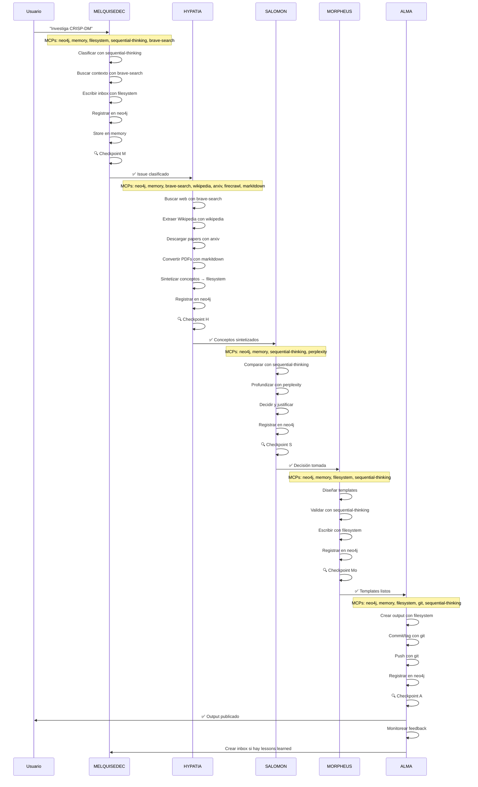

# MCPs Recomendados por Rostro

```yaml
---
id: "workflow-04-mcps"
is_a: "workflow/tools"
version: "4.0.0"
dc:
  title: "MCPs Recomendados: Herramientas para Cada Rostro"
  creator: ["Equipo ALEIA-BERESHIT"]
  date: "2026-01-08"
  subject: ["MCPs", "Tools", "Integration", "Rostros"]
seci:
  derives_from: ["../01-fundamentos/03-cinco-rostros.md"]
  informs: ["../04-implementacion/"]
---
```

---

## Principio Fundamental

> **TODOS los rostros necesitan `neo4j` + `memory` MCPs como base.**
> No es opcional. No es "solo algunos".
> Es la **fundación** del Output Triple.

Sin estos 2 MCPs base, un rostro **NO PUEDE** producir Output Triple válido:
- ❌ Sin `neo4j`: No puede escribir al grafo (P6 Trazabilidad roto)
- ❌ Sin `memory`: No puede mantener contexto entre operaciones (pérdida de coherencia)

---

## Tabla Resumen de MCPs

| Rostro | MCPs Base (obligatorios) | MCPs Especializados | Justificación |
|--------|--------------------------|---------------------|---------------|
| **MELQUISEDEC** | `neo4j`, `memory` | `filesystem`, `sequential-thinking`, `brave-search` | Clasifica inbox, busca contexto inicial, toma decisiones complejas |
| **HYPATIA** | `neo4j`, `memory` | `brave-search`, `wikipedia`, `arxiv`, `firecrawl`, `markitdown` | Investigación exhaustiva: web, papers, conversión de PDFs |
| **SALOMON** | `neo4j`, `memory` | `sequential-thinking`, `perplexity` | Análisis profundo, razonamiento multi-paso, decisiones fundamentadas |
| **MORPHEUS** | `neo4j`, `memory` | `filesystem`, `sequential-thinking` | Diseño de templates, validación de esquemas, generación estructurada |
| **ALMA** | `neo4j`, `memory` | `filesystem`, `git` (GitHub MCP), `sequential-thinking` | Publicación, commit, push, monitoreo, feedback loop |

---

## MCPs Base (Obligatorios para TODOS)

### 1. `neo4j` MCP

**Propósito**: Escribir y leer del grafo de conocimiento.

**Operaciones clave**:
- `CREATE` nodos y relaciones
- `MATCH` para verificar existencia
- `MERGE` para idempotencia
- Queries de trazabilidad

**Ejemplo de uso**:
```cypher
// MELQUISEDEC: Crear nodo Issue
CREATE (i:Issue {
  id: "issue-001-crisp-dm",
  title: "Investigar CRISP-DM",
  domain: "data-science",
  created_at: datetime()
})

// HYPATIA: Crear concepto con trazabilidad
CREATE (c:Concept {id: "concept-crisp-dm"})
CREATE (c)-[:DERIVES_FROM]->(l:Literature {id: "chapman-2000"})

// SALOMON: Registrar decisión
CREATE (a:Analysis {id: "analysis-crisp-vs-tdsp"})
CREATE (a)-[:SELECTS]->(c1:Concept {id: "concept-crisp-dm"})
CREATE (a)-[:REJECTS {reason: "vendor lock-in"}]->(c2:Concept {id: "concept-tdsp"})

// MORPHEUS: Registrar template
CREATE (t:Template {id: "template-crisp-phases", version: "1.0.0"})
CREATE (a)-[:PRODUCES]->(t)

// ALMA: Registrar output con versión inmutable
CREATE (o:Output {
  id: "output-guia-crisp",
  version: "1.0.0",
  published: true,
  git_tag: "output-guia-crisp-v1.0.0"
})
CREATE (o)-[:PRODUCES {at_version: "1.0.0"}]->(t)
```

**Por qué es obligatorio**:
- Sin grafo: No hay trazabilidad (P6 roto)
- Sin grafo: No hay relaciones semánticas
- Sin grafo: Checkpoint no puede validar consistencia

---

### 2. `memory` MCP

**Propósito**: Mantener contexto persistente entre operaciones del rostro.

**Operaciones clave**:
- `store(key, value)`: Guardar información
- `get(key)`: Recuperar información
- `list()`: Ver todo el contexto actual
- `delete(key)`: Limpiar (al finalizar)

**Ejemplo de uso**:
```python
# HYPATIA: Mantener track de papers revisados
memory.store("papers_reviewed", [
    "chapman-2000-crisp-dm",
    "wirth-2000-crisp-dm-process",
    "shearer-2000-crisp-dm-model"
])

# HYPATIA: Evitar duplicados
already_reviewed = memory.get("papers_reviewed")
if paper_id not in already_reviewed:
    review_paper(paper_id)
    memory.store("papers_reviewed", already_reviewed + [paper_id])

# SALOMON: Mantener contexto de alternativas
memory.store("alternatives_evaluated", {
    "crisp-dm": {"score": 8.5, "reason": "tooling maduro"},
    "tdsp": {"score": 6.0, "reason": "vendor lock-in"},
    "kdd": {"score": 7.0, "reason": "menos documentación"}
})

# ALMA: Track de archivos publicados
memory.store("published_files", [
    "5-outputs/GUIA_CRISP_DM.md",
    "5-outputs/TEMPLATES_CRISP_DM.yaml"
])
```

**Por qué es obligatorio**:
- Sin memoria: El rostro "olvida" entre operaciones
- Sin memoria: No puede evitar duplicados
- Sin memoria: No puede mantener estado para checkpoint
- Sin memoria: Pierde contexto de conversaciones largas

---

## MCPs Especializados por Rostro

### MELQUISEDEC (Keter): El Clasificador

**Rol**: Recibir solicitud del usuario, clasificar en dominio/tipo, decidir prioridad.

#### MCPs Especializados

##### `filesystem` MCP
**Propósito**: Leer/escribir archivos YAML en `0-inbox/`.

```python
# Crear inbox clasificado
filesystem.write_file(
    path="0-inbox/ISSUE-001.yaml",
    content=f"""---
id: {issue_id}
title: {title}
research_question: {question}
domain: {domain}
type: {type}
priority: {priority}
---"""
)
```

##### `sequential-thinking` MCP
**Propósito**: Decidir dominio/tipo cuando no es obvio.

```python
# Pregunta compleja: ¿DDD es "architecture" o "methodology"?
thinking_result = sequential_thinking.analyze(
    question="El usuario pregunta sobre DDD. ¿Es architecture pattern o software methodology?",
    steps=5
)
# Resultado: "methodology" porque enfoca procesos de diseño
```

##### `brave-search` MCP
**Propósito**: Búsqueda rápida de contexto para clasificación.

```python
# Usuario menciona "CRISP-DM" pero MELQUISEDEC no lo conoce
search_results = brave_search.search("CRISP-DM methodology")
# Extrae: "data science methodology"
# Clasifica: domain="data-science", type="methodology-research"
```

#### Checkpoint MELQUISEDEC

```yaml
validates:
  markdown: "0-inbox/ISSUE-001.yaml"
  graph: "(i:Issue {id: 'issue-001'})"
  vectors: "embedding de research_question"
```

---

### HYPATIA (Daath): La Investigadora

**Rol**: Buscar literatura, extraer conceptos, sintetizar conocimiento.

#### MCPs Especializados

##### `brave-search` MCP
**Propósito**: Búsqueda web exhaustiva.

```python
# Buscar información sobre CRISP-DM
results = brave_search.search(
    query="CRISP-DM methodology phases",
    count=20
)

for result in results:
    memory.store(f"web_source_{result.url}", result.content)
```

##### `wikipedia` MCP
**Propósito**: Extraer definiciones canónicas.

```python
# Obtener definición de Wikipedia
wiki_content = wikipedia.get_page("CRISP-DM")
concept_definition = extract_definition(wiki_content)

# Guardar como concepto atómico
filesystem.write_file(
    "2-atomic/concept-crisp-dm-wiki.md",
    content=f"""---
id: concept-crisp-dm-wiki
derives_from: https://en.wikipedia.org/wiki/CRISP-DM
---
{concept_definition}
"""
)
```

##### `arxiv` MCP
**Propósito**: Descargar papers académicos.

```python
# Buscar papers sobre CRISP-DM
papers = arxiv.search("CRISP-DM data mining")

for paper in papers:
    pdf_path = arxiv.download(paper.id)
    memory.store(f"paper_{paper.id}", pdf_path)
```

##### `firecrawl` MCP
**Propósito**: Extraer contenido estructurado de sitios web.

```python
# Crawlear documentación oficial
crawl_result = firecrawl.crawl(
    url="https://www.datascience-pm.com/crisp-dm-2/",
    max_depth=2
)

for page in crawl_result.pages:
    extract_to_atomic_notes(page.content)
```

##### `markitdown` MCP
**Propósito**: Convertir PDFs/DOCX a Markdown.

```python
# Convertir paper PDF a MD para procesamiento
pdf_path = "1-literature/chapman-2000-crisp-dm.pdf"
markdown_content = markitdown.convert(pdf_path)

# Guardar extract
filesystem.write_file(
    "1-literature/extracts/chapman-2000-extract.md",
    markdown_content
)
```

#### Checkpoint HYPATIA

```yaml
validates:
  markdown:
    - "1-literature/*.pdf"
    - "1-literature/extracts/*.md"
    - "2-atomic/concept-*.md"
  graph: "(c:Concept)-[:DERIVES_FROM]->(l:Literature)"
  vectors: "embeddings de conceptos"
```

---

### SALOMON (Tiferet): El Analista

**Rol**: Comparar alternativas, tomar decisiones fundamentadas.

#### MCPs Especializados

##### `sequential-thinking` MCP
**Propósito**: Razonamiento multi-paso para decisiones complejas.

```python
# Decidir entre CRISP-DM vs TDSP
decision = sequential_thinking.analyze(
    question="""
    Comparar CRISP-DM vs TDSP para proyecto de data science.
    Criterios: tooling, curva de aprendizaje, vendor lock-in.
    """,
    steps=10
)

# Resultado estructurado:
# - CRISP-DM: 8.5/10
# - TDSP: 6.0/10
# - Justificación: tooling maduro + equipo familiarizado
```

##### `perplexity` MCP
**Propósito**: Investigación profunda con citaciones.

```python
# Obtener comparación con fuentes
comparison = perplexity.research(
    query="Compare CRISP-DM vs Team Data Science Process (TDSP) for enterprise data science projects",
    focus="tooling, adoption, vendor independence"
)

# Perplexity retorna respuesta con [1], [2] citaciones
# Usar para justificar decisión
```

#### Checkpoint SALOMON

```yaml
validates:
  markdown: "3-workbook/analysis-*.md"
  graph: "(a:Analysis)-[:SELECTS]->(c:Concept)"
  vectors: "embeddings de análisis"
```

---

### MORPHEUS (Yesod): El Arquitecto

**Rol**: Diseñar templates, schemas, estructuras reutilizables.

#### MCPs Especializados

##### `filesystem` MCP
**Propósito**: Crear templates YAML/JSON.

```python
# Crear template de fases CRISP-DM
filesystem.write_file(
    "_melquisedec/templates/crisp-dm-phases.yaml",
    content="""---
id: template-crisp-dm-phases
version: 1.0.0
schema: crisp-dm-phase-v1
---
phases:
  - id: business-understanding
    outputs: [...]
  - id: data-understanding
    outputs: [...]
"""
)
```

##### `sequential-thinking` MCP
**Propósito**: Validar diseño de templates.

```python
# Validar que template es reutilizable
validation = sequential_thinking.analyze(
    question="""
    Este template de CRISP-DM, ¿puede usarse para:
    - Proyecto de ML en salud?
    - Proyecto de análisis financiero?
    - Proyecto de NLP?
    """,
    steps=5
)

if validation.result == "reutilizable":
    mark_template_as_production_ready()
```

#### Checkpoint MORPHEUS

```yaml
validates:
  markdown: "4-dataset/*.yaml"
  graph: "(t:Template)-[:IMPLEMENTS]->(p:Pattern)"
  vectors: "embeddings de templates"
```

---

### ALMA (Malkuth): La Ejecutora

**Rol**: Publicar outputs, commit a Git, monitorear feedback.

#### MCPs Especializados

##### `filesystem` MCP
**Propósito**: Crear outputs finales en `5-outputs/`.

```python
# Crear output final
filesystem.write_file(
    "5-outputs/GUIA_CRISP_DM.md",
    content=f"""---
id: output-guia-crisp-dm
version: 1.0.0
published: true
derives_from:
  - id: template-crisp-dm-phases
    version: 1.0.0  # ⚠️ Versión EXACTA
---
# Guía CRISP-DM
[contenido completo]
"""
)
```

##### `git` MCP (GitHub)
**Propósito**: Commit, tag, push.

```python
# Commit output
git.add("5-outputs/GUIA_CRISP_DM.md")
git.commit("docs(output): publish CRISP-DM guide v1.0.0")

# Tag inmutable
git.tag("output-guia-crisp-dm-v1.0.0")

# Push
git.push("origin", "research/crisp-dm-analysis")
```

##### `sequential-thinking` MCP
**Propósito**: Decidir acciones de monitoreo.

```python
# Monitorear feedback del output
feedback = check_usage_metrics("output-guia-crisp-dm")

if feedback.questions > 10:
    decision = sequential_thinking.analyze(
        question="Usuarios tienen 10+ preguntas sobre sección 'Data Understanding'. ¿Crear issue para mejorar esa sección?",
        steps=3
    )

    if decision.result == "yes":
        create_inbox_issue("Mejorar sección Data Understanding en guía CRISP-DM")
```

#### Checkpoint ALMA

```yaml
validates:
  markdown: "5-outputs/*.md con versiones exactas"
  graph: "(o:Output {published: true})"
  vectors: "embeddings de output"
  git: "Tag existe: output-guia-crisp-dm-v1.0.0"
```

---

## Flujo de MCPs en Research Instance



---

## Configuración de MCPs

### Archivo `mcp-config.json`

```json
{
  "mcps": {
    "base": {
      "neo4j": {
        "url": "bolt://localhost:7687",
        "auth": {
          "user": "neo4j",
          "password": "${NEO4J_PASSWORD}"
        }
      },
      "memory": {
        "backend": "redis",
        "url": "redis://localhost:6379"
      }
    },
    "specialized": {
      "brave-search": {
        "api_key": "${BRAVE_API_KEY}"
      },
      "wikipedia": {
        "language": "en"
      },
      "arxiv": {
        "max_results": 10
      },
      "firecrawl": {
        "api_key": "${FIRECRAWL_API_KEY}",
        "max_depth": 3
      },
      "markitdown": {
        "output_format": "markdown",
        "preserve_formatting": true
      },
      "perplexity": {
        "api_key": "${PERPLEXITY_API_KEY}",
        "model": "sonar-reasoning"
      },
      "git": {
        "provider": "github",
        "token": "${GITHUB_TOKEN}"
      }
    }
  },
  "rostros": {
    "MELQUISEDEC": {
      "base": ["neo4j", "memory"],
      "specialized": ["filesystem", "sequential-thinking", "brave-search"]
    },
    "HYPATIA": {
      "base": ["neo4j", "memory"],
      "specialized": ["brave-search", "wikipedia", "arxiv", "firecrawl", "markitdown"]
    },
    "SALOMON": {
      "base": ["neo4j", "memory"],
      "specialized": ["sequential-thinking", "perplexity"]
    },
    "MORPHEUS": {
      "base": ["neo4j", "memory"],
      "specialized": ["filesystem", "sequential-thinking"]
    },
    "ALMA": {
      "base": ["neo4j", "memory"],
      "specialized": ["filesystem", "git", "sequential-thinking"]
    }
  }
}
```

---

## Validación de MCPs Disponibles

```python
def validate_rostro_mcps(rostro_name: str) -> bool:
    """Valida que un rostro tiene todos sus MCPs disponibles."""

    config = load_mcp_config()
    required_mcps = config['rostros'][rostro_name]

    # Base MCPs (obligatorios)
    for mcp in required_mcps['base']:
        if not is_mcp_available(mcp):
            raise RuntimeError(f"{rostro_name}: Base MCP '{mcp}' no disponible")

    # Specialized MCPs
    for mcp in required_mcps['specialized']:
        if not is_mcp_available(mcp):
            raise RuntimeError(f"{rostro_name}: Specialized MCP '{mcp}' no disponible")

    return True

# Antes de ejecutar rostro
validate_rostro_mcps("HYPATIA")
# Si pasa: HYPATIA puede ejecutar
# Si falla: Error detallado de qué MCP falta
```

---

## Errores Comunes y Soluciones

### Error 1: "Rostro X no puede escribir al grafo"

**Causa**: No tiene MCP `neo4j` configurado.

**Solución**:
```json
// mcp-config.json
"ROSTRO_X": {
  "base": ["neo4j", "memory"],  // ✅ Agregar neo4j
  "specialized": [...]
}
```

---

### Error 2: "Rostro X 'olvida' contexto entre operaciones"

**Causa**: No tiene MCP `memory` configurado.

**Solución**:
```json
// mcp-config.json
"ROSTRO_X": {
  "base": ["neo4j", "memory"],  // ✅ Agregar memory
  "specialized": [...]
}
```

---

### Error 3: "HYPATIA no puede descargar papers"

**Causa**: Falta MCP `arxiv`.

**Solución**:
```json
"HYPATIA": {
  "base": ["neo4j", "memory"],
  "specialized": ["...", "arxiv"]  // ✅ Agregar arxiv
}
```

---

### Error 4: "ALMA no puede hacer commit"

**Causa**: Falta MCP `git`.

**Solución**:
```json
"ALMA": {
  "base": ["neo4j", "memory"],
  "specialized": ["filesystem", "git", "sequential-thinking"]  // ✅ Agregar git
}
```

---

## Tabla de Decisión: ¿Qué MCP Usar?

| Necesito... | MCP | Rostro típico |
|-------------|-----|---------------|
| Escribir al grafo | `neo4j` | **TODOS** |
| Mantener contexto | `memory` | **TODOS** |
| Leer/escribir archivos | `filesystem` | MELQUISEDEC, MORPHEUS, ALMA |
| Razonamiento multi-paso | `sequential-thinking` | MELQUISEDEC, SALOMON, MORPHEUS, ALMA |
| Buscar en web | `brave-search` | MELQUISEDEC, HYPATIA |
| Definiciones canónicas | `wikipedia` | HYPATIA |
| Papers académicos | `arxiv` | HYPATIA |
| Crawlear sitios web | `firecrawl` | HYPATIA |
| Convertir PDFs | `markitdown` | HYPATIA |
| Investigación profunda | `perplexity` | SALOMON |
| Git operations | `git` | ALMA |

---

## Conclusión

### ✅ Regla de Oro

> **Cada rostro debe tener `neo4j` + `memory` como base.**
>
> Sin ellos, el rostro es incompleto y rompe el Output Triple.

### 🚀 Expansión Futura

Si necesitas agregar un nuevo rostro (ej: "ATHENA - La Validadora"):

```json
"ATHENA": {
  "base": ["neo4j", "memory"],  // ⚠️ OBLIGATORIOS
  "specialized": ["filesystem", "sequential-thinking", "test-runner"]
}
```

**Siempre** empieza con la base. **Nunca** omitas `neo4j` o `memory`.

---

## Referencias

- [01-fundamentos/03-cinco-rostros.md](../01-fundamentos/03-cinco-rostros.md) - Descripción de rostros
- [02-arquitectura/02-sistema-checkpoints.md](../02-arquitectura/02-sistema-checkpoints.md) - Validación tripartita
- [02-arquitectura/04-sincronizacion-knowledge.md](../02-arquitectura/04-sincronizacion-knowledge.md) - Sincronización técnica

---

## 🧭 Navegación

- **← Anterior**: [03. Versionamiento](03-versionamiento.md)
- **→ Siguiente**: [../04-implementacion/](../04-implementacion/)
- **↑ Workflow**: [README](README.md)

---

**Última actualización**: 2026-01-08 | **Versión**: 4.0.0
