# Memoria y Persistencia Triple: Guía para Dummies

```yaml
---
id: "implementacion-04-memoria-persistencia"
is_a: "implementation/memory-persistence"
version: "4.0.0"
dc:
  title: "Memoria y Persistencia Triple en MELQUISEDEC"
  creator: ["Equipo ALEIA-BERESHIT"]
  date: "2026-01-08"
  subject: ["Memory", "Triple Persistence", "Neo4j", "Embeddings", "Spec Workflow"]
seci:
  derives_from: ["../02-arquitectura/04-sincronizacion-knowledge.md"]
  informs: ["./01-flujo-completo.md"]
---
```

---

## TL;DR - 3 Minutos

### ¿Qué es la Triple Persistencia?

Todo conocimiento en MELQUISEDEC se guarda en **3 lugares** al mismo tiempo:

```mermaid
graph LR
    K[Conocimiento<br/>Nuevo] --> W[Write API<br/>Unificada]
    
    W --> MD[📁 Markdown<br/>Humanos + Git]
    W --> Neo[🔗 Neo4j<br/>Relaciones + Queries]
    W --> Vec[🔍 Embeddings<br/>Búsqueda Semántica]
    
    MD -.-> R[🔄 Reconciliador]
    Neo -.-> R
    Vec -.-> R
    
    R -->|Repara inconsistencias| MD
    R -->|desde Markdown (SSoT)| Neo
    R -->|cada 5 minutos| Vec
    
    style W fill:#FFD700
    style R fill:#FF6347
```

### Reglas de Oro

1. **✍️ Nunca escribas directo** → Usa `knowledge_writer.write_*()`
2. **🧠 Siempre pregunta primero** → Query Neo4j antes de ejecutar task
3. **✅ Valida después** → `checkpoint_validator.validate_output_triple()`
4. **🔧 Deja que repare** → Reconciliador corre automático cada 5 min

### Flujo Típico (Copy-Paste)

```python
# FASE 1: PREPARACIÓN (al inicio de sesión)
completed = query_neo4j("""
    MATCH (s:Spec {id: 'mi-spec'})-[:HAS_TASK]->(t:Task)
    WHERE t.status = 'completed'
    RETURN t.id, t.output_file
""")

# FASE 2-4: WORKFLOW (ejecutar task)
result = knowledge_writer.write_task_result(
    task_id="task-1.2",
    spec_id="mi-spec",
    output_file_content="...",
    implementation_log="...",
    metadata={"rostro": "SALOMON"}
)

# FASE 5: VALIDACIÓN
validation = checkpoint_validator.validate_output_triple(
    artifact_id="task-1.2",
    artifact_type="Task"
)

if not validation['valid']:
    reconciler.repair_inconsistency(...)
```

### ¿Cuándo Activar Neo4j?

- ✅ **Al inicio de TODA sesión** (nueva o continuando spec)
- ✅ **Antes de ejecutar cualquier task** (consultar trabajo previo)
- ✅ **Después de git push** (log commit + actualizar memoria)
- ❌ **No necesario** para lectura de archivos simples

**Lee el resto si quieres entender el "por qué" y el "cómo" en detalle.**

---

## Para Dummies: ¿Por qué 3 Persistencias?

### El Problema Fundamental

Imagina que estás construyendo una casa (un proyecto de software). Tienes:
- **Planos en papel** (archivos .md)
- **Maqueta 3D** (grafo Neo4j)
- **Índice de materiales** (embeddings)

Si cambias algo en el plano pero no actualizas la maqueta ni el índice, **tienes 3 versiones diferentes de la misma casa**. 💥

MELQUISEDEC necesita **3 formas de ver el mismo conocimiento**:

1. **Archivos Markdown** → Para humanos, versionado git, documentación
2. **Grafo Neo4j** → Para relaciones, trazabilidad, consultas complejas
3. **Embeddings** → Para búsqueda semántica, similitud, RAG

### La Regla de Oro: **1 Escritura = 3 Actualizaciones**

Cuando creas un `Issue`, no solo guardas el archivo `.yaml`, también:
- Creas nodo `:Issue` en Neo4j con relaciones
- Generas embedding del `research_question`

---

## FASE 1: PREPARACIÓN - Consultar Memoria Primero

### ¿Cuándo Activar Neo4j?

**SIEMPRE** al inicio de un workflow, especialmente si:
- ✅ Es una sesión nueva (después de reiniciar VS Code)
- ✅ Vas a continuar un spec incompleto
- ✅ Necesitas saber "¿dónde quedé?"
- ✅ Vas a crear un nuevo issue/task
- ✅ Necesitas evitar duplicar trabajo

### ¿Cómo Indicarle al Agente que Consulte Memoria?

Esto se hace en **2 niveles**:

#### Nivel 1: Instrucción Explícita en Spec (tasks.md)

Cada task debe incluir esta línea en su prompt:

```markdown
- [ ] 1.1. Alguna tarea
  - File: path/to/file.py
  - Rostro: MELQUISEDEC (keter)
  - MCPs: base=[neo4j, memory] | specialized=[filesystem]
  - Lesson: lessons-learned/task-1.1.md
  - Prompt: Role: MELQUISEDEC Classifier | **ANTES DE EMPEZAR: Consulta Neo4j para ver si existe trabajo previo** | Task: [descripción] | Restrictions: [restricciones] | Success: [criterios]
```

Fíjate en la parte en negrita: **ANTES DE EMPEZAR: Consulta Neo4j para ver si existe trabajo previo**.

#### Nivel 2: Protocolo en spec-workflow-mcp

**Archivo**: `.spec-workflow/README.md` (ya existe, ver líneas 111-118)

El workflow completo es:

```mermaid
graph TD
    A[Nueva Sesión] --> B{¿Primera vez?}
    B -->|Sí| C[Activar: neo4j, memory]
    B -->|No| C
    
    C --> D[FASE 1: PREPARACIÓN]
    D --> E[Query Neo4j: ¿Qué spec estoy ejecutando?]
    E --> F[Query Neo4j: ¿Qué tasks están COMPLETED?]
    F --> G[Query Neo4j: ¿Hay Implementation Logs?]
    G --> H[Cargar contexto en memory]
    H --> I[FASE 2: WORKFLOW - Ejecutar siguiente task]
```



**Cypher Query Ejemplo** (FASE 1):

```cypher
// 1. ¿Qué spec estoy ejecutando?
MATCH (s:Spec {id: $spec_id})
RETURN s.id, s.version, s.status, s.current_phase

// 2. ¿Qué tasks están COMPLETED?
MATCH (s:Spec {id: $spec_id})-[:HAS_TASK]->(t:Task)
WHERE t.status IN ['completed', 'in_progress']
RETURN t.id, t.title, t.status, t.rostro, t.output_file
ORDER BY t.created_at DESC

// 3. ¿Hay Implementation Logs?
MATCH (s:Spec {id: $spec_id})-[:HAS_TASK]->(t:Task)-[:HAS_LOG]->(log:ImplementationLog)
RETURN t.id, log.content, log.timestamp
ORDER BY log.timestamp DESC
LIMIT 5

// 4. ¿Hay Lessons Learned relacionadas?
MATCH (s:Spec {id: $spec_id})-[:HAS_TASK]->(t:Task)-[:GENERATED_LESSON]->(l:Lesson)
RETURN t.id, l.pattern, l.anti_pattern, l.context
```

### Ejemplo Práctico: Continuar Spec Interrumpido

**Escenario**: Estabas en task 1.3 de `monorepo-improvements-v1.1.0`, la sesión se cerró.

**Al reiniciar**:

```bash
# Usuario dice:
"Continúa con monorepo-improvements-v1.1.0"

# Agente debe ejecutar INTERNAMENTE (FASE 1):
1. Activar MCP: neo4j
2. Query: ¿Qué tasks de monorepo-improvements-v1.1.0 están COMPLETED?
3. Query: ¿Cuál fue la última task in_progress?
4. Query: ¿Hay Implementation Logs de esa task?
5. Cargar ese contexto en memory
6. Responder: "Task 1.3 quedó incompleta. Veo que [resumen del log]. ¿Continúo desde ahí?"
```

**Query Cypher Concreta**:

```cypher
MATCH (s:Spec {id: "monorepo-improvements-v1.1.0"})-[:HAS_TASK]->(t:Task)
WHERE t.status IN ['completed', 'in_progress']
RETURN t.id, t.status, t.output_file, t.last_updated
ORDER BY t.last_updated DESC
```

---

## Triple Sincronización: Arquitectura

### Componente 1: Write API Unificada

**Ubicación**: `packages/core-mcp/tools/knowledge_writer.py` (a implementar)

**Propósito**: Garantizar que **1 escritura = 3 actualizaciones**.

```python
from dataclasses import dataclass
from typing import Dict, Any, List, Optional
from datetime import datetime

@dataclass
class TripleWriteResult:
    success: bool
    markdown_path: Optional[str]
    neo4j_node_id: Optional[str]
    vector_id: Optional[str]
    errors: List[str]
    timestamp: datetime

class KnowledgeWriter:
    """Write API unificada para los 3 sistemas."""
    
    def __init__(self, fs_root: str, neo4j_uri: str, vector_store):
        self.fs_root = fs_root
        self.neo4j = Neo4jClient(neo4j_uri)
        self.vectors = vector_store
    
    def write_issue(
        self,
        issue_id: str,
        yaml_content: str,
        research_question: str,
        domain: str,
        metadata: Dict[str, Any]
    ) -> TripleWriteResult:
        """
        Escribe Issue en los 3 sistemas de forma atómica.
        
        Args:
            issue_id: "issue-001-crisp-dm"
            yaml_content: Contenido completo del ISSUE.yaml
            research_question: "¿Cómo aplicar CRISP-DM...?"
            domain: "data-science"
            metadata: Metadata adicional
        
        Returns:
            TripleWriteResult con paths/IDs o errores
        """
        errors = []
        
        # 1. Markdown (Filesystem)
        try:
            md_path = f"{self.fs_root}/0-inbox/{issue_id}.yaml"
            with open(md_path, 'w', encoding='utf-8') as f:
                f.write(yaml_content)
        except Exception as e:
            errors.append(f"Markdown: {e}")
            md_path = None
        
        # 2. Neo4j (Graph)
        try:
            query = """
            MERGE (i:Issue {id: $id})
            SET i.research_question = $question,
                i.domain = $domain,
                i.created_at = datetime(),
                i += $metadata
            
            MERGE (d:Domain {name: $domain})
            MERGE (i)-[:BELONGS_TO]->(d)
            
            RETURN i.id AS node_id
            """
            result = self.neo4j.run(
                query,
                id=issue_id,
                question=research_question,
                domain=domain,
                metadata=metadata
            )
            node_id = result[0]['node_id'] if result else None
        except Exception as e:
            errors.append(f"Neo4j: {e}")
            node_id = None
        
        # 3. Vectors (Embeddings)
        try:
            embedding = generate_embedding(research_question)
            vec_id = self.vectors.upsert(
                id=f"{issue_id}-question",
                vector=embedding,
                metadata={
                    "artifact_type": "Issue",
                    "artifact_id": issue_id,
                    "domain": domain,
                    "text": research_question,
                    **metadata
                }
            )
        except Exception as e:
            errors.append(f"Vectors: {e}")
            vec_id = None
        
        return TripleWriteResult(
            success=len(errors) == 0,
            markdown_path=md_path,
            neo4j_node_id=node_id,
            vector_id=vec_id,
            errors=errors,
            timestamp=datetime.now()
        )
```

### Componente 2: Reconciliador (Background Service)

**Ubicación**: `packages/core-mcp/services/reconciler.py` (a implementar)

**Propósito**: Detectar y reparar inconsistencias entre los 3 sistemas.

```python
from typing import List, Dict, Any
from dataclasses import dataclass
from datetime import datetime

@dataclass
class Inconsistency:
    artifact_id: str
    artifact_type: str
    issue_type: str  # "missing_node", "missing_vector", "version_mismatch"
    markdown_state: Dict[str, Any]
    neo4j_state: Dict[str, Any]
    vector_state: Dict[str, Any]
    detected_at: datetime

class Reconciler:
    """Servicio que detecta y repara inconsistencias."""
    
    def __init__(self, writer: KnowledgeWriter):
        self.writer = writer
    
    def scan_spec(self, spec_id: str) -> List[Inconsistency]:
        """Escanea un spec completo buscando inconsistencias."""
        inconsistencies = []
        
        # 1. Obtener todos los artifacts del filesystem
        md_artifacts = self._scan_markdown(spec_id)
        
        # 2. Para cada artifact, verificar Neo4j y Vectors
        for artifact in md_artifacts:
            # 2a. Verificar Neo4j
            neo4j_node = self._get_neo4j_node(artifact['id'])
            if not neo4j_node:
                inconsistencies.append(Inconsistency(
                    artifact_id=artifact['id'],
                    artifact_type=artifact['type'],
                    issue_type="missing_node",
                    markdown_state=artifact,
                    neo4j_state={},
                    vector_state={},
                    detected_at=datetime.now()
                ))
                continue
            
            # 2b. Verificar Vectors
            vector = self._get_vector(artifact['id'])
            if not vector:
                inconsistencies.append(Inconsistency(
                    artifact_id=artifact['id'],
                    artifact_type=artifact['type'],
                    issue_type="missing_vector",
                    markdown_state=artifact,
                    neo4j_state=neo4j_node,
                    vector_state={},
                    detected_at=datetime.now()
                ))
                continue
            
            # 2c. Verificar versiones coincidan
            if artifact.get('version') != neo4j_node.get('version'):
                inconsistencies.append(Inconsistency(
                    artifact_id=artifact['id'],
                    artifact_type=artifact['type'],
                    issue_type="version_mismatch",
                    markdown_state=artifact,
                    neo4j_state=neo4j_node,
                    vector_state=vector,
                    detected_at=datetime.now()
                ))
        
        return inconsistencies
    
    def repair_inconsistency(self, inc: Inconsistency) -> bool:
        """Repara una inconsistencia detectada."""
        if inc.issue_type == "missing_node":
            # Crear nodo en Neo4j desde Markdown
            return self._create_neo4j_node_from_markdown(inc)
        
        elif inc.issue_type == "missing_vector":
            # Generar embedding desde Markdown
            return self._create_vector_from_markdown(inc)
        
        elif inc.issue_type == "version_mismatch":
            # Markdown es SSoT, actualizar Neo4j y Vectors
            return self._update_from_markdown(inc)
        
        return False
    
    def _create_neo4j_node_from_markdown(self, inc: Inconsistency) -> bool:
        """Crea nodo Neo4j desde estado de Markdown."""
        try:
            if inc.artifact_type == "Issue":
                query = """
                MERGE (i:Issue {id: $id})
                SET i += $properties
                RETURN i.id
                """
                self.writer.neo4j.run(
                    query,
                    id=inc.artifact_id,
                    properties=inc.markdown_state
                )
            # ... otros artifact_types
            return True
        except Exception as e:
            print(f"Error creating Neo4j node: {e}")
            return False
```

### Componente 3: Checkpoint Validator

**Ubicación**: Ya existe en [docs/manifiesto/02-arquitectura/02-sistema-checkpoints.md](docs/manifiesto/02-arquitectura/02-sistema-checkpoints.md)

**Integración**: Se llama después de cada write para validar Output Triple.

```python
from typing import Dict, Any, List

class CheckpointValidator:
    """Valida que Output Triple esté sincronizado."""
    
    def __init__(self, writer: KnowledgeWriter):
        self.writer = writer
    
    def validate_output_triple(
        self,
        artifact_id: str,
        artifact_type: str
    ) -> Dict[str, Any]:
        """
        Valida que el artifact existe en los 3 sistemas.
        
        Returns:
            {
                'valid': bool,
                'markdown': {'exists': bool, 'path': str},
                'neo4j': {'exists': bool, 'node_id': str},
                'vectors': {'exists': bool, 'vector_id': str},
                'consistency': {'ids_match': bool, 'versions_match': bool}
            }
        """
        result = {
            'valid': False,
            'markdown': {},
            'neo4j': {},
            'vectors': {},
            'consistency': {}
        }
        
        # 1. Validar Markdown
        md_path = self._find_markdown(artifact_id)
        result['markdown'] = {
            'exists': md_path is not None,
            'path': md_path
        }
        
        # 2. Validar Neo4j
        neo4j_node = self._find_neo4j_node(artifact_id, artifact_type)
        result['neo4j'] = {
            'exists': neo4j_node is not None,
            'node_id': neo4j_node.get('id') if neo4j_node else None
        }
        
        # 3. Validar Vectors
        vector = self._find_vector(artifact_id)
        result['vectors'] = {
            'exists': vector is not None,
            'vector_id': vector.get('id') if vector else None
        }
        
        # 4. Validar Consistency
        if all([
            result['markdown']['exists'],
            result['neo4j']['exists'],
            result['vectors']['exists']
        ]):
            md_data = self._load_markdown(md_path)
            result['consistency'] = {
                'ids_match': (
                    md_data.get('id') == artifact_id and
                    neo4j_node.get('id') == artifact_id
                ),
                'versions_match': (
                    md_data.get('version') == neo4j_node.get('version')
                )
            }
        
        result['valid'] = (
            result['markdown']['exists'] and
            result['neo4j']['exists'] and
            result['vectors']['exists'] and
            result['consistency'].get('ids_match', False) and
            result['consistency'].get('versions_match', False)
        )
        
        return result
```

---

## Integración con spec-workflow-mcp

### ¿Qué es spec-workflow-mcp?

Es la **extensión de VS Code** (+ dashboard) que gestiona el ciclo de vida de especificaciones. Ver [.spec-workflow/README.md](.spec-workflow/README.md).

### Protocolo de Uso con Memoria

#### Paso 1: Activar MCPs Base (OBLIGATORIOS)

**Archivo**: `.spec-workflow/README.md` línea 68

```yaml
mcps_base:
  - neo4j  # Para consultar memoria de graph
  - memory # Para cargar contexto de embeddings
```

#### Paso 2: FASE 1 - Consultar Memoria

**Al inicio de CADA sesión**:

```python
# Pseudocódigo del agente
def fase_1_preparacion(spec_id: str):
    # 1. Activar Neo4j MCP
    activate_mcp("neo4j")
    
    # 2. Query: ¿Qué tasks están COMPLETED?
    completed_tasks = query_neo4j(f"""
        MATCH (s:Spec {{id: '{spec_id}'}})-[:HAS_TASK]->(t:Task)
        WHERE t.status = 'completed'
        RETURN t.id, t.output_file, t.rostro
        ORDER BY t.completed_at DESC
    """)
    
    # 3. Query: ¿Cuál es la siguiente task?
    next_task = query_neo4j(f"""
        MATCH (s:Spec {{id: '{spec_id}'}})-[:HAS_TASK]->(t:Task)
        WHERE t.status = 'pending'
        RETURN t.id, t.title, t.prompt
        ORDER BY t.task_number ASC
        LIMIT 1
    """)
    
    # 4. Cargar Implementation Logs de la task anterior
    if completed_tasks:
        last_task_id = completed_tasks[0]['id']
        logs = query_neo4j(f"""
            MATCH (t:Task {{id: '{last_task_id}'}})-[:HAS_LOG]->(log:ImplementationLog)
            RETURN log.content, log.timestamp
            ORDER BY log.timestamp DESC
            LIMIT 3
        """)
        context = "\n\n".join([log['content'] for log in logs])
    else:
        context = "Primera vez ejecutando este spec."
    
    # 5. Preguntar al usuario si continuar
    print(f"✅ Contexto cargado: {len(completed_tasks)} tasks completadas")
    print(f"📝 Siguiente task: {next_task['title']}")
    print(f"🧠 Contexto previo: {context[:200]}...")
    return ask_user(f"¿Continúo con task {next_task['id']}?")
```

#### Paso 3: Ejecutar Task con Write API Unificada

```python
def execute_task(task_id: str, spec_id: str):
    # ... ejecutar task ...
    
    # Al finalizar, usar Write API
    result = knowledge_writer.write_task_result(
        task_id=task_id,
        spec_id=spec_id,
        output_file_content="...",
        implementation_log="...",
        lesson_learned="...",
        metadata={
            "rostro": "MORPHEUS",
            "completed_at": datetime.now()
        }
    )
    
    # Validar Output Triple
    validation = checkpoint_validator.validate_output_triple(
        artifact_id=task_id,
        artifact_type="Task"
    )
    
    if not validation['valid']:
        print("❌ Checkpoint FAILED: Triple inconsistente")
        # Intentar reparar
        inconsistencies = reconciler.scan_spec(spec_id)
        for inc in inconsistencies:
            reconciler.repair_inconsistency(inc)
    else:
        print("✅ Checkpoint PASSED: Triple sincronizado")
```

#### Paso 4: FASE 5 - Persistir con git-push-workflow

Ver [.spec-workflow/specs/monorepo-improvements-v1.1.0/orchestrator.md](file:///c:/proyectos/aleia-melquisedec/.spec-workflow/specs/monorepo-improvements-v1.1.0/orchestrator.md) FASE 5.

**Después de git push**:

```python
def fase_5_persistencia(spec_id: str, commit_sha: str):
    # 1. Log commit a Neo4j
    query_neo4j(f"""
        MATCH (s:Spec {{id: '{spec_id}'}})
        CREATE (c:Commit {{
            sha: '{commit_sha}',
            timestamp: datetime(),
            message: '...'
        }})
        CREATE (s)-[:HAS_COMMIT]->(c)
    """)
    
    # 2. Actualizar status de Spec en Neo4j
    query_neo4j(f"""
        MATCH (s:Spec {{id: '{spec_id}'}})
        SET s.last_commit = '{commit_sha}',
            s.last_updated = datetime()
    """)
    
    # 3. Generar embedding del spec completo
    spec_summary = generate_spec_summary(spec_id)
    embedding = generate_embedding(spec_summary)
    vector_store.upsert(
        id=f"{spec_id}-summary",
        vector=embedding,
        metadata={"type": "Spec", "id": spec_id}
    )
```

---

## Flujo Completo: Ejemplo Real

### Escenario: Usuario crea nuevo Issue

```bash
# Usuario:
"Crea un issue para investigar CRISP-DM en proyectos de IA generativa"

# Agente (FASE 1: PREPARACIÓN):
1. Activar MCPs: neo4j, memory
2. Query Neo4j: ¿Ya existe issue similar?
   MATCH (i:Issue)-[:BELONGS_TO]->(d:Domain {name: 'data-science'})
   WHERE i.research_question CONTAINS 'CRISP-DM'
   RETURN i.id, i.research_question
3. No existe → Continuar

# Agente (FASE 2: WORKFLOW - MELQUISEDEC):
4. Generar issue_id: "issue-001-crisp-dm"
5. Crear YAML content
6. Llamar Write API Unificada:
   
   result = knowledge_writer.write_issue(
       issue_id="issue-001-crisp-dm",
       yaml_content="""
       ---
       id: issue-001-crisp-dm
       title: "CRISP-DM en IA Generativa"
       research_question: "¿Cómo aplicar CRISP-DM en proyectos de IA generativa?"
       domain: data-science
       type: research
       priority: P0
       ---
       """,
       research_question="¿Cómo aplicar CRISP-DM en proyectos de IA generativa?",
       domain="data-science",
       metadata={"created_by": "user", "version": "1.0.0"}
   )

7. Validar Output Triple:
   ✅ Markdown: c:/proyectos/.../0-inbox/issue-001-crisp-dm.yaml
   ✅ Neo4j: node_id = "issue-001-crisp-dm"
   ✅ Vectors: vector_id = "issue-001-crisp-dm-question"

8. Checkpoint MELQUISEDEC: PASSED ✅

# Agente responde:
"✅ Issue creado: issue-001-crisp-dm
- Archivo: 0-inbox/issue-001-crisp-dm.yaml
- Neo4j: Nodo :Issue con relación a :Domain(data-science)
- Embedding: Generado para búsqueda semántica

Próximo paso: HYPATIA ejecutará investigación."
```

---

## Reglas de Coherencia (3C: Correcta, Completa, Consistente)

### 1. Correcta

- **Markdown es SSoT** (Single Source of Truth)
- Si hay conflicto, Markdown gana
- Neo4j y Vectors se regeneran desde Markdown

### 2. Completa

- **Toda escritura usa Write API Unificada**
- No escribir directamente a filesystem/Neo4j/vectors
- Write API garantiza Output Triple

### 3. Consistente

- **Reconciliador ejecuta cada 5 minutos** (background)
- Detecta: missing_node, missing_vector, version_mismatch
- Repara automáticamente desde Markdown (SSoT)

---

## Checklist para Implementadores

### Checkpoint Pre-Task

Antes de ejecutar **cualquier** task:

- [ ] **Activar MCP neo4j**
- [ ] **Consultar**: ¿Existe trabajo previo relacionado?
- [ ] **Cargar**: Implementation Logs de tasks anteriores
- [ ] **Validar**: ¿Output Triple del spec está sincronizado?

### Checkpoint Post-Task

Después de completar task:

- [ ] **Escribir**: Usar Write API Unificada (no escribir directo)
- [ ] **Validar**: Checkpoint Validator → Output Triple
- [ ] **Reparar**: Si checkpoint falla, ejecutar Reconciler
- [ ] **Log**: Escribir Implementation Log a Neo4j
- [ ] **Lesson**: Generar Lesson Learned si aplica

### Checkpoint Post-Spec

Al finalizar spec completo:

- [ ] **git push**: Ejecutar git-push-workflow
- [ ] **Neo4j commit**: Log commit SHA + timestamp
- [ ] **Embedding spec**: Generar embedding del spec summary
- [ ] **Scan completo**: Ejecutar Reconciler.scan_spec()
- [ ] **Report**: Generar reporte de inconsistencias (debe ser vacío)

---

## Roadmap de Implementación

### Fase 1: Write API (Semanas 1-2)

- [ ] Implementar `KnowledgeWriter` class
- [ ] Métodos: `write_issue()`, `write_task()`, `write_lesson()`
- [ ] Tests unitarios para cada método
- [ ] Integración con Neo4j MCP existente

### Fase 2: Checkpoint Validator (Semanas 3-4)

- [ ] Implementar `CheckpointValidator` class
- [ ] Validaciones: markdown, neo4j, vectors, consistency
- [ ] Integración con Write API
- [ ] Tests de validación tripartita

### Fase 3: Reconciler (Semanas 5-6)

- [ ] Implementar `Reconciler` class
- [ ] Background service (cron cada 5 min)
- [ ] Métodos de reparación por tipo de inconsistencia
- [ ] Dashboard de inconsistencias en spec-workflow-mcp

### Fase 4: Integración spec-workflow-mcp (Semanas 7-8)

- [ ] Integrar FASE 1: PREPARACIÓN con queries Neo4j
- [ ] Integrar Write API en todas las operaciones de spec
- [ ] Integrar Checkpoint Validator en workflow
- [ ] Dashboard de estado de Output Triple

---

## Referencias

- **Sincronización Knowledge**: [02-arquitectura/04-sincronizacion-knowledge.md](../02-arquitectura/04-sincronizacion-knowledge.md)
- **Sistema Checkpoints**: [02-arquitectura/02-sistema-checkpoints.md](../02-arquitectura/02-sistema-checkpoints.md)
- **Spec Workflow MCP**: [.spec-workflow/README.md](../../../.spec-workflow/README.md)
- **Orchestrator Pattern**: [.spec-workflow/specs/monorepo-improvements-v1.1.0/orchestrator.md](../../../.spec-workflow/specs/monorepo-improvements-v1.1.0/orchestrator.md)

---

**Última actualización**: 2026-01-08
