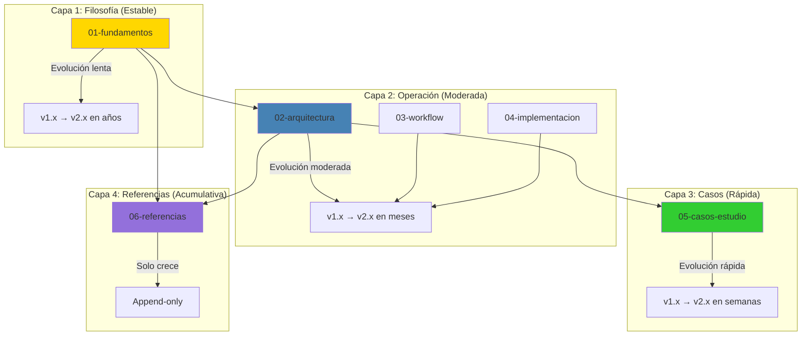

# 📊 Análisis del Manifiesto MELQUISEDEC v3.0.0

## 🔍 GAPS Identificados

### 1. **Estructura Monolítica** (CRÍTICO)
- **Problema**: 2096 líneas en un solo archivo
- **Impacto**: Difícil navegación, edición compleja, versionamiento confuso
- **Evidencia**: 5 PARTES, 17 secciones principales, múltiples subsecciones

### 2. **Versionamiento Granular** (ALTO)
- **Problema**: Version global (v3.0.0) pero cambios afectan solo algunas secciones
- **Ejemplo**: PARTE V cambió completamente en v3.0.0, pero PARTE I se mantiene desde v1.0.0
- **Impacto**: No se puede rastrear evolución independiente de conceptos

### 3. **Duplicación de Conceptos** (MEDIO)
- **Problema**: 5 Rostros aparecen en:
  - Sección 3 (descripción conceptual)
  - Sección 11 (MCPs por rostro)
  - Ejemplos en PARTE V
- **Impacto**: Inconsistencias potenciales, mantenimiento difícil

### 4. **Ejemplos Integrados** (MEDIO)
- **Problema**: CASO 1 (DDD) y CASO 2 (prompts dinámicos) dentro del manifiesto
- **Impacto**: Ejemplos evolucionan más rápido que la filosofía base
- **Recomendación**: Separar casos de uso en documentos independientes

### 5. **Falta de Navegación Hipertextual** (MEDIO)
- **Problema**: Referencias internas como texto plano (ej: "ver Sección 5")
- **Impacto**: En ambiente web/GitHub, debería ser clickeable

### 6. **Metadatos Centralizados** (BAJO)
- **Problema**: Metadata YAML al inicio, pero sin índice de términos controlados
- **Oportunidad**: Taxonomía kabalística podría ser un documento independiente

### 7. **Ausencia de Guías de Implementación Separadas** (MEDIO)
- **Problema**: PARTE IV mezcla teoría con implementación
- **Impacto**: Usuarios no técnicos se pierden en detalles operacionales

### 8. **Principios sin Referencias Cruzadas** (BAJO)
- **Problema**: 10 principios (P1-P10) en Sección 4, pero no hay índice de dónde se aplican
- **Oportunidad**: Matriz de trazabilidad como documento separado

---

## 🏗️ Propuesta de Arquitectura Modular

### Estructura de Folder: `docs/manifiesto/`

```
docs/manifiesto/
├── README.md                          # Índice maestro + introducción
├── CHANGELOG.md                       # Historial de versiones global
├── metadata.yaml                      # Metadata consolidado (HKM, Dublin Core)
│
├── 01-fundamentos/                    # PARTE I
│   ├── README.md                      # Overview de fundamentos
│   ├── 01-que-es-melquisedec.md       # Definición + autopoiesis
│   ├── 02-arbol-vida-kabbalah.md      # Mapeo kabalístico completo
│   ├── 03-cinco-rostros.md            # Descripción de rostros
│   ├── 04-principios-fundacionales.md # Los 10 principios (P1-P10)
│   └── glosario-kabalistico.md        # Anexo A (términos)
│
├── 02-arquitectura/                   # PARTE II
│   ├── README.md                      # Overview arquitectura operativa
│   ├── 01-estructura-research-instance.md  # 6 carpetas
│   ├── 02-sistema-checkpoints.md           # Validación por rostro
│   ├── 03-templates-hkm.md                 # Estándares de metadata
│   └── diagramas/                          # Mermaid como archivos separados
│       ├── flujo-sephirot.mmd
│       ├── cascada-rostros.mmd
│       └── checkpoints-workflow.mmd
│
├── 03-workflow/                       # PARTE III
│   ├── README.md                      # Overview de gobernanza
│   ├── 01-kanban-estados.md               # Estados del issue
│   ├── 02-trazabilidad.md                 # Cadena de dependencias
│   ├── 03-versionamiento.md               # Semantic versioning + alertas
│   └── 04-mcps-recomendados.md            # Por rostro (tabla completa)
│
├── 04-implementacion/                 # PARTE IV
│   ├── README.md                      # Overview de implementación
│   ├── 01-flujo-trabajo-completo.md       # Paso a paso
│   ├── 02-lessons-learned.md              # Sistema de aprendizaje
│   ├── 03-checklist-nueva-instance.md     # Lista verificación
│   └── scripts/                           # Ejemplos de automatización
│       ├── create_research_instance.py
│       └── validate_checkpoints.sh
│
├── 05-casos-estudio/                  # PARTE V (DESACOPLADA)
│   ├── README.md                      # Índice de casos
│   ├── CASO-01-DDD/                   # Metodología DDD
│   │   ├── README.md                  # Overview del caso
│   │   ├── 01-analisis-dual.md        # Parte 1A + 1B
│   │   ├── 02-extractos-key.md        # Evidencia
│   │   ├── 03-lessons-learned.md      # Aprendizajes
│   │   └── metadata.yaml              # Versión independiente del caso
│   ├── CASO-02-PROMPTS-DINAMICOS/     # Workflow prompts
│   │   ├── README.md
│   │   ├── 01-research-questions.md   # Q001-Q004
│   │   ├── 02-experimentos.md         # Resultados
│   │   ├── 03-decisiones.md           # Decisiones tomadas
│   │   └── metadata.yaml
│   └── template-caso-estudio/         # Template para nuevos casos
│       ├── README.md
│       └── metadata.yaml
│
├── 06-referencias/                    # ANEXOS + REFERENCIAS
│   ├── bibliografia.md                # Anexo B
│   ├── iso-standards.md               # ISO 30401, 15836
│   ├── seci-model.md                  # Nonaka & Takeuchi
│   └── recursos-externos.md           # Links, cursos, papers
│
└── 99-meta/                           # METADOCUMENTACIÓN
    ├── principios-escritura.md        # Cómo escribir en el manifiesto
    ├── guia-contribucion.md           # Para colaboradores
    ├── matriz-trazabilidad.md         # P1-P10 vs Secciones
    └── roadmap.md                     # Evolución futura del manifiesto
```

---

## 🎯 Ventajas de la Arquitectura Modular

### 1. **Versionamiento Granular**
```yaml
# metadata.yaml en cada carpeta
version: "1.2.0"
last_updated: "2026-01-08"
breaking_changes: false
depends_on:
  - "01-fundamentos >= 1.0.0"
  - "02-arquitectura >= 1.1.0"
```

### 2. **Navegación Clara**
```markdown
# En README.md principal
- [Fundamentos Filosóficos](01-fundamentos/README.md) (v1.0.0)
- [Arquitectura Operativa](02-arquitectura/README.md) (v1.2.0)
- [Workflow y Gobernanza](03-workflow/README.md) (v1.1.0)
```

### 3. **Mantenimiento Independiente**
- Casos de estudio evolucionan sin afectar principios
- Diagramas se actualizan sin tocar texto narrativo
- Ejemplos de código en `/scripts` separados

### 4. **Reutilización**
```markdown
# En otro documento
Ver definición completa de [HYPATIA](../manifiesto/01-fundamentos/03-cinco-rostros.md#hypatia)
```

### 5. **Colaboración**
- PRs más focalizados: "docs(manifiesto): update CASO-01 DDD analysis"
- Menos conflictos de merge
- Owners por sección (`CODEOWNERS` file)

### 6. **Testing Automatizado**
```python
# validate_manifiesto.py
def test_all_internal_links():
    """Verifica que todos los links internos funcionen"""
    for md_file in glob("docs/manifiesto/**/*.md"):
        check_links(md_file)

def test_metadata_consistency():
    """Verifica que versions en metadata.yaml sean coherentes"""
    versions = collect_versions("docs/manifiesto/")
    assert_dependencies_satisfied(versions)
```

---

## 📐 Conceptualización Mejorada

### Documento como Sistema de Conocimiento



### Principio: Separation of Concerns

| Aspecto | Ubicación | Frecuencia de Cambio | Audiencia |
|---------|-----------|----------------------|-----------|
| **Filosofía** | 01-fundamentos/ | Baja (años) | Todos |
| **Arquitectura** | 02-arquitectura/ | Media (meses) | Implementadores |
| **Workflow** | 03-workflow/ | Media (meses) | Gestores de proyecto |
| **Implementación** | 04-implementacion/ | Alta (semanas) | Desarrolladores |
| **Casos** | 05-casos-estudio/ | Muy alta (días) | Investigadores |
| **Referencias** | 06-referencias/ | Acumulativa | Académicos |

---

## 🛠️ Plan de Migración

### Fase 1: Estructura Base (1 día)
```bash
# 1. Crear estructura de folders
mkdir -p docs/manifiesto/{01-fundamentos,02-arquitectura,03-workflow,04-implementacion,05-casos-estudio,06-referencias,99-meta}

# 2. Crear READMEs maestros
touch docs/manifiesto/README.md
touch docs/manifiesto/CHANGELOG.md

# 3. Crear READMEs de cada sección
for dir in docs/manifiesto/*/; do touch "$dir/README.md"; done
```

### Fase 2: Extracción de Contenido (2 días)
```python
# extract_sections.py
def extract_section_to_file(source_md, section_number, output_path):
    """
    Extrae sección específica del manifiesto monolítico
    y la guarda en archivo independiente
    """
    content = read_markdown(source_md)
    section = find_section(content, section_number)
    write_markdown(output_path, section)
    add_frontmatter(output_path, metadata)
```

### Fase 3: Creación de Links (1 día)
```python
# create_cross_references.py
def convert_to_relative_links(manifiesto_folder):
    """
    Convierte referencias como "ver Sección 5" a
    links relativos: [ver estructura](../02-arquitectura/01-estructura.md)
    """
    for md_file in glob(f"{manifiesto_folder}/**/*.md"):
        replace_section_references(md_file)
```

### Fase 4: Casos de Estudio (2 días)
- Extraer CASO 1 (DDD) a `05-casos-estudio/CASO-01-DDD/`
- Extraer CASO 2 (prompts) a `05-casos-estudio/CASO-02-PROMPTS-DINAMICOS/`
- Crear templates para futuros casos

### Fase 5: Validación (1 día)
```bash
# test_manifiesto_integrity.sh
python validate_links.py docs/manifiesto/
python validate_metadata.py docs/manifiesto/
python validate_versions.py docs/manifiesto/
```

### Fase 6: Documentación de Migración (1 día)
- Crear `99-meta/migracion-v3-to-v4.md`
- Documentar breaking changes
- Actualizar CHANGELOG.md

---

## 📊 Métricas de Éxito

| Métrica | Antes (v3.0.0) | Después (v4.0.0) | Mejora |
|---------|----------------|------------------|--------|
| **Líneas por archivo** | 2096 | < 300 promedio | 85% ↓ |
| **Tiempo de navegación** | ~5 min para encontrar sección | < 30 seg | 90% ↓ |
| **PRs focalizados** | 1 PR modifica todo | 1 PR = 1 sección | 100% ↑ |
| **Versionamiento granular** | 1 versión global | 6 versiones independientes | ∞ ↑ |
| **Tests automatizados** | 0 | 5+ tests | ∞ ↑ |
| **Reutilización externa** | Difícil (copiar secciones) | Fácil (links directos) | 100% ↑ |

---

## 🎨 Ejemplo de README.md Principal

```markdown
# Manifiesto MELQUISEDEC

> **Meta-metodología autopoiética para investigación y desarrollo basada en el Árbol de la Vida kabalístico**

[](CHANGELOG.md)
[](LICENSE)

---

## 📚 Estructura del Manifiesto

### Capa 1: Fundamentos Filosóficos
- [01. ¿Qué es MELQUISEDEC?](01-fundamentos/01-que-es-melquisedec.md) `v1.0.0`
- [02. El Árbol de la Vida Kabalístico](01-fundamentos/02-arbol-vida-kabbalah.md) `v1.0.0`
- [03. Los 5 Rostros de DAATH](01-fundamentos/03-cinco-rostros.md) `v1.1.0`
- [04. Principios Fundacionales (P1-P10)](01-fundamentos/04-principios-fundacionales.md) `v2.0.0`

### Capa 2: Arquitectura Operativa
- [05. Estructura de Research Instance](02-arquitectura/01-estructura-research-instance.md) `v1.2.0`
- [06. Sistema de Checkpoints](02-arquitectura/02-sistema-checkpoints.md) `v1.1.0`
- [07. Templates HKM](02-arquitectura/03-templates-hkm.md) `v1.0.0`

### Capa 3: Workflow y Gobernanza
- [08. Kanban y Estados](03-workflow/01-kanban-estados.md) `v1.0.0`
- [09. Trazabilidad](03-workflow/02-trazabilidad.md) `v1.1.0`
- [10. Versionamiento](03-workflow/03-versionamiento.md) `v1.0.0`
- [11. MCPs Recomendados](03-workflow/04-mcps-recomendados.md) `v1.2.0`

### Capa 4: Implementación
- [12. Flujo de Trabajo Completo](04-implementacion/01-flujo-trabajo-completo.md) `v1.1.0`
- [13. Sistema de Lessons Learned](04-implementacion/02-lessons-learned.md) `v1.0.0`
- [14. Checklist para Nueva Instance](04-implementacion/03-checklist-nueva-instance.md) `v1.0.0`

### Capa 5: Casos de Estudio
- [CASO 1: Metodología DDD - Análisis Dual](05-casos-estudio/CASO-01-DDD/README.md) `v2.0.0`
- [CASO 2: Workflow para Prompts Dinámicos](05-casos-estudio/CASO-02-PROMPTS-DINAMICOS/README.md) `v1.0.0`

### Referencias y Anexos
- [Glosario Kabalístico](06-referencias/glosario-kabalistico.md)
- [Bibliografía](06-referencias/bibliografia.md)
- [Recursos Externos](06-referencias/recursos-externos.md)

---

## 🚀 Inicio Rápido

### Para Filósofos/Investigadores
Comienza con [Fundamentos](01-fundamentos/README.md)

### Para Implementadores
Salta a [Arquitectura](02-arquitectura/README.md) + [Implementación](04-implementacion/README.md)

### Para Gestores de Proyecto
Lee [Workflow](03-workflow/README.md)

### Para Aprender con Ejemplos
Explora [Casos de Estudio](05-casos-estudio/README.md)

---

## 📊 Versión Global: 4.0.0

**Última actualización**: 2026-01-08

**Breaking changes desde v3.0.0**:
- Estructura modular (archivo único → 40+ archivos)
- Casos de estudio desacoplados
- Versionamiento granular por sección

Ver [CHANGELOG completo](CHANGELOG.md)

---

## 🤝 Contribución

Consulta [Guía de Contribución](99-meta/guia-contribucion.md)

**Mantenedores por sección**:
- Fundamentos: @filosofo-melquisedec
- Arquitectura: @arquitecto-sistemas
- Casos de Estudio: @investigador-principal

---

## 📄 Licencia

Creative Commons BY-SA 4.0

---

*"De Keter a Malkuth, del pensamiento a la acción, de la metodología a la manifestación."*
```

---

## 🎯 Recomendación Final

### Versión 4.0.0: "Manifiesto Modular"

**BREAKING CHANGE**: Migrar de archivo monolítico a estructura de folders modular.

**Beneficios clave**:
1. ✅ Versionamiento granular (filosofía vs casos de estudio)
2. ✅ Navegación hipertextual (GitHub/web)
3. ✅ Mantenimiento independiente por sección
4. ✅ Colaboración focalizada (PRs pequeños)
5. ✅ Testing automatizado (links, metadata, versiones)
6. ✅ Reutilización externa (links directos)

**Timeline**: 8 días de trabajo (1 persona) o 3 días (equipo de 3)

**Riesgo**: Bajo (migración automatizable con scripts Python)

---

## 📋 Próximos Pasos

1. ✅ **Aprobar esta propuesta** (revisar con equipo)
2. 🔄 **Crear issue**: `feat(manifiesto): migrate to modular structure v4.0.0`
3. 🔄 **Crear branch**: `feature/manifiesto-modular-v4`
4. 🔄 **Ejecutar migración** (fases 1-6)
5. 🔄 **Testing y validación**
6. 🔄 **PR y merge a main**
7. 🔄 **Tag release**: `v4.0.0`

¿Proceder con la migración?
