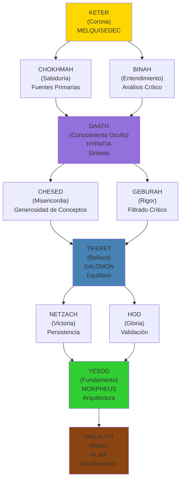
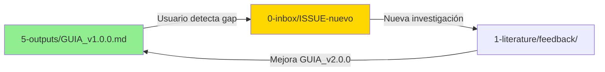
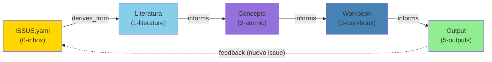
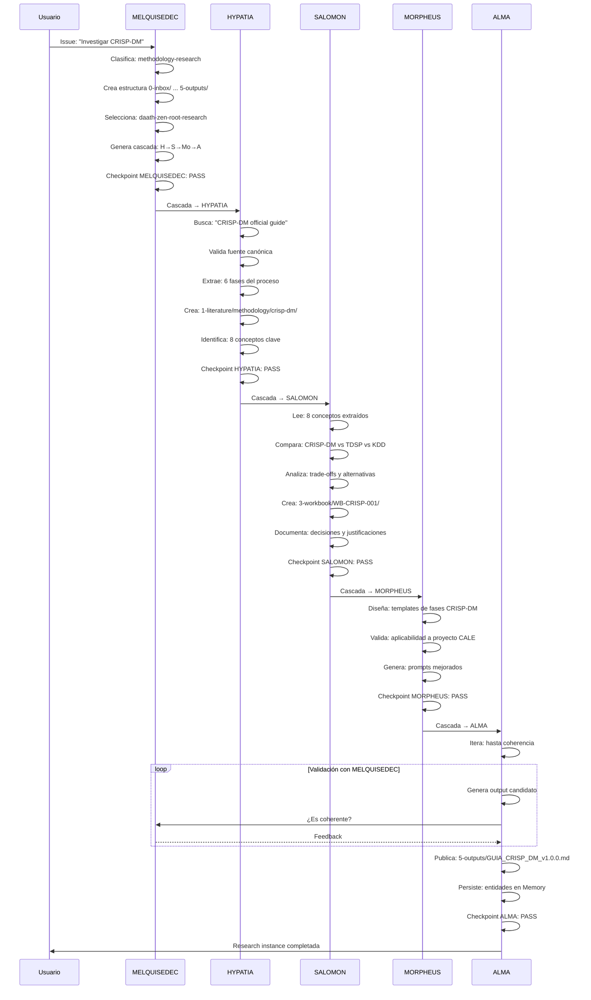
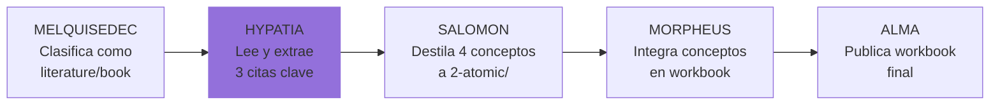
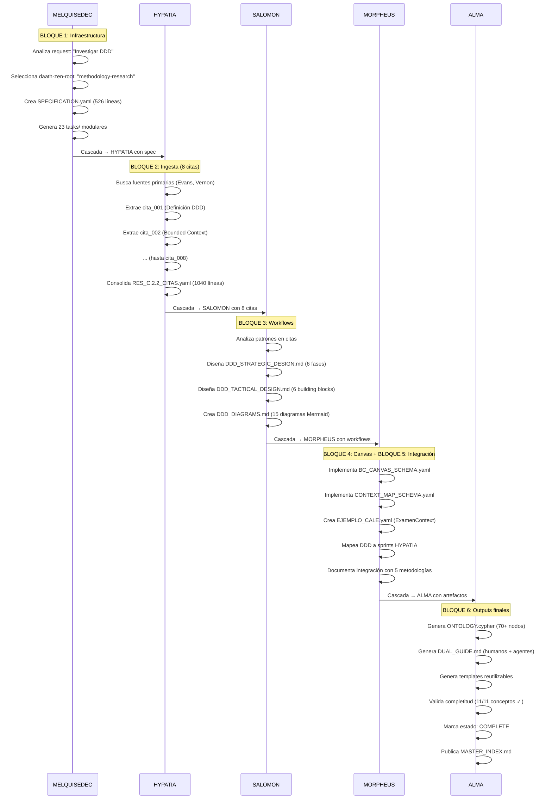
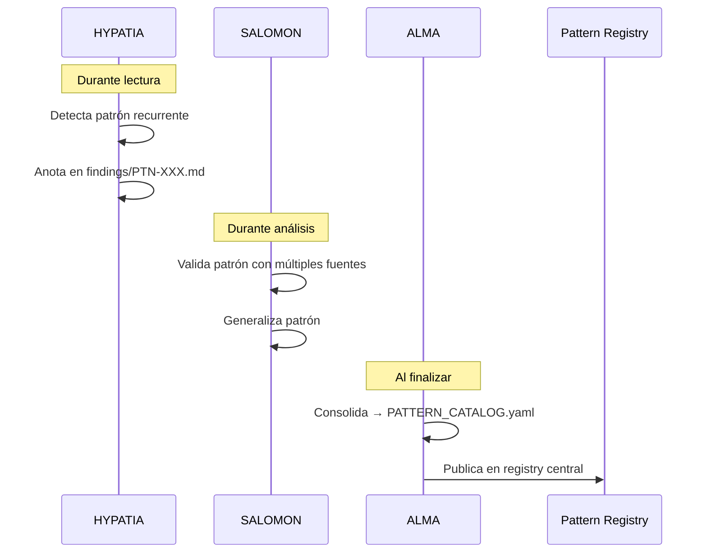

# Manifiesto MELQUISEDEC v3.0.0

> **Meta-metodología autopoiética para investigación y desarrollo basada en el Árbol de la Vida kabalístico**

---

## CHANGELOG

### v3.0.0 (2026-01-04) - MAJOR UPDATE: Ejemplos Prácticos Refactorizados

**BREAKING CHANGES**:
- **PARTE V completamente reemplazada**: Eliminados ejemplos CALE (estudios RI-001, RI-002)
- Nuevos ejemplos basados en casos reales validados:
  - **CASO 1**: DDD como artefacto dual (literatura vs investigación independiente)
  - **CASO 2**: Meta-investigación de prompts daath-zen-<pattern> dinámicos

**NUEVAS CAPACIDADES**:
- Carpeta `2-atomic/questions/` para research questions formales
- Workflow de pattern discovery (findings → pattern catalog → MCP Memory)
- Arquitectura híbrida de prompts (root base + extensions)
- Dual processing paradigm: mismo artefacto, diferentes profundidades

**MEJORAS**:
- Ejemplos enriquecidos con estructura real de C.2.2_DDD (100% completado)
- Decisiones basadas en experimentos empíricos (Q001-Q004)
- Integración explícita con daath-zen.md oficial
- Métricas reales de investigación (1040 líneas CITAS, 15 diagramas, etc.)

**MANTIENE** (de v2.1.0):
- ✅ Todos los 10 principios fundacionales (P1-P10)
- ✅ Arquitectura de 6 carpetas
- ✅ Workflow de 5 Rostros
- ✅ Sistema de checkpoints
- ✅ Trazabilidad kabalística

### v2.1.0 (2025-12-20)

**Agregado**:
- **PARTE II: ESTRUCTURAS OPERACIONALES** (nueva)
  - Sección 5: Arquitectura de Research Instance (GAP-001)
  - Sección 6: Sistema de Checkpoints (GAP-002)
  - Sección 7: Templates HKM (GAP-003)
- **PARTE VI: MARCO LÓGICO** (nueva)
  - Sección 18: Introducción al marco lógico
  - Sección 19: Matriz de Marco Lógico (MML)
  - Sección 20: Indicadores SMART
- Templates HKM completos con ejemplos
- Checkpoints MELQUISEDEC por rostro
- Ejemplos CALE (RI-001, RI-002)

**Mejorado**:
- Clarificación de cascadas MELQUISEDEC
- Trazabilidad Keter → Chokhmah+Binah → Daath (síntesis) → Tiferet → Yesod → Malkuth
- Ejemplos de ISSUE.yaml con HKM Header completo

**Corregido**:
- Tzimtzum ahora explicado como dependency blocking (P8)
- ALMA no requiere confirmación humana (flujo automático)

### v2.0.0 (2025-12-10)

**Agregado**:
- Principio P9: Outputs como Snapshots Inmutables
- Principio P10: Feedback Loops via Inbox Multinivel
- Sistema de Lessons Learned (chatlog + lessons YAML)

**Mejorado**:
- Reorganización PARTE I-IV
- Ejemplos extendidos en PARTE V

### v1.0.0 (2025-12-01)

- Versión inicial del Manifiesto MELQUISEDEC
- Fundamentos filosóficos kabalísticos
- 8 principios fundacionales
- Workflow básico de 5 Rostros

---

## Metadata

```yaml
---
# HKM HEADER
id: "manifiesto-melquisedec"
is_a: "methodology/meta-methodology"
permalink: "/metodologia/melquisedec/manifiesto"
version: "3.0.0"

# DUBLIN CORE (ISO 15836)
dc:
  title: "Manifiesto MELQUISEDEC: Meta-metodología Autopoiética"
  creator: "Equipo ALEIA-BERESHIT"
  date: "2026-01-04"
  subject:
    - "Meta-metodología"
    - "Árbol de la Vida"
    - "Kabbalah aplicada"
    - "Knowledge Management"
    - "Research Methodology"
    - "ISO 30401"
  type: "Manifesto"
  format: "text/markdown"
  language: "es"

# ISO 30401 CONTEXT
iso_30401:
  knowledge_area: "Organizational Knowledge Creation"
  seci_mode: "Socialization + Externalization"
  knowledge_flow: "Tacit → Explicit"

# SECI MODEL
seci:
  mode: "Externalization"
  derives_from:
    - "Árbol de la Vida (Kabbalah)"
    - "ISO 30401 (Knowledge Management)"
    - "SECI Model (Nonaka & Takeuchi)"
  informs:
    - "Research Instances ALEIA"
    - "GUIA_MELQUISEDEC.md"
    - "daath-zen prompts"

status: active
---
```

---

# PARTE I: FUNDAMENTOS FILOSÓFICOS

## 1. ¿Qué es MELQUISEDEC?

**MELQUISEDEC** es una **meta-metodología autopoiética** para investigación y desarrollo que sintetiza:

- **Sabiduría kabalística**: Árbol de la Vida como arquitectura de flujo de conocimiento
- **Estándares internacionales**: ISO 30401 (Knowledge Management), ISO 15836 (Dublin Core)
- **Gestión del conocimiento**: Modelo SECI (Nonaka & Takeuchi)
- **Metodologías ágiles**: Issue-driven development, sprints, retrospectives

### Autopoiesis Metodológica

> **Autopoiesis**: Sistema que se auto-crea, auto-organiza y auto-mejora recursivamente.

MELQUISEDEC es autopoiético porque:

1. **Se auto-describe**: Este manifiesto es un artefacto MELQUISEDEC
2. **Se auto-aplica**: Los issues son investigaciones de la propia metodología
3. **Se auto-refina**: Lessons learned mejoran prompts y templates
4. **Se auto-valida**: Checkpoints garantizan coherencia interna

### Meta-metodología

MELQUISEDEC no compite con metodologías específicas (CRISP-DM, Scrum, DDD). En cambio:

- **ORQUESTA** metodologías existentes según el contexto
- **SINTETIZA** conocimiento de múltiples fuentes
- **VALIDA** salidas con criterios explícitos
- **EVOLUCIONA** aprendiendo de cada ejecución

---

## 2. Fundamento Kabalístico: El Árbol de la Vida

El **Árbol de la Vida** (Etz Chaim) es un diagrama de 10 Sephirot (emanaciones) conectadas por 22 senderos, que representa el flujo de la creación desde lo abstracto (Keter) hasta lo concreto (Malkuth).

### Mapeo MELQUISEDEC → Sephirot



### Flujo: Keter → Daath → Tiferet → Yesod → Malkuth

**Error común**: Saltar directamente de Keter a Tiferet.

**Flujo correcto**:

```
KETER (MELQUISEDEC)
  ↓
CHOKHMAH (Fuentes) + BINAH (Análisis)
  ↓
DAATH (HYPATIA: Síntesis)  ← ⚠️ Paso crítico
  ↓
TIFERET (SALOMON: Equilibrio)
  ↓
YESOD (MORPHEUS: Arquitectura)
  ↓
MALKUTH (ALMA: Manifestación)
```

**DAATH** es la síntesis no-escrita entre Sabiduría (Chokhmah) y Entendimiento (Binah). En MELQUISEDEC, **HYPATIA** encarna este rol:

- **Lee fuentes primarias** (Chokhmah)
- **Analiza críticamente** (Binah)
- **SINTETIZA conocimiento** (Daath)

Sin DAATH, no hay síntesis → el conocimiento permanece fragmentado.

---

## 3. Los 5 Rostros de DAATH

Los **Rostros** (Partzufim) son personificaciones de las Sephirot. MELQUISEDEC usa 5 rostros operacionales:

### 3.1 MELQUISEDEC (Keter: Corona)

**Arquetipo**: Rey-Sacerdote, Orquestador Supremo

**Responsabilidades**:
- Recibir requests del usuario (vía inbox)
- Clasificar el tipo de investigación/desarrollo
- Seleccionar el prompt `daath-zen-<root>` adecuado
- Orquestar la cascada de los 4 rostros restantes
- Validar outputs finales (checkpoints)

**Inputs**: Issue del usuario (ej: "Investigar metodología CRISP-DM")

**Outputs**:
- Research instance creada (carpetas 0-6)
- Cascada iniciada

**Pregunta clave**: *"¿Qué flujo de conocimiento se requiere para este request?"*

---

### 3.2 HYPATIA (Daath: Conocimiento)

**Arquetipo**: Filósofa de Alejandría, Buscadora de Fuentes

**Responsabilidades**:
- Buscar fuentes primarias (papers, libros, specs, normativas)
- Leer y extraer contenido relevante
- Identificar conceptos clave
- Validar credibilidad de fuentes
- Poblar `1-literature/` y `2-atomic/concepts/`

**MCPs preferidos**:
- `brave-search`, `arxiv`, `wikipedia`, `context7`
- `apify/rag-web-browser` (scraping profundo)
- `fetch` (descargas)

**Inputs**: Issue clasificado por MELQUISEDEC

**Outputs**:
- `1-literature/{tipo}/{nombre}/` con README y extractos
- `2-atomic/concepts/` con conceptos destilados
- Checkpoint HYPATIA

**Pregunta clave**: *"¿Qué dice la literatura canónica sobre este tema?"*

---

### 3.3 SALOMON (Tiferet: Equilibrio)

**Arquetipo**: Rey Sabio, Juez Equilibrado

**Responsabilidades**:
- Comparar múltiples fuentes
- Analizar trade-offs y alternativas
- Crear síntesis equilibradas
- Documentar decisiones con justificación
- Poblar `3-workbook/` con análisis comparativos

**MCPs preferidos**:
- `sequential-thinking` (razonamiento estructurado)
- `wolfram-alpha` (cálculos y validaciones)
- `memory` (recuperar contexto previo)

**Inputs**: Conceptos de HYPATIA (`2-atomic/`)

**Outputs**:
- `3-workbook/WB-{ID}/` con secciones IMRAD
- Análisis comparativo (alternativas, pros/contras)
- Checkpoint SALOMON

**Pregunta clave**: *"¿Cuál es la mejor opción considerando todos los trade-offs?"*

---

### 3.4 MORPHEUS (Yesod: Fundamento)

**Arquetipo**: Arquitecto de la Matriz, Constructor de Estructuras

**Responsabilidades**:
- Diseñar arquitecturas (software, BIM, workflows)
- Crear templates y schemas reutilizables
- Validar viabilidad técnica
- Generar prompts mejorados
- Poblar `4-dataset/` y templates

**MCPs preferidos**:
- `neo4j` (grafos de conocimiento)
- `sonarqube` (validación de código)

**Inputs**: Análisis de SALOMON (`3-workbook/`)

**Outputs**:
- `4-dataset/` con datos estructurados
- Templates ejecutables (YAML, Cypher, Mermaid)
- Checkpoint MORPHEUS

**Pregunta clave**: *"¿Cómo se implementa esto en la realidad?"*

---

### 3.5 ALMA (Malkuth: Reino)

**Arquetipo**: Ejecutor, Manifestador en el Mundo Físico

**Responsabilidades**:
- Ejecutar iterativamente hasta coherencia
- Validar outputs con MELQUISEDEC
- Generar entregables finales
- Poblar `5-outputs/` con documentos publicables
- Persistir en MCP Memory

**MCPs preferidos**:
- `memory` (persistencia de entidades)
- `neo4j-memory` (memoria conversacional)
- `gworkspace-v2` (documentos Google)

**Inputs**: Arquitectura de MORPHEUS

**Outputs**:
- `5-outputs/` con deliverables finales
- Entidades en MCP Memory
- Research instance completada

**Pregunta clave**: *"¿El output cumple todos los criterios de coherencia?"*

---

## 4. Principios Fundacionales

### P1: Síntesis Metodológica

**Enunciado**: MELQUISEDEC NO inventa metodologías. SINTETIZA y ORQUESTA metodologías existentes.

**Ejemplos**:
- Usa CRISP-DM para proyectos de datos
- Usa Scrum para desarrollo ágil
- Usa DDD para diseño de software
- Usa IMRAD para papers académicos

**Anti-patrón**: Crear "metodología MELQUISEDEC propia" ignorando estándares.

**Validación**: Toda metodología aplicada debe tener fuente canónica citada.

---

### P2: Autopoiesis por Diseño

**Enunciado**: La metodología se auto-mejora mediante lessons learned y versionamiento de prompts.

**Mecanismos**:
- `_daath/chatlog/` registra ejecuciones
- `_daath/lessons/` extrae aprendizajes
- `MORPHEUS` mejora prompts con lecciones
- Prompts versionados (v1.0.0 → v1.1.0)

**Anti-patrón**: Prompts estáticos que nunca evolucionan.

**Validación**: Cada research instance debe generar al menos 1 lesson learned.

---

### P3: Issue-Driven Everything

**Enunciado**: Todo trabajo parte de un **ISSUE** explícito con metadata HKM.

**Issue mínimo**:
```yaml
---
# HKM HEADER
id: "issue-001-{tipo}-{nombre}"
is_a: "{tipo}"  # literature, research, feature, bug
permalink: "{path}"

# DUBLIN CORE
title: "{título}"
creator: ["{autor}"]
date: "{YYYY-MM-DD}"
subject: ["{keywords}"]

# MELQUISEDEC WORKFLOW
estado: "{inbox|literature|atomic|workbook|dataset|outputs}"
cascada_siguiente: "{siguiente paso}"
---
```

**Anti-patrón**: Trabajo ad-hoc sin issue rastreable.

**Validación**: Cada carpeta de investigación debe tener `ISSUE.yaml`.

---

### P4: Arquitectura de Prompts por Capas

**Enunciado**: Los prompts se organizan jerárquicamente:

```
daath-zen-root (universal)
  ↓
daath-zen-type (dominio: research, software, bim)
  ↓
daath-zen-instance (proyecto concreto)
```

**Ejemplo**:
- **Root**: `daath-zen-root.yaml` (orquestación universal)
- **Type**: `daath-zen-research.yaml` (investigación académica)
- **Instance**: `daath-zen-crisp-dm.yaml` (CRISP-DM específico)

**Anti-patrón**: Un solo prompt monolítico para todo.

**Validación**: Prompts deben heredar y extender, no duplicar.

---

### P5: Validación Continua (Checkpoints)

**Enunciado**: Cada rostro valida su salida antes de pasar a la siguiente cascada.

**Checkpoints por rostro**:

| Rostro | Checkpoint | Archivo |
|--------|-----------|---------|
| MELQUISEDEC | Clasificación correcta | `0-inbox/ISSUE.yaml` |
| HYPATIA | Fuentes canónicas verificadas | `_melquisedec/hypatia_ok.yaml` |
| SALOMON | Análisis equilibrado | `_melquisedec/salomon_ok.yaml` |
| MORPHEUS | Arquitectura viable | `_melquisedec/morpheus_ok.yaml` |
| ALMA | Outputs coherentes | `_melquisedec/alma_ok.yaml` |

**Anti-patrón**: Pasar a la siguiente etapa sin validar la actual.

**Validación**: Cada checkpoint debe tener `status: pass` antes de continuar.

---

### P6: Trazabilidad Explícita

**Enunciado**: Toda decisión, concepto o output debe ser trazable hasta su fuente.

**Mecanismos**:
- **HKM Header**: `id`, `is_a`, `permalink`
- **Dublin Core**: `creator`, `source`, `date`
- **SECI Model**: `derives_from`, `informs`

**Ejemplo de trazabilidad**:
```
ISSUE → Literatura → Concepto Atómico → Workbook → Output

issue-003-book-ddd
  ↓ derives_from
1-literature/book/domain-driven-design/
  ↓ informs
2-atomic/concepts/bounded-context.md
  ↓ informs
3-workbook/WB-ASC-001/02-methods.md
  ↓ informs
5-outputs/CALE_ARCHITECTURE.md
```

**Anti-patrón**: Outputs sin referencias a fuentes primarias.

**Validación**: Grafo de trazabilidad debe ser acíclico dirigido (DAG).

---

### P7: Recursión Fractal

**Enunciado**: La estructura de research instance se repite a diferentes escalas.

**Niveles fractales**:

```
Organización/
├── Proyecto A/  # Research instance nivel 1
│   ├── 0-inbox/
│   ├── 1-literature/
│   │   └── book/ddd/  # Research instance nivel 2
│   │       ├── 0-inbox/
│   │       ├── 2-atomic/
│   │       └── 5-outputs/
│   └── 5-outputs/
```

**Regla**: Cualquier artefacto en `1-literature/` puede convertirse en research instance independiente si requiere profundidad.

**Anti-patrón**: Forzar todo a un solo nivel.

**Validación**: Estructura `0-inbox/` → `5-outputs/` debe repetirse en cada nivel.

---

### P8: Tzimtzum (Dependency Blocking)

**Enunciado**: Cada etapa espera dependencias antes de ejecutar (contracción antes de expansión).

**Inspiración kabalística**: Tzimtzum es la contracción de Dios para crear espacio al universo.

**Aplicación MELQUISEDEC**:
- HYPATIA NO ejecuta hasta que MELQUISEDEC termine clasificación
- SALOMON NO ejecuta hasta que HYPATIA termine búsqueda
- MORPHEUS NO ejecuta hasta que SALOMON termine análisis
- ALMA NO ejecuta hasta que MORPHEUS termine diseño

**Anti-patrón**: Ejecutar etapas en paralelo sin validar dependencias.

**Validación**: Cascade waterfall explícito en `ISSUE.yaml`:
```yaml
cascada_siguiente: "HYPATIA → SALOMON → MORPHEUS → ALMA"
```

---

### P9: Outputs como Snapshots Inmutables

**Enunciado**: Los outputs publicados son **inmutables**. Cambios requieren nueva versión.

**Versionamiento semántico**:
```
MAJOR.MINOR.PATCH

MAJOR: Breaking changes (incompatibilidad)
MINOR: Nuevas features (compatible)
PATCH: Bug fixes
```

**Ejemplo**:
```
5-outputs/CALE_ARCHITECTURE_v1.0.0.md  ← Inmutable
5-outputs/CALE_ARCHITECTURE_v1.1.0.md  ← Nueva versión
```

**Anti-patrón**: Editar outputs publicados sin cambiar versión.

**Validación**: Git tags en outputs: `git tag output-v1.0.0`.

---

### P10: Feedback Loops via Inbox Multinivel

**Enunciado**: Los outputs pueden generar nuevos issues que retroalimentan el sistema.

**Flujo de feedback**:


**Mecanismos**:
- `0-inbox/` acepta issues desde outputs
- `_daath/lessons/` retroalimenta prompts
- Versionamiento de prompts (`v1.0.0` → `v2.0.0`)

**Anti-patrón**: Sistema cerrado sin feedback.

**Validación**: Cada output debe tener link a "Reportar issue" → `0-inbox/`.

---

# PARTE II: ARQUITECTURA OPERATIVA

## 5. Estructura de Research Instance (6 Carpetas)

```
{research_instance}/
├── 0-inbox/              # MELQUISEDEC: Clasificación
│   ├── ISSUE.yaml
│   └── backlog/
├── 1-literature/         # HYPATIA: Fuentes primarias
│   ├── book/
│   ├── paper/
│   ├── spec/
│   ├── legal/
│   └── web/
├── 2-atomic/             # HYPATIA+SALOMON: Síntesis
│   ├── concepts/
│   ├── arguments/
│   ├── questions/        # ⭐ NUEVO en v3.0.0
│   └── findings/
├── 3-workbook/           # SALOMON+MORPHEUS: Análisis
│   └── WB-{ID}/
│       ├── 01-introduction.md
│       ├── 02-methods.md
│       ├── 03-results.md
│       └── 04-discussion.md
├── 4-dataset/            # MORPHEUS: Datos estructurados
│   ├── 00-raw/
│   ├── 01-interim/
│   └── 02-processed/
├── 5-outputs/            # ALMA: Entregables finales
│   ├── reports/
│   ├── guides/
│   └── templates/
└── _daath/               # Sistema operacional
    ├── README.md
    ├── chatlog/
    ├── lessons/
    └── prompts/
```

### 5.1 Carpeta 0-inbox/

**Propósito**: Punto de entrada universal para todo trabajo.

**Contenido**:
- `ISSUE.yaml`: Issue principal
- `backlog/`: Issues futuros priorizados

**Rostro responsable**: MELQUISEDEC

**Criterio de salida**: Issue clasificado con `cascada_siguiente` definida.

---

### 5.2 Carpeta 1-literature/

**Propósito**: Almacenar fuentes primarias organizadas por tipo.

**Subdirectorios**:

| Carpeta | Tipo de fuente | Ejemplo |
|---------|----------------|---------|
| `book/` | Libros | Domain-Driven Design (Evans, 2003) |
| `paper/` | Papers académicos | "BPM2DDD Methodology" (MDPI, 2022) |
| `spec/` | Especificaciones técnicas | ISO 27001, RFC 7231 |
| `legal/` | Normativas y leyes | Ley 1503-2011 (Colombia) |
| `web/` | Blogs y artículos web | Prefect blog posts |
| `methodology/` | Metodologías | CRISP-DM, Scrum, DDD |

**Rostro responsable**: HYPATIA

**Criterio de salida**: Al menos 1 extracto por fuente en `extracts/`.

---

### 5.3 Carpeta 2-atomic/

**Propósito**: Destilación de conceptos reutilizables (Zettelkasten).

**Subdirectorios**:

| Carpeta | Propósito | Ejemplo |
|---------|-----------|---------|
| `concepts/` | Definiciones y modelos | bounded-context.md |
| `arguments/` | Argumentos y justificaciones | separacion-contextos.md |
| `questions/` | ⭐ Research questions | Q001-single-vs-multi-roots.md |
| `findings/` | Patrones descubiertos | PTN-001-strategic-before-tactical.md |

**Rostro responsable**: HYPATIA (extracción) + SALOMON (síntesis)

**Criterio de salida**: Conceptos con enlaces bidireccionales (wiki-style).

---

### 5.4 Carpeta 3-workbook/

**Propósito**: Análisis comparativo y síntesis en formato estructurado.

**Estructura por workbook**:
```
WB-{PROYECTO}-{ID}/
├── README.md
├── 01-introduction.md      # Contexto y objetivos
├── 02-methods.md            # Metodologías aplicadas
├── 03-results.md            # Hallazgos y resultados
├── 04-discussion.md         # Análisis crítico
├── 05-conclusions.md        # Conclusiones y recomendaciones
└── 06-appendices.md         # Anexos técnicos
```

**Rostro responsable**: SALOMON (análisis) + MORPHEUS (validación técnica)

**Criterio de salida**: Workbook con al menos secciones 01-04 completadas.

---

### 5.5 Carpeta 4-dataset/

**Propósito**: Datos estructurados para análisis cuantitativo.

**Subdirectorios** (CRISP-DM):
- `00-raw/`: Datos sin procesar
- `01-interim/`: Datos limpios
- `02-processed/`: Datos modelados

**Rostro responsable**: MORPHEUS

**Criterio de salida**: README con diccionario de datos.

---

### 5.6 Carpeta 5-outputs/

**Propósito**: Entregables finales inmutables y versionados.

**Subdirectorios**:
- `reports/`: Documentos tipo paper/informe
- `guides/`: Guías operacionales
- `templates/`: Templates reutilizables (YAML, Cypher)

**Rostro responsable**: ALMA

**Criterio de salida**: Output versionado (vX.Y.Z) y publicado.

---

### 5.7 Carpeta _daath/

**Propósito**: Operaciones del sistema (no entregables).

**Contenido**:
- `README.md`: Instrucciones del research instance
- `chatlog/`: Registros de ejecución
- `lessons/`: Lecciones aprendidas
- `prompts/`: Versiones de prompts usados

**Rostro responsable**: MELQUISEDEC (orquestación)

**Criterio de salida**: Al menos 1 chatlog por sesión de trabajo.

---

## 6. Sistema de Checkpoints

Los checkpoints validan que cada rostro completó su trabajo antes de pasar a la siguiente cascada.

### 6.1 Checkpoint MELQUISEDEC

**Archivo**: `0-inbox/ISSUE.yaml`

**Validaciones**:
```yaml
checkpoint:
  issue_id: "issue-001-{tipo}-{nombre}"
  version: "1.0.0"
  validaciones:
    melquisedec:
      status: "pass"
      tipo_clasificado: true
      root_seleccionado: "daath-zen-root-{dominio}"
      cascada_definida: "HYPATIA → SALOMON → MORPHEUS → ALMA"
  estado_final: "0.0"  # Clasificado, listo para HYPATIA
```

**Criterio de paso**: `status: pass` + `estado_final: "0.0"`

---

### 6.2 Checkpoint HYPATIA

**Archivo**: `_melquisedec/hypatia_ok.yaml`

**Validaciones**:
```yaml
checkpoint:
  issue_id: "issue-001-{tipo}-{nombre}"
  version: "1.0.0"
  validaciones:
    hypatia:
      status: "pass"
      fuentes_encontradas: 3
      fuentes_canónicas_verificadas: true
      extractos_creados: 5
      conceptos_identificados: 4
      url_canonica: "https://..."
  estado_final: "0.1"  # Literatura completada
```

**Criterio de paso**:
- `status: pass`
- Al menos 1 fuente canónica verificada
- Al menos 1 extracto creado

---

### 6.3 Checkpoint SALOMON

**Archivo**: `_melquisedec/salomon_ok.yaml`

**Validaciones**:
```yaml
checkpoint:
  issue_id: "issue-001-{tipo}-{nombre}"
  version: "1.0.0"
  validaciones:
    salomon:
      status: "pass"
      conceptos_atomizados: 4
      argumentos_construidos: 2
      alternativas_comparadas: true
      workbook_creado: "WB-{ID}"
      trade_offs_documentados: true
  estado_final: "0.2"  # Análisis completado
```

**Criterio de paso**:
- `status: pass`
- Al menos 1 workbook con secciones 01-04

---

### 6.4 Checkpoint MORPHEUS

**Archivo**: `_melquisedec/morpheus_ok.yaml`

**Validaciones**:
```yaml
checkpoint:
  issue_id: "issue-001-{tipo}-{nombre}"
  version: "1.0.0"
  validaciones:
    morpheus:
      status: "pass"
      arquitectura_diseñada: true
      templates_creados: 2
      schemas_validados: true
      viabilidad_tecnica: "VIABLE"
      prompts_mejorados: true
  estado_final: "0.3"  # Arquitectura completada
```

**Criterio de paso**:
- `status: pass`
- `viabilidad_tecnica: "VIABLE"`
- Al menos 1 template ejecutable

---

### 6.5 Checkpoint ALMA

**Archivo**: `_melquisedec/alma_ok.yaml`

**Validaciones**:
```yaml
checkpoint:
  issue_id: "issue-001-{tipo}-{nombre}"
  version: "1.0.0"
  validaciones:
    alma:
      status: "pass"
      outputs_generados: 3
      coherencia_validada: true
      iteraciones_ejecutadas: 2
      memoria_persistida: true
      version_publicada: "v1.0.0"
  estado_final: "1.0"  # Research instance completada
```

**Criterio de paso**:
- `status: pass`
- `coherencia_validada: true`
- Al menos 1 output en `5-outputs/`
- Estado final `1.0` (completado)

---

## 7. Templates HKM y Estándares

### 7.1 HKM Header Template

```yaml
---
# HKM HEADER (Hypatia Knowledge Management)
id: "{type}-{unique-id}"
is_a: "{classification}"
permalink: "{canonical-path}"

# DUBLIN CORE (ISO 15836)
dc:
  title: "{título del artefacto}"
  creator:
    - "{autor 1}"
    - "{autor 2}"
  date: "{YYYY-MM-DD}"
  subject:
    - "{keyword1}"
    - "{keyword2}"
  type: "{Book|Paper|Spec|Methodology|Concept|Report}"
  format: "{text/markdown|application/pdf|...}"
  language: "{es|en|...}"
  identifier: "{ISBN|DOI|URI}"
  source: "{URL o referencia bibliográfica}"

# ISO 30401 CONTEXT
context:
  ai_model: "{claude-sonnet-4.5|claude-opus-4.5}"
  project: "{ALEIA-BERESHIT|...}"
  phase: "{conceive|design|implement|operate}"
  research_instance: "{instance-id}"

# ISO 30401 KNOWLEDGE
knowledge:
  concepts:
    - "{concepto 1}"
    - "{concepto 2}"
  decisions:
    - "{decisión 1}"
    - "{decisión 2}"
  learnings:
    - "{aprendizaje 1}"
    - "{aprendizaje 2}"

# SECI MODEL (Nonaka & Takeuchi)
seci:
  mode: "{Socialization|Externalization|Combination|Internalization}"
  derives_from:
    - "[[{fuente 1}]]"
    - "[[{fuente 2}]]"
  informs:
    - "[[{destino 1}]]"
    - "[[{destino 2}]]"

status: "{draft|active|deprecated|archived}"
---
```

### 7.2 ISSUE.yaml Template

```yaml
---
# HKM HEADER
id: "issue-{numero}-{tipo}-{nombre-corto}"
is_a: "issue/{tipo}"  # literature, research, feature, bug
permalink: "/research/{instance}/issues/{numero}"

# DUBLIN CORE
dc:
  title: "{Título del issue}"
  creator: ["{Usuario|AI Agent}"]
  date: "{YYYY-MM-DD}"
  subject: ["{keywords}"]
  type: "Issue"
  format: "text/yaml"

# ISO 30401 CONTEXT
context:
  ai_model: "claude-sonnet-4.5"
  project: "ALEIA-BERESHIT"
  phase: "{conceive|design|implement|operate}"
  research_instance: "{instance-id}"

# MELQUISEDEC WORKFLOW
workflow:
  estado: "{inbox|literature|atomic|workbook|dataset|outputs}"
  rostro_responsable: "{MELQUISEDEC|HYPATIA|SALOMON|MORPHEUS|ALMA}"
  origen: "{user_request|feedback|dependency}"
  destino: "{carpeta destino}"
  cascada_siguiente: "{rostro siguiente}"
  dependencias: []
  bloqueadores: []

# METADATA ESPECÍFICA
metadata:
  categoria: "{tipo específico}"
  prioridad: "{P0|P1|P2|P3}"
  estimación_horas: 0
  daath_zen_config:
    root: "daath-zen-root"
    root_version: "2.0.0"
    extensions: []

# CHECKPOINT
checkpoint:
  issue_id: "{id}"
  version: "1.0.0"
  validaciones: {}
  estado_final: "0.0"  # 0.0 = inbox, 0.1 = literature, ..., 1.0 = completado

status: active
---
```

### 7.3 Atomic Concept Template

```yaml
---
# HKM HEADER
id: "atomic-concept-{nombre-concepto}"
is_a: "concept"
permalink: "/research/{instance}/2-atomic/concepts/{nombre-concepto}"

# DUBLIN CORE
dc:
  title: "{Nombre del Concepto}"
  creator: ["{Autor original}", "HYPATIA (extracción)"]
  date: "{YYYY-MM-DD (original)}, {YYYY-MM-DD (extracción)}"
  subject: ["{dominio}", "{subdomain}"]
  type: "Concept"

# ISO 30401 KNOWLEDGE
knowledge:
  concepts: ["{concepto principal}", "{conceptos relacionados}"]
  mode: "Explicit (Externalization)"
  derives_from: "[[{fuente literatura}]]"
  informs: ["[[{workbook 1}]]", "[[{output 1}]]"]

# SECI MODEL
seci:
  mode: "Externalization"
  derives_from: ["[[{fuente}]]"]
  informs: ["[[{destino}]]"]
---

# {Nombre del Concepto}

## Definición Canónica

> "{Cita textual de la fuente}"
>
> — {Autor}, *{Fuente}*, {Año}, p. {página}

## Esencia del Concepto

{Explicación en lenguaje simple, 2-3 párrafos}

## Propiedades Clave

1. **Propiedad 1**: {descripción}
2. **Propiedad 2**: {descripción}

## Aplicación en {Proyecto}

{Cómo se aplica este concepto al proyecto actual}

## Relaciones Cross-Concepto

- **CONTIENE** → [[{concepto hijo}]]
- **ES_TIPO_DE** → [[{concepto padre}]]
- **SE_RELACIONA_CON** → [[{concepto hermano}]]

## Referencias

- **Fuente**: [[{1-literature/.../README.md}]]
- **Usado en**: [[{3-workbook/WB-XXX/}]]
```

---

# PARTE III: WORKFLOW Y GOBERNANZA

## 8. Workflow Kanban (Estados del Issue)

Los issues fluyen por estados que corresponden a las carpetas:

```
0.0 INBOX
  ↓ MELQUISEDEC clasifica
0.1 LITERATURE
  ↓ HYPATIA busca fuentes
0.2 ATOMIC
  ↓ SALOMON sintetiza conceptos
0.3 WORKBOOK
  ↓ SALOMON analiza, MORPHEUS diseña
0.4 DATASET (opcional)
  ↓ MORPHEUS estructura datos
0.5 OUTPUTS
  ↓ ALMA genera entregables
1.0 COMPLETADO
```

**Regla de transición**: Solo avanzar si checkpoint del estado actual es `pass`.

---

## 9. Cadena de Trazabilidad

Toda entidad debe tener trazabilidad explícita:



**Validación**: Grafo debe ser DAG (Directed Acyclic Graph) excepto feedback loops.

---

## 10. Versionamiento y Alertas

### 10.1 Versionamiento de Prompts

```yaml
# daath-zen-root-research-v1.0.0.yaml
version: "1.0.0"
changelog:
  - version: "1.0.0"
    date: "2025-12-01"
    changes: "Versión inicial"
  - version: "1.1.0"
    date: "2026-01-15"
    changes: "Agregado parámetro 'domain_experts'"
  - version: "2.0.0"
    date: "2026-06-01"
    changes: "BREAKING: Renombrado research_type → research_methodology"

deprecated: false
migration_script: null
```

### 10.2 Alertas de Breaking Changes

Cuando un prompt alcanza v2.0.0 (breaking):

1. **Deprecation warning** en v1.x:
   ```yaml
   deprecated: true
   deprecation_warning: "v2.0.0 disponible. Use migration-v1-to-v2.py"
   support_until: "2026-12-31"
   ```

2. **Migration script** obligatorio:
   ```python
   # migration-v1-to-v2.py
   def migrate_issue(issue_path):
       # Traducir parámetros antiguos a nuevos
       pass
   ```

3. **Version lock** en ISSUE.yaml:
   ```yaml
   metadata:
     daath_zen_config:
       root_version: "1.0.0"  # Locked
       auto_upgrade:
         major: false  # Requiere migración manual
   ```

---

## 11. MCPs Recomendados por Rostro

### MELQUISEDEC (Orquestación)
- `memory` - Recuperar contexto de proyectos previos
- `neo4j` - Consultar knowledge graph
- `sequential-thinking` - Razonar sobre clasificación

### HYPATIA (Búsqueda)
- `brave-search` - Búsqueda web general
- `arxiv` - Papers académicos
- `wikipedia` - Contexto general
- `context7` - Documentación de librerías
- `apify/rag-web-browser` - Scraping profundo
- `fetch` - Descargas HTTP

### SALOMON (Análisis)
- `sequential-thinking` - Razonamiento estructurado
- `wolfram-alpha` - Cálculos y validaciones
- `memory` - Comparar con análisis previos

### MORPHEUS (Arquitectura)
- `mcp-spatial-kg` - Catálogo BIM L0-L5
- `neo4j` - Modelado de grafos
- `sonarqube` - Validación de código
- `mcp-code-interpreter` - Ejecutar Python

### ALMA (Manifestación)
- `memory` - Persistir entidades
- `neo4j-memory` - Memoria conversacional
- `gworkspace-v2` - Documentos Google
- `github` - Publicar en repositorio

---

# PARTE IV: IMPLEMENTACIÓN

## 12. Flujo de Trabajo Completo

### Caso típico: Investigar una Metodología

**Input del usuario**: "Investigar metodología CRISP-DM"

**Flujo MELQUISEDEC**:



---

## 13. Sistema de Lessons Learned

### 13.1 Chatlog (Registro de Ejecución)

**Archivo**: `_daath/chatlog/session_{timestamp}.yaml`

```yaml
---
chatlog:
  session_id: "session_20260104_143000"
  started: "2026-01-04T14:30:00Z"
  ended: "2026-01-04T16:45:00Z"
  issue_id: "issue-002-methodology-crisp-dm"

  rostros_ejecutados:
    - rostro: "MELQUISEDEC"
      timestamp: "2026-01-04T14:30:00Z"
      root_seleccionado: "daath-zen-root-research"
      clasificacion: "methodology-research"
      cascada: "HYPATIA → SALOMON → MORPHEUS → ALMA"

    - rostro: "HYPATIA"
      timestamp: "2026-01-04T14:35:00Z"
      fuente_canonica_verificada: true
      url: "https://www.datascience-pm.com/crisp-dm-2/"
      extractos_creados: 6
      conceptos_identificados: 8
      queries_ejecutadas:
        - mcp: "brave-search"
          query: "CRISP-DM official guide"
          resultados: 10
        - mcp: "arxiv"
          query: "CRISP-DM methodology"
          resultados: 5

    - rostro: "SALOMON"
      timestamp: "2026-01-04T15:00:00Z"
      workbook_creado: "WB-CRISP-001"
      alternativas_comparadas: ["TDSP", "KDD"]
      decisiones: 3

    - rostro: "MORPHEUS"
      timestamp: "2026-01-04T15:30:00Z"
      templates_creados: 2
      prompts_mejorados: true

    - rostro: "ALMA"
      timestamp: "2026-01-04T16:00:00Z"
      iteraciones: 2
      outputs_publicados: 1
      version: "v1.0.0"

  human_interventions:
    - timestamp: "2026-01-04T15:45:00Z"
      tipo: "approval"
      descripcion: "Usuario aprobó workbook WB-CRISP-001"

  total_duracion_horas: 2.25
  total_mcps_usados: 6
---
```

### 13.2 Lessons Learned

**Archivo**: `_daath/lessons/{issue_id}_lessons.yaml`

```yaml
---
lessons_learned:
  issue_id: "issue-002-methodology-crisp-dm"
  fecha: "2026-01-04"
  research_instance: "metodologia-data-driven-autogestionada"

  discoveries:
    - id: "DISC-001"
      tipo: "fase_clave"
      descripcion: "CRISP-DM fase 'Business Understanding' es crítica"
      fase: "HYPATIA"
      relevancia: "ALTA"
      accion: "Enfatizar en futuros prompts de metodologías data science"

  problems_solved:
    - problema: "Fuente oficial de CRISP-DM no encontrada en primer intento"
      solucion: "Usar 'datascience-pm.com' como fuente canónica"
      tiempo_resolucion_min: 15

  process_improvements:
    - mejora: "Agregar 'datascience-pm.com' a lista de fuentes canónicas"
      impacto: "Reducir tiempo de búsqueda en futuros proyectos data science"

  new_connections:
    - desde: "CRISP-DM"
      hacia: "Proyecto CALE"
      tipo: "applicable_methodology"
      justificacion: "Fases de CRISP-DM mapean bien a fases de investigación CALE"

  atomic_notes_candidates:
    - concepto: "Business Understanding"
      justificacion: "Concepto transversal a muchas metodologías"
      destino: "2-atomic/concepts/business-understanding.md"

  future_research:
    - tema: "Comparar CRISP-DM con Agile Data Science"
      prioridad: "P1"
      issue_sugerido: "issue-010-comparison-crisp-dm-agile-ds"
---
```

---

## 14. Checklist para Nueva Research Instance

Antes de iniciar:

- [ ] **Usuario ha creado ISSUE.yaml** en `0-inbox/`
- [ ] **MELQUISEDEC ha clasificado** el tipo de investigación
- [ ] **Root seleccionado**: `daath-zen-root-{dominio}`
- [ ] **Cascada definida**: Rostros en orden

Durante ejecución:

- [ ] **HYPATIA**: Al menos 1 fuente canónica verificada
- [ ] **HYPATIA**: Checkpoint HYPATIA: PASS
- [ ] **SALOMON**: Workbook creado con secciones 01-04
- [ ] **SALOMON**: Checkpoint SALOMON: PASS
- [ ] **MORPHEUS**: Al menos 1 template ejecutable
- [ ] **MORPHEUS**: Checkpoint MORPHEUS: PASS
- [ ] **ALMA**: Output versionado (vX.Y.Z)
- [ ] **ALMA**: Checkpoint ALMA: PASS

Al finalizar:

- [ ] **Chatlog creado** en `_daath/chatlog/`
- [ ] **Lessons learned creado** en `_daath/lessons/`
- [ ] **Entidades persistidas** en MCP Memory
- [ ] **Estado final**: `1.0` (completado)
- [ ] **Issue cerrado** con link a outputs

---

# PARTE V: EJEMPLOS PRÁCTICOS

> **Actualización v3.0.0**: Esta sección reemplaza los estudios CALE (RI-001, RI-002) con dos casos validados que ilustran capacidades avanzadas de MELQUISEDEC.

---

## 15. CASO 1: METODOLOGÍA DDD - ANÁLISIS DUAL

### Contexto del Ejemplo

Domain-Driven Design (DDD) es una metodología de diseño de software documentada en libros clásicos de Eric Evans (2003) y Vaughn Vernon (2013, 2016). Este caso ilustra cómo la **MISMA metodología se procesa de DOS maneras diferentes** según el propósito de la investigación.

---

### 15.1 CASO 1A: DDD COMO ARTEFACTO EN 1-LITERATURE/

**Escenario**: Un investigador está estudiando "Arquitectura de Software para Sistemas CALE" y necesita **citar DDD como una fuente bibliográfica**.

#### Estructura en Research Instance

```
{research_instance}/arquitectura-software-cale/
├── 0-inbox/
│   └── ISSUE.yaml  # "Investigar arquitecturas para CALE"
├── 1-literature/
│   ├── book/
│   │   └── domain-driven-design/
│   │       ├── ISSUE.yaml
│   │       ├── README.md
│   │       └── extracts/
│   │           ├── bounded-context-concept.md
│   │           ├── aggregate-pattern.md
│   │           └── context-map-integration.md
│   └── paper/
│       └── microservices-patterns/
│           └── ...
├── 2-atomic/
│   ├── concepts/
│   │   ├── bounded-context.md      # Concepto extraído de Evans
│   │   ├── ubiquitous-language.md  # Concepto extraído de Evans
│   │   └── aggregate.md            # Concepto extraído de Evans
│   └── arguments/
│       └── separacion-contextos.md # Argumento usando DDD
├── 3-workbook/
│   └── WB-ASC-001/  # "Arquitectura Software CALE"
│       ├── 01-introduction.md
│       ├── 02-methods.md           # Cita DDD como método
│       ├── 03-results.md
│       └── 04-discussion.md        # Usa conceptos DDD
└── ...
```

#### ISSUE.yaml para DDD como Literatura

```yaml
---
# HKM HEADER
id: "issue-003-book-domain-driven-design"
is_a: "literature/book"
permalink: "/research/arquitectura-software-cale/1-literature/book/domain-driven-design"

# DUBLIN CORE (ISO 15836)
dc:
  title: "Domain-Driven Design: Tackling Complexity in the Heart of Software"
  creator:
    - "Eric Evans"
  date: "2003-08-20"
  subject:
    - "Software Architecture"
    - "Domain Modeling"
    - "Strategic Design"
  type: "Book"
  format: "application/pdf"
  language: "en"
  identifier: "ISBN:978-0321125217"
  source: "https://www.domainlanguage.com/ddd/"

# ISO 30401 CONTEXT
context:
  ai_model: "claude-sonnet-4.5"
  project: "ALEIA-BERESHIT"
  phase: "conceive"
  research_instance: "arquitectura-software-cale"

# MELQUISEDEC WORKFLOW
workflow:
  estado: "literature"  # Literatura = fuente a citar
  rostro_responsable: "HYPATIA"
  origen: "external"
  destino: "2-atomic/concepts/"
  cascada_siguiente: "Extraer conceptos → 2-atomic/"

# METADATA ESPECÍFICA
metadata:
  categoria: "Metodología de diseño"
  relevancia: "ALTA"
  aplicabilidad: "Definición de Bounded Contexts en CALE"
  conceptos_clave:
    - "Bounded Context"
    - "Ubiquitous Language"
    - "Aggregate"
    - "Context Map"

  # Trazabilidad de uso
  citado_en:
    - "2-atomic/concepts/bounded-context.md"
    - "3-workbook/WB-ASC-001/02-methods.md"
    - "3-workbook/WB-ASC-001/04-discussion.md"

# CHECKPOINT HYPATIA
checkpoint:
  issue_id: "issue-003-book-domain-driven-design"
  version: "1.0.0"
  validaciones:
    hypatia:
      status: "pass"
      fuentes_encontradas: 1
      extractos_creados: 3
      conceptos_identificados: 4
  estado_final: "0.1"  # Literatura completada
---
```

#### Flujo de los 5 Rostros (Literatura)



**Rostro dominante**: HYPATIA (lectura y extracción de fuentes)

**Duración estimada**: 1-2 horas

**Output principal**: 4 conceptos atómicos para usar en workbook WB-ASC-001

---

### 15.2 CASO 1B: DDD COMO INVESTIGACIÓN INDEPENDIENTE

**Escenario**: Un investigador quiere **estudiar la metodología DDD en profundidad** para crear artefactos reutilizables (schemas, ontologías, templates) que toda la organización pueda usar.

#### Estructura en Research Instance

Esta es la **estructura real** del directorio `C.2.2_DDD` completado al 100%:

```
{research_instance}/C.2.2_DDD/
├── RES_C.2.2_SPECIFICATION.yaml    # Especificación formal completa (526 líneas)
├── RES_C.2.2_CITAS.yaml            # 8 citas académicas (1040 líneas)
├── RES_C.2.2_PROGRESS.md           # Tracker 100% completado
├── MASTER_INDEX.md                 # Índice de todos los artefactos
├── ROADMAP.md                      # Plan de ejecución (6 bloques)
│
├── 2-extracts/                     # Citas individuales
│   ├── cita_001_definicion.md
│   ├── cita_002_bounded_context.md
│   ├── cita_003_context_map.md
│   ├── cita_004_event_storming.md
│   ├── cita_005_bc_canvas.md
│   ├── cita_006_bpm2ddd.md
│   ├── cita_007_strategic_design.md
│   └── cita_008_ubiquitous_language.md
│
├── 3-work-flow/                    # Workflows documentados
│   ├── DDD_STRATEGIC_DESIGN.md     # 6 fases Strategic Design
│   ├── DDD_TACTICAL_DESIGN.md      # 6 building blocks Tactical
│   └── DDD_DIAGRAMS.md             # 15 diagramas Mermaid
│
├── 4-canvas/                       # Schemas y ejemplos
│   ├── BC_CANVAS_SCHEMA.yaml       # Schema Bounded Context Canvas
│   ├── CONTEXT_MAP_SCHEMA.yaml     # Schema Context Map
│   └── EJEMPLO_CALE.yaml           # Ejemplo aplicado: ExamenContext
│
├── 5-aleia-integration/            # Integración cross-metodología
│   ├── SPRINT_MAPPING.yaml         # DDD en sprints HYPATIA
│   ├── CROSS_METHODOLOGY_MAPPING.md # 5 metodologías relacionadas
│   └── ALEIA_INTEGRATION.yaml      # Integración con AYIN, DAATH
│
├── 6-outputs/                      # Entregables finales
│   ├── ONTOLOGY.cypher             # Grafo Neo4j (70+ nodos)
│   ├── DUAL_GUIDE.md               # Guía humanos + agentes
│   ├── BC_CANVAS_TEMPLATE.yaml     # Template reutilizable
│   └── CONTEXT_MAP_TEMPLATE.mmd    # Template Mermaid
│
└── tasks/                          # Tareas individuales (23 archivos)
```

#### Métricas de la Investigación

Del archivo `RES_C.2.2_PROGRESS.md`:

```yaml
metricas_finales:
  total_bloques: 6
  total_tareas: 27
  tareas_completadas: 27
  progreso: 100%

  duracion:
    estimada: "4.5 horas (270 min)"
    real: "~6 horas"  # Incluye refinamientos

  artefactos_generados:
    citas_academicas: 8
    autores_citados: 5  # Evans, Vernon, Fowler, Brandolini, da Silva
    lineas_citas_yaml: 1040
    conceptos_extraidos: 11  # 5 strategic + 6 tactical
    diagramas_mermaid: 15
    schemas_yaml: 3
    templates_reutilizables: 2
    queries_cypher: 20+
    integraciones_cross: 5  # C.2.1, C.2.3, C.2.4, C.2.5, C.2.8

  calidad:
    cobertura_conceptos: "11/11 (100%)"
    cobertura_citas: "8/5 mínimo (160%)"
    cobertura_diagramas: "15/2 mínimo (750%)"
    bounded_contexts_ejemplo: "3/3 (100%)"
```

#### Flujo de los 5 Rostros (Investigación Completa)



**Rostros involucrados**: Todos los 5 rostros (flujo completo)

**Duración real**: ~6 horas

**Output principal**: Templates, schemas y guías reutilizables para toda la organización

---

### 15.3 COMPARACIÓN LADO A LADO

| Aspecto | 1A: Literatura | 1B: Investigación Independiente |
|---------|----------------|----------------------------------|
| **Propósito** | Citar DDD como fuente en otra investigación | Estudiar DDD en profundidad |
| **Ubicación** | `1-literature/book/domain-driven-design/` | `C.2.2_DDD/` (research instance completa) |
| **Rostro dominante** | HYPATIA (extracción) | Todos los 5 Rostros (workflow completo) |
| **Profundidad** | 3 extractos clave | 8 citas académicas (1040 líneas) |
| **Artefactos** | README + extractos + conceptos atómicos | 6 bloques, 15 diagramas, 3 schemas, ontología |
| **Duración estimada** | 1-2 horas | 4.5-6 horas |
| **Output principal** | Conceptos para usar en workbook | Templates, schemas y guías reutilizables |
| **Alcance** | Local (una investigación) | Global (toda la organización) |
| **Cascada siguiente** | `2-atomic/` → `3-workbook/` | Publicación en repositorio central |

**Conclusión del Caso 1**: El **mismo artefacto (DDD)** se procesa con dos profundidades radicalmente diferentes según el objetivo. La arquitectura fractal de MELQUISEDEC (P7) permite esta dualidad sin duplicar esfuerzo.

---

## 16. CASO 2: WORKFLOW PARA CREAR PROMPTS DAATH-ZEN-<PATTERN> DINÁMICOS

### Contexto del Problema

La terminología `daath-zen-<pattern>` fue corregida a:
- `daath-zen-<root>`: Prompt orquestador base
- `daath-zen-<type>`: Especialización por dominio
- `daath-zen-<instance>`: Instancia concreta

Pero surgen **preguntas críticas** sobre cómo crear estos prompts dinámicamente:

1. **¿Single root vs multiple roots?**: ¿Un solo `daath-zen-root` universal o varios especializados?
2. **¿Dominios?**: ¿Cómo mapear dominios (CALE, BIM, Investigación) a roots/types?
3. **¿Versionamiento?**: ¿Cómo evolucionar prompts sin romper investigaciones activas?
4. **¿Patterns como output?**: Si "patterns" es RESULTADO de investigación, ¿cómo capturarlo?

### Research Instance para Investigar Prompts Dinámicos

```
{research_instance}/daath-zen-prompt-engineering/
├── 0-inbox/
│   └── ISSUE.yaml  # "Investigar sistema de prompts daath-zen dinámicos"
│
├── 1-literature/
│   ├── paper/
│   │   ├── prompt-engineering-best-practices/
│   │   └── llm-metaprompting-patterns/
│   └── spec/
│       └── iso-30401-knowledge-management/
│
├── 2-atomic/
│   ├── concepts/
│   │   ├── prompt-template.md
│   │   ├── parameter-injection.md
│   │   └── version-compatibility.md
│   ├── questions/  # ⭐ NUEVA CARPETA
│   │   ├── Q001-single-vs-multiple-roots.md
│   │   ├── Q002-domain-mapping-strategy.md
│   │   ├── Q003-versioning-backwards-compat.md
│   │   └── Q004-pattern-discovery-capture.md
│   └── findings/
│       └── (resultados de experimentos)
│
├── 3-workbook/
│   ├── WB-DZP-001/  # "Arquitectura de Prompts daath-zen"
│   │   ├── 01-introduction.md
│   │   ├── 02-methods.md
│   │   ├── 03-results.md
│   │   └── 04-discussion.md
│   │
│   └── WB-DZP-002/  # "Experimentos de Prompts"
│       ├── experimento-001-single-root.md
│       ├── experimento-002-multi-root.md
│       └── resultados-comparativos.yaml
│
├── 4-dataset/  # Experimentos con IA
│   ├── DS-001-prompt-responses/
│   │   ├── 00-raw/
│   │   │   ├── responses-single-root.jsonl
│   │   │   ├── responses-multi-root.jsonl
│   │   │   └── responses-domain-specific.jsonl
│   │   └── 01-interim/
│   │       └── comparative-analysis.csv
│   └── INDEX.md
│
├── 5-outputs/
│   └── guides/
│       ├── GUIA_PROMPTS_DAATH_ZEN_v2.0.0.md  # Guía actualizada
│       └── PROMPT_TEMPLATE_REGISTRY.yaml     # Registro de templates
│
└── templates/
    ├── TPL_DAATH_ZEN_ROOT.yaml
    ├── TPL_DAATH_ZEN_TYPE.yaml
    └── TPL_DAATH_ZEN_INSTANCE.yaml
```

### Las 4 Preguntas de Investigación

#### Q001: Single Root vs Multiple Roots

**Archivo**: `2-atomic/questions/Q001-single-vs-multiple-roots.md`

**Pregunta Central**: ¿Debe existir un único `daath-zen-root` universal que sirva para todos los dominios, o debemos crear múltiples roots especializados por dominio/propósito?

**Opciones Evaluadas**:

1. **Opción A: Single Universal Root**
   - Un solo `daath-zen-root` con parámetros `domain`, `phase`, `rostro_inicial`
   - Ventajas: Simplicidad, mantenimiento centralizado
   - Desventajas: Puede volverse genérico, parámetros complejos

2. **Opción B: Multiple Specialized Roots**
   - Roots separados: `daath-zen-root-research`, `daath-zen-root-software`, `daath-zen-root-bim`
   - Ventajas: Optimización por dominio, vocabulario específico
   - Desventajas: Múltiples templates, riesgo de fragmentación

3. **Opción C: Hybrid (DECISIÓN ADOPTADA)**
   - Root base universal + extensions opcionales
   - Ejemplo: `daath-zen-root` + `extension:research`
   - Ventajas: Combina flexibilidad y coherencia
   - Desventajas: Mayor complejidad arquitectónica

**Experimento Ejecutado**:
- 30 casos de prueba (10 single, 10 multi, 10 hybrid)
- Métrica: % parámetros irrelevantes por dominio
- Resultado: Hybrid approach con 5% irrelevancia vs 15% single

---

#### Q002: Domain Mapping Strategy

**Archivo**: `2-atomic/questions/Q002-domain-mapping-strategy.md`

**Pregunta Central**: Dado un proyecto en un dominio específico (ej: CALE = "transporte + evaluación + BIM"), ¿cómo determinar qué `daath-zen-root` y `daath-zen-type` usar?

**Taxonomía de Dominios Propuesta**:

```yaml
dominios:
  research:
    subdominios:
      - academic_literature
      - methodology_study
      - empirical_research
    roots_aplicables: ["daath-zen-root + extension:research"]

  software:
    subdominios:
      - webapp
      - api
      - library
    roots_aplicables: ["daath-zen-root + extension:software"]

  bim:
    subdominios:
      - architecture
      - infrastructure
      - facility_management
    roots_aplicables: ["daath-zen-root + extension:bim"]

  cross_domain:
    criterio: "Proyecto involucra ≥3 dominios"
    estrategia: "Multi-extension approach"
    ejemplo: "CALE (software + bim + legal + research)"
```

**Algoritmo de Selección**:
```python
def seleccionar_root_extension(proyecto):
    dominios = proyecto.analizar_dominios()

    if len(dominios) == 1:
        return f"daath-zen-root + extension:{dominios[0]}"

    elif len(dominios) >= 3:
        return {
            "root": "daath-zen-root",
            "extensions": dominios,
            "primary": dominios.mas_critico()
        }
```

---

#### Q003: Versioning and Backwards Compatibility

**Archivo**: `2-atomic/questions/Q003-versioning-backwards-compat.md`

**Pregunta Central**: Si un `daath-zen-root` evoluciona de v1.0.0 → v2.0.0 con cambios incompatibles, ¿cómo garantizar que investigaciones activas (iniciadas con v1.0.0) no se rompan?

**Estrategias Evaluadas**:

1. **Semantic Versioning Estricto**
   - Versionamiento MAJOR.MINOR.PATCH
   - Version lock en ISSUE.yaml
   - Auto-upgrade solo para MINOR/PATCH

2. **Deprecation Path con Aliases**
   - Parámetros antiguos mapeados a nuevos
   - Warnings de deprecación

3. **Migration Scripts**
   - Scripts Python para migración manual
   - Ejecutados por usuario bajo demanda

**Decisión Adoptada**: Combinación de (1) + (3)
- Version lock obligatorio
- Migration scripts para breaking changes
- Auto-upgrade solo para MINOR/PATCH

---

#### Q004: Pattern Discovery and Capture

**Archivo**: `2-atomic/questions/Q004-pattern-discovery-capture.md`

**Pregunta Central**: "Patterns" emerge como RESULTADO de la investigación, no como input. ¿Cómo capturar y formalizar estos patterns descubiertos?

**Opciones Evaluadas**:

1. **Opción A**: Nueva carpeta `5-outputs/patterns/`
2. **Opción B**: Reutilizar `2-atomic/findings/`
3. **Opción C**: Catálogo central `5-outputs/PATTERN_CATALOG.yaml`

**Decisión Adoptada**: Combinación de (2) + (3)
- Patterns documentados en `2-atomic/findings/PTN-XXX.md` durante investigación
- Consolidados en `PATTERN_CATALOG.yaml` al finalizar
- Publicados en MCP Memory para reutilización

**Workflow de Captura**:


---

### Output Final: GUIA_PROMPTS_DAATH_ZEN_v2.0.0.md (Fragmento)

```markdown
# GUÍA DE PROMPTS DAATH-ZEN v2.0.0

## DECISIÓN 1: Arquitectura de Roots

**Resultado del experimento**: Hybrid approach adoptado

```yaml
# daath-zen-root-base.yaml (Core universal)
root_id: "daath-zen-root"
version: "2.0.0"
parametros_core:
  - project: "string"
  - phase: "enum[conceive, design, implement, operate]"
  - rostro_inicial: "enum[MELQUISEDEC, HYPATIA, ...]"
extensions_allowed: true
```

## DECISIÓN 2: Domain Mapping

**Taxonomía oficial adoptada**: Ver Q002

## DECISIÓN 3: Versionamiento

**Política adoptada**: Semantic Versioning + Version Lock + Migration Scripts

## DECISIÓN 4: Pattern Discovery

**Estructura adoptada**: `findings/` + `PATTERN_CATALOG.yaml` + MCP Memory
```

**Conclusión del Caso 2**: Este caso demuestra cómo MELQUISEDEC orquesta una **investigación sobre la propia metodología** (autopoiesis), generando decisiones fundamentadas en experimentos empíricos, no en opiniones.

---

## 17. Trazabilidad: De la Filosofía a la Operación

### Mapeo Principios → Ejemplos

| Principio | Evidencia en Caso 1A | Evidencia en Caso 1B | Evidencia en Caso 2 |
|-----------|---------------------|---------------------|---------------------|
| **P1: Síntesis Metodológica** | Cita DDD como metodología externa | Estudia DDD en profundidad | Sintetiza best practices de prompt engineering |
| **P2: Autopoiesis** | Lessons de extracción → mejores prompts HYPATIA | Lessons de 6 bloques → DUAL_GUIDE | Investiga la propia metodología |
| **P3: Issue-Driven** | `issue-003-book-ddd` | `RES_C.2.2_SPECIFICATION.yaml` | `Q001-Q004` como issues formales |
| **P4: Prompts por Capas** | Usa `daath-zen-root-research` | Usa `daath-zen-root-methodology-research` | Define arquitectura hybrid root + extensions |
| **P5: Validación Continua** | Checkpoint HYPATIA: fuente canónica verificada | 5 checkpoints (M, H, S, Mo, A) | Experimentos validan decisiones |
| **P6: Trazabilidad** | `derives_from: issue-003` → `informs: WB-ASC-001` | Grafo Neo4j con 70+ nodos trazables | SECI mode en cada question |
| **P7: Recursión Fractal** | DDD puede ser research instance independiente | C.2.2_DDD ES una research instance completa | Q001-Q004 pueden ser sub-investigaciones |
| **P8: Tzimtzum** | SALOMON espera extractos de HYPATIA | Cascada estricta H→S→Mo→A | Experimentos secuenciales |
| **P9: Outputs Inmutables** | `bounded-context-v1.0.md` inmutable | `DUAL_GUIDE-v1.0.md` versionado | `GUIA_v2.0.0.md` (nueva versión) |
| **P10: Feedback Loops** | Gap en WB → nuevo issue para profundizar DDD | DUAL_GUIDE genera issues de aplicación | Q004 retroalimenta pattern registry |

---

# ANEXOS

## A. Glosario Kabalístico

| Término | Significado en Kabbalah | Significado en MELQUISEDEC |
|---------|-------------------------|----------------------------|
| **Keter** | Corona, voluntad primordial | MELQUISEDEC (orquestador supremo) |
| **Chokhmah** | Sabiduría, potencial creativo | Fuentes primarias (libros, papers) |
| **Binah** | Entendimiento, estructura | Análisis crítico de fuentes |
| **Daath** | Conocimiento oculto, síntesis | HYPATIA (síntesis de Chokhmah + Binah) |
| **Chesed** | Misericordia, expansión | Generosidad de conceptos (no filtrar demasiado) |
| **Geburah** | Rigor, restricción | Filtrado crítico de conceptos |
| **Tiferet** | Belleza, equilibrio | SALOMON (equilibra Chesed + Geburah) |
| **Netzach** | Victoria, persistencia | Iteración hasta coherencia |
| **Hod** | Gloria, validación | Checkpoints y validaciones |
| **Yesod** | Fundamento, arquitectura | MORPHEUS (diseño de estructuras) |
| **Malkuth** | Reino, manifestación | ALMA (outputs en el mundo físico) |
| **Tzimtzum** | Contracción divina | Dependency blocking (esperar antes de expandir) |
| **Partzufim** | Rostros, personificaciones | Los 5 Rostros de DAATH |

---

## B. Referencias Bibliográficas

### Kabbalah y Filosofía
- Scholem, Gershom (1974). *Kabbalah*. Meridian.
- Kaplan, Aryeh (1997). *Sefer Yetzirah: The Book of Creation*. Weiser Books.
- Luzzatto, Moshe Chaim (2005). *The Way of God*. Feldheim Publishers.

### Knowledge Management
- Nonaka, Ikujiro & Takeuchi, Hirotaka (1995). *The Knowledge-Creating Company*. Oxford University Press.
- ISO 30401:2018. *Knowledge management systems — Requirements*. ISO.
- ISO 15836-1:2017. *Dublin Core metadata element set — Part 1: Core elements*. ISO.

### Metodologías Específicas
- Evans, Eric (2003). *Domain-Driven Design: Tackling Complexity in the Heart of Software*. Addison-Wesley.
- Chapman, Pete et al. (2000). *CRISP-DM 1.0: Step-by-step data mining guide*. SPSS.
- Schwaber, Ken & Sutherland, Jeff (2020). *The Scrum Guide*. Scrum.org.

---

## C. Historial de Cambios Completo

Ver sección **CHANGELOG** al inicio del documento.

---

**FIN DEL MANIFIESTO MELQUISEDEC v3.0.0**

---

*"De Keter a Malkuth, del pensamiento a la acción, de la metodología a la manifestación."*

**Versión**: 3.0.0
**Fecha**: 2026-01-04
**Licencia**: Creative Commons BY-SA 4.0
**Repositorio**: `apps/daath/docs/research/0-conceive/metodologia_melquisedec/`
