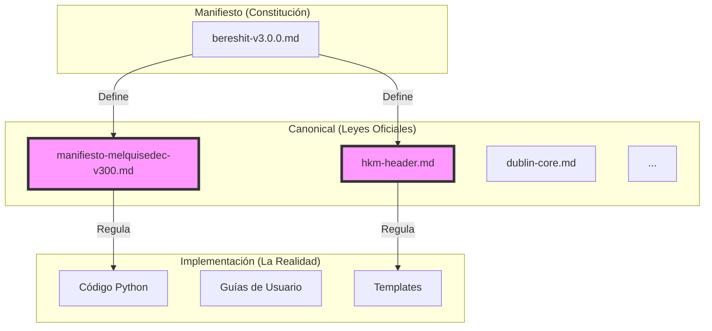
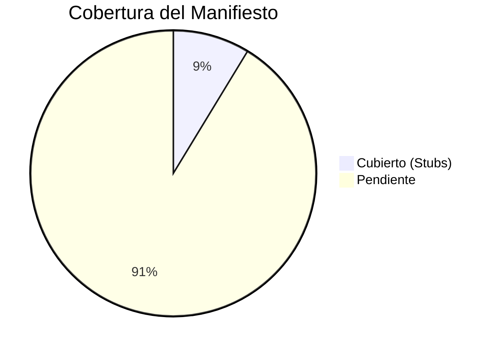

# Reporte de Estado: Cobertura Canónica (Fase 1)

**Fecha:** 10 de Enero de 2026
**Estado:** 🚀 Inicio de Estandarización
**Objetivo:** Establecer la "Verdad Única" (Canonical Truth) para el proyecto ALEIA-MELQUISEDEC.

---

## 1. ¿Qué acabamos de hacer? (Versión para Dummies)

Imagina que MELQUISEDEC es una constitución gigante. Hasta ahora, teníamos la constitución escrita (`docs/manifiesto/bereshit-v3.0.0.md`), pero nadie había creado las **leyes específicas** que explican cómo aplicar cada artículo. Todo estaba mezclado.

Lo que hicimos fue:
1.  **Leer la Constitución**: Escaneamos automáticamente el Manifiesto.
2.  **Identificar Vacíos**: Encontramos qué secciones no tenían un documento "oficial".
3.  **Crear Carpetas Vacías (Stubs)**: Generamos los primeros 10 archivos "oficiales" en la carpeta `canonical/`.

### Antes vs. Después

| Antes | Después |
| :--- | :--- |
| El conocimiento estaba disperso en cientos de archivos `.md`. | Tenemos una carpeta central `canonical/` que actúa como índice maestro. |
| Si querías saber qué es "HKM Header", tenías que buscar en 10 sitios. | Ahora vas a `canonical/hkm-header.md` y ahí estará la definición oficial. |
| Riesgo de contradicción alto. | "Single Source of Truth" (Fuente Única de Verdad). |

---

## 2. Mapa Visual de la Solución

## 3. Los 10 Primeros Stubs Generados

Estos son los documentos "semilla" que se han creado automáticamente. Actualmente son borradores (`status: draft`).

1.  `canonical/manifiesto-melquisedec-v300.md` (La raíz de todo)
2.  `canonical/changelog.md`
3.  `canonical/v300-2026-01-04-major-update-ejemplos-prácticos-refactorizados.md`
4.  `canonical/v210-2025-12-20.md`
5.  `canonical/v200-2025-12-10.md`
6.  `canonical/v100-2025-12-01.md`
7.  `canonical/metadata.md`
8.  `canonical/hkm-header.md` (Crucial para estandarización de documentos)
9.  `canonical/dublin-core-iso-15836.md`
10. `canonical/iso-30401-context.md`

## 4. Métricas de Progreso

- **Total de Secciones detects:** 115
- **Stubs Creados:** 10
- **Cobertura Actual:** ~8.7%

## 5. Recomendaciones para Proceder

Ahora que tenemos la estructura, el siguiente paso es llenar estos stubs con contenido real. No intentes hacerlo todo a la vez.

### Paso 1: "The Golden Path" (Prioridad Alta)
Concéntrate en completar **solo** estos 3 documentos primero, ya que son los más usados:
-   `canonical/hkm-header.md`: Define cómo deben empezar todos los archivos.
-   `canonical/metadata.md`: Estandariza los tags y categorías.
-   `canonical/manifiesto-melquisedec-v300.md`: El índice general.

### Paso 2: Delegar o Iterar
Para los documentos de versiones (`v100`, `v200`, etc.), puedes simplemente copiar y pegar el changelog relevante o dejarlos como referencia histórica mínima.

### Paso 3: Activación de CI
Una vez que `hkm-header.md` esté completo, puedes activar reglas en el CI para rechazar cualquier PR que no cumpla con lo que dice ese documento.

---
*Generado automáticamente por tu Asistente de IA - Melquisedec/Copilot*
