# Reporte de Estado: Cobertura Canónica (Fase 1)

**Fecha:** 10 de Enero de 2026
**Estado:** 🚀 Inicio de Estandarización
**Objetivo:** Establecer la "Verdad Única" (Canonical Truth) para el proyecto ALEIA-MELQUISEDEC.

---

## 1. ¿Qué acabamos de hacer? (Versión para Dummies)

Imagina que MELQUISEDEC es una constitución viva que evoluciona. Inicialmente usamos una versión antigua (`bereshit`), pero nos dimos cuenta de que la "verdad actual" está en `raw-manifiesto.md` (v4.3.1) y su estructura modular.

Lo que hicimos fue:
1.  **Leer la Fuente Real**: Escaneamos `apps/.../raw-manifiesto.md` (v4.3.1) que contiene la unificación de PRAXIS + RBM.
2.  **Identificar Vacíos Reales**: Encontramos qué conceptos de la nueva arquitectura (Autopoiesis, Spec-Workflow link) faltaban.
3.  **Expandir el Canon**: A los stubs iniciales (Metadata, HKM), sumamos los nuevos conceptos estructurales.

### Antes vs. Después

| Antes | Después |
| :--- | :--- |
| Basado en v3.0.0 (Bereshit). | Basado en v4.0.0+ (Unified Design + Manifiesto Modular). |
| Faltaban conceptos clave como "Spec-Workflow" o "PRAXIS". | Se integran los nuevos paradigmas de arquitectura. |
| Riesgo de desactualización. | Alineado con la última versión de desarrollo (`raw-manifiesto`). |

---

## 2. Mapa Visual de la Solución

```mermaid
graph TD
    subgraph "Manifiesto (Constitución)"
        M[bereshit-v3.0.0.md]
    end

    subgraph "Canonical (Leyes Oficiales)"
        C1[manifiesto-melquisedec-v300.md]
        C2[hkm-header.md]
        C3[dublin-core.md]
        CN[...]
    end

    subgraph "Implementación (La Realidad)"
        I1[Código Python]
        I2[Guías de Usuario]
        I3[Templates]
    end

    M -->|Define| C1
    M -->|Define| C2
    C1 -->|Regula| I1
    C2 -->|Regula| I3

    style C1 fill:#f9f,stroke:#333,stroke-width:4px
    style C2 fill:#f9f,stroke:#333,stroke-width:4px
```

## 3. Stubs Generados (Consolidado Fase 1)

Documentos "semilla" generados a partir de `raw-manifiesto.md` (v4.3.1) y legado:

**Nuevos Conceptos (Arquitectura v4+):**
1.  `canonical/unified-research-template-design-v431.md`
2.  `canonical/praxis-rbm-meta-framework-autopoiético-para-investigación.md`
3.  `canonical/el-puente-manifiesto-daath-zen-root-spec-workflow-mcp.md` (Crucial: Define la integración técnica)
4.  `canonical/narrativa-para-dummies.md`
5.  `canonical/visión-un-meta-framework-autopoiético.md`

**Conceptos Fundacionales (Legado v3):**
6.  `canonical/manifiesto-melquisedec-v300.md`
7.  `canonical/hkm-header.md`
8.  `canonical/metadata.md`
9.  `canonical/dublin-core-iso-15836.md`
10. `canonical/iso-30401-context.md`

## 4. Métricas de Progreso

- **Total de Secciones:** 1877 (¡Creció masivamente por el detalle del raw-manifiesto!)
- **Stubs Creados:** ~20 (acumulados)
- **Estrategia:** No cubrir todo. Usar la "Ley de Pareto" (80/20). Solo estandarizar lo que se usa repetidamente.

## 5. Recomendaciones para Proceder

Ahora que tenemos la estructura, el siguiente paso es llenar estos stubs con contenido real. No intentes hacerlo todo a la vez.

### Paso 1: "The Golden Path" (Prioridad Alta)
Concéntrate en completar **solo** estos 3 documentos primero, ya que son los más usados:
-   `canonical/hkm-header.md`: Define cómo deben empezar todos los archivos.
-   `canonical/metadata.md`: Estandariza los tags y categorías.
-   `canonical/manifiesto-melquisedec-v300.md`: El índice general.

### Paso 2: Delegar o Iterar
Para los documentos de versiones (`v100`, `v200`, etc.), puedes simplemente copiar y pegar el changelog relevante o dejarlos como referencia histórica mínima.

### Paso 3: Activación de CI
Una vez que `hkm-header.md` esté completo, puedes activar reglas en el CI para rechazar cualquier PR que no cumpla con lo que dice ese documento.

---
*Generado automáticamente por tu Asistente de IA - Melquisedec/Copilot*
